> # <i class="fa fa-star"></i> LearnOpenGL
> * URL: learnopengl.com & learnopengl-cn.github.io
> * Notes & Tips

<!-- TOC -->

* [1. Introduction](#1-introduction)
* [Part Ⅰ - Getting started](#part-ⅰ---getting-started)
  * [2. OpenGL](#2-opengl)
    * [一、关于 OpenGL](#一关于-opengl)
    * [二、扩展](#二扩展)
    * [三、状态机（State Machine）](#三状态机state-machine)
    * [四、对象](#四对象)
  * [3. Creating a window](#3-creating-a-window)
    * [一、Intro: GLFW](#一intro-glfw)
    * [二、Intro: GLAD](#二intro-glad)
    * [三、Settings: Windows10 VS2019 GLFW GLAD 完全配置踩坑结果](#三settings-windows10-vs2019-glfw-glad-完全配置踩坑结果)
      * [下载](#下载)
      * [配置目录结构 `folder - oglsettings`](#配置目录结构-folder---oglsettings)
      * [项目配置](#项目配置)
  * [4. Hello Window](#4-hello-window)
  * [5. Hello Triangle](#5-hello-triangle)
    * [一、Intro](#一intro)
    * [**`二、OpenGL Graphics Pipeline`**](#二opengl-graphics-pipeline)
    * [**`三、Normalized Device Coordinates（NDC）`**](#三normalized-device-coordinatesndc)
    * [**四、Implement Details**](#四implement-details)
    * [TODO&Tips & Q&A](#todotips--qa)
      * [TODO&Tips](#todotips)
      * [Q&A](#qa)
    * [附：API](#附api)
  * [6. Shaders](#6-shaders)
    * [一、Vectors](#一vectors)
    * [二、Ins and outs](#二ins-and-outs)
    * [**三、Uniform**](#三uniform)
    * [**`四、Shader Class`**](#四shader-class)
    * [Tips](#tips)
    * [附：API](#附api-1)
  * [7. Textures](#7-textures)
    * [一、平铺与缩放](#一平铺与缩放)
    * [二、实现](#二实现)
    * [Tips](#tips-1)
    * [附：API](#附api-2)
  * [8. Transformations](#8-transformations)
    * [一、数学基础](#一数学基础)
      * [**旋转 Rotation**](#旋转-rotation)
    * [二、Maths Lib：GLM](#二maths-libglm)
    * [三、实现](#三实现)
    * [四、扩展资料](#四扩展资料)
    * [Tips](#tips-2)
    * [附：API](#附api-3)
  * [9. Coordinate Systems](#9-coordinate-systems)
    * [一、OpenGL 中的坐标变换](#一opengl-中的坐标变换)
    * [二、Z-Buffer](#二z-buffer)
    * [Tips](#tips-3)
    * [附：API](#附api-4)
  * [10. Camera](#10-camera)
    * [一、构造相机坐标系](#一构造相机坐标系)
    * [二、归一化硬件配置差异](#二归一化硬件配置差异)
    * [三、欧拉角](#三欧拉角)
    * [四、GLFW 输入事件](#四glfw-输入事件)
    * [Tips](#tips-4)
    * [附：API](#附api-5)
  * [11. Review](#11-review)
* [Part Ⅱ - Lighting](#part-ⅱ---lighting)
  * [12. Color](#12-color)
    * [一、光照着色器](#一光照着色器)
  * [13. Basic Lighting](#13-basic-lighting)
  * [14. Materials](#14-materials)
  * [15. Lighting Maps](#15-lighting-maps)
  * [16. Light Casters](#16-light-casters)
  * [17. Multiple lights](#17-multiple-lights)
  * [18. Review](#18-review)
* [Part Ⅲ - Model Loading](#part-ⅲ---model-loading)
  * [19. Assimp](#19-assimp)
    * [**`Assimp 编译配置`**](#assimp-编译配置)
  * [20. Mesh](#20-mesh)
  * [21. Model](#21-model)
* [Part Ⅳ - Advanced OpenGL](#part-ⅳ---advanced-opengl)
  * [22. Depth Testing](#22-depth-testing)
    * [深度值精度问题与可视化](#深度值精度问题与可视化)
  * [23. Stencil testing](#23-stencil-testing)
    * [Stencil testing](#stencil-testing)
    * [Object Outlining](#object-outlining)
  * [24. Blending](#24-blending)
    * [透明测试](#透明测试)
    * [透明混合](#透明混合)
    * [透明物体的渲染顺序](#透明物体的渲染顺序)
  * [25. Face culling](#25-face-culling)
  * [26. Framebuffers](#26-framebuffers)
    * [Framebuffers 创建流程](#framebuffers-创建流程)
    * [Attachment type 1 - Texture](#attachment-type-1---texture)
    * [Attachment type 2 - Renderbuffer Object](#attachment-type-2---renderbuffer-object)
    * [Post-processing](#post-processing)
    * [Implement Tips](#implement-tips)
  * [27. Cubemaps](#27-cubemaps)
    * [应用](#应用)
  * [28. Advanced Data](#28-advanced-data)
    * [Buffer Object](#buffer-object)
    * [Batching vertex attributes](#batching-vertex-attributes)
    * [复制缓冲](#复制缓冲)
  * [29. Advanced GLSL](#29-advanced-glsl)
    * [GLSL built-in variables](#glsl-built-in-variables)
    * [Interface Block](#interface-block)
    * [Uniform Buffer Object](#uniform-buffer-object)
    * [Uniform Block Layout](#uniform-block-layout)
    * [使用 Uniform 缓冲](#使用-uniform-缓冲)
  * [30. Geometry Shader](#30-geometry-shader)
    * [应用](#应用-1)
  * [31. Instancing](#31-instancing)
  * [32. Anti Aliasing](#32-anti-aliasing)
* [Part Ⅴ - Advanced Lighting](#part-ⅴ---advanced-lighting)
  * [33. Advanced Lighting](#33-advanced-lighting)
  * [34. Gamma Correction](#34-gamma-correction)
  * [35. Shadow Mapping](#35-shadow-mapping)
  * [36. Point Shadows](#36-point-shadows)
  * [37. Normal Mapping](#37-normal-mapping)
  * [38. Parallax Mapping](#38-parallax-mapping)
  * [39. HDR](#39-hdr)
  * [40. Bloom](#40-bloom)
  * [41. Deferred Shading](#41-deferred-shading)
  * [42. SSAO](#42-ssao)
* [Part Ⅵ - PBR](#part-ⅵ---pbr)
  * [43. Theory](#43-theory)
  * [44. Lighting](#44-lighting)
  * [45. Diffuse irradiance](#45-diffuse-irradiance)
  * [46. Specular IBL](#46-specular-ibl)
* [Part Ⅶ - In Practice](#part-ⅶ---in-practice)
  * [47. Debugging](#47-debugging)
  * [48. Text Rendering](#48-text-rendering)
* [Part Ⅷ - 2D Game](#part-ⅷ---2d-game)
* [More - OIT](#more---oit)
* [More - Animation](#more---animation)
* [OpenGL API Document](#opengl-api-document)
* [To Be Continued...](#to-be-continued)

<!-- /TOC -->

# 1. Introduction

# Part Ⅰ - Getting started
## 2. OpenGL
### 一、关于 OpenGL
* OpenGL 本身是一个规范（specification）。
  * 规定了每个函数的行为和输出，内部具体实现由 OpenGL 库的开发者自行决定。
  * 实际 OpenGL 库开发者多为显卡厂商。
* OpenGL 演变
  * 早期的立即渲染模式（Immediate mode，也即固定渲染模式），效率和灵活性低，OpenGL3.2 起废弃
  * 核心模式（Core-profile），高灵活性和效率，但需要理解 OpenGL 运作细节和图形编程

### 二、扩展
* 显卡公司提出的新特性、渲染上的大优化等，通常以扩展的方式在驱动中实现。
* 不必等待 OpenGL 新规范面世即可使用，只要简单检查显卡是否支持此扩展。
* 通常，一个扩展受众很广时，将成为未来 OpenGL 规范的一部分。
* 扩展使用的代码例子：
    ```cpp
    if (GL_ARB_extension_name)
    {
        // 使用硬件支持的全新现代特性
    }
    else
    {
        // 不支持此扩展的显卡：用原来的方式完成
    }
    ```

### 三、状态机（State Machine）
* OpenGL 是一个状态机
  * 以变量来描述 OpenGL 当前应该如何运行。
  * OpenGL 的状态通常称为 OpenGL 上下文（context）。
  * 更改 OpenGL 状态的一般途径：设置选项、操作缓冲，最后使用当前 OpenGL 上下文来渲染。
  * 如设置当前 OpenGL 的状态（设置上下文变量），使其作线段或画三角形。
* OpenGL 中的函数
  * 状态设置函数（State-changing Function）：改变上下文。
  * 状态使用函数（State-using Function）：根据当前 OpenGL 的状态执行一些操作。

### 四、对象
* OpenGL内核：C语言编写的库。
  * 支持多种语言的派生。
  * 但C的一些语言结构不容易被翻译到其它高级语言，因此引入了一些抽象层如“对象”。
* OpenGL中的对象
  * 指一些选项的集合，代表OpenGL状态的一个子集。
  * 如用一个对象代表绘图窗口的设置，则其内有一些成员，用来设置大小和支持的颜色位数等。
* OpenGL的数据类型
  * 其有自己的基本类型，改为语言自带类型可能不造成影响，但用OpenGL自身基本类型更安全。
  * 可以保证在各平台中每一种类型的大小统一。（当然也可以使用其它定宽类型(Fixed-width Type)来实现。）

## 3. Creating a window
### 一、Intro: GLFW
* 一个专门针对OpenGL的C语言库。
  * 提供一些渲染物体所需的最低限度接口。
  * 允许用户创建OpenGL上下文，定义窗口参数以及处理用户的输入。
* 环境搭建 - 下载安装
  * 下载源代码包：https://www.glfw.org/download.html
  * 解压打开源代码包。
  * 下载安装Visual Studio：https://visualstudio.microsoft.com/zh-hans/
  * 下载安装CMake：https://cmake.org/download/
  * CMakeGUI：source code `~/glfw-3.15.3`，where to build `~/glfw-3.15.3/build`新建build作为目标文件夹
  * 用VS打开build下的GLFW.sln，生成解决方案。然后编译的库glfw3.lib出现在src/Debug。
  * 把GLFW默认的`~/include`和编译生成的`glfw3.lib`告知IDE或编译器。
    * 1.把`~/include`文件加到IDE/编译器的`/include`，把`glfw3.lib`加到`/lib`。
    * 2.建立新的包含所有第三方库文件头文件的目录，并在IDE/编译器中指定。
* 环境搭建 - 在Visual Studio中的配置
  * VS创建空项目（Visual C++）。
  * 链接：项目属性-VC++ 目录-把include和.lib路径加到include（包含）和lib（库）目录。【可通过`<GLFW/...>`引用头文件和库文件夹。】
  * 在Linker链接器-Input输入-Additional dependencies附加依赖项添加glfw3.lib。（使GLFW在编译时能被链接器链接）
  * Windows下：最后将opengl32.lib加入连接器设置。（Windows下包含在Microsoft SDK中，安装VS时默认安装）
### 二、Intro: GLAD
* 完成“运行时查询本机显卡相应OpenGL驱动版本的函数地址，并保存在函数指针中供使用”的任务。
    ```cpp
    /* Windows 上手动完成的例子 */

    // 定义函数原型
    typedef void (*GL_GENBUFFERS) (GLsizei, GLuint*);
    // 找到正确的函数并赋值给函数指针
    GL_GENBUFFERS glGenBuffers  = (GL_GENBUFFERS)wglGetProcAddress("glGenBuffers");
    // 现在函数可以被正常调用了
    GLuint buffer;
    glGenBuffers(1, &buffer);
    ```
* GLAD配置步骤
  * GLAD在线生成地址：https://glad.dav1d.de/ 完成选项
    
    项目 | 选项 | 
    --- | --- |
    Language | C/C++
    Specification | OpenGL
    API(gl) | version >3.3
    Profile | Core
    Extensions | 暂时忽略

  * 生成的glad.zip中`include/KHR、glad`加入之前自设的include
  * `src/glad.c`加入项目的源文件（新建其它项目则重新添加）

    ````cpp
    /* 测试配置。 */
    #include <glad/glad.h>
    #include <GLFW/glfw3.h>
    #include <iostream>
    using namespace std;

    int main()
    {
        cout << "Hello, OpenGL" << endl;
        return 0;
    }
    ````
### 三、Settings: Windows10 VS2019 GLFW GLAD 完全配置踩坑结果
#### 下载
* GLFW：https://www.glfw.org/download.html
  * 选 x64 版本，之后在 VS 的项目属性->配置管理器里把平台改成x64！
* GLAD：https://glad.dav1d.de/
  * API gl Version 3.3（对应 LearnOpenGL 在线教程所用OGL版本）
  * Profile Core
  * √ Gnerate a loader
  * 生成后下载 .zip
#### 配置目录结构 `folder - oglsettings`
* `include`
  * glad、KHR (所下载的 glad->include 中内容)
  * GLFW (所下载的 glfw->include 中内容)
* `lib` (所下载的 glfw->lib-vc 对应vs版本中内容，本次配置用的 vs2019)
  * glfw3.dll
  * glfw3.lib
  * glfw3dll.lib
* `src`
  * glad.c (所下载的 glad->src 中内容)
#### 项目配置
1. 把 `oglsettings` 放到项目根目录下
2. 项目属性中更改：
   * VC++ 目录：包含目录、库目录，分别添加 oglsettings 中 include 和 lib 路径
   * Linker 链接器->输入：附加依赖项，添加 opengl32.lib、glfw3.lib
3. 项目源文件中引入 glad.c
> `Error: 模块计算机类型“x64”与目标计算机类型“x86”冲突`  
> 解决方案：检查`项目属性->链接器->高级：目标计算机`应为x64，改完清理一下重新生成方案。

## 4. Hello Window
* Step 1 - GLAD & GLFW 头文件
    ```cpp
    #include <glad/glad.h>
    #include <GLFW/glfw3.h>
    ```
  * `在包含GLFW的头文件之前包含GLAD的头文件`：GLAD的头文件包含了正确的OpenGL头文件（例如GL/gl.h），所以需要在其它依赖于OpenGL的头文件之前包含GLAD。
* Step 2 - 实例化GLFW窗口
  * `glfwInit();	// 初始化GLFW`
  * GLFW 配置函数 `glfwWindowHint()` [（Param. Doc）](https://www.glfw.org/docs/latest/window.html#window_hints)
  * 创建窗口 `glfwCreateWindow()`
* 阿巴阿巴 Details in source code...

## 5. Hello Triangle
### 一、Intro
* `Primitives` in OpenGL：GL_POINTS、GL_TRIANGLES、GL_LINE_STRIP……（ `render types form with the vertices' data` ）
### **`二、OpenGL Graphics Pipeline`**

<!-- ![] -->

<!-- &nbsp;&nbsp;&nbsp;&nbsp;&nbsp;&nbsp; Input: Vertex Data  
&nbsp;&nbsp;&nbsp;&nbsp;&nbsp;&nbsp;&nbsp;&nbsp;&nbsp;&nbsp;&nbsp;&nbsp; &nbsp;&nbsp;&nbsp;&nbsp;&nbsp;&nbsp;  $\Downarrow$  
&nbsp;&nbsp;&nbsp;&nbsp;&nbsp;&nbsp; **`Vertex Shader`**  
$\Rightarrow$ &nbsp; Primitive Assembly  
$\Rightarrow$ &nbsp; `Geometry Shader`  
$\Rightarrow$ &nbsp; Rasterization  
$\Rightarrow$ &nbsp; Clipping（ **Discards fragments outside the camera view** ）  
$\Rightarrow$ &nbsp; **`Fragment Shader`**  
$\Rightarrow$ &nbsp; Alpha test and blending（ **Checks the depth and stencil value, 做透明混合** ）   -->

Other stages：Tessellation stage、Transform feedback loop


### **`三、Normalized Device Coordinates（NDC）`**
* 归一化设备坐标 NDC 中
  * $x, y, z \in [-1, 1]$
  * NDC 坐标超出该范围的会被剪裁（discarded/clipped）
  * NDC 坐标会根据给出的 `glViewport` 数据通过`视口变换 viewport transform` 转到`屏幕空间坐标 screen-space coordinates`

### **四、Implement Details**
* Step 1 - 定义顶点数据，放入显存
  * 在 GPU 中创建存储空间（`顶点缓冲对象 VBO - Vertex Buffer Objects`，由于 CPU 到 GPU 的数据传输速度慢，该空间用于批量传输储存，Vertex Shader 对显存的访问速度快）
  * 保存顶点数据到显存空间，指定数据的管理方式
* Step 2 - 定义顶点着色器
  * 通过关键字 `in` 声明输入的所有顶点属性数据
  * 输出顶点 NDC 坐标到 `gl_Position`
* Step 3 - 编译着色器
  * 创建着色器对象
  * 将源码字符串添加到着色器对象
  * 编译
  * （check 编译结果）
* Step 4 - 定义片元着色器
* Step 5 - 链接着色器对象到着色器程序
  * 创建着色器程序对象
  * 按序添加着色器到程序
  * 链接
  * （check 链接结果）
  * 使用着色器程序
    * `glUseProgram()` 后所有着色器和渲染调用都会使用该程序对象中的 shader
    * 链接成功后删除着色器对象
* Step 6 - 链接顶点属性
  * 根据顶点数据在显存中的存储方式，通过 `glVertexAttribPointer()` 指定如何按地址对应获取到顶点的每个属性值
    
    
    * `注意`：顶点缓冲对象 VBO 可以有多个，当前用于链接到顶点着色器输入数据的为`调用 glVertexAttribPointer() 时绑定到 GL_ARRAY_BUFFER` 的那个 VBO
  * 启用顶点属性
  * 把链接配置存入 **`顶点数组对象 VAO - Vertex Array Object`**，存储内容：

    
    * 顶点属性启用/禁用的调用
    * 通过 glVertexAttribPointer() 设置的顶点属性链接配置及其对应 VBO（**`多组`**）
* 索引缓冲对象 Element/Index Buffer Object（EBO/IBO）
  * 为了复用顶点数据，避免重复定义，用 IBO 指定绘制时使用的顶点数据索引
  * 使用类似 VBO ，缓冲类型 GL_ELEMENT_ARRAY_BUFFER
  * `绑定 VAO 时绑定着的 EBO 也会被记录到该 VAO 中`，**`记录后解绑 EBO 会从 VAO 的内容中同时解绑`**

    
* **`Debug`**
  * 通过 `glGetError()` 获取错误标记，返回 0 无错误
  * 调用时会清除所有错误标记

### TODO&Tips & Q&A
#### TODO&Tips
* 对象 ID 根据对象类型分别计数
* **`不！要！在循环里爆炸开空间建对象测显存承受力啊啊啊啊啊！！！orzzz`**
* [ ] note - Pipeline 示意图
* [x] 渐变三角形
  * glVertexAttribPointer(..., `offset 单位 Byte`)
* Exercises
  * [x] 用 glDrawArrays 画两个相邻三角形
  * [x] 用不同的 VAO 和 VBO 创建两个相同的三角形
  * [x] 用两个 shader program 链接不同的 fragment shader 输出不同色的三角形

#### Q&A
* 【？】顶点属性默认禁用，是便于同一套顶点结构适应不同的需求么
* 【？】代码结构管理
  * shader source code
  * vertex data?
  * shader compile & link?
  * VAO/VBO/EBO config?

### 附：API

<center>API</center> | <center>Describe</center>
:--|:-------
glGenBuffers() | 通过唯一 ID 生成缓冲对象
glBindBuffer() | 绑定 VBO 到某缓冲类型（让对象可用该类型缓冲），一个对象可绑定多种缓冲类型
glBufferData() | 把用户定义的数据复制到目标缓冲类型
 | 
glCreateShader() | 生成指定类型的着色器对象，返回引用该对象的唯一 ID
glShaderSource() | 把着色器源码添加给该着色器对象
glCompileShader() | 编译着色器
glGetShaderiv() | 检查着色器编译结果
glGetShaderInfoLog() | 获取着色器编译错误信息
 | 
glCreateProgram() | 创建着色器程序对象，返回引用该对象的唯一 ID
glAttachShader() | 添加着色器对象到程序对象
glLinkProgram() | 链接程序对象中的着色器
glGetShaderiv() | 检查着色器链接结果
glGetShaderInfoLog() | 获取着色器链接错误信息
glUseProgram() | 使用着色器程序对象
glDeleteShader() | 删除着色器对象
 | 
glVertexAttribPointer() | 指定解析显存中顶点属性数据的方式
glEnableVertexAttribArray() | 根据属性索引启用顶点属性
glGenVertexArrays() |通过唯一 ID 生成 VAO
glBindVertexArray() | 绑定 VAO
glDrawArrays() | 使用当前激活的着色器程序及 VAO 绘制图元
glDrawElements() | 同上，并使用当前绑定到 GL_ELEMENT_ARRAY_BUFFER 的 EBO 绘制图元
glPolygonMode() | 指定绘制几何图形的模式（默认 FILL 实心）

* glBufferData() 指定的显卡数据管理方式
  
  Form | Describe
  :---:|:-------:
  GL_STATIC_DRAW | set once, used many times
  GL_DYNAMIC_DRAW | changed a lot, used many times
  GL_STREAM_DRAW | set once(cn: each frame), used at most a few times
  
    * 指定 DYNAMIC 时，GPU 将数据放入可高速写入的存储区域

* 着色器编译信息
    ```cpp
    int success;
    char infoLog[512];
    // 获取编译结果
    glGetShaderiv(vertexShader, GL_COMPILE_STATUS, &success);

    if (!success)
    {
        // 获取编译信息
        glGetShaderInfoLog(vertexShader, 512, NULL, infoLog);
        std::cout << "ERROR::SHADER::VERTEX::COMPILATION_FAILED\n"
                  << infoLog << std::endl;
    }
    ```

* glVertexAttribPointer() 指定显存中顶点属性数据解析方式的函数参数
  * **`顶点属性 x`**：对应顶点着色器中获取输入时的 `layout(location = x)`
  * **`size of 顶点属性`**：如 vec3 为 3
  * `数据类型`：如 `GL_FLOAT`
  * `是否归一化`：GL_FALSE/GL_TRUE，按类型将当前属性数据归一化到 $[0, 1]$ or $[-1, 1]$
  * **`步长 Stride`**：不同顶点数据间隔
  * **`当前顶点属性在顶点数据中的偏移 Offset`**


## 6. Shaders
### 一、Vectors
* Swizzling
    ```GLSL
    vec2 someVec;
    vec4 otherVec = someVec.xyxx;
    vec4 anotherVec = otherVec.wyxz;
    ```
### 二、Ins and outs
* 顶点属性在 CPU 中的存储位置
  * `layout (location = x)`
  * 默认分配，通过 `glGetAttribLocation()` 访问
* 链接 Shader Program Object 时会将同类型同名的前置着色器输出与后续着色器输入进行匹配

### **三、Uniform**
* Uniform 是全局变量
  * 在每个 Shader Program Object 中唯一
  * 可以在相应 Shader Program 中任意阶段任意着色器内访问
* Tips
  * 通过 glUniform4f() `set` 值不会立刻更新，仅当 `reset` 或 `updated` 后更新值
  * **`未被使用的 uniform 会在编译后的版本里被编译器优化掉`**
  * 获取 Uniform 位置不需要激活相应的 Shader Program，但 `set` Uniform 的值作用在`当前使用的` Shader Program

### **`四、Shader Class`**
* 读取、创建、编译、链接

### Tips
* Exercises
  * [ ] 用 vertex shader 倒置三角形
  * [ ] 用 uniform 设水平偏移
  * [ ] 用颜色输出 fragment position，思考：为什么左下顶点是黑的？

### 附：API

<center>API</center> | <center>Describe</center>
:--|:-------
glfwGetTime() | 获取运行时间
glGetUniformLocation() | 从 Shader Program 中获取 Uniform 变量位置
glUniform4f() | `set` Uniform（重载后缀 4f 决定参数类型）

## 7. Textures
### 一、平铺与缩放
* Texture coordinates
  * $(0, 0)$：Lower left corner
* 纹理 $(s, t, (,r))$ 平铺方式（wrapping mode）按轴配置：GL_REPEAT、GL_MIRRORED_REPEAT、GL_CLAMP_TO_EDGE、GL_CLAMP_TO_BORDER
* 纹理缩放
  * 放大问题：大物体，小贴图
  * 缩小问题：远处的小物体，贴图很大
  * OpenGL 的处理
    * GL_NEAREST 取纹素中心离像素点最近的
    * GL_LINEAR 双线性插值
    * GL_NEAREST/LINEAR_MIPMAP_NEAREST/LINEAR 取最近/插值的 mipmap 层级在层中用近邻/插值方式取纹素
  * 注意：Mipmaps 只用于缩小问题，即 GL_TEXTURE_MIN_FILTER，否则会报 ERROR：GL_INVALID_ENUM
### 二、实现
* 纹理的创建和加载：`读取图片并存入数组`，stb image 库
  * `stbi_set_flip_vertically_on_load()`
* Fragment Shader
  * 接收纹理坐标的类型：uniform samplerXD（uniform：在 shader 外通过 glBindTexture() 绑定纹理到该量）
  * 采样：`texture(texture, texCoord);`
  * 混合：`mix(a, b, x);` = $x * b + (1-x) * a$
* 纹理单元 `Texture Unit`：纹理的位置，一个单元放一张纹理
  * 默认激活 GL_TEXTURE0（据说有的设备需要手动激活，我家阿苏斯不用嗷）
  * OpenGL 至少保证 16 个纹理单元（0 - 15）
  * **纹理单元 `GL_TEXTURE8` 可以通过 `GL_TEXTURE0 + 8` 访问**
  * **`给纹理单元指定位置（0-15）`的两种方式**
    ```cpp
    glUniform1i(glGetUniformLocation(shader.ID, "texture1"), 0);
    shader.setInt("texture2", 1);
    ```

### Tips
* Exercises
  * [x] 通过 Fragment Shader flip 笑脸
  * [x] 尝试不同的纹理平铺方式
    * 用 glTexParameterfv(type, GL_TEXTURE_BORDER_COLOR, (4f)color) 指定颜色
    * 指定位置在哪都行，取最新值，不同轴向貌似不能分别指定
  * [x] 尝试 GL_NEAREST
  * [ ] 用上下键改变两张纹理混合度
* 顶点数据加内容记得更新读内存的`步长`和在顶点属性中的`偏移`
  * 所以这参数列表实际上应该就是：根据 `stride` （Param. 5）找到一个顶点属性组的基址，加上偏移 `offset` （Param. 6）找到当前要提取的属性数据位置，按照类型 `type` （Param. 3）及个数 `size` （Param. 2）提取相应量的数据，附给出的顶点属性序号 `index`（Param. 1）
* `glTexImage2D()` 根据载入数组的数据生成纹理，注意最后的 `type` 对应存放的数组 `data 的类型`，`format` 是读取的图片有几项值，中间的 `internalFormat` 指保存纹素的几项值（RGBA 1/2/3/4）
  * 试了下 internalFormat 是可以小于 format 的，去掉 B 通道变成小黄图（x
  * 只取单通道：GL_RED、GL_GREEN、GL_BLUE
  * [ ] 【？】只有 GL_RED 能行，[Doc](https://www.khronos.org/registry/OpenGL-Refpages/gl2.1/xhtml/glTexImage2D.xml) 的描述好像没区别啊全都是补足 RGBA……=。=|||
* **`EBO data int！！！`**
* 关于纹理单元
  * 在 Fragment Shader 中以 `uniform samplerXD` 类型接收
  * 在 shader 外以 int 传入单元位置序号（0-15）
* `stbi_image_free()` 调的是 C 里的 free(*p)
* [x] 【？】add texture unit bug: GL_TEXTURE1 的纹理显示不出
  * [IMGUI issue - save and restore sampler in GL 3 examples](https://github.com/ocornut/imgui/pull/1145)：然而这个问题修复过了
  * [sampler example](http://orangepalantir.org/topicspace/show/84)
  * 阿！西！吧！！！和 shader 交互前记得先激活啊啊啊啊啊啊啊！！！
  * ？？？然而为什么在 0 单元里的可以采样到啊……默认值吗 orz
* [x] 【？】为啥另外丢一张 .png 就生成纹理失败
  * 貌似是图片太大，读进去爆栈了……
  * [glTexImage2D doc](https://www.khronos.org/registry/OpenGL-Refpages/gl2.1/xhtml/glTexImage2D.xml)：`GL_INVALID_OPERATION: ... exceed the data store size` 然而直接崩了怎么 getError 啊……
  * 新截一张 94K 也阔以，盲猜 >100K 去世
* [x] 【？】头像被斜切了
  * 貌似被 shear 了
  * 手动反错切假装问题不存在！OVER！

### 附：API

<center>API</center> | <center>Describe</center>
:--|:-------
glTexParameteri() | 设置纹理平铺/缩放方式
glTexParameterfv() | 设置纹理平铺方式（BORDER COLOR）
glGenTextures() | 创建纹理，返回 ID
glActiveTexture() | 激活纹理单元
glBindTexture() | 绑定纹理`到当前激活的纹理单元`
glTexImage2D() | `生成纹理`
glGenerateMipmap() | 对当前绑定纹理创建 mipmap 集
glUniform1i() | 给纹理采样器分配所采样的纹理单元（位置值）

## 8. Transformations
### 一、数学基础
* 基本数学复习：[GAMES101](https://github.com/LokiSparken/Computer-Graphics-Notes/blob/master/GAMES/Lectures/GAMES101%20-%20note.md)、[CSE167](https://github.com/LokiSparken/Computer-Graphics-Notes/blob/master/note%20-%20edX%20-%20CSE167.md)
* 齐次：点 $1$ 向量 $0$
#### **旋转 Rotation**
* 万向锁 Gimbal Lock
  * 绕三坐标轴转
  * 直接绕任意轴旋转（罗德里格斯旋转公式）
    
    
      * 但也没有完全解决万向锁问题
* 四元数 Quaternions
### 二、Maths Lib：[GLM](http://glm.g-truc.net/0.9.8/api/index.html)
### 三、实现
* 从单位矩阵开始
    ```cpp
    glm::mat4 trans = glm::mat4(1.0f);
    ```
* 得到变换矩阵后通过 `uniform mat4 transform;` 传入 vertex shader
* 向 vertex shader 传递矩阵：`glUniform*()`
  * OpenGL、GLM 矩阵排列方式：列优先
  * 参数传递时，由于 GLM 与 OpenGL 的矩阵存储方式不是完全一致，所以传入指针
* 注意构造变换矩阵的顺序与对物体的变换是相反的
  * 矩阵 $M_1 \times M_2 \times P$，构造时左乘，几何意义先乘 $M2$  
### 四、扩展资料
* [Grant Sanderson（3B1B） - Essence of linear algebra](https://www.youtube.com/playlist?list=PLZHQObOWTQDPD3MizzM2xVFitgF8hE_ab)：变换与线性代数

### Tips
* Exercises
  * [x] 改变旋转和平移的顺序，解释现象
  * [x] 在左上角画另一个物体，随时间改变 scale

### 附：API

API（glm::） | Describe
:--|:-------
translate() | 平移
scale() | 缩放
rotate() | 旋转

## 9. Coordinate Systems
### 一、OpenGL 中的坐标变换


* [透视变换矩阵推导新清晰图示资料 - OpenGL Projection Matrix - by songho](http://www.songho.ca/opengl/gl_projectionmatrix.html)
* 图元的部分在 NDC 之外的，会分解成一个或多个三角形来适应裁剪范围
* `OpenGL 流程`
  * Vertex Shader 的输出应为 clip space 坐标（$\in [-w, w]$ 且 $w$ 表示物体离视点远近程度）
  * 进入流水线后会自行将四维的裁剪空间坐标通过齐次除法转为三维 NDC（$\div w$），并作裁剪
  * 之后用 glViewPort() 给出的参数，（视口变换：）将 NDC 映射到屏幕坐标。
<!-- * vertex shader output $\in [-1.0, 1.0]$ -->
* 确定透视投影矩阵时，如果 Near 距离设置较大，OpenGL 会 `clip 掉很靠近摄像机的一段范围`。如 (Near = 10.0f, clip 掉 [0.0f, 10.0f])。现象：游戏中很靠近某物体时会看不见它。
* 正交投影应用：2D 渲染或美工应用需要
* OpenGL `右手系，原点左下角`，`NDC 左手系`
### 二、Z-Buffer
* 启用 GL_DEPTH_TEST 后 OpenGL 自行完成深度测试
* 记得每帧用 glClear() 清空 DEPTH_BUFFER_BIT

### Tips
* glActiveTexture() 参数是 `GL_TEXTURE0` - `GL_TEXTURE15` orz...
* Bug coder's diary - box 变成了一堆三角面片.gif
  * 注意内存读取方式嘤
* Try
  * [ ] 康康不做透视投影是什么亚子？（说起来为什么这里透视投影完不用正交投影一下？）
    * 无了的亚子。
    * 用正交……也整不出来……emmm...
  * [x] 不清空 depth buffer？
    * 大概因为深度测试疯狂失败所以……就啥也没有？
* Exercises
  * [x] 测不同 FOV 和 宽高比 aspect-ratio 构造出的透视投影矩阵对结果的影响
    * FOV 增大，近平面远平面不变，导致整个视野范围变大，相对而言物体在画面中的比例就变小了
    * 哪个方向的比例拉长，哪个方向上物体所占比例就缩小
  * [x] 在不同方向上平移视角变换矩阵，看结果
    * 就是跟着坐标轴动嘛，注意一下物体和视角在 $z$ 轴的运动是相对的就好
  * [x] 只让第一个盒子和三的倍数的盒子转

### 附：API
* OpenGL
    
    API | Describe
    :--|:-------
    glEnable() | 启用
    glDisable() | 禁用
    glClear() | 清空缓存
* GLM
    
    API（glm::） | Describe
    :--|:-------
    model() | 构造模型变换矩阵
    view() | 构造视角变换矩阵
    perspective() | 构造透视投影变换矩阵
    ortho() | 构造正交投影变换矩阵

## 10. Camera
### 一、构造相机坐标系
* 构造：position + 经典 (reverse) direction、up 构造 $(u, v, w)$（Gram-Schmidt process）
* 几何意义：为了把相机位置和视角归一化到世界空间下的原点和世界坐标系，根据相对运动，对所有物体做逆操作
### 二、归一化硬件配置差异
* 即使将移动速度设为常量，程序运行时 CPU 的处理速度不同，函数会以不同的频率被调用。
* 取`渲染两帧的时间差`，与移动速度相乘
    $$ speed = v \times (currentFrameTime - lastFrameTime) $$
    * 当渲染速度慢时，相应提升相机移动速度作平衡。
### 三、欧拉角
* 俯仰角 Pitch、偏航角 Yaw、滚转角 Roll

    
* 用 pitch、yaw 表示一个三维方向
  * 侧视看 pitch $\alpha$

    
  * 俯视看 yaw $\theta$

    
### 四、GLFW 输入事件
* 事件注册
  * 配置输入模式
  * 定义事件
  * 注册
    
### Tips
* Camera Class
  * 前后左右移动竟在旋转：center 没更新 orz，无事了
  * 【？】说起来事件注册加 callback 这套内部机制是啥来着……看着像是硬件实现？
* Exercises
  * [ ] 改造出一个 FPS 类型的 camera
  * [ ] 手写 LookAt() 实现构造视角变换矩阵

### 附：API
* GLM
    
    API（glm::）| Describe
    :-------- | :-------
    lookAt() | 构造视角变换矩阵

* GLFW

    API（glm::）| Describe
    :-------- | :-------
    glfwSetInputMode() | 设定输入模式
    glfwSetCursorPosCallback() | 注册事件到 GLFW 窗口


## 11. Review
* 原来只是感叹一下，没有 Tips 啊 2333

# Part Ⅱ - Lighting
## 12. Color
### 一、光照着色器
* 为了不让光源位置、颜色、强度受模型影响，单独开一套 V/F Shader 给光源
* 用一个物体可视化光源的位置

## 13. Basic Lighting
* Phong shading
  * ambient
    * ambient 强度
    * ambientColor 环境光颜色
  * diffuse
    * diffuse 系数：考虑光线在物体接收表面垂直方向上的能量才有贡献，dot(normal, lightDirection)
    * lightColor 光源颜色
  * specular
    * intensity 强度
    * shininess 指数系数
    * specular 系数：考虑观察方向和镜面反射方向的夹角，估计高光区域，dot(viewDirection, reflect(viewDirection, normal))，注意内置函数对参数向量的方向要求
    * $intensity * dot^{shininess}$
* 高光颜色相比物体颜色，更接近于光源颜色
* Tips
  * 求夹角 $cos$ 值时要用单位向量
  * 计算光源方向 LightDirection 时要对光源位置 LightPosition 和片元位置 FragPosition 统一在同一坐标空间（世界坐标系），即只进行了模型变换的状态
  * `法向量的坐标变换`：对物体进行非等比缩放会影响法向量的方向，用`模型变换矩阵左上的逆矩阵的转置`（mat3(transpose(inverse(ModelMatrix))) * normal）
  * 在 shader 里求转置开销很大，所以最好在 CPU 上做完传给 shader
  * 做各种计算都要统一坐标系，不过在世界坐标系下比较认知友好。在观察空间的话主要是视点总是在原点，就不用算这个了。
* 不等比缩放 Non-uniform scale 和[法线空间](http://www.lighthouse3d.com/tutorials/glsl-12-tutorial/the-normal-matrix/)
* 逐顶点：Gouraund shading，逐像素：Phong shading
* Exercises
  * [x] 移动光源，看着色效果变化
  * [x] 试不同的 ambient、diffuse、specular 强度和高光指数
  * [ ] 在观察空间做 phong shading
  * [x] 实现 Gouraund shading

## 14. Materials
* shader 中定义 struct
* [一些材质的参数](http://devernay.free.fr/cours/opengl/materials.html)

## 15. Lighting Maps
* 封装 sampler2D 类型纹理到 Material 材质结构体
* sampler2D：`不透明类型 Opaque Type`
  * 该类型只能通过 uniform 定义，否则 GLSL 会抛出异常
  * 所以封装了该种类型的结构体都只能定义 uniform
* Tips
  * 多张纹理使用时记得在 CPU 中为 shader 的 sampler 绑定纹理单元
* Exercises
  * [x] 尝试彩色的 specular map
  * [ ] emission map

## 16. Light Casters
* 平行光 Directional Light
  * 假设光源无限远，所有 ray 方向视作平行光线
* 点光源 Point Light
  * 点光源衰减模拟公式
    $$ F_{att} = \frac{1.0}{K_c + K_l * d + K_q * d^2} $$
    * $d$：到光源的距离
    * $K_c$ 自定义常量：通常设为 $1$，用于限制分母，避免强度大于 $1$
    * $K_l$ 自定义线性量：根据距离线性衰减
    * $K_q$ 自定义平方量：鉴于点光源近处的衰减变化迅速，远处变化缓慢，该量用于在距离值大的时候减缓距离对衰减变化速度的影响
    * [Param. value reference - Ogre3D wiki](http://wiki.ogre3d.org/tiki-index.php?page=-Point+Light+Attenuation)
* 聚光源 Spotlight
  * 圆锥形光，类似路灯/手电筒

    
  * 定义：position、direction 圆锥中心线、`cutoff` 扇形切面圆心角的一半
  * 判别：tracing ray 方向与 spot light direction 夹角 $\theta$ 是否在 $\phi$ 范围内
  * Tips
    * 角度值比较涉及反余弦计算，比较复杂，所以用余弦值进行比较
    * 软化边缘：设内外圆锥，并`在内外余弦值之间根据实际夹角插值`作衰减
        $$ I = \frac{\theta - \gamma}{\epsilon} $$
        * $\theta$：tracing ray 方向与 spot light direction 夹角
        * $\gamma$：外圆锥余弦值
        * $\epsilon$：内外圆锥余弦值差 $\phi - \gamma$

## 17. Multiple lights
* Tips
  * **`各式中的向量一定要记得归一化！！！`**

## 18. Review

# Part Ⅲ - Model Loading
## 19. Assimp
* [Wavefront 的 .obj 格式](https://en.wikipedia.org/wiki/Wavefront_.obj_file)
* [Assimp](http://assimp.org/)
  * Importer.ReadFile() [后期处理选项](http://assimp.sourceforge.net/lib_html/postprocess_8h.html)：常用 aiProcess_Triangulate 图元三角化，aiProcess_FlipUVs 翻转纹理，aiProcess_GenNormals 法线生成，aiProcess_SplitLargeMeshes 网格细分，aiProcess_OptimizeMeshes 网格简化
### **`Assimp 编译配置`**
* 编译
  * download source
  * cd assimp/
  * cmake CMakeLists.txt 生成 assimp.sln
    * 用 x86（Win32）
    * cmake-gui 大法好（
  * 在 assimp.sln 中编译（Debug/Release），得到 assimp-*.dll 丢进 `project/Debug`
    * 否则在用相关函数时会 `ERROR：找不到 .dll`
    * 因为静态库 .lib 内只有定义，不用的时候能过编译，但实际调用时需要找到 .dll 内的实现
  * 配套的 .lib 丢进 `project/libs/assimp`
  * assimp/include 丢到 `project/include/assimp`
* 项目配置
  * Linker - General - `Additional Library Directories`: add `libs/assimp`
    * otherwise, `cannot open file '*.lib'`
  * Linker - Input - `Additional Dependencies`: add `*.lib`
* 使用
    ```cpp
    #include <../includes/assimp/Importer.hpp>
    #include <../includes/assimp/scene.h>
    #include <../includes/assimp/postprocess.h>

    // #pragma comment (lib, "*.lib")

    void load()
    {
        Assimp::Importer importer;
        const aiScene* scene = importer.ReadFile(...);
    }
    ```
## 20. Mesh
## 21. Model
* tips
  * `offsetof(structName, variableInStruct)` 返回变量距离结构体首地址的字节偏移量 `Byte Offset`
  * 网格节点间的父子关系：便于保持模型内部位置关系，统一作位移等操作

# Part Ⅳ - Advanced OpenGL
## 22. Depth Testing
* depth testing：fragment shader 和 stencil test 之后，in screen space
* OpenGL 中的屏幕坐标
  * 根据 glViewport() 给出的屏幕大小参数从 NDC $\in [-1, 1]$ 变换到屏幕坐标左下到右上 $[(0, 0), (w, h)]$
  * GLSL 在 fragment shader 中的内置变量 `gl_FragCoord` 
    * x、y 分量为屏幕坐标
    * z 分量为深度测试时与 depth buffer 做比较的深度值
* 提前深度测试
  * 在 fragment shader 前
  * `限制`：不能对 fragment shader 写入 depth value
  * 【？】：因为用的剪枝条件刀很大直接 cut 掉该 frag 所以这个 frag 相关的深度数据直接不计算？【check】字面意思，因为把深度值改了所以测了也白测=。=，see [Fragment Shader - gl_FragDepth](#glsl-built-in-variables)
  * [深入剖析 GPU Early Z 优化](https://www.cnblogs.com/ghl_carmack/p/10166291.html)
* 深度测试选项
  * 启用深度测试：`glEnable(GL_DEPTH_TEST);`
  * 每帧渲染前清空深度缓冲：`glClear(GL_DEPTH_BUFFER_BIT);`
  * 做深度测试但不更新深度缓冲（禁用写入，仅在深度测试启用时有效）：`glDepthMask(GL_FALSE);`
  * 设置深度测试的方式：`glDepthFunc(default = GL_LESS)`

    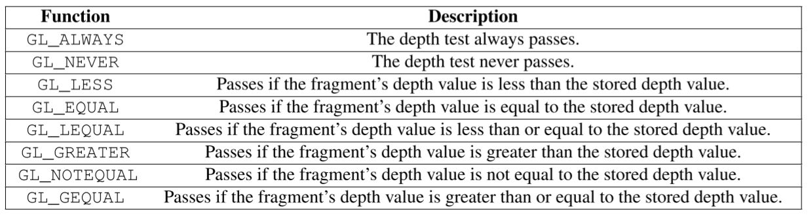
### 深度值精度问题与可视化
* 由于经过透视投影，深度值不是线性的了，在接近近平面处变化平缓，精度高，反之精度低

    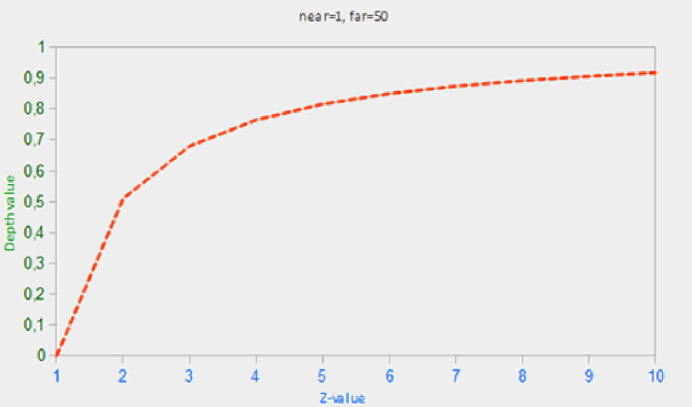
* 可视化深度图时，非线性值的结果比较不友好，需要逆变换到 NDC 再作逆投影
* 深度冲突：精度问题导致的物体遮挡关系不稳定
* 抗深度冲突
  * 设计场景时不把物体放太近
  * 把近平面设远
  * 用更高精度的深度缓冲，牺牲性能
* `非线性深度值 -> 线性深度值（distance from frag to camera）`[（Recap: 投影变换矩阵推导）](http://www.songho.ca/opengl/gl_projectionmatrix.html)
  * 结论：
    $$ Z_{linear} = \frac{2 * near * far}{far + near - Z_{ndc} * (far - near)} $$

## 23. Stencil testing
### Stencil testing
* stencil buffer 可以在渲染过程中更新
  * 其中单个像素通常位深 8bits，即一个像素可表示 $2^8=256$ 个值
  * 不同的 window library 对模板缓冲的配置方式不同，GLFW 默认自动配置一个 stencil buffer
* 模板测试选项
  * 启用模板测试：`glEnable(GL_STENCIL_TEST);`
  * 每帧渲染前清空模板缓冲：`glClear(GL_STENCIL_BUFFER_BIT);`
  * 设置位掩码：`glStencilMask(default = 0xFF)`
    * `位掩码 bitmask` 用来与将要写入缓冲的模板值做`按位与`
    * 默认 bitmask = 0xFF 全 1 不影响输出，0x00 时全 0，与 GL_FALSE 禁用写入等价
    * 大部分情况下只会用 0xFF 和 0x00 :)
  * 设置模板测试的方式：`glStencilFunc(GLenum func, GLint ref, GLuint mask)`
    * func：default =  GL_LESS，类似 glDepthFunc()
    * ref：用于与模板缓冲内的值作比较
    * mask：位掩码
  * 设置模板缓冲的写入方式：`glStencilOp(GLenum sfail, GLenum dpfail, GLenum dppass)`
    * sfail：当 stencil test 失败时，针对 stencil buffer 的操作
    * dpfail：当 stencil test 成功、depth test 失败时，针对 stencil buffer 的操作
    * dppass：两种测试都成功时对 stencil buffer 的操作
    * default = GL_KEEP 

        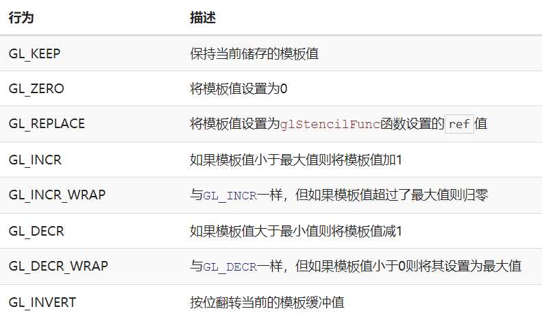
### Object Outlining
* 常用功能：Object outlining - scale object 后描边
* Object outlining steps
  * `启用模板测试`：Enable stencil writing
  * `设置模板缓冲写入方式`：glStencilOp(func = GL_ALWAYS)，将需要描边的物体部分都置 1
  * 渲染物体
  * **`禁用模板写入及深度测试`**
  * 略微放大描边物体
  * 用另一个 fragment shader 再渲一次物体，把 stencil buffer 内为 0 的部分描边
  * `重新启用 depth testing 并将 stencil func 置为默认的 GL_KEEP`
* More
  * 注：此时多物体描边会合并，要对不同物体分别描边则应在各物体渲染前都 clear buffer
  * [ ] 【？】中间的禁用是出于性能考虑还是会影响结果？康康不禁用有没影响。
  * [x] 实现描边
    * 打开 stencil test 后注意其对不需要描边的物体的影响
    * backpack 背后有 floor 的部分无描边：同上，因为先渲了 floor，忘记把 Mask 置 0 导致 floor 的部分也写入了 stencil buffer，导致 scale 放大的部分通过了 stencil test
  * [x] 在 class : Model 中将是否描边集成到模型类
  * [ ] 对描边用高斯模糊等做软化，效果更自然

## 24. Blending
### 透明测试
* 在 fragment shader 中 test alpha 值，`discard`
* 注：当纹理平铺方式为 REPEAT 时，OpenGL 会在纹理边缘进行插值。当纹理带透明通道，alpha 也会被插值，`导致边缘产生框`。所以这种情况下，不需 REPEAT 的话记得把平铺方式设为 CLAMP_TO_EDGE。
    
    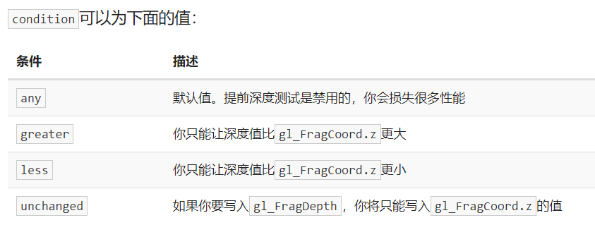
### 透明混合
* 启用透明混合：`glEnable(GL_BLEND);`
* OpenGL 的混合方程

    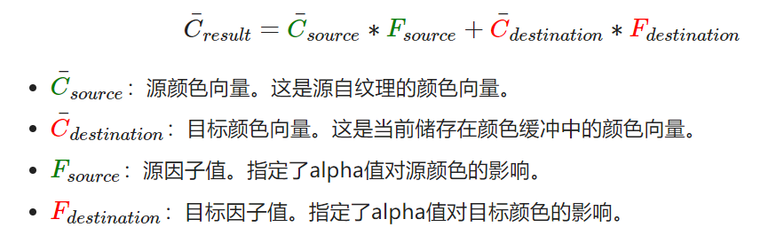
  * 颜色值由 OpenGL 自动读取纹理和 fragment shader 输出
* 指定源因子和目标因子：`glBlendFunc(GLenum sfactor, GLenum dfactor)`，分离 RGB 和 Alpha 通道的因子 glBlendFuncSeparate()

    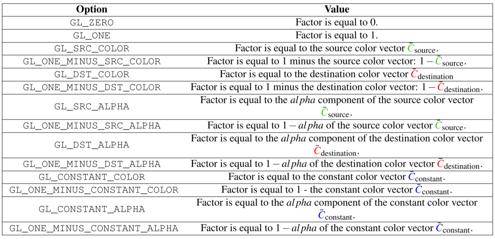
* 调整混合方程的混合模式：glBlendEquation(GLenum mode)
### 透明物体的渲染顺序
* 遮挡关系混乱
    
    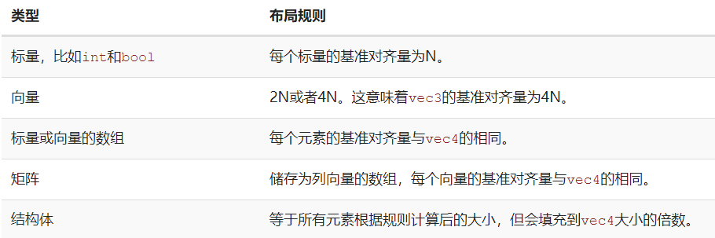
    * 窗户之间的遮挡和 bag 的遮挡关系都炸了：stencil test 的锅。描边完没把 stencil test 关掉，前面的窗户 stencil test failed 被裁了。描边完后把 stencil test 关掉可破，但是描边又不稳定了，转转视角描边就凉了=。=【？】
        
        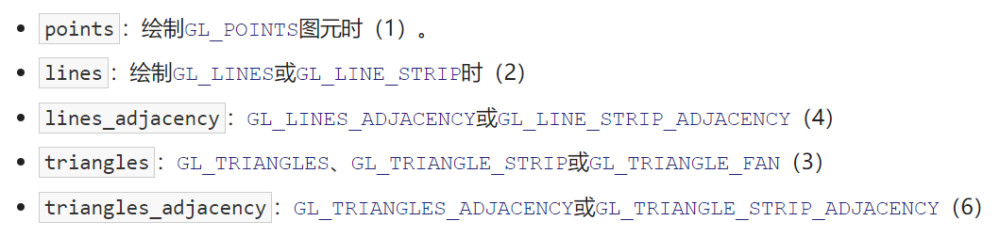

        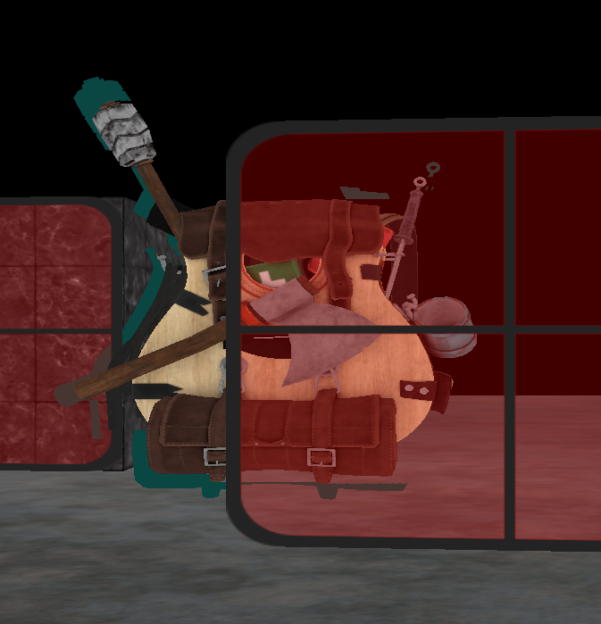
    * [x] 简单对透明物体 position 排个序（按到 camera 距离）（也就修好了窗户……而且对体积大一点的物体 position 和实际各部分位置差别很大……TODO list++: render queue manager?【？】）

        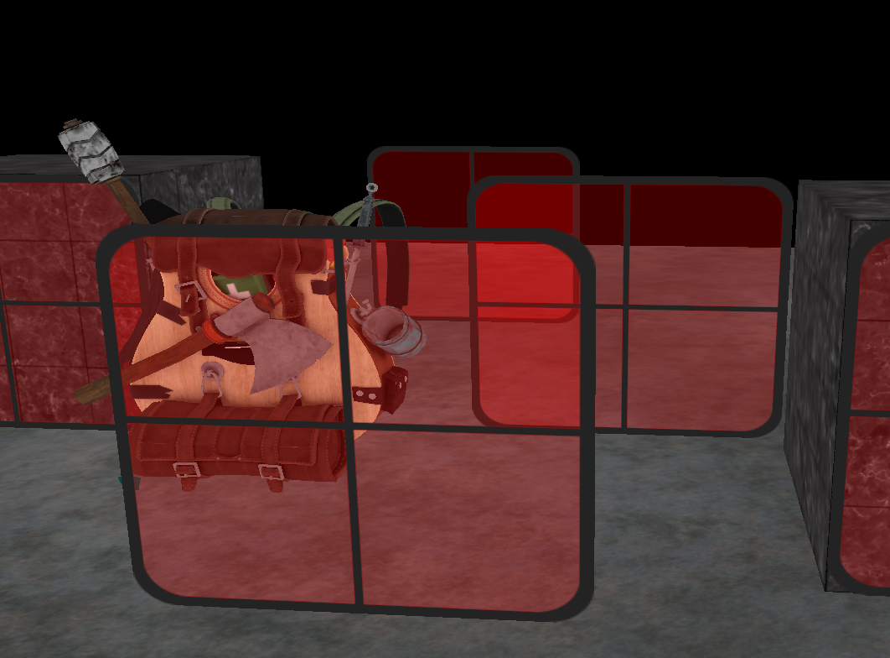
* [ ] [Order Independent Transparency](#more---oit)

## 25. Face culling
* 面剔除：基于“一个物体只有部分表面会被观察者看到”，剔除背对 camera 的部分，节省计算开销
* 正向面 Front Face & 背向面 Back Face `判定`
  * 环绕顺序：默认逆时针顺序为正向
  * 定义正向的逆时针顺序，翻转后即为背向的顺时针
* 实现
  * 启用面剔除：`glEnable(GL_CULL_FACE);`
  * 剔除面的类型：`glCullFace(default = GL_BACK);`
  * 规定正向环绕顺序：`glFrontFace(default = GL_CCW)`
* Tips
  * 正规模型文件的正向顺序貌似是默认逆时针？好像并不是：backpack 模型可能不够大？剔除前后效率没啥区别……显示效果 ok。nanosuit 好像剔多了昂？正反剔都瘸=。=

## 26. Framebuffers
* 帧缓冲：带 color/depth/stencil attachments，使用后相关的读写操作都和该帧缓冲的 attachment 交互。如深度测试时读取绑定到该帧缓冲的 depth attachment
### Framebuffers 创建流程
```cpp
// Step 1 - 创建帧缓冲对象 FBO
unsigned int FBO;
glGenFramebuffers(1, &FBO);

// Step 2 - 把帧缓冲对象 FBO 绑定到读写目标，or GL_READ/DRAW_* 分别绑定不同的 FBO
glBindFramebuffer(GL_FRAMEBUFFER, FBO);

/**
 * 帧缓冲对象使用条件（完整性条件）
 * 1. Attach at least one buffer
 *    - 为该对象附加至少一个缓冲
 *    - attachment：一个内存位置，分为纹理附件 texture attachment 或渲染缓冲对象 renderbuffer object 两种类型
 * 2. At least one color attachment
 * 3. All attachments should be complete as well
 * 4. Each buffer should have the same number of samples
 *    - 如当开启 AA 时，子样本数要相同
 */

// Step 3.1 - 为帧缓冲对象附加纹理附件作为缓冲
glFramebufferTexture2D(...);
// Step 3.2 - 为帧缓冲对象附加渲染缓冲对象附件作为缓冲
glFramebufferRenderbuffer(...);
/**
 * 附加的纹理为深度纹理时，纹理的 Format 和 Internalformat 变为 GL_DEPTH_COMPONENT，反映深度缓冲的储存格式。【？】用什么设？咋设？【check】glTexImage2D() 中的两个参数
 * 附加模板缓冲时，要将纹理格式设为 GL_STENCIL_INDEX
 * 拼接深度纹理和模板信息：附加 GL_DEPTH_STENCIL_ATTACHMENT 类型
 */

// Step 4 - 检查帧缓冲对象的完整性
if(glCheckFramebufferStatus(GL_FRAMEBUFFER) == GL_FRAMEBUFFER_COMPLETE) 
{
    /**
     * 此时所有渲染操作输出到当前绑定帧缓冲的 Attachment 中。Depth/Stencil testing 也从当前帧缓冲的 attachment 中读取。
     * 【？】如果当前的 framebuffer 没有相应的 depth buffer & stencil buffer，那么会自动输出到默认帧缓冲的 attachment 中吗？：并不会，depth testing 由于莫得参照数据直接烂掉（。）然而好像描边的 stencil test 不知道从什么鬼地方取了值还跑出来了啊喂！可能没写入 stencil data ，比较器又设的是 not_equal 1 ，默认和 0 比所以全 success？
     * 由于自定义的帧缓冲不是默认帧缓冲，不影响 window output，执行的是 Off-screen Rendering。
     * 渲染到窗口：再次激活默认帧缓冲，绑定到 0。
     */
    glBindFramebuffer(GL_FRAMEBUFFER, 0);
}

// Step 5 - 删除帧缓冲对象
glDeleteFramebuffers(1, &FBO);
``` 
### Attachment type 1 - Texture
* 类似普通的纹理，主要区别：glTexImage2D 生成时的参数
  * 维度大小设为屏幕大小
    * 注意`想把屏幕内容放缩渲染到纹理时要调整 glViewport()`
  * data = null
    * 只`分配内存`，不自动填充
```cpp
unsigned int texture;
glGenTextures(1, &texture);
glBindTexture(GL_TEXTURE_2D, texture);

glTexImage2D(GL_TEXTURE_2D, 0, GL_RGB, WINDOW_WIDTH, WINDOW_HEIGHT, 0, GL_RGB, GL_UNSIGNED_BYTE, NULL);

glTexParameteri(GL_TEXTURE_2D, GL_TEXTURE_MIN_FILTER, GL_LINEAR);
glTexParameteri(GL_TEXTURE_2D, GL_TEXTURE_MAG_FILTER, GL_LINEAR);
```

### Attachment type 2 - Renderbuffer Object
* 类似 texture，但存储数据时使用的格式为 OpenGL 原生渲染格式，不对纹理格式做转换，便于内存优化
  * 写入/复制到其它缓冲的速度快：如用于加速每帧迭代时的 glfwSwapBuffers()
  * 不能直接从其内存读取，需要通过 `glReadPixels()` 间接从当前绑定的 framebuffer 的一块特殊区域读取（【？】所以是从它的内存临时复制到当前绑定的 framebuffer 然后从 framebuffer 转换格式读出来？）
  * 适合一些`不需要采样的情况`，如 depth/stencil testing（【？】可能是因为采样的话需要 texture2D() 读取？）
```cpp
// Step 1 - 创建渲染缓冲对象
unsigned int RBO;
glGenRenderbuffers(1, &RBO);
// Step 2 - 绑定渲染缓冲对象
glBindRenderbuffer(GL_RENDERBUFFER, RBO);
// Step 3 - document: establish data storage, format and dimensions of a renderbuffer object's image. 意思看起来应该是分配内存空间和指定内部数据格式？
glRenderbufferStorage(GL_RENDERBUFFER, GL_DEPTH24_STENCIL8, 800, 600);
// （分配完空间就能将当前绑定的 RBO 恢复成默认值）
glBindRenderbuffer(GL_RENDERBUFFER, 0);
// Step 4 - 附加到帧缓冲对象
glFramebufferRenderbuffer(GL_FRAMEBUFFER, GL_DEPTH_STENCIL_ATTACHMENT, GL_RENDERBUFFER, RBO);
```
### Post-processing
* 反相：1 - color
* 灰度
  * 所有颜色分量取均值，输出 vec3(avg, avg, avg, 1.0)
  * 考虑到人眼对三色敏感度不同，可以加权一下 0.2126 * FragColor.r + 0.7152 * FragColor.g + 0.0722 * FragColor.b（又见像素亮度！）
* 用于给卷积核做周围像素信息的采样
  * 锐化效果
  * 模糊效果
### Implement Tips
* 绑定新的帧缓冲记得先 clear buffer

    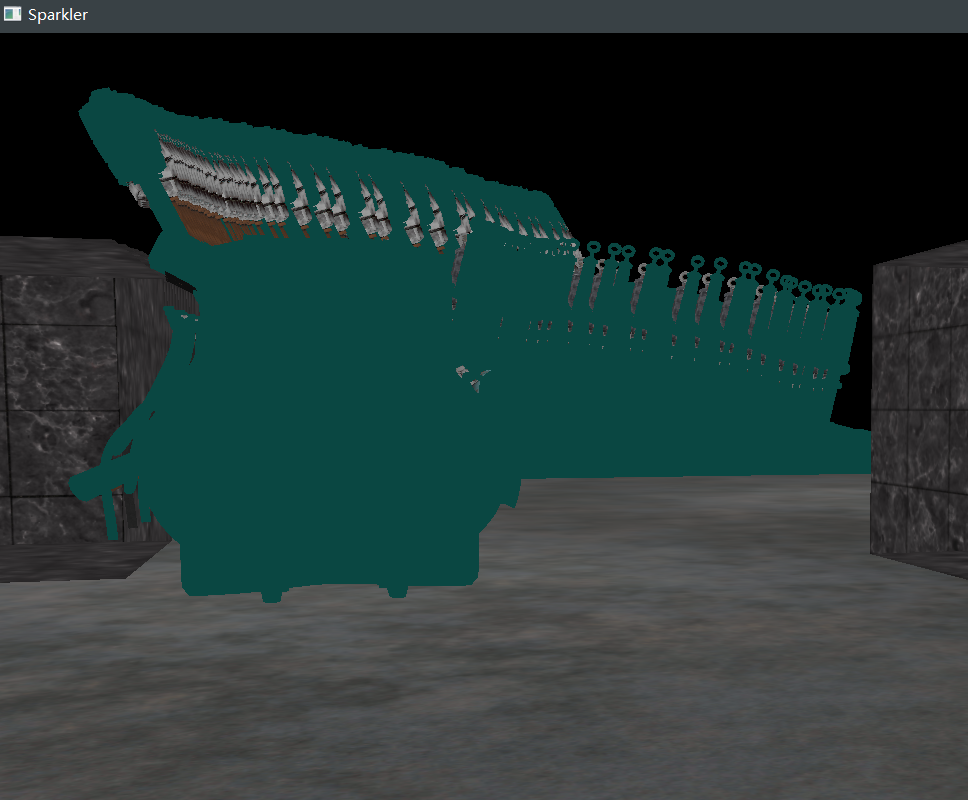
* 整个包怎么都描成边了 orz... 而且旁边的 cube 好像深度不太对？

    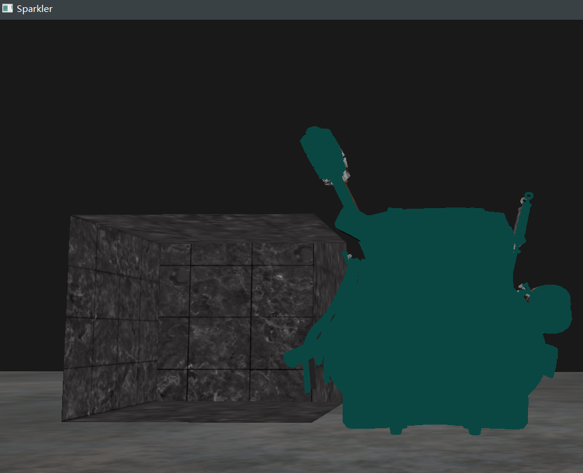
    * 去掉 stencil test 可以发现是 depth testing 的锅=。=
    * `ERROR`：glFramebufferRenderbuffer(`GL_RENDERBUFFER`, GL_DEPTH_STENCIL_ATTACHMENT, GL_RENDERBUFFER, rbo);
    * 憨批日记：第 998244353 次因传错参数绝望 debug :)
    * 过了过了过了正常了正常了正常了啊啊啊啊啊啊啊啊啊！！！
    * 不知道为什么修好这里 transparent shader 的 file read failed 也突然好了……阿巴阿巴……？？？
* 绝美配色我的天！！！

    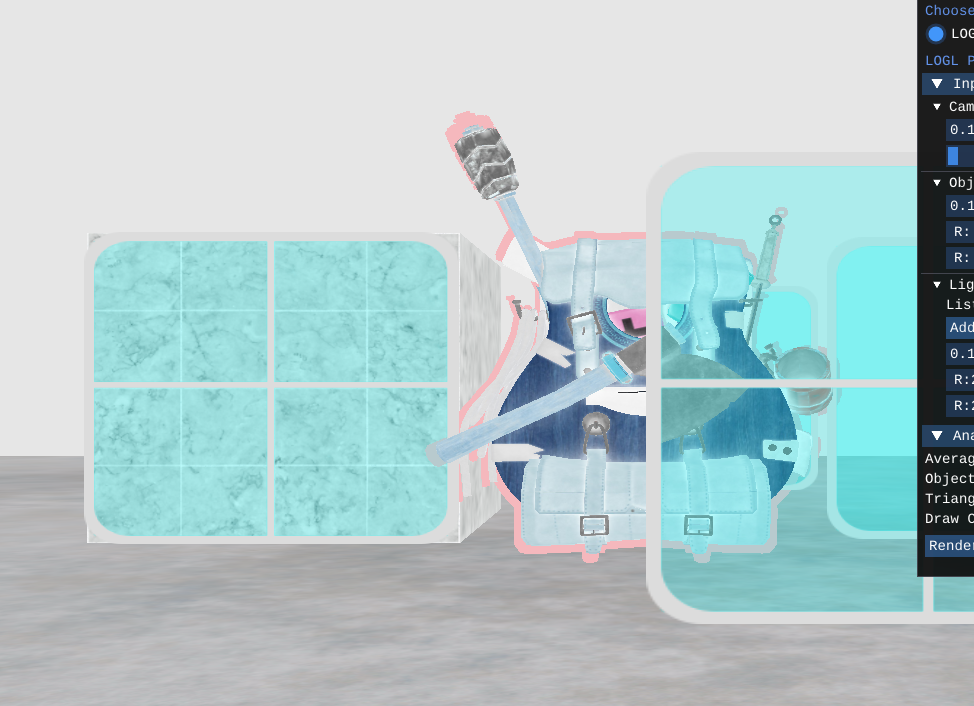
* kernel 在边缘处采样会超出纹理边界，默认 REPEAT 的平铺模式可能导致边缘把另一边的值采过来，记得换 CLAMP_TO_EDGE
    
    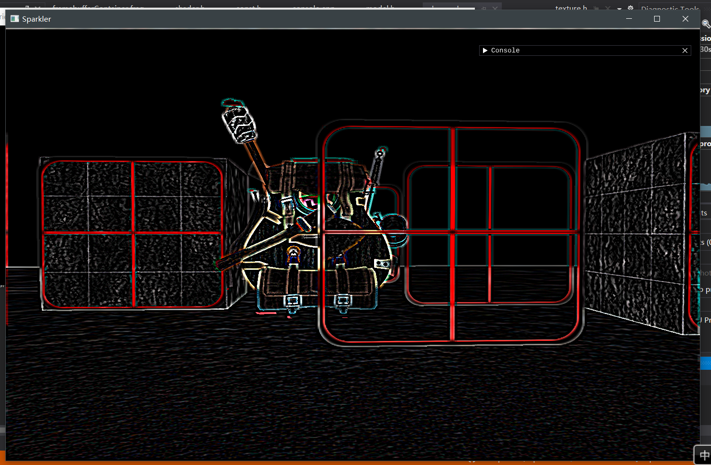

## 27. Cubemaps
* 采样 cubemaps 时，位于原点的立方体顶点位置可以直接作为其三维纹理坐标，在 pipeline 中自动插值
* OpenGL 中的创建流程类似普通纹理
  * 六个面分别 glTexImage2D(GL_TEXTURE_CUBE_MAP_POSITIVE/NEGATIVE_X/Y, ...)
  * 考虑不同面之类的缝隙不能恰好采样到，平铺方式设为 CLAMP_TO_EDGE
* in fragment shader
    ```GLSL
    in vec3 textureDir;
    uniform samplerCube cubemap;
    void main()
    {
        gl_FragColor = texture(cubemap, textureDir);
    }
    ```
### 应用
* [x] 天空盒 Skybox
  * 作为场景中最后一个渲染的物体，令其深度值最大 z = 1.0
  * fix 视觉效果：不跟随 camera 平移，camera.view -> mat3 -> mat4
  * fix skybox 只有 front：阿巴阿巴 draw arrays count 只传了 6（
* 环境贴图 Environment Mapping
  * [x] 使物体反射 skybox
    * cube 完全不反射：uniform 忘传，VAO attribute pointer 没设好
    * 修完 uniform 还有两个面反射不出东西：

        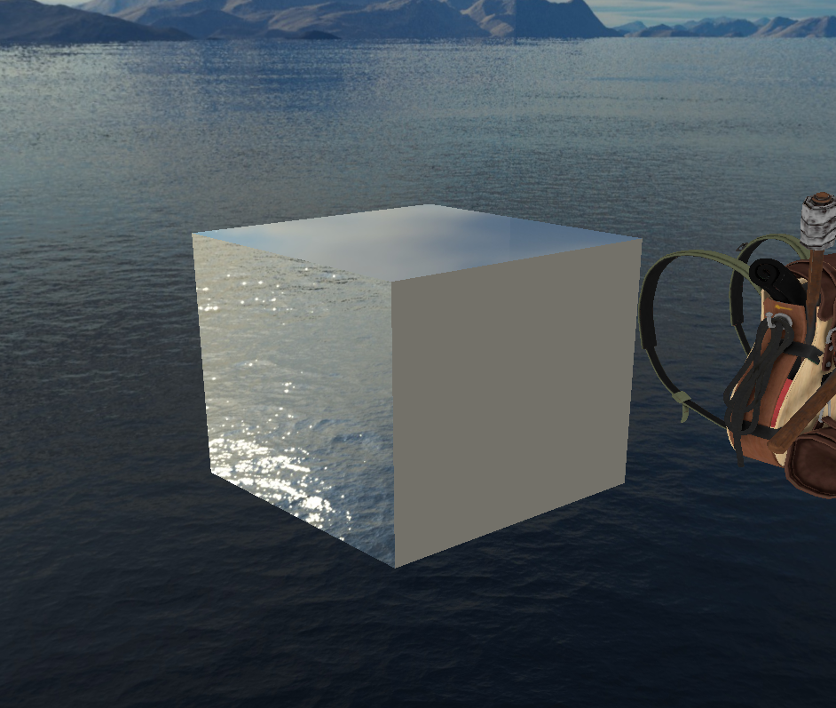
    * 哦哦果然还是 VAO attribute pointer 的锅（竟然没修完（
  * [ ] 引入反射贴图
  * [x] 单面折射 Single-side Refraction
    * 写完 bug 看 (-4, 0, -4) 的 refract cube 顶是黑的以为真有 bug... 顶上那个面比较暗是因为单次折射用的折射向量采样到的是底下 bottom 那块的 skybox 所以才看着黑搓搓。那没事了w
  * [ ] 引入二次折射
  * [ ] 使用帧缓冲实现动态环境贴图（反射探针 reflection probe？）
  * [ ] sphere map
    * 用三维极坐标生成球面顶点 position、indices、normal
    * [StackOverflow: Wrap an image around a sphere in opengl](https://stackoverflow.com/questions/22980246/i-want-to-wrap-an-image-around-a-sphere-in-opengl)
    * [StackOverflow: Creating a 3D sphere in OpenGL using Visual C++](https://stackoverflow.com/questions/5988686/creating-a-3d-sphere-in-opengl-using-visual-c)

## 28. Advanced Data
### Buffer Object
* 缓冲对象绑定到缓冲目标 Buffer Target（GL_ARRAY_BUFFER/GL_ELEMENT_ARRAY_BUFFER/...）
  * 存储：stores a `reference` to the buffer per target
  * 以不同的方式处理缓冲：`processes the buffer differently` based on the target type
* 填充 Buffer Object 管理的内存的方式
  * glBufferData()：分配内存，并填充由参数 data 给出的数据。
    * data = null 时只分配内存，不作填充。
    * 可用于预留空间。
  * glBufferSubData(缓冲目标, offset, datasize, data)：根据 offset 填充缓冲的特定区域。
    * `要预先通过 glBufferData() 分配内存。`
  * glMapBuffer(bufferType, 读写方式)：请求当前所绑定的缓冲的内存指针。
    * 适合要直接映射数据到缓冲的需求，without first storing it in temporary memory。类似从文件读取数据后直接复制到 buffer memory
      ```cpp
      float data[] = {...};
      glBindBuffer(GL_ARRAY_BUFFER, buffer);
      // 获取指针
      void *ptr = glMapBuffer(GL_ARRAY_BUFFER, GL_WRITE_ONLY);
      // 复制数据到内存
      memcpy(ptr, data, sizeof(data));
      // 释放指针，在成功将数据映射到 buffer 后返回 GL_TRUE
      glUnmapBuffer(GL_ARRAY_BUFFER);
      ```
### Batching vertex attributes
* 把同种属性数据放在一块空间连续存储
  * 当然还是交错处理对 shader 更友好，vertex shader 读单个顶点数据的时候可以从连续的空间取
    ```cpp
    float positions[] = { ... };
    float normals[] = { ... };
    float tex[] = { ... };
    // 【？】要先分内存来着？
    // 填充缓冲
    glBufferSubData(GL_ARRAY_BUFFER, 0, sizeof(positions), &positions);
    glBufferSubData(GL_ARRAY_BUFFER, sizeof(positions), sizeof(normals), &normals);
    glBufferSubData(GL_ARRAY_BUFFER, sizeof(positions) + sizeof(normals), sizeof(tex), &tex);
    // 指定向 GPU 传输数据时的内存读取方式
    glVertexAttribPointer(0, 3, GL_FLOAT, GL_FALSE, 3 * sizeof(float), 0);  
    glVertexAttribPointer(1, 3, GL_FLOAT, GL_FALSE, 3 * sizeof(float), (void*)(sizeof(positions)));  
    glVertexAttribPointer(2, 2, GL_FLOAT, GL_FALSE, 2 * sizeof(float), (void*)(sizeof(positions) + sizeof(normals)));
    ```
### 复制缓冲
* `void glCopyBufferSubData(GLenum readtarget, GLenum writetarget, GLintptr readoffset, GLintptr writeoffset, GLsizeiptr size);`
  * read/write target 分别为一种缓冲目标类型，分别读写当前绑定到该缓冲目标的缓冲内容
* 需要读写同种类型缓冲的情况：由于`不能同时将两个缓冲绑定到同一缓冲目标`，用 GL_COPY_READ_BUFFER、GL_COPY_WRITE_BUFFER
    ```cpp
    float vertexData[] = { ... };
    glBindBuffer(GL_COPY_READ_BUFFER, vbo1);
    glBindBuffer(GL_COPY_WRITE_BUFFER, vbo2);
    glCopyBufferSubData(GL_COPY_READ_BUFFER, GL_COPY_WRITE_BUFFER, 0, 0, sizeof(vertexData));

    // 或者

    float vertexData[] = { ... };
    glBindBuffer(GL_ARRAY_BUFFER, vbo1);
    glBindBuffer(GL_COPY_WRITE_BUFFER, vbo2);
    glCopyBufferSubData(GL_ARRAY_BUFFER, GL_COPY_WRITE_BUFFER, 0, 0, sizeof(vertexData));
    ```

## 29. Advanced GLSL
### GLSL built-in variables
* [Built-in Variables (GLSL)](khronos.org/opengl/wiki/Built-in_Variable_(GLSL))
* Vertex Shader - gl_PointSize 修改渲染的像素点大小
  * OpenGL - glPointSize()
  * GLSL
    * 在 OpenGL 中启用在 vertex shader 中修改点大小的功能：glEnable(GL_PROGRAM_POINT_SIZE);
    * vertex shader 中 gl_PointSize = e.g. gl_Position.z;
    * application：`粒子特效`
* Vertex Shader - gl_VertexID
  * glDrawElements 渲染时，存储当前顶点的索引
  * glDrawArrays 渲染时，存储从渲染调用开始的已处理顶点数
* Fragment Shader - gl_FragCoord .xy 屏幕空间坐标
* Fragment Shader - bool gl_FrontFacing
  * 可用于对正向面和背向面上不同的纹理，剔除了就没用
* Fragment Shader - gl_FragDepth 修改片元深度值，默认取用 gl_FragCoord.z
  * 使用时会破坏提前深度测试
  * OpenGL 4.2+ 可在 Fragment Shader 顶部声明
    ```GLSL
    layout (depth_<condition>) out float gl_FragDepth;

    // sample: 注意版本
    #version 420 core
    out vec4 FragColor;
    layout (depth_greater) out float gl_FragDepth;

    void main()
    {             
        FragColor = vec4(1.0);
        gl_FragDepth = gl_FragCoord.z + 0.1;
    }  
    ```

    
### Interface Block
* 接口块 Interface Block：用于从 vertex shader 打包数据发给 fragment shader，便于管理
* 输出接口块
    ```GLSL
    out VS_OUT
    {
        vec2 texCoords;
    } vs_out;
    ```
* 输入接口块
  * 块名保持一致，实例名随意
    ```GLSL
    in VS_OUT
    {
        vec2 texCoords;
    } fs_in;
    ```
* 在 Geometry Shader 中会有用

### Uniform Buffer Object
* Uniform 缓冲对象：定义在多个着色器中相同的 uniform
* in Vertex Shader
    ```GLSL
    #version 330 core
    layout (location = 0) in vec3 aPos;
    
    // 声明 Uniform 块
    layout (std140) uniform Matrices
    {
        mat4 projection;
        mat4 view;
    };

    uniform mat4 model;

    void main()
    {
        gl_Position = projection * view * model * vec4(aPos, 1.0);
    }
    ```
  * Uniform 块中的变量直接访问，不用加块名前缀
  * 当 OpenGL 将相关数据存入缓冲，每个声明了该 Uniform 块的着色器都能访问那些数据
  * layout (std140)：对当前定义 Uniform 块使用特定内存布局
### Uniform Block Layout
* Uniform 块布局：将数据放进预留内存供 Uniform 块使用后，要`规定内存的各部分分别对应 shader 中的哪个 uniform 变量`
* 对于 shader 中定义的一个 Uniform 块，把相关数据放进缓冲的时候要明确这个块里`每个变量的大小（字节）`以及`（从块起始位置的）偏移量`
  * Shared 布局：默认情况下，GLSL 使用的布局为 Shared，在多个程序间共享。使用该布局时，变量顺序保持不变，但 GLSL 可以为了优化变动各变量的位置和间距（比如可能将 vec3 填充成 4 个 floats 的数组），虽然可以用 glGetUniformIndices() 查询但很麻烦。
  * std140 布局：显式声明每个变量类型的内存布局
* Packed 布局：非共享，不保证在每个程序中不改变。根据着色器的行为，允许编译器将 uniform 变量从 Uniform 块中优化掉。
* [std140](https://www.khronos.org/registry/OpenGL/extensions/ARB/ARB_uniform_buffer_object.txt)
    
    
  * 其中，每个 int、float、bool 为 4 字节量，用一个 N 表示。
    ```GLSL
    layout (std140) uniform ExampleBlock
    {
                         // 基准对齐量       // 对齐偏移量
        float value;     // 4               // 0 
        vec3 vector;     // 16              // 16  (必须是16的倍数，所以 4->16)
        mat4 matrix;     // 16              // 32  (列 0)
                         // 16              // 48  (列 1)
                         // 16              // 64  (列 2)
                         // 16              // 80  (列 3)
        float values[3]; // 16              // 96  (values[0])
                         // 16              // 112 (values[1])
                         // 16              // 128 (values[2])
        bool boolean;    // 4               // 144
        int integer;     // 4               // 148
    }; 
    ```
### 使用 Uniform 缓冲
```cpp
// 创建 Uniform 缓冲对象
unsigned int uboExampleBlock;
glGenBuffers(1, &uboExampleBlock);
// 绑定到缓冲目标 GL_UNIFORM_BUFFER 
glBindBuffer(GL_UNIFORM_BUFFER, uboExampleBlock);
// 分配 152 字节的内存
glBufferData(GL_UNIFORM_BUFFER, 152, NULL, GL_STATIC_DRAW);

glBindBuffer(GL_UNIFORM_BUFFER, 0);
```
* 绑定点 Binding points
* 链接 Uniform 块到绑定点：glUniformBlockBinding(shaderID, Uniform Block Index)
    ```cpp
    unsigned int lights_index = glGetUniformBlockIndex(shaderA.ID, "Lights");
    glUniformBlockBinding(shaderA.ID, lights_index, 2);
    ```
    * OpenGL 4.2 起可以在 shader 中显式设置绑定点
        ```GLSL
        layout(std140, binding = 2) uniform Lights {...};
        ```
* 链接 Uniform 缓冲对象到绑定点：glBindBufferBase()、glBindBufferRange()
    ```cpp
    glBindBufferBase(GL_UNIFORM_BUFFER, 2, uboExampleBlock); 
    // 或
    // 绑定 Uniform 缓冲的一部分到绑定点，绑到不同的绑定点，可以把多个不同的 Uniform 块取用同一缓冲对象的内容
    glBindBufferRange(GL_UNIFORM_BUFFER, 2, uboExampleBlock, 0, 152);
    ```
* 向 Uniform 缓冲中添加数据：glBufferSubData()
    ```cpp
    glBindBuffer(GL_UNIFORM_BUFFER, uboExampleBlock);
    int b = true; // GLSL中的bool是4字节的，所以我们将它存为一个integer
    glBufferSubData(GL_UNIFORM_BUFFER, 144, 4, &b); 
    glBindBuffer(GL_UNIFORM_BUFFER, 0);
    ```
* Uniform 块优势
  * 统一在 UBO 中修改
  * OpenGL 限制了 uniform 数量，用块能假装破上限（
    * 最大处理数量：GL_MAX_VERTEX_UNIFORM_COMPONENTS

## 30. Geometry Shader
* 输入：一个图元的`所有顶点`
```GLSL
#version 330 core
// 声明输入输出的图元类型
layout (points) in;
layout (line_strip, max_vertices = 2) out;

void main() 
{ 
    gl_Position = gl_in[0].gl_Position + vec4(-0.1, 0.0, 0.0, 0.0); 
    // 将 gl_Position 中的向量添加到输出图元的顶点序列
    EmitVertex();

    gl_Position = gl_in[0].gl_Position + vec4( 0.1, 0.0, 0.0, 0.0);
    EmitVertex();

    // 将输出顶点序列合成为输出图元类型
    EndPrimitive();
}
```
* 输入图元类型（括号内为该类型图元最小顶点数）

    
* 输出图元类型：points、line_strip、triangle_strip，用 max_vertices 限制最大输出顶点数。多出的顶点 OpenGL 将其忽略。
* Built-in
    ```GLSL
    // Geometry Shader
    in gl_Vertex
    {
        vec4 gl_Position;
        float gl_PointSize;
        float gl_ClipDistance[];
    } gl_in[];  // 输入的图元每个顶点都有一套相关数据
    ```
* 普通数据传递
    ```GLSL
    // Vertex Shader
    out VS_OUT 
    {
        vec3 color;
    } vs_out;
    
    // Geometry Shader
    in VS_OUT 
    {
        vec3 color;
    } gs_in[];
    // 或者
    in vec3 vColor[];
    // 输出
    out vec3 fColor;
    ```
  * vertex shader -> geometry shader 数据传输：interface block，也可以在 geometry shader 中输入单个数组，但是 interface block 总比散装好
  * 注意：`out` 类型数据在每次 `EmitVertex()` 生成输出顶点序列的时候会将当前调用时的值附加给当前要生成的输出顶点作为 fragment shader 的输入数据
### 应用
* [ ] house
* [ ] explode：各三角图元沿法向移动一小段时间
* [ ] **`可视化法向量`**

## 31. Instancing
* 实例化 Instancing：考虑 draw call（glDrawArrays/glDrawElements）对 CPU 的巨大开销，渲多个相同物体的时候一次性发送所有数据（合批？）
* glDrawArraysInstanced/glDrawElementsInstanced
  * 多一个参数：Instance Count
  * vertex shader 中多一个 gl_InstanceID，配合数组给出不同物体的不同属性
* 实例化数组 Instanced Array
  * recap uniform 变量上限，所以普通 uniform 数组传递属性会容易爆
  * `在 vs 中的定义就是一个顶点属性`，其仅在 vs 渲染一个新实例时更新
  * 使用：类似普通的属性，数据放在 VBO，设置 VertexAttribPointer 并启用属性后用 `glVertexAttribDivisor(属性 ID, 属性除数 Attribute Divisor)` 规定属性如何更新。divisor = 0 时 vs 每次迭代都更新（即逐顶点），1 时每个新实例更新，2 时每 2 个新实例更新。
* 练习
  * [ ] hello, rectangle
  * [ ] 小行星带

## 32. Anti Aliasing
* MSAA：每个像素跑一次 fs，四个子采样点颜色插值到子样本
* OpenGL 的 MSAA - 多重采样缓冲 Multisample Buffer：能在每个像素中存储大于一个颜色值的颜色缓冲
  * 由 window system 提供（GLFW）
  * 多重采样的具体算法在 OpenGL 驱动的 rasterizer 中已实现
```cpp
// 使 GLFW 为每个像素创建四个子采样点的缓冲。（在调用 glfwCreateWindow 创建渲染窗口时，每个屏幕坐标用一个包含四个子采样点的颜色缓冲。）
glfwWindowHint(GLFW_SAMPLES, 4);
// 启用多重采样（多数 OpenGL 驱动上默认启用）
glEnable(GL_MULTISAMPLE);
```
* off-screen MSAA
  * 为帧缓冲创建多重采样纹理附件（glTexImage2DMultisample）或多重采样 RBO
  * 不能直接采样多重采样缓冲生成的图像，用 glBlitFramebuffer 进行还原（resolve）
  * 非要用的情况（如对 multisample buffer 做 post-processing）：把位块传送到普通 FBO 再用
    * 此时纹理又变成了单一采样点的普通纹理，类似边缘检测的 post-processing 会重新整出锯齿
* 自定义 AA
  * 在 shader 中定义多重样本采样器 `uniform sampler2DMS screenTextureMS;`
  * 获取子样本值 `texelFetch(screenTextureMS, texCoords, 0-3);`

# Part Ⅴ - Advanced Lighting
## 33. Advanced Lighting
## 34. Gamma Correction
## 35. Shadow Mapping
## 36. Point Shadows
## 37. Normal Mapping
## 38. Parallax Mapping
## 39. HDR
## 40. Bloom
## 41. Deferred Shading
## 42. SSAO

# Part Ⅵ - PBR
## 43. Theory
## 44. Lighting
## 45. Diffuse irradiance
## 46. Specular IBL

# Part Ⅶ - In Practice
## 47. Debugging
## 48. Text Rendering

# Part Ⅷ - 2D Game

# More - OIT

# More - Animation

# OpenGL API Document
* [OpenGL 2.1 Reference Pages](https://www.khronos.org/registry/OpenGL-Refpages/gl2.1/)
* [OpenGL 4.5 Reference Pages](https://www.khronos.org/registry/OpenGL-Refpages/gl4/)

# To Be Continued...

备用
* OpenGL
    API | Describe
    :--|:-------
    glDepthFunc() | 设置深度测试的方式

<!-- 使用FontAwesome -->
<head> 
    <script defer src="https://use.fontawesome.com/releases/v5.0.13/js/all.js"></script> 
    <script defer src="https://use.fontawesome.com/releases/v5.0.13/js/v4-shims.js"></script> 
</head> 
<link rel="stylesheet" href="https://use.fontawesome.com/releases/v5.0.13/css/all.css">

<!-- Sample use: <i class="fa fa-star"></i> -->
