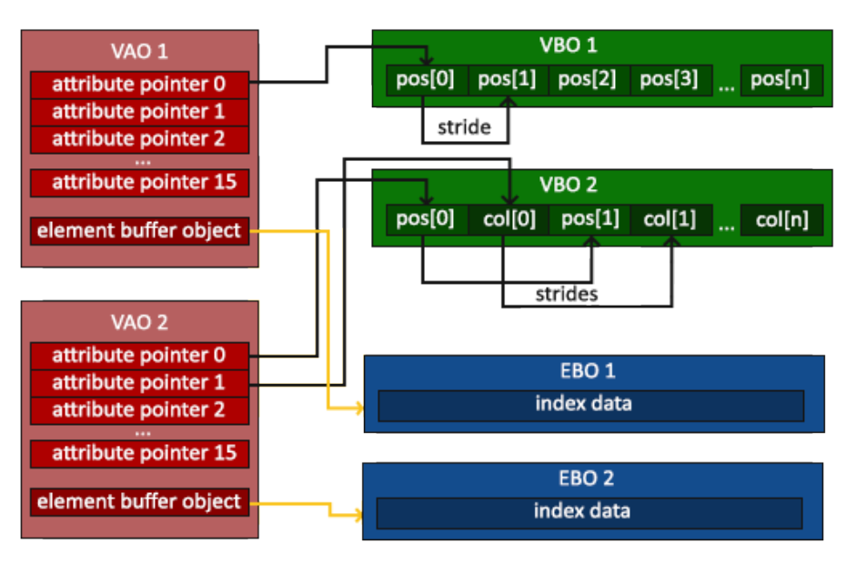

> # <i class="fa fa-star"></i> LearnOpenGl
> * URL: learnopengl.com & learnopengl-cn.github.io
> * Notes & Tips

<!-- TOC -->

* [1. Introduction](#1-introduction)
* [Part Ⅰ - Getting started](#part-ⅰ---getting-started)
  * [2. OpenGL](#2-opengl)
    * [一、关于 OpenGL](#一关于-opengl)
    * [二、扩展](#二扩展)
    * [三、状态机（State Machine）](#三状态机state-machine)
    * [四、对象](#四对象)
  * [3. Creating a window](#3-creating-a-window)
    * [一、Intro: GLFW](#一intro-glfw)
    * [二、Intro: GLAD](#二intro-glad)
    * [三、Settings: Windows10 VS2019 GLFW GLAD 完全配置踩坑结果](#三settings-windows10-vs2019-glfw-glad-完全配置踩坑结果)
      * [下载](#下载)
      * [配置目录结构 `folder - oglsettings`](#配置目录结构-folder---oglsettings)
      * [项目配置](#项目配置)
  * [4. Hello Window](#4-hello-window)
  * [5. Hello Triangle](#5-hello-triangle)
    * [一、Intro](#一intro)
    * [**`二、OpenGL Graphics Pipeline`**](#二opengl-graphics-pipeline)
    * [**`三、Normalized Device Coordinates（NDC）`**](#三normalized-device-coordinatesndc)
    * [**四、Implement Details**](#四implement-details)
    * [附：API](#附api)
    * [TODO&Tips & Q&A](#todotips--qa)
      * [TODO&Tips](#todotips)
      * [Q&A](#qa)
  * [6. Shaders](#6-shaders)
    * [一、Vectors](#一vectors)
    * [二、Ins and outs](#二ins-and-outs)
    * [**三、Uniform**](#三uniform)
    * [**`四、Shader Class`**](#四shader-class)
    * [Tips](#tips)
    * [附：API](#附api-1)
  * [7. Textures](#7-textures)
    * [附：API](#附api-2)
    * [Tips](#tips-1)
  * [8. Transformations](#8-transformations)
  * [9. Coordinate Systems](#9-coordinate-systems)
  * [10. Camera](#10-camera)
  * [11. Review](#11-review)
* [Part Ⅱ - Lighting](#part-ⅱ---lighting)
* [Part Ⅲ - Model Loading](#part-ⅲ---model-loading)
* [Part Ⅳ - Advanced OpenGL](#part-ⅳ---advanced-opengl)
* [Part Ⅴ - Advanced Lighting](#part-ⅴ---advanced-lighting)
* [Part Ⅵ - PBR](#part-ⅵ---pbr)
* [Part Ⅶ - In Practice](#part-ⅶ---in-practice)
* [Part Ⅷ - 2D Game](#part-ⅷ---2d-game)
* [OpenGL API Document](#opengl-api-document)
* [To Be Continued...](#to-be-continued)

<!-- /TOC -->

# 1. Introduction

# Part Ⅰ - Getting started
## 2. OpenGL
### 一、关于 OpenGL
* OpenGL 本身是一个规范（specification）。
  * 规定了每个函数的行为和输出，内部具体实现由 OpenGL 库的开发者自行决定。
  * 实际 OpenGL 库开发者多为显卡厂商。
* OpenGL 演变
  * 早期的立即渲染模式（Immediate mode，也即固定渲染模式），效率和灵活性低，OpenGL3.2 起废弃
  * 核心模式（Core-profile），高灵活性和效率，但需要理解 OpenGL 运作细节和图形编程

### 二、扩展
* 显卡公司提出的新特性、渲染上的大优化等，通常以扩展的方式在驱动中实现。
* 不必等待 OpenGL 新规范面世即可使用，只要简单检查显卡是否支持此扩展。
* 通常，一个扩展受众很广时，将成为未来 OpenGL 规范的一部分。
* 扩展使用的代码例子：
    ```cpp
    if (GL_ARB_extension_name)
    {
        // 使用硬件支持的全新现代特性
    }
    else
    {
        // 不支持此扩展的显卡：用原来的方式完成
    }
    ```

### 三、状态机（State Machine）
* OpenGL 是一个状态机
  * 以变量来描述 OpenGL 当前应该如何运行。
  * OpenGL 的状态通常称为 OpenGL 上下文（context）。
  * 更改 OpenGL 状态的一般途径：设置选项、操作缓冲，最后使用当前 OpenGL 上下文来渲染。
  * 如设置当前 OpenGL 的状态（设置上下文变量），使其作线段或画三角形。
* OpenGL 中的函数
  * 状态设置函数（State-changing Function）：改变上下文。
  * 状态使用函数（State-using Function）：根据当前 OpenGL 的状态执行一些操作。

### 四、对象
* OpenGL内核：C语言编写的库。
  * 支持多种语言的派生。
  * 但C的一些语言结构不容易被翻译到其它高级语言，因此引入了一些抽象层如“对象”。
* OpenGL中的对象
  * 指一些选项的集合，代表OpenGL状态的一个子集。
  * 如用一个对象代表绘图窗口的设置，则其内有一些成员，用来设置大小和支持的颜色位数等。
* OpenGL的数据类型
  * 其有自己的基本类型，改为语言自带类型可能不造成影响，但用OpenGL自身基本类型更安全。
  * 可以保证在各平台中每一种类型的大小统一。（当然也可以使用其它定宽类型(Fixed-width Type)来实现。）

## 3. Creating a window
### 一、Intro: GLFW
* 一个专门针对OpenGL的C语言库。
  * 提供一些渲染物体所需的最低限度接口。
  * 允许用户创建OpenGL上下文，定义窗口参数以及处理用户的输入。
* 环境搭建 - 下载安装
  * 下载源代码包：https://www.glfw.org/download.html
  * 解压打开源代码包。
  * 下载安装Visual Studio：https://visualstudio.microsoft.com/zh-hans/
  * 下载安装CMake：https://cmake.org/download/
  * CMakeGUI：source code `~/glfw-3.15.3`，where to build `~/glfw-3.15.3/build`新建build作为目标文件夹
  * 用VS打开build下的GLFW.sln，生成解决方案。然后编译的库glfw3.lib出现在src/Debug。
  * 把GLFW默认的`~/include`和编译生成的`glfw3.lib`告知IDE或编译器。
    * 1.把`~/include`文件加到IDE/编译器的`/include`，把`glfw3.lib`加到`/lib`。
    * 2.建立新的包含所有第三方库文件头文件的目录，并在IDE/编译器中指定。
* 环境搭建 - 在Visual Studio中的配置
  * VS创建空项目（Visual C++）。
  * 链接：项目属性-VC++ 目录-把include和.lib路径加到include（包含）和lib（库）目录。【可通过`<GLFW/...>`引用头文件和库文件夹。】
  * 在Linker链接器-Input输入-Additional dependencies附加依赖项添加glfw3.lib。（使GLFW在编译时能被链接器链接）
  * Windows下：最后将opengl32.lib加入连接器设置。（Windows下包含在Microsoft SDK中，安装VS时默认安装）
### 二、Intro: GLAD
* 完成“运行时查询本机显卡相应OpenGL驱动版本的函数地址，并保存在函数指针中供使用”的任务。
    ```cpp
    /* Windows 上手动完成的例子 */

    // 定义函数原型
    typedef void (*GL_GENBUFFERS) (GLsizei, GLuint*);
    // 找到正确的函数并赋值给函数指针
    GL_GENBUFFERS glGenBuffers  = (GL_GENBUFFERS)wglGetProcAddress("glGenBuffers");
    // 现在函数可以被正常调用了
    GLuint buffer;
    glGenBuffers(1, &buffer);
    ```
* GLAD配置步骤
  * GLAD在线生成地址：https://glad.dav1d.de/ 完成选项
    
    项目 | 选项 | 
    --- | --- |
    Language | C/C++
    Specification | OpenGL
    API(gl) | version >3.3
    Profile | Core
    Extensions | 暂时忽略

  * 生成的glad.zip中`include/KHR、glad`加入之前自设的include
  * `src/glad.c`加入项目的源文件（新建其它项目则重新添加）

    ````cpp
    /* 测试配置。 */
    #include <glad/glad.h>
    #include <GLFW/glfw3.h>
    #include <iostream>
    using namespace std;

    int main()
    {
        cout << "Hello, OpenGL" << endl;
        return 0;
    }
    ````
### 三、Settings: Windows10 VS2019 GLFW GLAD 完全配置踩坑结果
#### 下载
* GLFW：https://www.glfw.org/download.html
  * 选 x64 版本，之后在 VS 的项目属性->配置管理器里把平台改成x64！
* GLAD：https://glad.dav1d.de/
  * API gl Version 3.3（对应 LearnOpenGL 在线教程所用OGL版本）
  * Profile Core
  * √ Gnerate a loader
  * 生成后下载 .zip
#### 配置目录结构 `folder - oglsettings`
* `include`
  * glad、KHR (所下载的 glad->include 中内容)
  * GLFW (所下载的 glfw->include 中内容)
* `lib` (所下载的 glfw->lib-vc 对应vs版本中内容，本次配置用的 vs2019)
  * glfw3.dll
  * glfw3.lib
  * glfw3dll.lib
* `src`
  * glad.c (所下载的 glad->src 中内容)
#### 项目配置
1. 把 `oglsettings` 放到项目根目录下
2. 项目属性中更改：
   * VC++ 目录：包含目录、库目录，分别添加 oglsettings 中 include 和 lib 路径
   * Linker 链接器->输入：附加依赖项，添加 opengl32.lib、glfw3.lib
3. 项目源文件中引入 glad.c
> `Error: 模块计算机类型“x64”与目标计算机类型“x86”冲突`  
> 解决方案：检查`项目属性->链接器->高级：目标计算机`应为x64，改完清理一下重新生成方案。

## 4. Hello Window
* Step 1 - GLAD & GLFW 头文件
    ```cpp
    #include <glad/glad.h>
    #include <GLFW/glfw3.h>
    ```
  * `在包含GLFW的头文件之前包含GLAD的头文件`：GLAD的头文件包含了正确的OpenGL头文件（例如GL/gl.h），所以需要在其它依赖于OpenGL的头文件之前包含GLAD。
* Step 2 - 实例化GLFW窗口
  * `glfwInit();	// 初始化GLFW`
  * GLFW 配置函数 `glfwWindowHint()` [（Param. Doc）](https://www.glfw.org/docs/latest/window.html#window_hints)
  * 创建窗口 `glfwCreateWindow()`
* 阿巴阿巴 Details in source code...

## 5. Hello Triangle
### 一、Intro
* `Primitives` in OpenGL：GL_POINTS、GL_TRIANGLES、GL_LINE_STRIP……（ `render types form with the vertices' data` ）
### **`二、OpenGL Graphics Pipeline`**

<!-- ![] -->

<!-- &nbsp;&nbsp;&nbsp;&nbsp;&nbsp;&nbsp; Input: Vertex Data  
&nbsp;&nbsp;&nbsp;&nbsp;&nbsp;&nbsp;&nbsp;&nbsp;&nbsp;&nbsp;&nbsp;&nbsp; &nbsp;&nbsp;&nbsp;&nbsp;&nbsp;&nbsp;  $\Downarrow$  
&nbsp;&nbsp;&nbsp;&nbsp;&nbsp;&nbsp; **`Vertex Shader`**  
$\Rightarrow$ &nbsp; Primitive Assembly  
$\Rightarrow$ &nbsp; `Geometry Shader`  
$\Rightarrow$ &nbsp; Rasterization  
$\Rightarrow$ &nbsp; Clipping（ **Discards fragments outside the camera view** ）  
$\Rightarrow$ &nbsp; **`Fragment Shader`**  
$\Rightarrow$ &nbsp; Alpha test and blending（ **Checks the depth and stencil value, 做透明混合** ）   -->

Other stages：Tessellation stage、Transform feedback loop


### **`三、Normalized Device Coordinates（NDC）`**
* 归一化设备坐标 NDC 中
  * $x, y, z \in [-1, 1]$
  * NDC 坐标超出该范围的会被剪裁（discarded/clipped）
  * NDC 坐标会根据给出的 `glViewport` 数据通过`视口变换 viewport transform` 转到`屏幕空间坐标 screen-space coordinates`

### **四、Implement Details**
* Step 1 - 定义顶点数据，放入显存
  * 在 GPU 中创建存储空间（`顶点缓冲对象 VBO - Vertex Buffer Objects`，由于 CPU 到 GPU 的数据传输速度慢，该空间用于批量传输储存，Vertex Shader 对显存的访问速度快）
  * 保存顶点数据到显存空间，指定数据的管理方式
* Step 2 - 定义顶点着色器
  * 通过关键字 `in` 声明输入的所有顶点属性数据
  * 输出顶点 NDC 坐标到 `gl_Position`
* Step 3 - 编译着色器
  * 创建着色器对象
  * 将源码字符串添加到着色器对象
  * 编译
  * （check 编译结果）
* Step 4 - 定义片元着色器
* Step 5 - 链接着色器对象到着色器程序
  * 创建着色器程序对象
  * 按序添加着色器到程序
  * 链接
  * （check 链接结果）
  * 使用着色器程序
    * `glUseProgram()` 后所有着色器和渲染调用都会使用该程序对象中的 shader
    * 链接成功后删除着色器对象
* Step 6 - 链接顶点属性
  * 根据顶点数据在显存中的存储方式，通过 `glVertexAttribPointer()` 指定如何按地址对应获取到顶点的每个属性值
    
    
    * `注意`：顶点缓冲对象 VBO 可以有多个，当前用于链接到顶点着色器输入数据的为`调用 glVertexAttribPointer() 时绑定到 GL_ARRAY_BUFFER` 的那个 VBO
  * 启用顶点属性
  * 把链接配置存入 **`顶点数组对象 VAO - Vertex Array Object`**，存储内容：

    
    * 顶点属性启用/禁用的调用
    * 通过 glVertexAttribPointer() 设置的顶点属性链接配置及其对应 VBO（**`多组`**）
* 索引缓冲对象 Element/Index Buffer Object（EBO/IBO）
  * 为了复用顶点数据，避免重复定义，用 IBO 指定绘制时使用的顶点数据索引
  * 使用类似 VBO ，缓冲类型 GL_ELEMENT_ARRAY_BUFFER
  * `绑定 VAO 时绑定着的 EBO 也会被记录到该 VAO 中`，**`记录后解绑 EBO 会从 VAO 的内容中同时解绑`**

    
* **`Debug`**
  * 通过 `glGetError()` 获取错误标记，返回 0 无错误
  * 调用时会清除所有错误标记

### 附：API

<center>API</center> | <center>Describe</center>
:--|:-------
glGenBuffers() | 通过唯一 ID 生成缓冲对象
glBindBuffer() | 绑定 VBO 到某缓冲类型（让对象可用该类型缓冲），一个对象可绑定多种缓冲类型
glBufferData() | 把用户定义的数据复制到目标缓冲类型
 | 
glCreateShader() | 生成指定类型的着色器对象，返回引用该对象的唯一 ID
glShaderSource() | 把着色器源码添加给该着色器对象
glCompileShader() | 编译着色器
glGetShaderiv() | 检查着色器编译结果
glGetShaderInfoLog() | 获取着色器编译错误信息
 | 
glCreateProgram() | 创建着色器程序对象，返回引用该对象的唯一 ID
glAttachShader() | 添加着色器对象到程序对象
glLinkProgram() | 链接程序对象中的着色器
glGetShaderiv() | 检查着色器链接结果
glGetShaderInfoLog() | 获取着色器链接错误信息
glUseProgram() | 使用着色器程序对象
glDeleteShader() | 删除着色器对象
 | 
glVertexAttribPointer() | 指定解析显存中顶点属性数据的方式
glEnableVertexAttribArray() | 根据属性索引启用顶点属性
glGenVertexArrays() |通过唯一 ID 生成 VAO
glBindVertexArray() | 绑定 VAO
glDrawArrays() | 使用当前激活的着色器程序及 VAO 绘制图元
glDrawElements() | 同上，并使用当前绑定到 GL_ELEMENT_ARRAY_BUFFER 的 EBO 绘制图元
glPolygonMode() | 指定绘制几何图形的模式（默认 FILL 实心）

* glBufferData() 指定的显卡数据管理方式
  
  Form | Describe
  :---:|:-------:
  GL_STATIC_DRAW | set once, used many times
  GL_DYNAMIC_DRAW | changed a lot, used many times
  GL_STREAM_DRAW | set once(cn: each frame), used at most a few times
  
    * 指定 DYNAMIC 时，GPU 将数据放入可高速写入的存储区域

* 着色器编译信息
    ```cpp
    int success;
    char infoLog[512];
    // 获取编译结果
    glGetShaderiv(vertexShader, GL_COMPILE_STATUS, &success);

    if (!success)
    {
        // 获取编译信息
        glGetShaderInfoLog(vertexShader, 512, NULL, infoLog);
        std::cout << "ERROR::SHADER::VERTEX::COMPILATION_FAILED\n"
                  << infoLog << std::endl;
    }
    ```

* glVertexAttribPointer() 指定显存中顶点属性数据解析方式的函数参数
  * **`顶点属性 x`**：对应顶点着色器中获取输入时的 `layout(location = x)`
  * **`size of 顶点属性`**：如 vec3 为 3
  * `数据类型`：如 `GL_FLOAT`
  * `是否归一化`：GL_FALSE/GL_TRUE，按类型将当前属性数据归一化到 $[0, 1]$ or $[-1, 1]$
  * **`步长 Stride`**：不同顶点数据间隔
  * **`当前顶点属性在顶点数据中的偏移 Offset`**

### TODO&Tips & Q&A
#### TODO&Tips
* 对象 ID 根据对象类型分别计数
* **`不！要！在循环里爆炸开空间建对象测显存承受力啊啊啊啊啊！！！orzzz`**
* [ ] note - Pipeline 示意图
* [x] 渐变三角形
  * glVertexAttribPointer(..., `offset 单位 Byte`)
* Exercises
  * [x] 用 glDrawArrays 画两个相邻三角形
  * [x] 用不同的 VAO 和 VBO 创建两个相同的三角形
  * [x] 用两个 shader program 链接不同的 fragment shader 输出不同色的三角形

#### Q&A
* 【？】顶点属性默认禁用，是便于同一套顶点结构适应不同的需求么
* 【？】代码结构管理
  * shader source code
  * vertex data?
  * shader compile & link?
  * VAO/VBO/EBO config?

## 6. Shaders
### 一、Vectors
* Swizzling
    ```cpp
    vec2 someVec;
    vec4 otherVec = someVec.xyxx;
    vec4 anotherVec = otherVec.wyxz;
    ```
### 二、Ins and outs
* 顶点属性在 CPU 中的存储位置
  * `layout (location = x)`
  * 默认分配，通过 `glGetAttribLocation()` 访问
* 链接 Shader Program Object 时会将同类型同名的前置着色器输出与后续着色器输入进行匹配

### **三、Uniform**
* Uniform 是全局变量
  * 在每个 Shader Program Object 中唯一
  * 可以在相应 Shader Program 中任意阶段任意着色器内访问
* Tips
  * 通过 glUniform4f() `set` 值不会立刻更新，仅当 `reset` 或 `updated` 后更新值
  * **`未被使用的 uniform 会在编译后的版本里被编译器优化掉`**
  * 获取 Uniform 位置不需要激活相应的 Shader Program，但 `set` Uniform 的值作用在`当前使用的` Shader Program

### **`四、Shader Class`**
* 读取、创建、编译、链接

### Tips
* Exercises
  * [ ] 用 vertex shader 倒置三角形
  * [ ] 用 uniform 设水平偏移
  * [ ] 用颜色输出 fragment position，思考：为什么左下顶点是黑的？

### 附：API

<center>API</center> | <center>Describe</center>
:--|:-------
glfwGetTime() | 获取运行时间
glGetUniformLocation() | 从 Shader Program 中获取 Uniform 变量位置
glUniform4f() | `set` Uniform（重载后缀 4f 决定参数类型）

## 7. Textures
* Texture coordinates
  * $(0, 0)$：Lower left corner
* 纹理 $(s, t, (,r))$ 平铺方式（wrapping mode）按轴配置：GL_REPEAT、GL_MIRRORED_REPEAT、GL_CLAMP_TO_EDGE、GL_CLAMP_TO_BORDER
* 纹理缩放
  * 放大问题：大物体，小贴图
  * 缩小问题：远处的小物体，贴图很大
  * OpenGL 的处理
    * GL_NEAREST 取纹素中心离像素点最近的
    * GL_LINEAR 双线性插值
    * GL_NEAREST/LINEAR_MIPMAP_NEAREST/LINEAR 取最近/插值的 mipmap 层级在层中用近邻/插值方式取纹素
  * 注意：Mipmaps 只用于缩小问题，即 GL_TEXTURE_MIN_FILTER，否则会报 ERROR：GL_INVALID_ENUM
* 纹理的创建和加载：`读取图片并存入数组`，stb image 库
  * `stbi_set_flip_vertically_on_load()`
* Fragment Shader
  * 接收纹理坐标的类型：uniform samplerXD（uniform：在 shader 外通过 glBindTexture() 绑定纹理到该量）
  * 采样：`texture(texture, texCoord);`
  * 混合：`mix(a, b, x);` = $x * b + (1-x) * a$
* 纹理单元 `Texture Unit`：纹理的位置，一个单元放一张纹理
  * 默认激活 GL_TEXTURE0（据说有的设备需要手动激活，我家阿苏斯不用嗷）
  * OpenGL 至少保证 16 个纹理单元（0 - 15）
  * **纹理单元 `GL_TEXTURE8` 可以通过 `GL_TEXTURE0 + 8` 访问**
  * **`给纹理单元指定位置（0-15）`的两种方式**
    ```cpp
    glUniform1i(glGetUniformLocation(shader.ID, "texture1"), 0);
    shader.setInt("texture2", 1);
    ```

### 附：API

<center>API</center> | <center>Describe</center>
:--|:-------
glTexParameteri() | 设置纹理平铺/缩放方式
glTexParameterfv() | 设置纹理平铺方式（BORDER COLOR）
glGenTextures() | 创建纹理，返回 ID
glActiveTexture() | 激活纹理单元
glBindTexture() | 绑定纹理`到当前激活的纹理单元`
glTexImage2D() | `生成纹理`
glGenerateMipmap() | 对当前绑定纹理创建 mipmap 集
glUniform1i() | 给纹理采样器分配所采样的纹理单元（位置值）

### Tips
* Exercises
  * [x] 通过 Fragment Shader flip 笑脸
  * [x] 尝试不同的纹理平铺方式
  * [ ] 尝试 GL_NEAREST
  * [ ] 用上下键改变两张纹理混合度
* 顶点数据加内容记得更新读内存的`步长`和在顶点属性中的`偏移`
  * 所以这参数列表实际上应该就是：根据 `stride` （Param. 5）找到一个顶点属性组的基址，加上偏移 `offset` （Param. 6）找到当前要提取的属性数据位置，按照类型 `type` （Param. 3）及个数 `size` （Param. 2）提取相应量的数据，附给出的顶点属性序号 `index`（Param. 1）
* `glTexImage2D()` 根据载入数组的数据生成纹理，注意最后的 `type` 对应存放的数组 `data 的类型`，中间的 `internalFormat` 指保存纹素的几项值（RGBA 1/2/3/4）
* **`EBO data int！！！`**
* 关于纹理单元
  * 在 Fragment Shader 中以 `uniform samplerXD` 类型接收
  * 在 shader 外以 int 传入单元位置序号（0-15）
* `stbi_image_free()` 调的是 C 里的 free(*p)
* [x] 【？】add texture unit bug: GL_TEXTURE1 的纹理显示不出
  * [IMGUI issue - save and restore sampler in GL 3 examples](https://github.com/ocornut/imgui/pull/1145)：然而这个问题修复过了
  * [sampler example](http://orangepalantir.org/topicspace/show/84)
  * 阿！西！吧！！！和 shader 交互前记得先激活啊啊啊啊啊啊啊！！！
  * ？？？然而为什么在 0 单元里的可以采样到啊……默认值吗 orz
* [x] 【？】为啥另外丢一张 .png 就生成纹理失败
  * 貌似是图片太大，读进去爆栈了……
  * [glTexImage2D doc](https://www.khronos.org/registry/OpenGL-Refpages/gl2.1/xhtml/glTexImage2D.xml)：`GL_INVALID_OPERATION: ... exceed the data store size` 然而直接崩了怎么 getError 啊……
  * 新截一张 94K 也阔以，盲猜 >100K 去世
* [ ] 【？】头像被斜切了
  * 貌似被 shear 了

## 8. Transformations
## 9. Coordinate Systems
## 10. Camera
## 11. Review

# Part Ⅱ - Lighting

# Part Ⅲ - Model Loading

# Part Ⅳ - Advanced OpenGL

# Part Ⅴ - Advanced Lighting

# Part Ⅵ - PBR

# Part Ⅶ - In Practice

# Part Ⅷ - 2D Game

# OpenGL API Document
* [OpenGL 2.1 Reference Pages](https://www.khronos.org/registry/OpenGL-Refpages/gl2.1/)
* [OpenGL 4.5 Reference Pages](https://www.khronos.org/registry/OpenGL-Refpages/gl4/)

# To Be Continued...

<!-- 使用FontAwesome -->
<head> 
    <script defer src="https://use.fontawesome.com/releases/v5.0.13/js/all.js"></script> 
    <script defer src="https://use.fontawesome.com/releases/v5.0.13/js/v4-shims.js"></script> 
</head> 
<link rel="stylesheet" href="https://use.fontawesome.com/releases/v5.0.13/css/all.css">

<!-- Sample use: <i class="fa fa-star"></i> -->