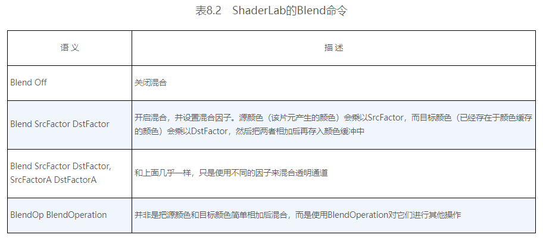
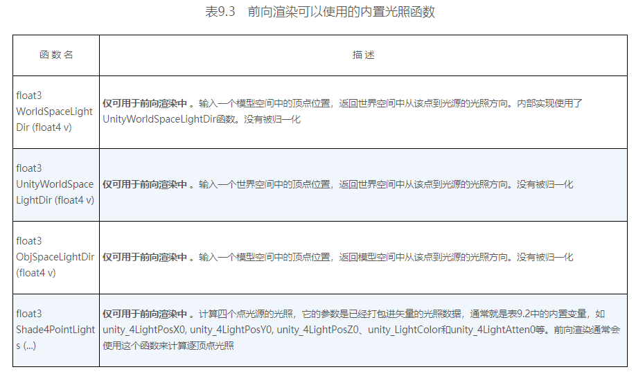

> # Unity Shader 入门精要

## 第一篇 基础篇
### 第一章 Welcome to the world of Shader!
### 第二章 渲染流水线


* 补充资料
  * Real-Time Rendering
  * 批处理：Batch, Batch, Batch: What does it really mean?（NVIDIA report on GDC 2003.）
### 第三章 Unity Shader 基础


* 补充资料
  * [GLSL in Unity Shader](https://docs.unity3d.com/Manual/SL-GLSLShaderPrograms.html)
  * [Unity Shader Doc](https://docs.unity3d.com/Manual/SL-Reference.html)
  * Unity Shader Tutorials
    * [Tutorial 1: ShaderLab and fixed function shaders](https://docs.unity3d.com/Manual/ShaderTut1.html)
    * [Tutorial 2: Vertex and fragment programs](https://docs.unity3d.com/Manual/ShaderTut2.html)
### 第四章 学习 Shader 所需的数学基础


* 变换推导见 GAMES101（注意左右手系的不同）


* Unity Shdaer 内置变量
  
  * 只存在旋转和统一缩放（缩放系数 $k$）时，MV的逆矩阵是 $\frac{1}{k}$T_MV。对方向向量可以截取其 $M_{3\times3}$
* 摄像机和屏幕参数
  
* 关于CG
  * 矩阵乘法 `mul(A, `**`b`**`)` ：正常右乘，此时 **b** 被视作列矩阵。反之作为第一参数左乘视为行矩阵。
  * 矩阵元素初始化填充按行。而 Unity 脚本中的 Matrix4x4 按列。
* **`获得片元视口坐标（屏幕坐标归一化为 (0, 0) 到 (1, 1) 的结果）的两种方法`**
  * 在片元着色器中声明 `VPOS/WPOS` 语义：
    * VPOS/WPOS.xy 为当前片元在屏幕空间中的像素坐标，除以屏幕分辨率
  * 在顶点着色器中使用 Unity 提供的 `ComputeScreenPos` 函数：
    * 在顶点着色器中保存 ComputeScreenPos 到 scrPos
    * 在片元着色器中进行齐次除法运算 scrPos.xy/scrPos.w
    * 原因：如果在顶点着色器中直接做齐次除法会破坏到片元着色器过程中的插值结果。对 $\frac{x}{w}$、$\frac{y}{w}$ 做插值意味着对投影插值，而对投影的插值结果和原数据的插值结果通常是不一致的。
* 补充资料
  * 数学
    * 3D Math Primer for Graphics and Game Development
    * Mathematics for 3D game programming and computer graphics
  * 左右手坐标系的转换：Conversion of Left-Handed Coordinates to Right-Handed Coordinates. | David Eberly.
  * 线性深度值：https://www.humus.name/temp/Linearize%20depth.txt

## 第二篇 初级篇
### 第五章 开始 Unity Shader 学习之旅
```c
// 将函数关联到指定着色器
#pragma vertex vert

// ReturnType FunctionName(Type input : 语义 semantics) semantics
float4 vert(float4 v : POSITION) SV_POSITION {
    return mul (UNITY_MATRIX_MVP, v);
}
```


* ShaderLab 属性类型与 CG 变量类型匹配表

* 顶点着色器输入语义

* 顶点着色器输出/片元着色器输入语义

* 片元着色器输出语义

* UnityCG.cginc 常用结构体/函数


* 三种 Debug 方法
  * 把值映射到 [0, 1] 输出颜色
  * [VS Graphics Debugger](https://docs.unity3d.com/Manual/SL-DebuggingD3D11ShadersWithVS.html)
  * Unity Frame Debugger
    * Window - Frame Debugger
    * 查看一帧的渲染事件
    * 更多抓帧工具：Intel GPA、RenderDoc、NVIDIA NSight、AMD GPU PerfStudio
* 补充资料
  * 流程控制语句对 GPU 性能的影响：GPU Gems 2 Chapter: GPU 流程控制
  * Shader Model 对着色器特性能力的规定：HLSL doc
### 第六章 Unity 中的基础光照


* 环境光 Unity 2019：Window -> Rendering -> Lighting settings -> Ambient Color
* skybox Unity 2019：Window -> Rendering -> Light settings -> Skybox Material
* 漫反射实现：逐顶点兰伯特 vs. 逐像素兰伯特 vs. 逐像素半兰伯特

  * 逐顶点兰伯特：明暗交界处锯齿感严重
  * 逐像素兰伯特：无光照部分全黑，无明暗变化，太硬
  * 逐像素半兰伯特：……好亮……
* 高光反射实现：逐顶点Phong vs. 逐像素Phong vs. 逐像素Blinn-Phong （Specular = (10, 148, 241, 255)，Gloss = 8）

* Unity 光照模型计算常用内置函数

  * 注意：不保证是单位向量，手动归一化
### 第七章 基础纹理


* Q
  * `albedo = tex2D().rgb * _Color.rgb;` 为什么做乘就能混合颜色了……颜色空间色域上的点移动？
  * 纹理长宽建议为 2 的幂
    * 便于纹理采样地址计算时通过移位做处理
  * 计算光照什么情况下要改法线？
  * 在切线空间下存储的法线如何通用到不同模型？
    * 因为切线空间下存储的法线是相对于标准顶点法线的？

### 第八章 透明效果
<!-- ![] -->
* 半透明物体渲染顺序导致的不同混合效果（Reference：[半透明物体混合顺序问题](http://rainyeve.com/wordpress/?p=723)）
    
    
* 物体的循环重叠情况
    
* 渲染队列
  * `SubShader 标签 Queue`
  * Unity：用整数索引来表示每个渲染队列，且索引号越小表示越早被渲染。
  * Unity 定义的渲染队列
    
#### 透明测试与透明混合
* Unity 透明度测试
    ```cpp
    Properties
    {
		_Color("Main Tint", Color) = (1,1,1,1)
		_MainTex("Main Tex", 2D) = "white" {}
		_Cutoff("Alpha Cutoff", Range(0, 1)) = 0.5	// 透明度阈值
    }
    SubShader
    {
        Tags 
		{
			"Queue" = "AlphaTest"					// 指定渲染队列
			"IgnoreProjector" = "True"				// 不受 Projector 影响
			"RenderType" = "TransparentCutout"		// 将当前 Shader 分类到使用透明度测试的组 TransparentCutout
		}
        
		Pass 
		{
			Tags { "LightMode" = "ForwardBase" }

			CGPROGRAM

			// 颜色四通道_Color，纹理_MainTex，纹理缩放_MainTex_ST，透明度
			fixed _Cutoff;

			// struct a2v, v2f, v2f vert(a2v v); 求法线/顶点位置的世界空间坐标，纹理坐标做缩放平移后传给片段着色器

			fixed4 frag(v2f i) : SV_Target
			{
				// 归一化法线和光源（世界空间）、纹理采样

				// 透明度测试
				// Alpha test
				clip(texColor.a - _Cutoff);
				// Equal to 
			//  if ((texColor.a - _Cutoff) < 0.0) 
			//	{
			//      discard;	// CG提供的指令，在FragmentShader中表示立即放弃当前处理的片元
			//  }

                // 光照计算并返回结果
			}
            ENDCG
		}

        Fallback "Transparent/Cutout/VertexLit"
        // 保证代替 Shader，且正确向其它物体投射阴影
    }
    ```
* Unity 透明混合
  * `ZWrite Off` 关闭深度写入，也可直接写在 SubShader 下，指定该 SubShader 下所有 Pass 都关闭深度写入
      ```cpp
      SubShader
      {
          Tags { "Queue" = "Transparent" }
          Pass 
          {
              ZWrite Off
          }
      }
      ```
  * `混合命令 Blend`：设置混合因子，同时打开混合模式。打开混合模式，片元的透明通道才有意义。
      
    * 本节使用 Blend `SrcAlpha` `OneMinusSrcAlpha`：以 $DstColor_{new} = SrcAlpha \times SrcColor + (1-SrcAlpha)\times DstColor_{old}$ 进行混合，SrcColor为当前片元着色器产生的颜色，DstColor为Color Buffer中颜色
  * 透明混合与混合测试的不同
    * ① 控制透明度的量（测试设阈值 Cutoff -> 混合控制透明度 AlphaScale）
    * ② SubShader标签（渲染队列Queue: AlphaTest -> Transparent、分类 RenderType: TransparentCutout -> Transparent）
    * ③ `在 Pass 中进行混合状态设置`（ZWrite Off、Blend）
    * ④ 片元着色器中的使用方法（透明测试以阈值为界discard，透明混合打开并修改返回值的透明通道）
    * ⑤ Fallback（Transparent/Cutout/VertexLit -> Transparent/VertexLit）
* 透明测试结果 Alpha Cutoff = 0.2、0.6、0.8、0.9
    
    
    
    
* 透明混合结果 Alpha Scale = 0.2、0.6、0.8
    
    
    
#### 开启深度写入的半透明效果
<!-- ![] -->
* 结果
    
    * 左透明混合：顺序完美地凌乱了呢（...
    * 右开启深度写入：**`模型内部没有半透明效果`**
#### ShaderLab 混合命令


#### 双面渲染的透明效果
* 透明测试 $\times$ 关闭背面剔除的透明测试 $\times$ 透明混合 $\times$ 关闭背面剔除的透明混合 （Cube 凸几何体）
    
    * 【？】问题：才半透明就没影子了嗷
* 透明混合 $\times$ 关闭背面剔除的透明混合
    
    * 【？】问题：显然，在模型自身非凸时，内部渲染顺序又 GG 了
      * 据说可以用[OIT顺序无关透明渲染](https://zhuanlan.zhihu.com/p/92841297)、[次序无关的半透明渲染实现](https://zhuanlan.zhihu.com/p/92337395)解决

## 第三篇 中级篇
### 第九章 更复杂的光照
#### **`渲染路径`**
* 渲染路径 Rendering Path：前向渲染路径 Forward Rendering Path、延迟渲染路径 Deferred Rendering Path
  * Project Settings / Camera Component Settings
  * 在 Pass 中以 Tag `LightMode` 标签设置，确定该 `Pass 的计算内容`，Unity 将对相应所需变量值传递给 Shader。
  * LightMode 标签支持的渲染路径设置选项
    
* 前向渲染路径
  * 任务：渲染图元，计算 Color Buffer、Depth Buffer（Z-Buffer）
  * 处理光照的方式：逐顶点、逐像素、球谐函数（Spherical Harmonics）。决策优先级：光源的重要性。
  * Unity 前向渲染的两种 Pass
    * `Base Pass`：一个 Base Pass 只执行一次，通常可计算环境光、自发光、可访问光照纹理 Light Map、平行光（开启光源阴影功能时，默认支持阴影）
    * `Additional Pass`：`对每个影响当前物体的逐像素光源都执行一次`，开启混合模式，Additional Pass 的结果与上一次的光照结果在帧缓存中进行叠加，得到多个光照的渲染效果。【← 多 Pass 的性能消耗、不同光源对同物体的光照计算中的重复冗余问题】
  * 前向渲染可以使用的内置光照变量、光照函数
    
    
* 延迟渲染路径
  * 任务：在第一个 Pass 用深度缓冲技术预处理片元可见性，将相关片元信息存储到 G-Buffer（Geometry），如表面法线、视角方向、漫反射系数、平滑度、自发光和深度等，每个物体执行一次该 Pass。第二个 Pass 做光照计算。
  * 优点：与场景中光源数目无关，不依赖场景复杂度。与屏幕空间大小相关。
  * 问题：
    * 不支持真正的抗锯齿 AA
    * 不能处理半透明物体
    * 显卡必须支持MRT（Multiple Render Targets）、Shader Mode 3.0及以上、深度渲染纹理以及双面的模板缓冲（stencil）。
  * 延迟渲染可以使用的内置变量、函数
    
#### **`光源类型`**
* 光源属性：位置、（到某点的）方向、颜色、强度、（到某点的）衰减
  * 平行光：阳光，只有 Rotation 有效（到场景中各点方向），无位置，不衰减
  * 点光源 Point Light：球形范围，衰减可由函数定义
  * 聚光灯 Spot Light：锥形区域，衰减可由函数定义，需要判断点是否在锥体范围内
* Unity 对光源衰减的处理：使用一张衰减纹理作为查找表（Lookup Table，LUT）
* 用帧调试器 Frame Debugger 查看场景绘制过程
* Unity：光源强度、颜色、距离物体的远近会影响光源的重要性优先级
#### **`光照衰减`**
* 衰减纹理：需要预处理，纹理大小影响衰减精度，不直观，存储到 LUT 后无法用其他数学公式计算衰减。但性能 up。
  * 对角线上纹理颜色值表明在光源空间中不同位置的点的衰减值。(0, 0)点表明了与光源位置重合的点的衰减值，而(1, 1)点表明了在光源空间中所关心的距离最远的点的衰减。
  * 采样：光源空间中顶点距离的平方。
#### **`Unity 阴影`**
* 阴影映射纹理 Shadow Map
  * 原理：把摄像机的位置放在与光源重合的位置上，得到该重合光源的阴影区域就是摄像机不可见的位置。
  * Shadow Map 记录信息：从光源位置出发、能看到的场景中距离它最近的表面位置（深度信息）。
  * 流程：渲染某物体时，从当前渲染物体的（所设或 Fallback 指定的） Unity Shader 中寻找 `LightMode Tag` 为 `ShadowCaster` 的 Pass，不存在时`无法向其它物体投射阴影`（但可以接收其它物体的阴影）。（Unity）放置摄像机到光源位置、调用该 Pass，得到`顶点在光源空间下的位置`，输出深度信息到 Shadow Map。
* 屏幕空间的阴影映射技术（Screenspace Shadow Map）：在 ShadowCaster Pass 中得到光源的 Shadow Map 的同时，产生`摄像机的深度纹理`。综合得到`屏幕空间的 Shadow Map`，此时某一点 $Z_{depth} > Z_{shadow}$ 则说明该点可见，但处于该光源的阴影区域。则使用时直接在 Shader 中用屏幕空间的表面坐标做采样。
* 注意光源阴影映射纹理计算时是否由于背面剔除没有计算`背对光源的面的信息`。
* 透明物体向其它物体投射阴影
  * 透明度测试：在 ShadowCaster Pass 中进行透明度测试。
  * 半透明物体：用不透明的阴影顶一顶（

### 第十章 高级纹理
### 第十一章 让画面动起来

## 第四篇 高级篇
### 第十二章 屏幕后处理效果
### 第十三章 使用深度和法线纹理
### 第十四章 非真实感渲染
### 第十五章 使用噪声
### 第十六章 Unity 中的渲染优化技术

## 第五篇 扩展篇
### 第十七章 Unity 的表面着色器探秘
### 第十八章 基于物理的渲染


