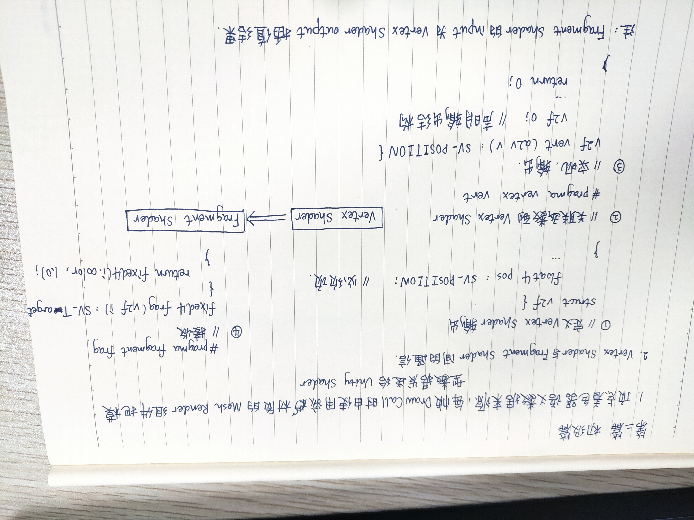
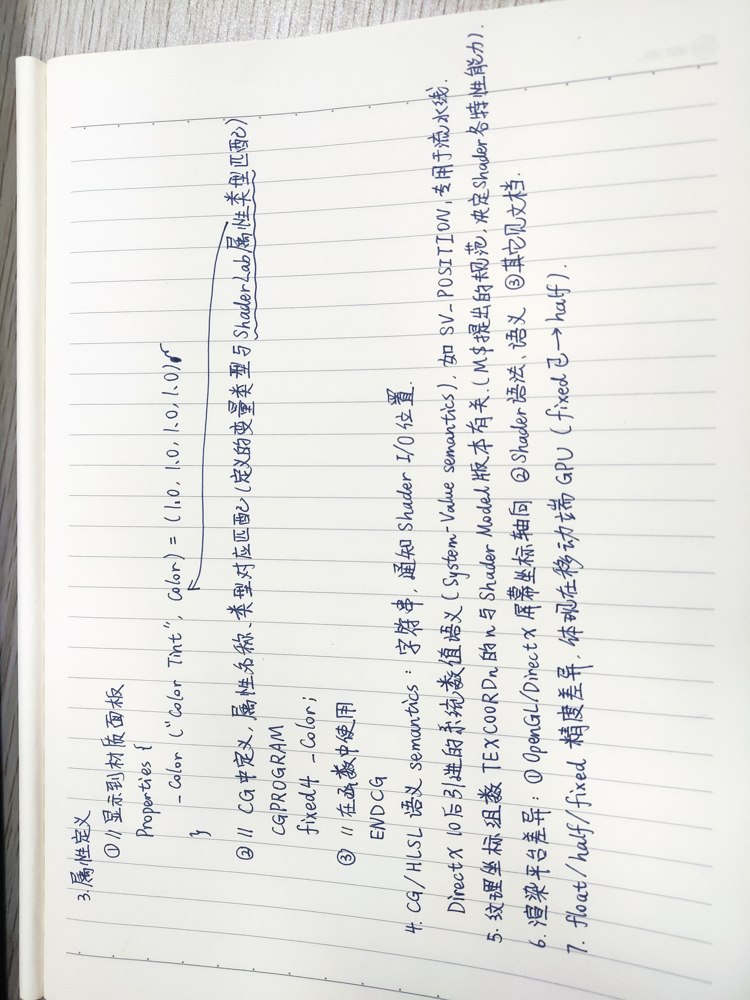

> # Unity Shader 入门精要

## 第一篇 基础篇
### 第一章 Welcome to the world of Shader!
### 第二章 渲染流水线


* 补充资料
  * Real-Time Rendering
  * 批处理：Batch, Batch, Batch: What does it really mean?（NVIDIA report on GDC 2003.）
### 第三章 Unity Shader 基础


* 补充资料
  * [GLSL in Unity Shader](https://docs.unity3d.com/Manual/SL-GLSLShaderPrograms.html)
  * [Unity Shader Doc](https://docs.unity3d.com/Manual/SL-Reference.html)
  * Unity Shader Tutorials
    * [Tutorial 1: ShaderLab and fixed function shaders](https://docs.unity3d.com/Manual/ShaderTut1.html)
    * [Tutorial 2: Vertex and fragment programs](https://docs.unity3d.com/Manual/ShaderTut2.html)
### 第四章 学习 Shader 所需的数学基础


* 变换推导见 GAMES101（注意左右手系的不同）


* Unity Shdaer 内置变量
  
  * 只存在旋转和统一缩放（缩放系数 $k$）时，MV的逆矩阵是 $\frac{1}{k}$T_MV。对方向向量可以截取其 $M_{3\times3}$
* 摄像机和屏幕参数
  
* 关于CG
  * 矩阵乘法 `mul(A, `**`b`**`)` ：正常右乘，此时 **b** 被视作列矩阵。反之作为第一参数左乘视为行矩阵。
  * 矩阵元素初始化填充按行。而 Unity 脚本中的 Matrix4x4 按列。
* **`获得片元视口坐标（屏幕坐标归一化为 (0, 0) 到 (1, 1) 的结果）的两种方法`**
  * 在片元着色器中声明 `VPOS/WPOS` 语义：
    * VPOS/WPOS.xy 为当前片元在屏幕空间中的像素坐标，除以屏幕分辨率
  * 在顶点着色器中使用 Unity 提供的 `ComputeScreenPos` 函数：
    * 在顶点着色器中保存 ComputeScreenPos 到 scrPos
    * 在片元着色器中进行齐次除法运算 scrPos.xy/scrPos.w
    * 原因：如果在顶点着色器中直接做齐次除法会破坏到片元着色器过程中的插值结果。对 $\frac{x}{w}$、$\frac{y}{w}$ 做插值意味着对投影插值，而对投影的插值结果和原数据的插值结果通常是不一致的。
* 补充资料
  * 数学
    * 3D Math Primer for Graphics and Game Development
    * Mathematics for 3D game programming and computer graphics
  * 左右手坐标系的转换：Conversion of Left-Handed Coordinates to Right-Handed Coordinates. | David Eberly.
  * 线性深度值：https://www.humus.name/temp/Linearize%20depth.txt

## 第二篇 初级篇
### 第五章 开始 Unity Shader 学习之旅
```c
// 将函数关联到指定着色器
#pragma vertex vert

// ReturnType FunctionName(Type input : 语义 semantics) semantics
float4 vert(float4 v : POSITION) SV_POSITION {
    return mul (UNITY_MATRIX_MVP, v);
}
```


* ShaderLab 属性类型与 CG 变量类型匹配表

* 顶点着色器输入语义

* 顶点着色器输出/片元着色器输入语义

* 片元着色器输出语义

* UnityCG.cginc 常用结构体/函数


* 三种 Debug 方法
  * 把值映射到 [0, 1] 输出颜色
  * [VS Graphics Debugger](https://docs.unity3d.com/Manual/SL-DebuggingD3D11ShadersWithVS.html)
  * Unity Frame Debugger
    * Window - Frame Debugger
    * 查看一帧的渲染事件
    * 更多抓帧工具：Intel GPA、RenderDoc、NVIDIA NSight、AMD GPU PerfStudio
* 补充资料
  * 流程控制语句对 GPU 性能的影响：GPU Gems 2 Chapter: GPU 流程控制
  * Shader Model 对着色器特性能力的规定：HLSL doc
### 第六章 Unity 中的基础光照


* 环境光 Unity 2019：Window -> Rendering -> Lighting settings -> Ambient Color
* skybox Unity 2019：Window -> Rendering -> Light settings -> Skybox Material
* 漫反射实现：逐顶点兰伯特 vs. 逐像素兰伯特 vs. 逐像素半兰伯特

  * 逐顶点兰伯特：明暗交界处锯齿感严重
  * 逐像素兰伯特：无光照部分全黑，无明暗变化，太硬
  * 逐像素半兰伯特：……好亮……
* 高光反射实现：逐顶点Phong vs. 逐像素Phong vs. 逐像素Blinn-Phong （Specular = (10, 148, 241, 255)，Gloss = 8）

* Unity 光照模型计算常用内置函数

  * 注意：不保证是单位向量，手动归一化
### 第七章 基础纹理


* Q
  * `albedo = tex2D().rgb * _Color.rgb;` 为什么做乘就能混合颜色了……颜色空间色域上的点移动？
  * 纹理长宽建议为 2 的幂
    * 便于纹理采样地址计算时通过移位做处理
  * 计算光照什么情况下要改法线？
  * 在切线空间下存储的法线如何通用到不同模型？
    * 因为切线空间下存储的法线是相对于标准顶点法线的？

### 第八章 透明效果

## 第三篇 中级篇
### 第九章 更复杂的光照
### 第十章 高级纹理
### 第十一章 让画面动起来

## 第四篇 高级篇
### 第十二章 屏幕后处理效果
### 第十三章 使用深度和法线纹理
### 第十四章 非真实感渲染
### 第十五章 使用噪声
### 第十六章 Unity 中的渲染优化技术

## 第五篇 扩展篇
### 第十七章 Unity 的表面着色器探秘
### 第十八章 基于物理的渲染


