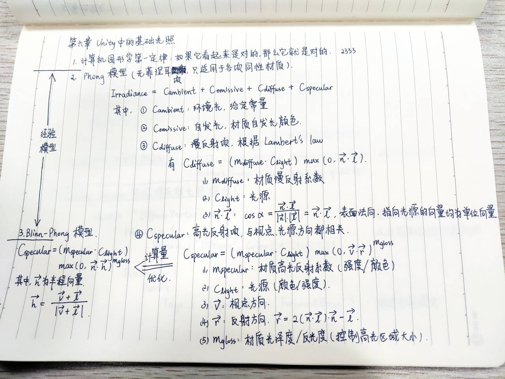
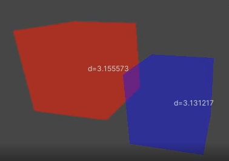
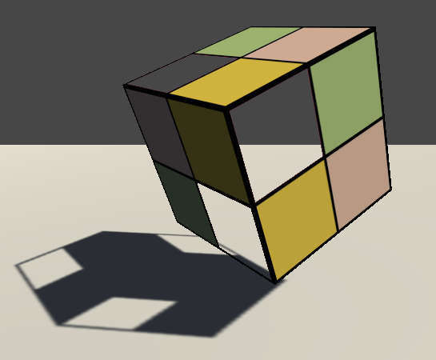

> # Unity Shader 入门精要

## 第一篇 基础篇
### 第一章 Welcome to the world of Shader!
### 第二章 渲染流水线


* 补充资料
  * Real-Time Rendering
  * 批处理：Batch, Batch, Batch: What does it really mean?（NVIDIA report on GDC 2003.）
### 第三章 Unity Shader 基础


* 补充资料
  * [GLSL in Unity Shader](https://docs.unity3d.com/Manual/SL-GLSLShaderPrograms.html)
  * [Unity Shader Doc](https://docs.unity3d.com/Manual/SL-Reference.html)
  * Unity Shader Tutorials
    * [Tutorial 1: ShaderLab and fixed function shaders](https://docs.unity3d.com/Manual/ShaderTut1.html)
    * [Tutorial 2: Vertex and fragment programs](https://docs.unity3d.com/Manual/ShaderTut2.html)
### 第四章 学习 Shader 所需的数学基础


* 变换推导见 GAMES101（注意左右手系的不同）


* Unity Shdaer 内置变量
  
  * 只存在旋转和统一缩放（缩放系数 $k$）时，MV的逆矩阵是 $\frac{1}{k}$T_MV。对方向向量可以截取其 $M_{3\times3}$
* 摄像机和屏幕参数
  
* 关于CG
  * 矩阵乘法 `mul(A, `**`b`**`)` ：正常右乘，此时 **b** 被视作列矩阵。反之作为第一参数左乘视为行矩阵。
  * 矩阵元素初始化填充按行。而 Unity 脚本中的 Matrix4x4 按列。
* **`获得片元视口坐标（屏幕坐标归一化为 (0, 0) 到 (1, 1) 的结果）的两种方法`**
  * 在片元着色器中声明 `VPOS/WPOS` 语义：
    * VPOS/WPOS.xy 为当前片元在屏幕空间中的像素坐标，除以屏幕分辨率
  * 在顶点着色器中使用 Unity 提供的 `ComputeScreenPos` 函数：
    * 在顶点着色器中保存 ComputeScreenPos 到 scrPos
    * 在片元着色器中进行齐次除法运算 scrPos.xy/scrPos.w
    * 原因：如果在顶点着色器中直接做齐次除法会破坏到片元着色器过程中的插值结果。对 $\frac{x}{w}$、$\frac{y}{w}$ 做插值意味着对投影插值，而对投影的插值结果和原数据的插值结果通常是不一致的。
* 补充资料
  * 数学
    * 3D Math Primer for Graphics and Game Development
    * Mathematics for 3D game programming and computer graphics
  * 左右手坐标系的转换：Conversion of Left-Handed Coordinates to Right-Handed Coordinates. | David Eberly.
  * 线性深度值：https://www.humus.name/temp/Linearize%20depth.txt

## 第二篇 初级篇
### 第五章 开始 Unity Shader 学习之旅
```c
// 将函数关联到指定着色器
#pragma vertex vert

// ReturnType FunctionName(Type input : 语义 semantics) semantics
float4 vert(float4 v : POSITION) SV_POSITION {
    return mul (UNITY_MATRIX_MVP, v);
}
```


* ShaderLab 属性类型与 CG 变量类型匹配表

* 顶点着色器输入语义

* 顶点着色器输出/片元着色器输入语义

* 片元着色器输出语义

* UnityCG.cginc 常用结构体/函数


* 三种 Debug 方法
  * 把值映射到 [0, 1] 输出颜色
  * [VS Graphics Debugger](https://docs.unity3d.com/Manual/SL-DebuggingD3D11ShadersWithVS.html)
  * Unity Frame Debugger
    * Window - Frame Debugger
    * 查看一帧的渲染事件
    * 更多抓帧工具：Intel GPA、RenderDoc、NVIDIA NSight、AMD GPU PerfStudio
* 补充资料
  * 流程控制语句对 GPU 性能的影响：GPU Gems 2 Chapter: GPU 流程控制
  * Shader Model 对着色器特性能力的规定：HLSL doc
### 第六章 Unity 中的基础光照



* 环境光 Unity 2019：Window -> Rendering -> Lighting settings -> Ambient Color
* skybox Unity 2019：Window -> Rendering -> Light settings -> Skybox Material
* 漫反射实现：逐顶点兰伯特 vs. 逐像素兰伯特 vs. 逐像素半兰伯特

  * 逐顶点兰伯特：明暗交界处锯齿感严重
  * 逐像素兰伯特：无光照部分全黑，无明暗变化，太硬
  * 逐像素半兰伯特：……好亮……
* 高光反射实现：逐顶点Phong vs. 逐像素Phong vs. 逐像素Blinn-Phong （Specular = (10, 148, 241, 255)，Gloss = 8）

* Unity 光照模型计算常用内置函数

  * 注意：不保证是单位向量，手动归一化
### 第七章 基础纹理


* Q
  * `albedo = tex2D().rgb * _Color.rgb;` 为什么做乘就能混合颜色了……颜色空间色域上的点移动？
  * 纹理长宽建议为 2 的幂
    * 便于纹理采样地址计算时通过移位做处理
  * 计算光照什么情况下要改法线？
  * 在切线空间下存储的法线如何通用到不同模型？
    * 因为切线空间下存储的法线是相对于标准顶点法线的？

### 第八章 透明效果
<!-- ![] -->
* 半透明物体渲染顺序导致的不同混合效果（Reference：[半透明物体混合顺序问题](http://rainyeve.com/wordpress/?p=723)）
    
    
* 物体的循环重叠情况
    
* 渲染队列
  * `SubShader 标签 Queue`
  * Unity：用整数索引来表示每个渲染队列，且索引号越小表示越早被渲染。
  * Unity 定义的渲染队列
    
#### 透明测试与透明混合
* Unity 透明度测试
    ```cpp
    Properties
    {
		_Color("Main Tint", Color) = (1,1,1,1)
		_MainTex("Main Tex", 2D) = "white" {}
		_Cutoff("Alpha Cutoff", Range(0, 1)) = 0.5	// 透明度阈值
    }
    SubShader
    {
        Tags 
		{
			"Queue" = "AlphaTest"					// 指定渲染队列
			"IgnoreProjector" = "True"				// 不受 Projector 影响
			"RenderType" = "TransparentCutout"		// 将当前 Shader 分类到使用透明度测试的组 TransparentCutout
		}
        
		Pass 
		{
			Tags { "LightMode" = "ForwardBase" }

			CGPROGRAM

			// 颜色四通道_Color，纹理_MainTex，纹理缩放_MainTex_ST，透明度
			fixed _Cutoff;

			// struct a2v, v2f, v2f vert(a2v v); 求法线/顶点位置的世界空间坐标，纹理坐标做缩放平移后传给片段着色器

			fixed4 frag(v2f i) : SV_Target
			{
				// 归一化法线和光源（世界空间）、纹理采样

				// 透明度测试
				// Alpha test
				clip(texColor.a - _Cutoff);
				// Equal to 
			//  if ((texColor.a - _Cutoff) < 0.0) 
			//	{
			//      discard;	// CG提供的指令，在FragmentShader中表示立即放弃当前处理的片元
			//  }

                // 光照计算并返回结果
			}
            ENDCG
		}

        Fallback "Transparent/Cutout/VertexLit"
        // 保证代替 Shader，且正确向其它物体投射阴影
    }
    ```
* Unity 透明混合
  * `ZWrite Off` 关闭深度写入，也可直接写在 SubShader 下，指定该 SubShader 下所有 Pass 都关闭深度写入
      ```cpp
      SubShader
      {
          Tags { "Queue" = "Transparent" }
          Pass 
          {
              ZWrite Off
          }
      }
      ```
  * `混合命令 Blend`：设置混合因子，同时打开混合模式。打开混合模式，片元的透明通道才有意义。
      
    * 本节使用 Blend `SrcAlpha` `OneMinusSrcAlpha`：以 $DstColor_{new} = SrcAlpha \times SrcColor + (1-SrcAlpha)\times DstColor_{old}$ 进行混合，SrcColor为当前片元着色器产生的颜色，DstColor为Color Buffer中颜色
  * 透明混合与混合测试的不同
    * ① 控制透明度的量（测试设阈值 Cutoff -> 混合控制透明度 AlphaScale）
    * ② SubShader标签（渲染队列Queue: AlphaTest -> Transparent、分类 RenderType: TransparentCutout -> Transparent）
    * ③ `在 Pass 中进行混合状态设置`（ZWrite Off、Blend）
    * ④ 片元着色器中的使用方法（透明测试以阈值为界discard，透明混合打开并修改返回值的透明通道）
    * ⑤ Fallback（Transparent/Cutout/VertexLit -> Transparent/VertexLit）
* 透明测试结果 Alpha Cutoff = 0.2、0.6、0.8、0.9
    
    
    
    
* 透明混合结果 Alpha Scale = 0.2、0.6、0.8
    
    
    
#### 开启深度写入的半透明效果
<!-- ![] -->
* 结果
    
    * 左透明混合：顺序完美地凌乱了呢（...
    * 右开启深度写入：**`模型内部没有半透明效果`**
#### ShaderLab 混合命令


#### 双面渲染的透明效果
* 透明测试 $\times$ 关闭背面剔除的透明测试 $\times$ 透明混合 $\times$ 关闭背面剔除的透明混合 （Cube 凸几何体）
    
    * 【？】问题：才半透明就没影子了嗷
* 透明混合 $\times$ 关闭背面剔除的透明混合
    
    * 【？】问题：显然，在模型自身非凸时，内部渲染顺序又 GG 了
      * 据说可以用[OIT顺序无关透明渲染](https://zhuanlan.zhihu.com/p/92841297)、[次序无关的半透明渲染实现](https://zhuanlan.zhihu.com/p/92337395)解决

## 第三篇 中级篇
### 第九章 更复杂的光照
#### **`渲染路径`**
* 渲染路径 Rendering Path：前向渲染路径 Forward Rendering Path、延迟渲染路径 Deferred Rendering Path
  * Project Settings / Camera Component Settings
  * 在 Pass 中以 Tag `LightMode` 标签设置，确定该 `Pass 的计算内容`，Unity 将对相应所需变量值传递给 Shader。
  * LightMode 标签支持的渲染路径设置选项
    
* 前向渲染路径
  * 任务：渲染图元，计算 Color Buffer、Depth Buffer（Z-Buffer）
  * 处理光照的方式：逐顶点、逐像素、球谐函数（Spherical Harmonics）。决策优先级：光源的重要性。
  * Unity 前向渲染的两种 Pass
    * `Base Pass`：一个 Base Pass 只执行一次，通常可计算环境光、自发光、可访问光照纹理 Light Map、平行光（开启光源阴影功能时，默认支持阴影）
    * `Additional Pass`：`对每个影响当前物体的逐像素光源都执行一次`，开启混合模式，Additional Pass 的结果与上一次的光照结果在帧缓存中进行叠加，得到多个光照的渲染效果。【← 多 Pass 的性能消耗、不同光源对同物体的光照计算中的重复冗余问题】
  * 前向渲染可以使用的内置光照变量、光照函数
    
    
* 延迟渲染路径
  * 任务：在第一个 Pass 用深度缓冲技术预处理片元可见性，将相关片元信息存储到 G-Buffer（Geometry），如表面法线、视角方向、漫反射系数、平滑度、自发光和深度等，每个物体执行一次该 Pass。第二个 Pass 做光照计算。
  * 优点：与场景中光源数目无关，不依赖场景复杂度。与屏幕空间大小相关。
  * 问题：
    * 不支持真正的抗锯齿 AA
    * 不能处理半透明物体
    * 显卡必须支持MRT（Multiple Render Targets）、Shader Mode 3.0及以上、深度渲染纹理以及双面的模板缓冲（stencil）。
  * 延迟渲染可以使用的内置变量、函数
    
#### **`光源类型`**
* 光源属性：位置、（到某点的）方向、颜色、强度、（到某点的）衰减
  * 平行光：阳光，只有 Rotation 有效（到场景中各点方向），无位置，不衰减
  * 点光源 Point Light：球形范围，衰减可由函数定义
  * 聚光灯 Spot Light：锥形区域，衰减可由函数定义，需要判断点是否在锥体范围内
* Unity 对光源衰减的处理：使用一张衰减纹理作为查找表（Lookup Table，LUT）
* 用帧调试器 Frame Debugger 查看场景绘制过程
* Unity：光源强度、颜色、距离物体的远近会影响光源的重要性优先级
#### **`光照衰减`**
* 衰减纹理：需要预处理，纹理大小影响衰减精度，不直观，存储到 LUT 后无法用其他数学公式计算衰减。但性能 up。
  * 对角线上纹理颜色值表明在光源空间中不同位置的点的衰减值。(0, 0)点表明了与光源位置重合的点的衰减值，而(1, 1)点表明了在光源空间中所关心的距离最远的点的衰减。
  * 采样：光源空间中顶点距离的平方。
#### **`Unity 阴影`**
* 阴影映射纹理 Shadow Map
  * 原理：把摄像机的位置放在与光源重合的位置上，得到该重合光源的阴影区域就是摄像机不可见的位置。
  * Shadow Map 记录信息：从光源位置出发、能看到的场景中距离它最近的表面位置（深度信息）。
  * 流程：渲染某物体时，从当前渲染物体的（所设或 Fallback 指定的） Unity Shader 中寻找 `LightMode Tag` 为 `ShadowCaster` 的 Pass，不存在时`无法向其它物体投射阴影`（但可以接收其它物体的阴影）。（Unity）放置摄像机到光源位置、调用该 Pass，得到`顶点在光源空间下的位置`，输出深度信息到 Shadow Map。
* 屏幕空间的阴影映射技术（Screenspace Shadow Map）：在 ShadowCaster Pass 中得到光源的 Shadow Map 的同时，产生`摄像机的深度纹理`。综合得到`屏幕空间的 Shadow Map`，此时某一点 $Z_{depth} > Z_{shadow}$ 则说明该点可见，但处于该光源的阴影区域。则使用时直接在 Shader 中用屏幕空间的表面坐标做采样。
* 注意光源阴影映射纹理计算时是否由于背面剔除没有计算`背对光源的面的信息`。
* 透明物体向其它物体投射阴影
  * 透明度测试：在 ShadowCaster Pass 中进行透明度测试。
  * 半透明物体：用不透明的阴影顶一顶（
<!-- TODO -->
#### 实现细节

### 第十章 高级纹理
#### **`立方体纹理 Cubemap`**
* `环境映射 Environment Mapping`：模拟物体周围的环境。
* **`立方体纹理 Cubemap`**：环境映射的一种实现方法。
  * 采样方法：提供一个三维的纹理坐标，表示在世界空间下的三维方向。该方向矢量从立方体中心出发，向外部延伸，和立方体的六个纹理面之一相交，交点即采样点。
  * Tips
    * 场景改变时需重新生成。
    * 由于`不能模拟多次反射的结果`，所以只能反射环境，不能反射使用了该立方体纹理的物体本身。（因此不适应会反射自身的凹面体）
    * 注意六个面接缝处的不匹配现象。
  * 基于物理的渲染，可用 HDR 图像生成高质量的 Cubemap。
  * 脚本：根据物体在场景中位置的不同，生成各自立方体纹理。
* 应用：反射
  * 方法：用反射方向对立方体纹理采样。
* 应用：折射
  * 方法：用一次折射方向采样。
  * 理论上需要计算两次折射，但是一次折射模拟的视觉效果可以接受。
* 菲涅尔反射 Fresnel reflection：Schlick 逼近公式、Empricial 逼近公式
  * 模拟边缘光照效果：Fresnel 和反射光相乘后叠加到漫反射光
#### **`渲染纹理`**
* 渲染目标纹理 Render Target Texture：把整个三维场景渲染到该中间缓冲
* 多重渲染目标 Multiple Render Target：把场景同时渲染到多个渲染目标纹理
* Unity 中的使用
  * 将摄像机的渲染目标设为渲染纹理
  * 在屏幕后处理时使用 `GrabPass` 命令或 `OnRenderImage` 函数获取当前屏幕图像
* 应用：镜面效果
  * 原理：在镜面上显示水平翻转后的渲染纹理
* 应用：玻璃效果（GrabPass）
  * Tips：透明材质的模拟实现时注意渲染队列设置，`保证所有不透明物体已绘制完毕`
#### **`程序纹理`**
* 通过脚本创建程序纹理，赋给相应的材质。
* 程序材质 Procedural Materials
  * 纹理生成工具 Substance Designer ，Substance 材质 .sbsar
<!-- TODO note from 10.2.2 -->
#### 实现细节

### 第十一章 让画面动起来
#### Unity 时间变量


#### 纹理动画
* 序列帧动画：播放关键帧。美术工程量大。
  * Shader 在每个时刻计算：当前时刻应播放的关键帧位置，对该关键帧进行纹理采样。
  * 通常是透明纹理【？啊这样吗】
#### 顶点动画
<!-- TODO -->
#### 实现细节
* 纹理动画应用：序列帧播放
* 纹理动画应用：滚动背景
* 顶点动画应用：2D 河流
  * 原理：用正弦函数等模拟水流的波动效果。
  * Tips
    * 顶点动画需要在物体的模型空间下对顶点位置进行偏移，合批不同模型时其各自模型空间丢失，因此需要 `DisableBatching` 指定不对该 SubShader 使用批处理。
* 顶点动画应用：广告牌技术 Billboarding
  * 思想：根据视角方向旋转一个被纹理着色的多边形（如四边形广告牌），使得多边形看似总是面对摄像机。（用于渲染厌恶、云朵、闪光效果等）
  * 关键：通过`表面法线 normal`、`指向上的方向 up`、`指向右的方向 right` 构造旋转矩阵，并指定一个在旋转过程中固定不变的`锚点 anchor location`。通常可由计算得到 normal、up ，两者一般不垂直，但其中之一固定。假设 normal 固定，求一组用于旋转的正交基：【？和相机坐标系的构造好像？】
    * $right = cross(normal, up) = normal \times up$
    * $right' = normalize(right)$
    * $up' = normal \times right'$
  * 锚点：使用物体的模型空间下的位置，但容易被合批处理破坏。避免用模型空间下的绝对位置和方向，可以使用顶点颜色存储顶点到锚点的距离值。
  * 阴影：需要在 ShadowCaster Pass 中包含有相关顶点动画的处理

## 第四篇 高级篇
### 第十二章 屏幕后处理效果
* 基本屏幕后处理脚本（基类）
  * `Input`：上一步结果产生的渲染纹理
  * `Step`
    * 绑定到一个 Camera
    * 检查实现特效的资源和条件是否满足
    * 检查特效需要使用的 Shader 的可用性
  * `output`：返回一个使用该 Shader 、用于处理渲染纹理的材质
* 对应实现某效果的脚本
  * 继承基类
  * `声明效果所需 Shader`，由此`创建相应材质`
  * `提供效果所需属性控制参数`
  * `定义 OnRenderImage() `，`检查材质是否可用`，传递参数，进行效果处理
* 后处理 Shader
  * 对接 Unity 后处理函数接口、上述脚本，`取得属性变量值`
  * `设置渲染状态`：后处理效果施加在与屏幕同宽同高的一层面片上，为了避免影响可能尚未渲染的物体（比如在不透明物体渲染完后直接进行后处理，再渲染透明物体），需要关闭深度写入等
  * 声明变量
  * 定义顶点着色器：顶点变换，`传递正确的纹理坐标`给片元着色器
  * 定义片元着色器：`采样原图像`，做处理
* 计算像素对应亮度值（加权和，灰度图亮度即像素值）
  * $luminance = 0.2125r + 0.7154g + 0.0721b$
  * **`像素亮度值计算`**：[Stackoverflow - Formula to determine brightness of RGB color](https://stackoverflow.com/questions/596216/formula-to-determine-brightness-of-rgb-color)
#### **边缘检测**
* 常见边缘检测算子（包含水平/竖直方向的边缘检测卷积核）
    
    
    * 对每个像素的不同方向分别卷积，得到两个方向上的梯度值（Gradient） $G_x$、$G_y$
    * 则该像素整体梯度 
      * $G = sqrt(G_x^2+G_y^2)$
      * 出于性能考虑，可用绝对值代替 $G = |G_x| + |G_y|$
    * 梯度越大（相邻像素差值），越可能是边缘点
#### **`高斯模糊`**
* 均值模糊、中值模糊
* **`高斯模糊`**
  * 高斯核：正方形，每个元素计算高斯方程 
    $$G(x, y) = \frac{1}{2\pi\sigma^2}e^{-\frac{x^2+y^2}{2\sigma^2}}$$
    * $\sigma$ 标准方差，通常取 $1$
    * $x$、$y$ 分别对应当前像素到卷积核中心的整数距离
    * $\frac{1}{2\pi\sigma^2}$ 是对高斯核中的权重进行归一化，使权重和为 $1$ ，保证滤波后的图像不变暗。该系数对结果无影响。
  * 意义：模拟了邻域中每个像素对当前像素的影响程度
    * 距离越近，影响越大
    * 高斯核维数越高，模糊程度越大
* 复杂度优化
  * $N \times N$ 高斯核对图像进行卷积滤波复杂度：$N \times N \times W \times H$
  * 拆分为两个一维函数，分两个 Pass 进行滤波：$2\times N \times W \times H$
    
    
* 调整高斯滤波次数控制模糊程度。
#### **Bloom**
* Bloom：让画面中较亮的区域扩散到周围区域
* `step`
  * 根据阈值提取较亮区域到渲染纹理
  * 对较亮区域做高斯模糊，模拟光线扩散效果
  * 叠加到原图
#### **运动模糊**
* 运动模糊模拟方法
  * 混合连续帧：累积缓存或保存前次渲染结果，把当前结果叠上去
  * 速度缓存：存储各个像素的运动速度
* 【？】Render Target 的 Alpha 通道
#### 扩展资料
* [Unity Doc](https://docs.unity3d.com/Manual/comp-Effects.html)
* [GPU Gems](https://developer.nvidia.com/gpugems/GPUGems)
<!-- TODO -->
#### 实现细节
* 屏幕亮度、饱和度、对比度：
* 描边效果：用颜色/深度/法线纹理进行边缘检测
  * 【？】图像边界补不补 0
* 高斯模糊
  * 两 Pass 中间整个 Temp Buffer
  * 降采样优化
  * 迭代次数
* Bloom
* 运动模糊

### 第十三章 使用深度和法线纹理
#### **`获取深度和法线纹理`**
* 深度纹理
  * 存储在一张渲染纹理，其值来自于顶点变换 MVP 结束后得到的归一化设备坐标（NDC）的顶点 $Z$ 值。
  * `非线性`：由于投影变换中，透视投影矩阵是非线性的，因此所得深度值也是非线性的。
  * 经过`映射`：NDC 中 $Z$ 分量范围 $[-1, 1]$，因此存储到纹理中时经过映射 $d = 0.5 \cdot Z_{NDC} + 0.5$
  * Unity 机制
    * 直接获取：延迟渲染 G-Buffer 中
    * 单独渲染：`着色器替换 Shader Replacement` 技术（选择 SubShader 的`渲染类型 RenderType` 为 Opaque 的不透明物体，判断满足 Render Queue <= 2500 的，使用其 ShadowCaster Pass 渲染到深度和法线纹理。不包含 ShadowCaster Pass 则不出现在深度纹理中。【？】默认没有 ShadowCaster 不向其它物体投射阴影就在远处所以不计入深度纹理吗？可是关掉阴影功能的话不也没有……？）
  * 精度：24bit or 16bit
* 法线纹理
  * Unity 机制
    * 延迟渲染直接获得
    * 前向渲染：单独的 Pass 重新渲染一遍场景
* 深度+法线纹理
  * 分辨率：与屏幕分辨率相同
  * 精度：32bit（八位四通道）
    * RG 通道：观察空间下的法线
    * BA 通道：深度
* 获取方式 - 深度纹理 Step
  * 在`脚本`中设置摄像机的 `depthTextureMode`
    ```c#
    // 获取深度纹理
    camera.depthTextureMode = DepthTextureMode.Depth;
    // 获取深度+法线纹理
    camera.depthTextureMode = DepthTextureMode.DepthNormals;
    ```
  * `采样`得到`非线性深度值`（一般直接 `tex2D`）
  * **`变换深度值到线性空间`**（逆推顶点变换过程）
    $$ Z_{view} = \frac{1}{\frac{Near-Far}{Near\cdot Far}d+\frac{1}{Near}} $$
    $$ Z_{view} \in [Near, Far] $$
    $$ \Downarrow \times \frac{1}{Far} $$
    $$ Z_{[0, 1]} = \frac{1}{\frac{Near-Far}{Near}d+\frac{Far}{Near}} $$
* Tips：Frame Debugger 看深度纹理时，由于投影变换需要覆盖从近平面到远平面所有深度区域，当远平面离摄像机很远时，近处物体过小，容易看不见。可能导致画面全黑全白（封闭/开放场景）
#### **`运动模糊`**
* 速度缓冲的生成方法
  * 把场景中所有物体的速度渲染到纹理：需要修改场景中所有物体的 Shader 代码
  * 《GPU Gems3》Chapter 27 方法：可在一个屏幕后处理步骤中完成整个效果模拟，但需要在片元着色器中进行两次矩阵乘法操作，影响性能
    * ① 利用深度纹理在片元着色器中`为每个像素计算世界空间下的位置`：用当前帧的 $M_{vp}^{-1}$ 对 NDC 下的顶点坐标进行变换，即重置到刚从模型空间转入世界空间的坐标状态。
    * ② `计算前一帧 NDC 坐标`：用前一帧的 $M_{vp}^{-1}$ 对顶点世界坐标做变换。
    * ③ 求前后两帧当前点`屏幕空间坐标差`（NDC 坐标差）
    * ④ 速度 $v = \frac{curPos.xy - prePos.xy}{2.0}$
    * ⑤ 用 $v$ 对邻域像素采样，均值模糊
    * 【？】为什么可以用当前帧世界坐标还原前一帧的 NDC ？因为时差小所以忽略两帧间的世界坐标差？而 $M_{p}$ 的非线性变换会放大差值？那为什么不转到摄像机空间，直接用 $M_{p}$？（sorosoro GPU Gems 系列启动！（x
    * 适用范围：场景静止、摄像机快速运动
#### **全局雾效**
* **`根据深度纹理重建像素的世界空间坐标（摄像机投影类型为透视投影时）`**
  * $Coord_{pixel} = Coord_{camera} + offset$  
    $offset = d \cdot ray$  
    其中 $d$ 为由深度纹理得到的线性深度值，$ray$ 为摄像机到屏幕上像素点射线（包含方向和距离）
  * 原理如图所示：
    
    

    &nbsp;&nbsp;&nbsp;&nbsp;&nbsp;&nbsp; 要求的像素点在世界空间下相对于摄像机的偏移即向量 $\overrightarrow{AP}$ ，根据相似三角形性质易得：
    $$ \frac{AP}{AC} = \frac{AD}{AB} $$
    &nbsp;&nbsp;&nbsp;&nbsp;&nbsp;&nbsp; 其中：  
    &nbsp;&nbsp;&nbsp;&nbsp;&nbsp;&nbsp; ① $AB$ 为视点到远平面距离，即 $[0, 1]$ 深度范围下的 $d_{far} = 1$  
    &nbsp;&nbsp;&nbsp;&nbsp;&nbsp;&nbsp; ② $AD$ 为深度纹理采样所得，即 $[0, 1]$ 范围下的线性深度值 $d$  
    &nbsp;&nbsp;&nbsp;&nbsp;&nbsp;&nbsp; ③ $\overrightarrow{AC}$ 即视点到屏幕像素射线 $ray$  
    &nbsp;&nbsp;&nbsp;&nbsp;&nbsp;&nbsp; 并且，$\overrightarrow{AP}$、$\overrightarrow{AC}$ 方向相同，可得：
    $$ \overrightarrow{AP} = \frac{AD}{AB} \cdot \overrightarrow{AC} $$
    $$ \Downarrow $$
    $$ \overrightarrow{AP} = d \cdot ray = offset $$
  * $ray$ 的求法：屏幕后处理使用特定材质渲染一张填充整个屏幕的四边形面片，该面片的四个顶点对应近平面四个角。而流水线会根据顶点着色器的输出在顶点之间做插值，因此要得到视点到屏幕像素的射线，只需让流水线对“摄像机到近平面顶点的射线”做插值
    * ① 求摄像机在近平面的投影（即近平面中心），指向近平面上沿、右沿的向量
        $$ halfHeight = Near \times tan\frac{FOV}{2} $$
        $$ toTop = camera.up \times halfHeight $$
        $$ toRight = camera.right \times halfHeight \cdot aspect $$
    * ② 对向量做偏移，即可得摄像机到近平面四个顶点的射线（距离向量），如往左上角：
        $$ TL = camera.forward \cdot Near + toTop - toRight $$
    * `注`：实现时在脚本中计算了摄像机到近平面四个顶点的射线，`由脚本传递给 Shader`，而 `Vertex Shader` 对顶点做完处理后，需要`将所有顶点的属性输出给流水线做插值`，此处各顶点的射线作为顶点的一个属性，要在 Vertex Shader 中对应获取，并通过 Vertex Shader 的返回值结构体输出给流水线。因此在获取时，通过判断四顶点的 $x$、$y$ 值看哪条射线是属于这个顶点的属性。
  * 摄像机投影类型为正交投影的情况：[Reconstructing positions from the depth buffer pt. 2: Perspective and orthographic general case](https://www.derschmale.com/2014/03/19/reconstructing-positions-from-the-depth-buffer-pt-2-perspective-and-orthographic-general-case/)
* **`雾效计算`**
  * 雾效系数 $f$：混合原始颜色和雾颜色的混合系数
    $$ float3 afterFog = f * fogColor + (1-f) * origColor; $$
    * Unity 雾效实现：给定距离 $z$，计算公式分别有线性 Linear、指数 Exponential、指数的平方 Exponential Squared 三种（13.3.2 雾的计算）
    * 本节：计算基于高度的雾效。给定点在世界空间下的高度 $y$，雾效系数 $f = \frac{H_{end} - y}{H_{end} - H_{start}}, H_{start}、H_{end}$ 分别为受雾影响的起始高度和终止高度
#### 再谈**边缘检测**
* 12.3 Color Buffer 做边缘检测的问题：受纹理和光照影响 $\Rightarrow$ 在深度和法线纹理上进行边缘检测
* 使用 `Roberts 算子`
    
    
* 对选中物体描边：只单独渲染需要描边的物体，做边缘检测，不符合条件的非边缘处 clip() 剔除，剩余的描边
#### 扩展资料
* 在 Unity 中创建任意缓存纹理：着色器替换 Shader Replacement 功能
* [SIGGRAPH 2011 - Unity](https://blogs.unity3d.com/2011/09/08/special-effects-with-depth-talk-at-siggraph/)：特定物体描边、角色护盾、相交线的高光模拟等
<!-- TODO -->
#### 实现细节
* 运动模糊
* 全局雾效
* 边缘检测

### 第十四章 非真实感渲染
#### 卡通风格
* 卡通风格特点
  * 黑色描边
  * 明暗变化鲜明（高光通常是模型上分界明显的纯色区域）
* 轮廓线渲染方法（《RTR 3th》）
  * 基于观察角度和表面法线
  * 过程式几何：双 Pass，背面 + 正面。适用于多数表面平滑模型，不适合立方体等平整模型。
  * 基于图像处理
  * 基于轮廓边检测：  
    **`轮廓边判断`** —— 检查和这条边相邻的两个三角面片是否满足 
    $$(\overrightarrow{n_0}\cdot \overrightarrow{v} > 0) \neq (\overrightarrow{n_1}\cdot \overrightarrow{v} > 0)$$
    其中，$\overrightarrow{n_0}、\overrightarrow{n_1}$ 分别为该边的两个关联三角面片的法向，$\overrightarrow{v}$ 为视角到该边上任意顶点的方向。  
    `几何意义`：判断当前边的两个关联三角面片是否一个朝正面、一个朝背面。  
    `缺点`：帧间会出现跳跃性
  * 混合法
* 过程式几何 `Pass 1`  
    ① 用轮廓线颜色渲染整个背面面片  
    ② 在`视角空间下`（让描边可以在观察空间达到最好效果）把模型顶点沿法线方向向外扩一点，使背部轮廓线可见（把模型描一圈）  
    ```c#
    viewPos = viewPos + viewNormal * _Outline;
    ```
    <!-- TODO 1: result 1 -->
    ③ `防止内凹模型的背面面片遮挡正面面片`：令顶点法线 $z = constant$ 为一定值，重新归一化法线再做顶点扩张。此时扩展的背面更扁平化，降低了遮挡正面面片的可能性。【？】
    ```c#
    viewNormal.z = -0.5;
    viewNormal = normalize(viewNormal);
    viewPos = viewPos + viewNormal * _Outline;
    ```
    <!-- TODO 2: result 2 -->
* 卡通高光
  * `高光反射系数`：计算 normal 和 halfDir 的点乘结果后，spec 小于阈值 threshold 为 0，否则 1
  * 高光区域边缘抗锯齿  
    $[0, 1]$ 间插值 $\Rightarrow$ spec - threshold 在 $[-w, w]$ 间插值  
    $w$ 可设为很小的定值，或邻域像素之间的近似导数值
#### 素描风格
* 特点：留白
* SIGGRAPH 2001 - Microsoft - Praun E, et al. Real-time hatching
  * 用提前生成的素描纹理（色调艺术映射 Tonal Art Map）实现实时的素描风格渲染
  * 含多级渐远纹理 mipmaps
#### 扩展资料
* 卡通
  * 一种风格化卡通高光的实现：Anjyo K, Hiramitsu K. Stylized highlights for cartoon rendering and animation[J]. Computer Graphics and Applications, IEEE, 2003, 23(4): 54-61.
  * [github - candycat1992 - NPR_Lab](https://github.com/candycat1992/NPR_Lab)
  * 《Team Fortress 2》效果实现：Mitchell J, Francke M, Eng D. Illustrative rendering in Team Fortress 2[C]. Proceedings of the 5th international symposium on Non-photorealistic animation and rendering. ACM, 2007: 71-76.
* 素描
  * SIGGRAPH 2001 - Microsoft：Praun E, Hoppe H, Webb M, et al. Real-time hatching[C]. Proceedings of the 28th annual conference on Computer graphics and interactive techniques. ACM, 2001: 581.
  * 
* NPR 会议 NPAR ：Non-Photorealistic Animation and Rendering
* 《The Algorithms and Principles of Non-photorealistic Graphics》
* Unity 商城
  * Toon Shader Free
  * Toon Styles Shader Pack
  * Hand-Drawn Shader Pack

<!-- TODO -->
#### 实现细节
* 卡通风格
* 素描风格

### 第十五章 使用噪声
#### 消融效果
* 消融 dissolve
  * 物体烧毁效果。
  * 通常从不同区域开始，向看似随机的方向扩张，最后整个物体消失。
* 原理：噪声纹理 + 透明度测试。
* Tips
  * 透明度测试的投射阴影 ShadowCaster 需要自定义
  * 注意模型背面也要渲染，烧一半会露内部
#### 水波效果
* 噪声纹理作高度图，修改水面法线方向。
* 流动效果：用和时间相关的变量对噪声纹理采样。
* Cubemap 模拟反射。
* GrabPass + 切线空间法线方向偏移像素屏幕坐标做采样 模拟折射。
#### 再谈全局雾效
* （讲道理感觉这个非均匀雾效看着画面有点脏=。=）
* 雾效计算添加噪声的影响。
#### 扩展资料
* Procedure Texture
  * [Perlin Noise](http://adrianb.io/2014/08/09/perlinnoise.html)
  * Worley Noise：Worley S. A cellular texture basis function[C]//Proceedings of the 23rd annual conference on Computer graphics and interactive techniques. ACM, 1996: 291-294

### 第十六章 Unity 中的渲染优化技术

## 第五篇 扩展篇
### 第十七章 Unity 的表面着色器探秘
### 第十八章 基于物理的渲染

