> # <i class="fa fa-star"></i> CSE 167x: Computer Graphics
> * Ravi Ramamoorthi

# Key Notes

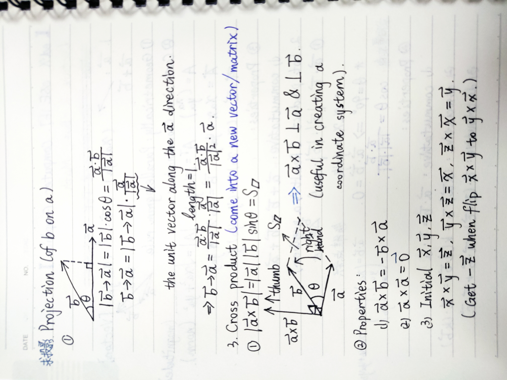

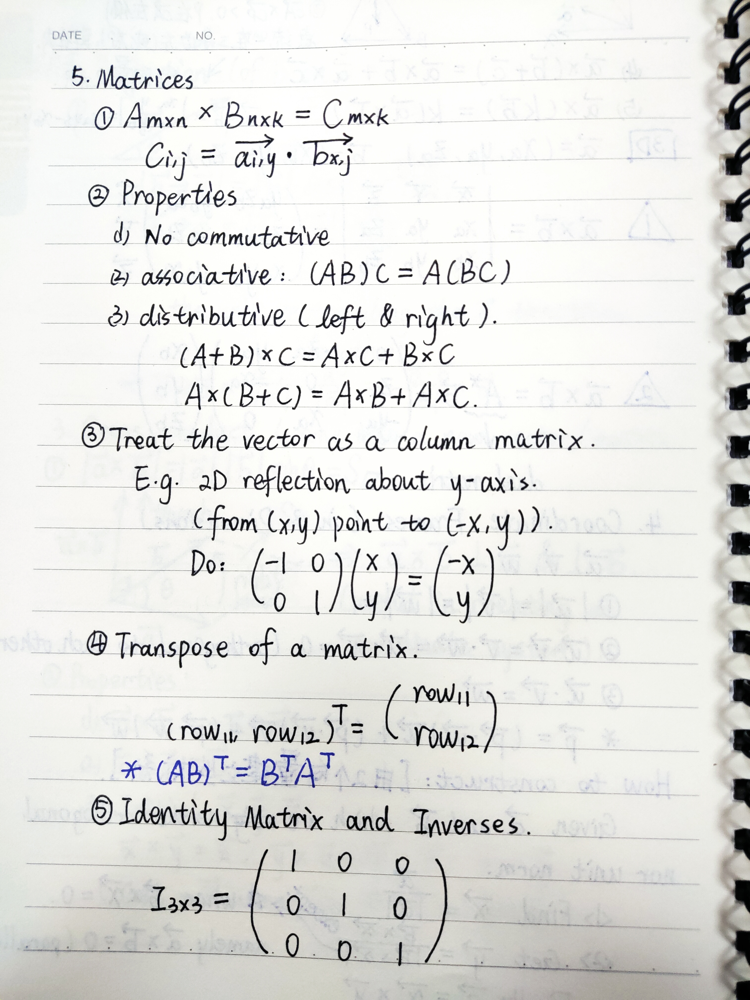

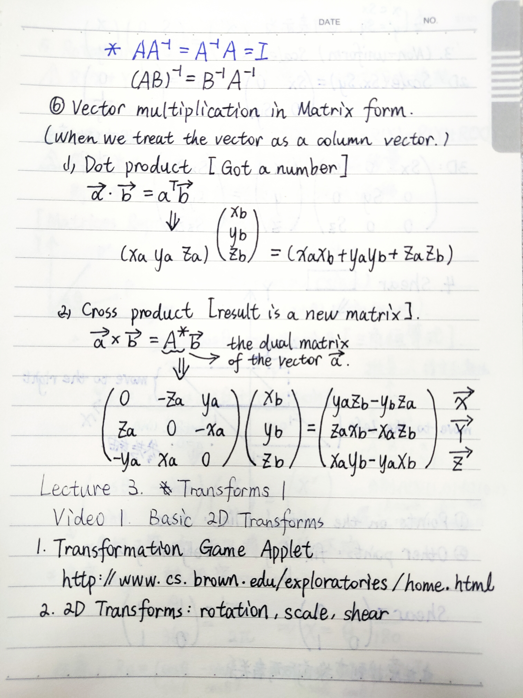

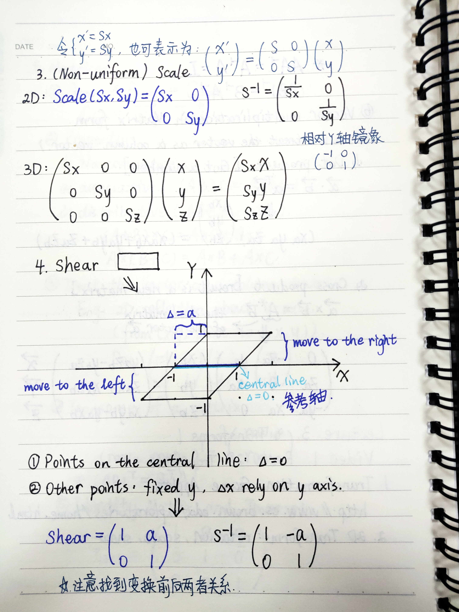

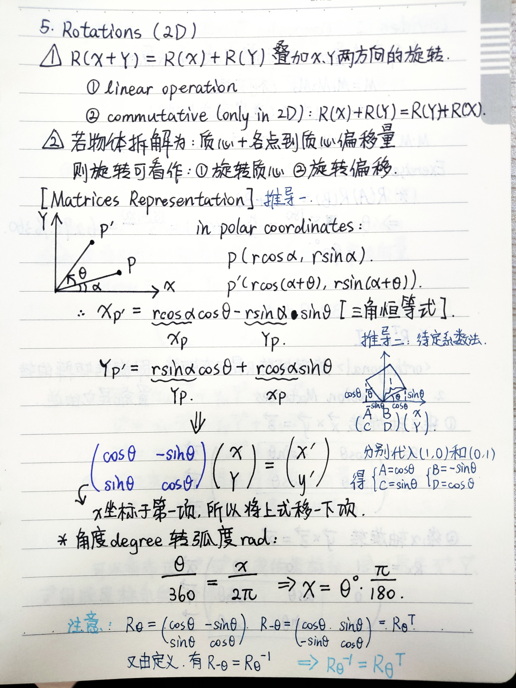

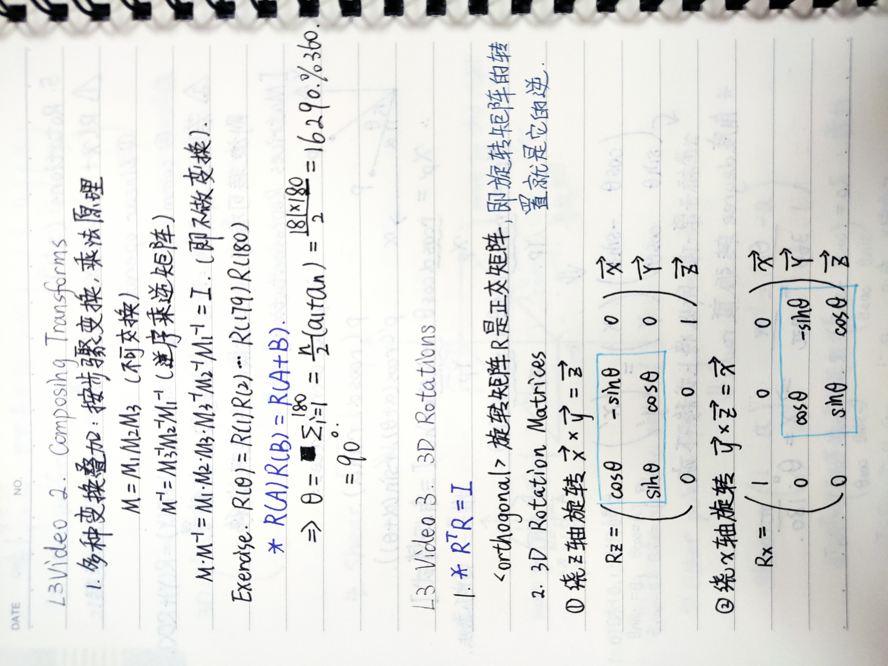

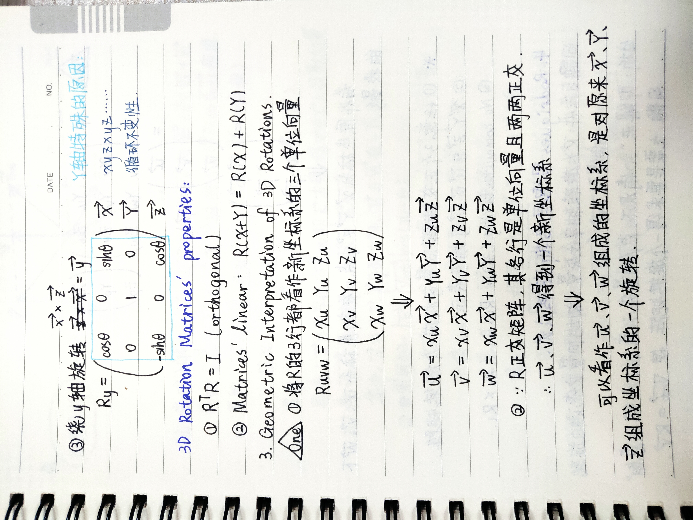

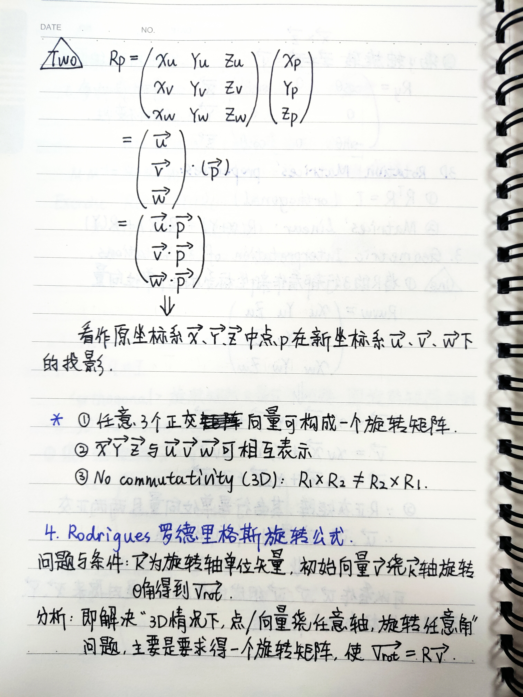

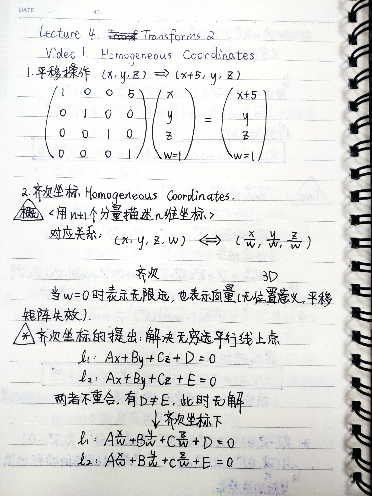

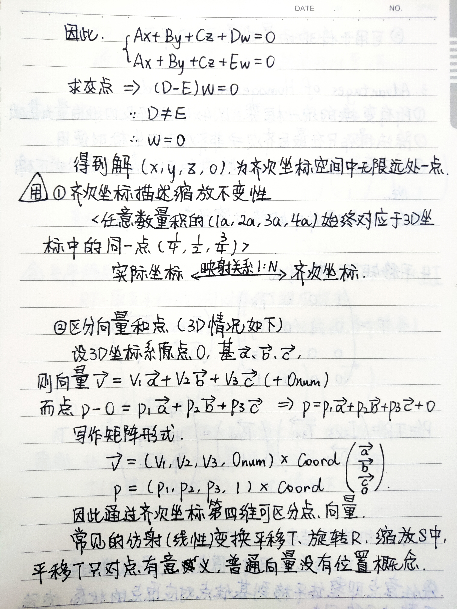

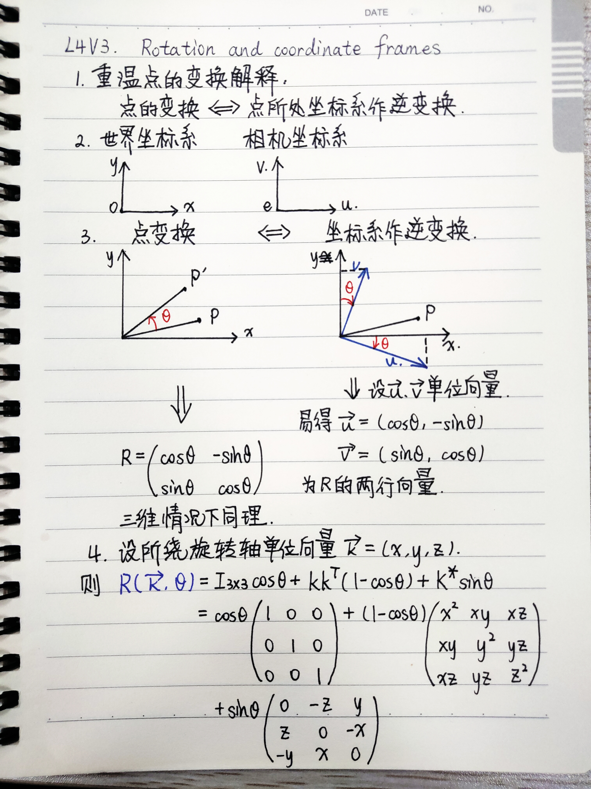

# Lesson
## <i class="fa fa-star"></i> **Unit 0**
### **Lecture 1: Course Overview**
#### **Motivation**
* Applications
  * Movies
  * Games
  * Computer Aided Desigh(CAD)
  * Lighting Simulation(Interiors, Automobiles, ...)
  * Visualization(Scientific, Medical)
  * Virtual Reality
  * Digital Vitual Medias
* Fundamental
  * Create and interact with realistic virtual world
    > "One of the goals in CG is to simulate and build virtual worlds that behave much the way as the real worlds."  
    > `Yeah, this is what I want to study.`
  * Requires understanding of all aspects of physical world
  * New computing methods, displays, technologies
    > `So this means I should learn lots of maths and physics?`
#### **Course outline and logistics**
* The graphics pipeline consists of 3 stages: 
  * modeling: Creating geometric models of objects.
  * animation: 
  * rendering
* Two differnet fundamental ways in which we can create images: 
  * Rasterization
    > Go through all the geometric primitives.  
    > Determine where in the screen the primitives should go.
  * Raytracing
    > Go to each point or pixel in the screen.  
    > Determine which geometric primitive that it correspond to.
  * Comparison
    * `Raytracing` can produce `higher quality` images, but `slower`.
    * Other distinctions in the following.
#### **History**
* `The video on the history of computer graphics`
  * Released by SIGGRAPH for its 25th anniversary
* Manchester Mark 1
  * modeled by Alan Turing
  * created by Tom Kilburn and Sir Frederic Williams
* Main ways the computers have been used for many decades
  * Textual representations.
  * The graphical user interface.
* Concepts for drawing in current systems
  * Pop up menus
  * Constraint-based drawing
  * Hierarchical Modeling
* `Sutherland's Sketchpad system`
  * http://www.youtube.com/watch?v=mOZqRJzE8xg
  * 该视频无法播放=。=
  * `Sketchpad`
##### **Modeling**
* Image Processing
  * Alter images: crop, scale, composite
  * Add or remove objects
  * `Q: Identify things in videos?`
* `spline curves`
##### **Rendering**
* 1960s: visibility
  * Hidden line algorithms: Roberts, Appel
  * Hidden surface algorithms: Warnock, Watkins
  * Visibility = Sorting: Sutherland
* 1970s: lighting
  * Diffuse Lighting漫射光照: Gouraud 1971
  * Specular Lighting镜面高光: Phong 1974
  * Curved Surfaces, Texture: Blinn 1974
  * Z-Buffer Hidden Surface: Catmull 1974
* 1980s, 90s: Global Illumination
  * Ray tracing: Whitted 1980. `The first recursive ray-tracing algorithm.`
  * Radiosity: Goral, Torrance et al. 1984. `Eg: Cornell Box.`
  * The rendering equation: Kajiya 1986
##### **Animation**
* 10 min clip
  * http://www.youtube.com/watch?v=LzZwiLUVaKg

### **Lecture 2: Basic Math**
#### **Basic Math: Vectors and Dot Products**
* Dot(scalar) product：
  $\vec a=(x_a,y_a),\ \ \vec b=(x_b,y_b),\ \ angle\ \vec a, \vec b = \theta$
  $$\vec a \cdot \vec b = \vec b \cdot \vec a = \vert \vec a \vert \cdot \vert \vec b \vert \cdot cos\theta = x_ax_b+y_ay_b$$
* 
#### **Basic Math: Cross Products**
#### **Basic Math: Creating a coordinate frame**
#### **Basic Math: Matrices**
> #### **`Maths notes are on the notebook`**
#### **Compiling OpenGL Programs**
* Set up
  * Download VS 2019
  * install C++ language
  * VS will help to run the hw0-windows given by the course
* Problems in demo running
  * screenshot error:   
    Change the code to save the back buffer instead of the front (this is in the third line of the saveScreenshot() procedure in mytest3.cpp)  
    `glReadBuffer(GL_FRONT); -> glReadBuffer(GL_BACK);`

## <i class="fa fa-star"></i> **Unit 1**
### **Lecture 3: Transforms 1**
* General Idea
  * In general have the object in model coordinates.
  * Tranform the object into world coordinates.
  * Represent points on object as vectors.
  * Multiply by matrices to transform.
  * Demos with applet "Transformations Game" from www.cs.brown.edu/exploratories/home.html

#### **Basic 2D Transforms**
* 2D Transforms: rotation, scale, shear(错切)
* 

#### **Composing Transforms**

#### **3D Rotations**

### **Lecture 4: Transforms 2**
### **Lecture 5: Viewing**

## <i class="fa fa-star"></i> **Unit 2**
### **Lecture 6: OpenGL 1**
### **Lecture 7: OpenGL Shading**
### **Lecture 8: OpenGL 2**

## <i class="fa fa-star"></i> **Unit 3**
### **Lecture 9: Ray Tracing 1**
### **Lecture 10: Ray Tracing 2**

# <i class="fa fa-star"></i> **Word Box**
## **Unit 0**
### **Lecture 1**
* `spherical harmonic lighting 球谐光照`
  * spherical adj. 球形的
  * harmonic n. 谐函数
* synthesis n. 合成
* notion n. 概念
* pipeline n. 感觉像是把一个总体过程切分成几个阶段stages的感觉
* `polygon mesh 多边形网格`
* intricate adj. 错综复杂的
* `rasterization n. 光栅化`
* `raytrace 光线追踪`
* `geometric primitives 几何元素`
* correspond to 相当于
* skeleton 框架
* from scratch 从头开始
* workload 工作量
* mechanism 方法，机制
* `linear algebra 线性代数`
* `Graphics Programming Unit GPU`
* be coined by 被……创造
* `hierarchical modeling 分层建模`
* pop up 弹出式
* presage v./n. 预示
* start-up adj. 新开办阶段的  n. 新企业（尤指互联网公司）
* manipulation n. 操作、处理、变换、管理措施
* `crop v. 剪裁` (v. 啃吃草或其他植物上面部分 n. 庄稼、收成产量、同时做某事的一群人、同时发生的一些事情)
* `scale v. 缩放`
* `composite` adj. 合成的 n. 合成物
* `spline curves 样条曲线`
* spout n. (容器的)嘴/(喷出的)水柱 v. 喷射/滔滔不绝地说
* torus 环面/纹孔塞
* interpret v.说明/领会/口译
* cone n. 圆锥体 v. 使成锥形/集中探照敌机
* facet n. 多面体的面/(事物的)部分，方面
* interpolate v. 插入
* representation of 表示形式
* matte adj. 无光泽的、表面粗糙的 n. 褪光
* clay n. 黏土
* constant adj. 固定的
* `diffuse lighting 漫射光照`
* `specular lighting 镜面高光`
  * adj. 镜面的
* component n. 组成部分
* substantial adj. 大量的
* texture n. 质地、纹理
* refract v. 使折射
* prospect n. 前景、设想 v. 探矿、勘探
* `radiosity 辐射着色`
* neutral adj. 中立的中性的、持平的、无倾向性的
* reddish adj. 微红的
* blueish 微蓝的
* tinge v. 轻微染色、使略带……感情/性质 n. 微量，少许
* unify v. 统一
* phenomenon(复phenomena) n. 现象/杰出的人/非凡的事物 
* `caustics 焦散曲线`
* frontier n. 学术前沿
* synopsis n. 概要
* clip 剪辑

### **Lecture 2**
* set up 创建、安排、安装配置、引起、产生、陷害
* verify v. 核实
* `GLSL => GL shading language?`
* magnitude n. 向量的大小（向量的长度）
* offset 
* displacement 位移
* parallelogram rule 平行四边形法则
* be aligned with 对齐
* commutative adj. (运算)可交换的
* cartesian components 笛卡尔分量
* orthogonal adj. 正交/直角/(相互)垂直/矩形的
* transpose 转置（v. 使调换顺序/转移/变形）
* norm 向量的模
* Pythagorean proposition 毕达哥拉斯/勾股定理
* symmetric adj. 对称的 symmetry n. 对称
* cosine 余弦
* inverse adj. 相反的
* scalar product 数量积（=dot product点积）
* associativity adj. 可结合性
* derive v. 获得/使产生
* denote v. 表示
* span v. 涵盖、跨越、持续、包括
* in terms of 从……角度看
* determinant n. 决定因素
* `dual matrix 对偶矩阵`
* torso n. 身体躯干
* consistent adj. 一致的、连续的、不矛盾的
* transform v. 使改变
* whereas (对比两个事实)然而，但是，尽管
* niggle n. 小牢骚 v. 使烦恼，挑剔 niggling adj. (不严重却不断)烦人的

### **Lecture 3**
* motivate 引出
* courtesy adj. 免费(试用)的 n. 礼貌、客气话
* homogenous adj. 同种类的、同性质的
* breakthrough n. 重大进展、突破

### **Lecture 4**
* homogeneous coordinates 齐次坐标
* rigid body 刚体
* intuitive adj. 凭直觉得到的，直觉的，易懂的
* diagram n. 示意图 v. 用图表示
* tangent n. 正切，切线
* canonical adj. 经典的
* 

<i class="fa fa-star"></i>
<!-- 使用FontAwesome -->
<head> 
     
     
</head> 
<link rel="stylesheet" href="https://use.fontawesome.com/releases/v5.0.13/css/all.css">

<!-- Sample use: <i class="fa fa-star"></i> -->
