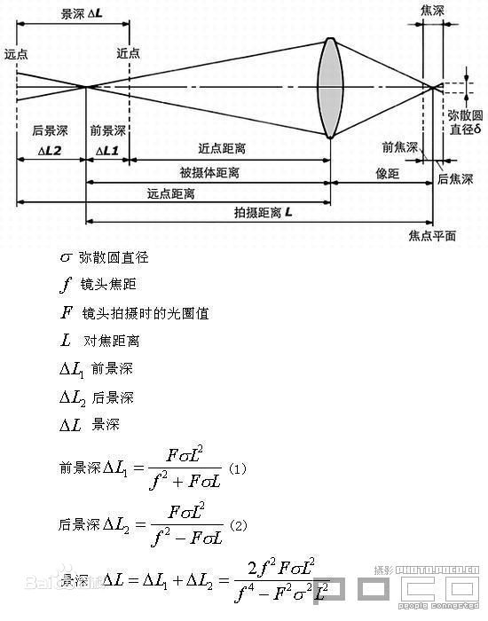

> # <i class="fa fa-book-open"></i> Peter Shirley - Ray Tracing in One Weekend
# <i class="fa fa-star"></i> Chapter 0: Overview

# <i class="fa fa-star"></i> Chapter 1: Output an image 
* .ppm格式：P3 nx*ny 各像素点的RGB
  * 可以直接看颜色效果欸好神奇ovo
* cpp文件输出
```c++
#include <fstream>

int main()
{
    ofstream output;    // 创建ofstream对象
    output.open("filename.ext");    // 关联文本文件

    output << "output some extents to the file.\n" ; // 输出到文件

    output.close(); // 最后关闭文件
}
```
## 小结
    大概就是输出到ppm看下预览吧，输出的图挺好看的，根据比例显示颜色的样子=。=

# <i class="fa fa-star"></i> Chapter 2: The vec3 class
* `class vec3`: 向量计算和颜色计算
* 复习一手cpp运算符重载
  * `operator[](int pos)`: 下标运算符重载，一般要针对常量对象和非常量对象写一个只读访问的`const T operator[](int pos) const`和一个返回引用的`T &operator[](int pos)`
  * `operator/=(float t)`: 将三次除法转为一次除法加三次乘法。惊了！好有道理，我怎么这么没有优化意识？
  * 感觉`make_unit_vector`和`unit_vector`都是向量单位化吧……就是调用方式不一样？
* 类定义最后`;`忘记加了，会疯狂影响后面定义的函数，瞎调半天QAQ
* ……做测试也太烦了叭=。=……orzzz
## 小结
首先`建立了存储三维空间中向量、点的类vec3`，并且同时也可以用来表示颜色的RGB三色值。对其进行一些基本运算的定义，重载相应的运算符。
主要是加减乘除等。之后是一些向量常用的基本量如模长、对应方向上的单位向量等的获取。最后是点积和叉乘。`叉乘`用矩阵的形式，根据第一行的
代数余子式展开求得新向量。

# <i class="fa fa-star"></i> Chapter 3: Rays, a simple camera, and background
* 头皮发麻，感觉写的注释比代码多……直接看小结叭QAQ
## 小结
* 根据空间直线的参数方程形式建立`射线类ray`。
* 显示平面的表示方法：平面一角+横纵偏移
* 设定相机/观察者位置到原点(0, 0, 0)
* 生成射线：确定光源、方向向量
* 打印像素点时假装观察者在往这个像素点看，设定需要什么颜色，打出RGB
* 用线性插值把色值范围相应缩放投影到要显示的平面区间
* 线性插值：`blended_value = (1-t)*s + t*e, t∈[0,1]`（我还是更喜欢`s + (e-s)*t`）

# <i class="fa fa-star"></i> Chapter 4: Adding a sphere
* 光线和球交点推导。设球心C(cx, cy, cz)，半径R，未知点p(x, y, z)。
  * $(x-cx)^2 + (y-cy)^2 + (z-cz)^2 = R^2$
  * 左部用向量表示，看作是 $\overrightarrow{p-C} \cdot \overrightarrow{p-C}$
  * 考虑光线上的点 $p(t) = \overrightarrow{A} + \overrightarrow{B}t$ 并代入上式
  * 完全展开，整理，得到关于参数 $t$ 的二次方程如下
  * $t^2\overrightarrow{B}\cdot\overrightarrow{B} + 2t\overrightarrow{B}\cdot(\overrightarrow{A}-\overrightarrow{C}) + (\overrightarrow{A}-\overrightarrow{C})\cdot(\overrightarrow{A}-\overrightarrow{C}) - R^2 = 0$
  * 令 $a = \overrightarrow{B}\cdot\overrightarrow{B}, b=2\overrightarrow{B}\cdot(\overrightarrow{A}-\overrightarrow{C}), c=(\overrightarrow{A}-\overrightarrow{C})\cdot(\overrightarrow{A}-\overrightarrow{C})-R^2$
  * 求一元二次方程根的判别式 $b^2-4ac$ 
  * $\delta < 0$时无交点，即光线没有照射到球上的这一点
* 本节问题：
  * 当圆心坐标设置在(0, 0, 1)时球位于相机背后，这里同样会显示，作者说后面解决。
  * 作者的代码 $\delta = 0$ 时hit返回false，测下来在这里貌似没有问题，不知道后面会不会有影响。（所以我就先自己补=号了qvq，坐等打脸）

# <i class="fa fa-star"></i> Chapter 5: Surface	normals	and	multiple objects
## **法线**
* 法线贴图Normal Mapping中的`对法线的编码和解码`(A common trick used for visualizing normals)
  * 设法线是单位向量，则其x, y, z值都在[-1, 1]之间。
  * 和上节相同的手法，全部+1再/2则可将区间转化到[0, 1]。
  * 然后*255.99即可将x, y, z映射到r, g, b。
* 注意hit_sphere返回值
  * 为了根据交点位置不同映射到不同的色值，所以要获取所求参数t具体数值
  * 所以hit_sphere返回值从bool转为float，不然就在边界爆了个INT_MIN
  * `话说返回值还是bool的时候，把INT_MIN的那行强行改成跟上一行一样的值得到的图也挺好看的不知道是啥图欸……`
## **多物体**
* 考虑场景中有多个物体，那么从观察者位置往某个方向看，如果当前的光线方向会命中很多物体……
* 此时，程序会计算光线和所有物体的交点。但是最后产生的画面，只需要离观察者最近的交点信息即可。
* 为此，建立`抽象的`命中类hitable，含纯虚函数（`继承类必须实现`）hit接受光线的命中和相关信息
* `求最近交点`
  * 当光射线与各种物体求交的过程中，会得到很多参数t的解
  * `设置符合的范围[tmin, tmax]`，初始为参数合法范围[0, 1]。
  * 当与某物体求交得到一个t后，由于要求离射线出发点最近的交点是观察者能看到的点，所以t应尽量小。
  * 因此更新范围到[0, t]，并将这个tmax不断缩小，就能得到最近交点。
## **代码实现**
* 作者的github代码和那些博客里tmax上界都用的MAXFLOAT我真找不到……
* 就用`<cfloat>`里的`FLT_MAX`了orz

# <i class="fa fa-star"></i> Chapter 6: Antialiasing
* 真实相机拍照时，边缘没有锯齿，边缘像素前景和背景进行了混合。
* 可以通过平均多个像素的值达到一样的效果。
* 代码里一个像素点是i、j遍历时step=1的变化，这样+0.x的话就可以在一个像素里对更多的点进行采样。
## ray tracing的计算量
* Peter Shirley大大在书里的代码用的一个像素采样100束光……
* 这个对于一个像素来说好像已经很多了
* 而本傻又试了1000和10000……讲道理肉眼上看不出更大的优化效果了
* 但是计算量爆炸式up太真实了！！！
* 当前像素才200x100！！！物体才两个球！！！我滴个老天鹅QAQ
* 怪不得到处都说光线追踪计算量太狠……这已经狼火了好吧orz

# <i class="fa fa-star"></i> Chapter 7: Diffuse Materials
## 漫反射
* 漫反射：随机反射
* 求漫反射光线方向（`Lambertian漫反射，理想散射模型：反射光线均匀向四面八方散射`）
  * 光线与物体交点p + 该处法向N = 球心坐标
  * 以上一步的球心坐标为中心，作单位球体
  * 在这个单位球体内部随机选取点，球心坐标 + 该随机点s = 漫反射光线途径点
  * 漫反射光线途径点 - 交点p = 漫反射光线方向，当然漫反射光源即交点p
* 这里总算发现之前建立的两个球其实是外切的，所以最后成图看起来就像是一个球放在一个弧面上，nice！
## 伽马校正 【？】
> The reason for this is that almost all image viewers assume that the image is `“gamma corrected”`, meaning `the 0 to 1 values have some transform before being stored as a byte.` There are many good reasons for that, but for our purposes we just need to be	aware of it. To a first approximation, we can use “gamma 2”	which means raising	the color to the power 1/gamma,	or in our simple case 1⁄2, which is just square-root
* 讲道理没太看懂这块，Gamma原理好像是和亮度有关的一个参数？
* Peter Shirley的意思貌似是，"Gamma x"表示把颜色开1/x次根号？所以这边用"Gamma 2"就开根号，然后就变亮了0。0

# <i class="fa fa-star"></i> Chapter 8: Metal
## Lambertian
* `Lambertian reflection is the property that defines an ideal "matte" or diffusely reflecting surface.`
* matte surface不光滑物体的表面（磨砂质感），Lambertian reflectance是用来模拟这种不光滑物体表面的光线反射模型。
* 光线在matte surface上随机反射，每个方向反射的概率相同，各向同性，所以每个角度观察这个表面的效果相同。
## 光滑表面
* 光滑表面发生镜面反射：反射角 = 入射角
* `求反射向量`
  * 作图，$\overrightarrow{I}$入射光，$\overrightarrow{N}$镜面法向，$\overrightarrow{R}$反射光
  * 可知$\overrightarrow{S}=-\frac{\overrightarrow{I}\cdot\overrightarrow{N}}{|\overrightarrow{N}|^2}\cdot\overrightarrow{N}$为入射光的反向向量在镜面法向的投影
  * 易得$\overrightarrow{R}=\overrightarrow{I}+2\cdot\overrightarrow{S}$
  * 由于$\overrightarrow{N}$为单位法向，化简可得
  * $\overrightarrow{R}=\overrightarrow{I}-2 （\overrightarrow{I}\cdot\overrightarrow{N}）\overrightarrow{N}$
## 代码实现
* 注意在各处加了material材质这个量以后，实际的如球体类也要加上，hit命中时作记录
## 反射光线的偏差
* 给反射光线也加上随机的微量偏移
  * 先前求出的准确反射向量 + 随机单位球体内点*偏差程度（看作在反射向量指向处所作的球体半径大小，[0, 1]）
  * 偏差程度fuzz数值越大效果越模糊。
## 掠射光线Grazing Rays
* 掠射：指光从光疏介质向光密介质传播，入射角接近于90度时。
* 掠射或垂直入射，疏到密，`反射过程中会产生半波损失`。

# <i class="fa fa-star"></i> Chapter 9: Dielectrics
## 折射Refraction
* 折射Debug：令全折射看效果（虽然我也不晓得咋看……？）
* 斯涅尔定律Snell's law：几何光学基本实验定律，`适用于各向同性介质构成的静止界面`。
  * ① 折射光线位于入射光线和界面法线所决定的平面内。
  * ② 折射光线和入射光线位于法线两侧。
  * ③ $n\sin\theta = n'\sin\theta'$
  * 其中 $n$ 、$n'$ 为物质折射率
  * 典型物质折射率：空气1，玻璃1.3-1.7，钻石2.4
* TIR：Total Internal Reflection全内反射
  * 光密到疏时，若入射角大于某临界角，折射光线消失。（如在某角度下水面会变成镜面）
## `求折射向量`
> 已知`单位入射光线` $\overrightarrow{UI}$，`单位法向量` $\overrightarrow{N}$，相对折射率 $\frac{\sin\theta'}{\sin\theta} = \frac{n}{n'} = \frac{1}{\eta}$  
  求单位折射向量 $\overrightarrow{T}$
* 设入射角 $\theta$，折射角 $\theta'$
  * $cos\theta = \frac{-\overrightarrow{UI}\cdot\overrightarrow{N}}{|\overrightarrow{UI}|\cdot|\overrightarrow{N}|}=-\overrightarrow{UI}\cdot\overrightarrow{N}$
  * $cos\theta' = \sqrt{1-sin\theta'^2} = \sqrt{1-(\frac{sin\theta}{\eta})^2} = \sqrt{1-\frac{1-cos\theta^2}{\eta^2}}$
* 将 $\overrightarrow{UI}$、$\overrightarrow{T}$ 分别分解到 $\perp\overrightarrow{N}$ 的 $\overrightarrow{UI_1}$、$\overrightarrow{T_1}$ 和 $\parallel\overrightarrow{N}$ 的 $\overrightarrow{UI_2}$、$\overrightarrow{T_2}$
* 求 $\overrightarrow{T_1}$
  * $|\overrightarrow{UI_1}|=|\overrightarrow{UI}|\cdot\sin\theta=sin\theta$
  * $|\overrightarrow{T_1}|=|\overrightarrow{T}|\cdot\sin\theta'=sin\theta'$
  * 两者方向一致
  * 因此 $\overrightarrow{T_1}=\frac{sin\theta'}{sin\theta}\cdot\overrightarrow{UI_1}=\frac{1}{\eta}\cdot\overrightarrow{UI_1}$ `①`，转化为求 $\overrightarrow{UI_1}$
  * 此时 $\sin\theta$ 要用平方公式从 $\cos\theta$ 开根转化，而 $\cos\theta$ 可从点积直接求出，因此从 $\cos\theta$ 入手考虑
  * 根据点积的几何意义，$\overrightarrow{UI_2}$ 为 $\overrightarrow{UI}$ 在 $\overrightarrow{N}$ 方向上的投影
  * $\overrightarrow{UI_2}=\frac{\overrightarrow{UI}\cdot\overrightarrow{N}}{|\overrightarrow{N}|}\cdot\frac{\overrightarrow{N}}{|\overrightarrow{N}|}=\frac{|\overrightarrow{UI}|\cdot|\overrightarrow{N}|\cdot\cos(\pi-\theta)}{1}\cdot\frac{\overrightarrow{N}}{1}=-cos\theta\cdot\overrightarrow{N}$
  * $\overrightarrow{UI_1}=\overrightarrow{UI}-\overrightarrow{UI_2}=\overrightarrow{UI}+\overrightarrow{N}\cdot\cos\theta$
  * 把 $\overrightarrow{UI_1}$ 代入式子 `①`
  * 得 $\overrightarrow{T_1}=\frac{1}{\eta}\cdot（\overrightarrow{UI}+\overrightarrow{N}\cdot\cos\theta）$
* 求 $\overrightarrow{T_2}$
  * 由勾股定理，$|\overrightarrow{T_1}|^2+|\overrightarrow{T_2}|^2=|\overrightarrow{T}|^2=1$
  * 显然 $\overrightarrow{T_2}$ 与 $\overrightarrow{N}$ 反向
  * 因此 $\overrightarrow{T_2}=-\overrightarrow{N}\cdot\sqrt{1-|\overrightarrow{T_1}|^2}=-\overrightarrow{N}\cdot\sqrt{1-sin\theta'^2}=-\overrightarrow{N}\cdot\cos\theta'$
* <i class="fa fa-star"></i> 最后得到 $\overrightarrow{T}$
  * $\overrightarrow{T}=\overrightarrow{T_1}+\overrightarrow{T_2}$  
    &nbsp;&nbsp;&nbsp;&nbsp;
    $=\frac{1}{\eta}\cdot\overrightarrow{UI}+\frac{1}{\eta}\cdot\overrightarrow{N}\cdot\cos\theta-\overrightarrow{N}\cdot\cos\theta'$  
    &nbsp;&nbsp;&nbsp;&nbsp;
    $=\frac{1}{\eta}\cdot（\overrightarrow{UI}-\overrightarrow{N}\cdot（\overrightarrow{UI}\cdot\overrightarrow{N}））-\overrightarrow{N}\cdot\sqrt{1-\frac{1-\cos\theta'^2}{\eta^2}}$
* 注意：当 $cos\theta'$ 式子中 $\sqrt{<0}$ 时 $\theta'$ 无意义
  * 此时为`全反射现象`
  * 发生条件：① 光密介质到光疏介质，② 入射角大于临界角（折射角90度时对应的入射角，也即 $\sqrt{=0}$ 的情况）
* 代码实现
  * `dielectric:scatter`中判断了入射角的角度，大于90度的情况为光线从电解质射入空气
    * 不过我没想通这种情况什么时候产生欸……orz
    * 虽然想想是应该要考虑的……吧=。=【？】
  * `dielectric:scatter`中`attenuation`一开始以为`(1, 1, 1)`结果变成好多圈……其实是`(1, 1, 0)`orz（好的，然后中间圈变成绿色了，debug继续中）
  * `material.h`中`refract`函数：作者gayhub上公式打错了orz，改正后形状差不多对了……里面下面一大半还是绿的……
  * 好棒哦，最后发现问题还是在`attenuation`，就是三个1没错，作者书里又打错了=。=
  * 2020/01/01 review：突然发现三个1作者在书里写了110是个bug但我当时又没有仔细看？？？呜呜咦呜呜
## 反射系数逼近公式 Christophe Schlick's approximation
* Schlick逼近公式：$R(\theta)=R_0+(1-R_0)(1-cos\theta)^5$
  * 其中，$R_0=\frac{(n-n')^2}{(n+n')^2}$为常数，$n$、$n'$为入射介质、折射介质的折射率
  * 通常图形学中两介质总有一方为空气，因此 $n$ 近似取1，由于有平方，所以 $n$ 与 $n'$ 的减与被减可以任意。
  * 当入射介质是玻璃等物体，在空气中折射时，传入 $cos\theta'$ 即可。
* 加上反射系数以后的变化【？】
  * emmm...有些地方感觉稍微暗了一点？（此时传入的`cosine`用的是作者的代码，看不懂orz）
  * 把传入的 $cos\theta$ 改成用折射系数+平方关系求对应的 $cos\theta'$，和作者的代码效果好像一样……
  * 好的，改完以后发现作者在gayhub上的代码也改成这样求的=。=
  * 讲道理感觉变化真的就一丢丢……不知道什么情况下会明显一点qaq
* 为什么用随机数和反射系数比较
  * 一个像素点在main中设置采样次数100
  * 这100次采样中反射光线的条数基本和反射系数成正相关，所以随机选取，在外面取均值时就能取到该像素点处反射光线和折射光线的叠加结果
## 负半径球体 trick【？】
* `dielectric`球里面套一个负半径的`dielectric`球会变成空心的泡泡耶！
  * 内部球体的法向量会指向内侧
  * 有点想不动……遗留一下=。=
## 小结
* 感觉代码应该没有啥问题，但我的效果为啥好多黑搓搓的……噪点？？？QAQ哭唧唧。等全写完和作者的源码对拍一下吧orz
  * 估计是因为那个0.001？

# <i class="fa fa-star"></i> Chapter 10: Positionable camera
## 相机视野
* 张角`fov`
  * 观察者指向视野上边界、指向视野下边界，两向量所成角
  * 角度转弧度 $\theta=fov*\pi/180$
  * 设观察者 $(0, 0, 0)$ ，看向 $z=-1$ 的平面，作图显然有 $h=tan(\theta/2)$
* 画面宽高比`aspect`
  * $aspect = \frac{width}{height}$
## 任意视角
* 引入参数
  * 相机/观察者位置`lookfrom`
  * 看向某点`lookat`（或看向某个方向`lookin`）
  * 头顶指向方向`vup`（为了可以左右倾斜脑袋，绕鼻子旋转2333）
* 观察者位置`lookfrom`
  * `origin = lookfrom`
* 确定画面所在平面：指向观察者正前方的向量（确定w）
  * `w = unit_vector(lookfrom-lookat)`
  * 即：`观察者看向-w方向`
* 确定画面所在平面：在该平面上的向量（vup, w生成u，再得v）
  * `u = unit_vector(cross(vup, w))`
  * `v = cross(w, u)`
* `uvw组成相机/观察者坐标系`
## 代码实现
* 第一张图ok，第二张图调张角`fov`测下来差不多`22.5`

# <i class="fa fa-star"></i> Chapter 11: Defocus Blur
## 散焦模糊（虚化、景深效果）
* 景深效果：主题清晰，背景或前景模糊
* “光轴平行的光线射入凸透镜，理想镜头：所有光线聚集到`焦点`，其前后`光线逐渐聚集`和`扩散`，点的影像变模糊，形成一个扩大的弥散圆。当景物投射到镜头里的圆的直径小于人眼鉴别能力时成像清晰，临界处称为`容许弥散圆`。”

* 现实相机中，为了收集光线增加图片的亮度，需要增大`光圈`，从而影响景深，导致图片出现散焦，变模糊。
* `但调整透镜和成像处(film/sensor)的距离可以找到清晰图像的位置。`当然，通过光圈控制进光量也可以控制虚化的范围。
* 结论：`大`光圈、`长`焦距使景深变`浅`。
## 引入参数
* ① 光圈`aperture`：控制透镜lens的大小
* ② 成像位置`focus_dist`：透镜（光圈）到想要显示的平面的距离。（之前一直是z=-1，$tan\theta$ 的分母，此时宽高分别再乘上这个距离即可，`注意在算成像面左下角的时候对w的偏移也要乘这个距离`。）
* 代码可以模仿真实相机，写完整的光感面、透镜、光圈，弄清光线的路径并如何倒置成像。
* 但也可以近似简化：
  * 光的起点：之前一直是观察者位置的一个`点光源`，现在引入`光圈`，即光源变成这个光圈上的任意一点，发出光射线。
  * 光的方向：仍然是指向当前想要渲染的图像上某个像素点，即成像平面上的某点。
## 代码实现
* 光线向量生成的时候有个地方敲错了量，真的是调到天荒地老呢（……

# <i class="fa fa-star"></i> Chapter 12: Where next?
* 随机一堆小球，调整像素和采样点个数，先随便渲一渲
  * `nx:1200, ny:800, ns:10. Time: 946s`
  * `nx:2000, ny:1000, ns:100. Time: 16127s`
* 测作者代码的时候总是找不到编译器头文件，最后发现又是没有`using namespace std;`嘤嘤嘤，我自己的在vec3里面写了一个……所以换了作者的头文件以后也不行:)日常把自己蠢死.jpg
* 玻璃球里面太糊的原因：`光线和球交点求解的参数t范围tmin=0.0`，作者是`0.001`
  * 2019/12/30 review: chapter7最后已经提到了这个问题，当时竟然没注意我是不是瞎……

# Sum up
* 最后渲了个1920x1080x100的高清版，很棒棒w。`Time: 15223.697755s`
* git clone to Windows: invalid filename
  * contain characters like: <, >, :, ", /, \, |, ?, *
* drand48()只在Linux下有，the next week的时候再换吧前面量太多了，后面手撸或者srand一下。

# ？？？
* Gamma校正 chapter7
* `world->hit(r, 0.0, MAXFLOAT, rec)`有精度问题，要近似到0.001（但是为啥呢Orz） chapter7
* 说起来不造为啥要给反射光也加随机偏移fuzz？chapter8
  * 《全反射光波在反射界面上的偏移和偏移时间》：光发生全反射时，入射光不是严格在界面上反射的，而是投射到第二种介质一定深度后被逐渐反射的。这样光在第二种介质中的入射点和出射点就有一定的偏移和一定的偏移时间。
  * 按Peter Shirley的意思，这个偏移导致的fuzz程度与球的半径有关？【待确认】
* chpt9：`when there is a reflection ray the function returns false so there are no reflections`？啥意思？？？
* chpt9：负半径电解质球体trick，为啥呢？？？

# <i class="fa fa-star"></i> Word Box
## Chapter 0: Overview
* staple adj. 主要的，基本的 n. 订书钉，基本食物 v. 用订书钉装订
* preach v. 宣讲，说教
## Chapter 1: Output an image
## Chapter 2: The vec3 class
* transparency n. 幻灯片，透明性，显而易见
* suffice v. 足以，足够
## Chapter 3: Rays, a simple camera, and background
* computation n. 计算
* verbose adj. 冗长的
* intersect v. 相交，贯穿
* gradient n. 斜率，变化率
* convention 惯例
* traverse v. 穿过 n. 横越，可横越的地方
* exactness n. 精确，正确
* antialiasing 抗锯齿处理，边缘柔化
* blend v. 混合 n. 混合物
* linear blend/interpolation = lerp 线性插值
* ray n. 射线，少量 v. 照射，发光
## Chapter 4: Adding a sphere
* straightforward adj. 简单的
* under the hood 在幕后
* algebra 代数
* quadratic 二次的
## Chapter 5: Surface normals and multiple objects
* shade n. 阴凉处，灯罩，色度 v. 给……遮挡（光线），画阴影
* perpendicular adj. 垂直的 n. 垂直线
* by convention 按照惯例
* subtle adj. 不易察觉的，机智的，狡猾的
* intuitive adj. 凭直觉得到的，易懂的
* quandary n. 困惑
* end up doing 结果变成做……
* blur n. 模糊的东西 v. (使)变得模糊，难以区分
* flaw n. 错误，缺点，瑕疵，弱点 v. 损害，削弱，使失效
## Chapter 6: Antialiasing
* jaggies 锯齿
* stratification n. 分层
* bother with 为……烦恼
* controversial adj. 有争议的
* tuck away 把……隐藏
* infrastructure n. 基础设施
* canonical adj. 经典的，最简洁的
* yield v. 产生，提供，屈服，放弃 n. 产量，利润
* encapsulate v. 概括，压缩
* axis-aligned 轴对齐
## Chapter 7: Diffuse Materials
* diffuse material 漫反射材质
* procedural adj. 程序上的
* emit v. 发射，发出
* merely adv. 仅仅，只不过
* take on 呈现
* modulate v. 调节
* intrinsic adj. 固有的，内在的，本身的
* absorb v. 吸收，吞并，理解掌握
* rejection method 剔除法
## Chapter 8: Metal
* zero out 清零
* scattered adj. 分散的 v. 撒，散开
* incident ray 入射光
* attenuate v. 使减弱
* stuff v. 填充
* circularity n. 环
* perturbation n. 忧虑，微扰
* grazing rays 掠射光线
## Chapter 9: Dielectrics
* dielectric n. 电解质 adj. 非传导性的，诱电的
* transmit v. 传送，发射，传播，透光，使通过
* refracted ray 折射光
* transmitted ray 透射光
* refractive indices 折射率（indices为index复数形式之一）
* troublesome adj. 麻烦的
* Total Internal Reflection 全（内）反射
* submerge v. 淹没
* plausible adj. 有道理的
* steep adj. 陡峭的，急剧的，过高的，不合理的 v. 泡，使充满
* polynomial adj. 多项式的 n.多项式
* specular reflection 镜面反射
* nonconducting adj. 不传导的
* coefficient n. 系数
* hollow adj. 空心的 v. 挖 n. 洞
## Chapter 10: Positionable camera
* incrementally adv. 渐进地
* adjustable adj. 可调整的
* field of view(FOV) 视野
* portal n. 入口
* specify v. 具体说明
* radians 弧度制
* specify 指明
* camera roll 胶卷
* sideways tilt 左右倾斜
* plane 水平面
* orthogonal 正交的
## Chapter 11: Defocus Blur
* defocus blur 散焦模糊（虚化、景深效果）
* lens n. 透镜
* compound adj. 复合的 v. 使加重，混合，构成 n. 复合物
## Chapter 12: Where next?


<i class="fa fa-star"></i>
<!-- 使用FontAwesome -->
<head> 
    <script defer src="https://use.fontawesome.com/releases/v5.0.13/js/all.js"></script> 
    <script defer src="https://use.fontawesome.com/releases/v5.0.13/js/v4-shims.js"></script> 
</head> 
<link rel="stylesheet" href="https://use.fontawesome.com/releases/v5.0.13/css/all.css">

<!-- Sample use: <i class="fa fa-star"></i> -->