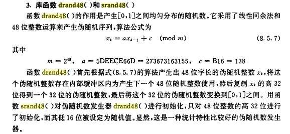

> # <i class="fa fa-book-open"></i> Peter Shirley - Ray Tracing the Next Week
# <i class="fa fa-star"></i> Before Start
* 之前直接在Ubuntu上整的没有啥问题。
* Windows下.ppm下个XnView查看，后面可能再弄一下bmp之类的图片格式或者改成OGL输出吧。（再或者直接去访问显存？
* 随机函数drand48()貌似只在Linux系统下有，改成srand又不甘心（？），知乎一下又被tlmm教育了。借这个机会看下c++ 11的随机数引擎，学习使用的时候正好复（预）习常见概率分布。
## **概率论基本概念回顾**
* 
## **常见概率分布类型**
### **① 伯努利分布（Bernoulli）[两点分布/0-1分布，成功/失败]**
* 定义：`只有两种可能结果的单次随机实验。`随机变量 $X$ 取值为 $1$ 代表成功，成功概率为 $p$ 。取值为 $0$ 代表失败，失败概率为 $q=1-p$ 。
* 概率分布函数： $p^x(1-p)^{1-x}$，其中 
### **② 二项分布（Binomial）**
### **③ 均匀分布（Uniform）**
### **④ 正态分布（Normal）**
### **⑤ 泊松分布（Poisson）**
### **⑥ 指数分布（Exponential）**
## **C++ 11随机数引擎的使用**
* 据说C++ 11的随机数引擎很奈斯
```cpp
double my_random_real(double left, double right)
{
    random_device seed;
    default_random_engine generator(seed());
    uniform_real_distribution<double> distribution(left, right);
    return distribution(generator);
}
```
* 然鹅生成的随机数过于均匀orzzz太整齐了很恐怖（
* srand也很整齐……
* 怕了怕了，还是回到drand48()=。=
* drand48()说明  
    
* 实现
```cpp
#define m 0x100000000LL
#define c 0xB16
#define a 0x5DEECE66DLL

static unsigned long long seed = 1;

double drand48(void)
{
	seed = (a * seed + c) & 0xFFFFFFFFFFFFLL;
	unsigned int x = seed >> 16;
    return 	((double)x / (double)m);
	
}

void srand48(unsigned int i)
{
    seed  = (((long long int)i) << 16) | rand();
}
```

# <i class="fa fa-star"></i> Chapter 0: Overview
* Bounding Volume Hierarchy(BVH) 层次包围盒
  * 基于物体的场景管理技术（一种用来管理3D场景中的物体的方法）。
  * 三维场景实时渲染的常用数据结构。
* 本书难点：BVH和Perling texture

# <i class="fa fa-star"></i> Chapter 1: Motion Blur
* Motion Blur运动模糊
  * 相机快门开启的短暂时间间隔内，相机视野内物体发生位移，拍摄到的画面呈现出移动过程中像素的平均值。
  * 

# <i class="fa fa-star"></i> Word Box
## Chapter 0: Overview
* texture n. 纹理
* volumn fog 体积雾（烟雾？）
* Bounding Volume Hierarchy(BVH) 层次包围盒
* heuristic adj. 启发式的
* optimization n. 最优条件/参数
* sophisticated adj. 复杂巧妙的、精密的、见多识广的、老练的
* premature adj. 未成熟的
* execution n. 处决，执行，表演，制作
* endeavor n. 尽力，试图

## Chapter 1: Motion Blur
* shutter n. 百叶窗，（相机的）快门
* aperture n. （摄像机光圈）孔径
* 

<!-- 使用FontAwesome -->
<head> 
    <script defer src="https://use.fontawesome.com/releases/v5.0.13/js/all.js"></script> 
    <script defer src="https://use.fontawesome.com/releases/v5.0.13/js/v4-shims.js"></script> 
</head> 
<link rel="stylesheet" href="https://use.fontawesome.com/releases/v5.0.13/css/all.css">

<!-- Sample use: <i class="fa fa-star"></i> -->