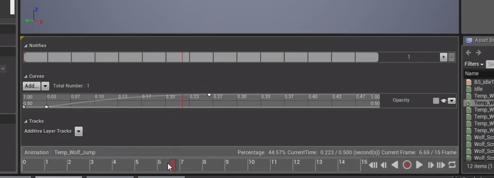

> # 虚幻引擎编辑器基础——动画
> * https://www.unrealengine.com/zh-CN/onlinelearning-courses/unreal-editor-fundamentals---animation
> * Author：Luis Cataldi

## 准备
* 商城资源：Paragon Shinbi 狼
* 模板项目：ThirdPerson

## 混合空间和动画蓝图
* Duplicate BP_ThirdPersonCharacter 为 BP_WolfCharacter
  * 把人形骨骼网格体换成狼，调整胶囊体
* ParagonShinbi - Characters - Heroes - Shinbi - Shinbi_Wolf - Animations
### **`混合空间`**
* 创建混合空间
  * Create Advanced Asset - Animation - `Blend Space 1D` - `BS`_IdleToRun
  * Pick Skeleton - Wolf 选择要应用到的骨骼网格体类型
* Axis Settings - `Horizontal Axis`（因为创建的是一维混合空间，就一个）
  * Name = Speed
  * Max = 375（Min/Max Value 调整对应坐标轴的范围）
* Sample Interpolation - Target Weight Interpolation = 5.0 目标权重每秒插值速度，表示沿坐标轴变化速率
* 加入动作
  * 把右下的单个动作拖到坐标轴：Idle 0.0，Run 375.0，拖动绿标，改变骨骼状态
  * UE4 小技巧：混合空间编辑器 Shift 直接滑动绿标
  * 效果不太好，把 Idle 改成 Wolf_ScreenSelect_B
### **`动画蓝图`**
* 创建`动画蓝图`
  * Create Advanced Asset - Animation - Animation Blueprint - `BP`_Wolf`Anim`
  * Target Skeleton - Wolf 选择目标骨骼网格体类型
#### **`动画蓝图 - AnimGraph`**
* 创建`状态机`
  * AnimGraph - `Add New State Machine` - WolfAnim -> Result
  * 进入状态机 WolfAnim：`Entry` -> 新建`状态` IdleToRun
  * 进入状态 IdleToRun：右下 Asset Browser 拖入混合空间 BS_IdleToRun -> Result，由于该混合空间有一维坐标 Speed，因此结点上会给出输入 pin，通过变量改变 Speed 值调整动画状态。
* 创建更多状态
  * 从 IdleToRun -> `Add New State` - Jump -> New State - Idle -> IdleToRun 形成循环
  * 设计状态 Jump
    * Temp_Wolf_LeapAttack -> Result
    * 取消勾选 details - settings - `Loop Animation` 循环播放
    * Play Rate = 0.5 调整动画速率
  * 设计状态 Idle
    * Idle -> Result
    * 取消循环
* 状态间的 `Condition State`（**`Transition Rule 转换规则`**）
  * 进入 IdleToRun to Jump (rule)
    * 添加变量 IsInAir 表示 Wolf 是否在空中，已在空中则不应再进入跳跃状态
    * IsInAir -> Can Enter Transition
  * Jump to Idle (rule)
    * IsInAir -> not bool -> Can Enter Transition
  * Idle to IdleToRun (rule)
    * Can Enter Transition = true
#### **`动画蓝图 - EventGraph`**
* 通过 EventGraph `提供数据给 AnimGraph` 以驱动动作状态的转换。
* `基本流程`
  * ① `获取并检查角色控制器`：Event Blueprint Update Animation() -> IsValid.InputObject = TryGetPawnOwner 
  * ② `通过移动组件或当前属性状态给出所需变量的值`
    * 确认 Wolf 是否在空中：GetPawnOwner -> GetMovementComponent -> IsFalling -> SetIsInAir()
    * 获取角色当前速度：GetPawnOwner -> GetVelocity.VectorLength() -> SetSpeed()
* 应用：BP_WolfCharacter - MeshComponent - Animation - Anim Class = BP_WolfAnim_C

## 调整完善已有动画
### 调整 Jump
* 打开单个动画动作文件 Temp_Wolf_Attack ，可 Stop 并拖动状态条查看动画。复制一份 Temp_Wolf_Jump 开始乱搞（不。
* 在 Curves 下的 Opacity 为透明效果轨道（Track）
    
    

  * 其中有三个关键帧，删掉开头的两个取消显形效果
  * 最后一个也删掉就无了（
  * 可以在轨道右侧末端直接 Remove Track
* 显示骨骼：视口工具条 - Character - Bones - All Hierarchy
  * 左侧 Skeleton Tree 选中单个骨骼节点查看
* 调整动作：给 root 骨骼添加关键帧
  * Tracks - Additive Layer Tracks
  * 拖动轨道状态条，调整 root 骨骼的位置等，编辑器工具栏 - +Key 在该处添加关键帧

### Sprint 冲刺动作
* 设置输入控制：Action Mappings - Sprint - Left Shift
* BP_WolfCharacter - Event Graph - InputAction Sprint()
  * 选中移动组件查看 Walk Speed 限制范围
  * Pressed: CharacterMovement.SetWalkSpeed(1200)
  * Released: set 600

