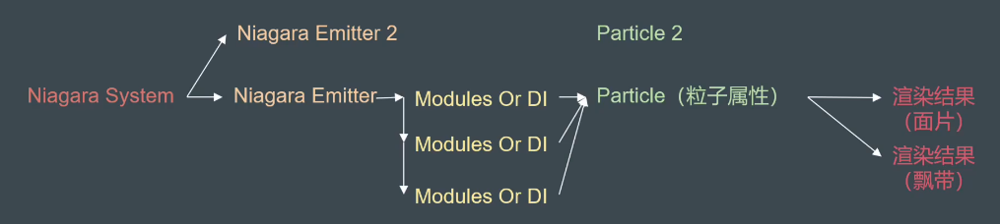
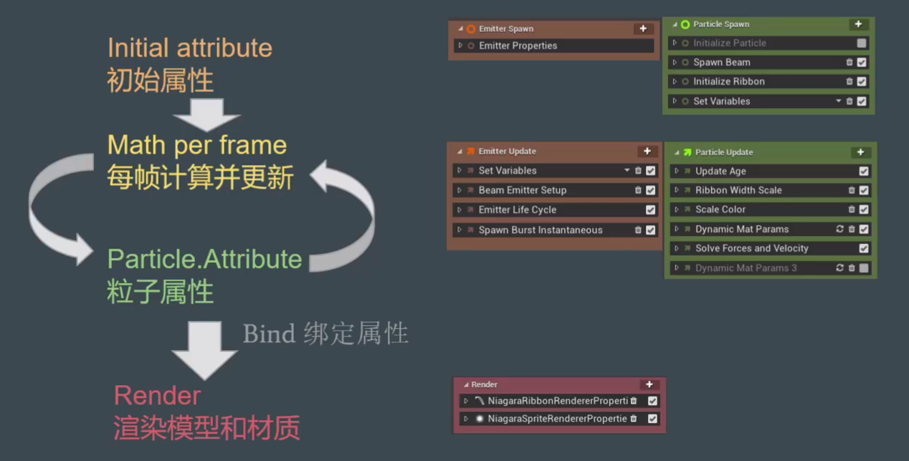

> # Niagara 基础

## Niagara基础1
* https://www.bilibili.com/video/av73602807
### 启用插件
* Niagara
* Niagara Extras
### 创建
* New - FX - Niagara *
### 类型

* Niagara System
  * 放置于场景。
  * 可包含多个 Emitter。
* Niagara Emitter
  * 通过不同的 Modules 给出的值计算粒子 Particle 最终属性（Attribute）。初始属性、每帧更新属性、渲染结果对应 Module ：
    
    

  * 一个发射器只解算一套粒子，但可渲染多种结果。
### Emitter
* New - FX - Niagara Emitter
  * `Inherit` from an existing emitter in your project content
  * `Empty` 包含几个必需 Module
* 发射器编辑器 - Selected Emitters 右上转到父发射器

> at 22:34

## 基本操作姿势
* https://www.bilibili.com/video/av27517097/
### Niagara System
* Add Tracks 增加发射器

### Niagara Emitter
* Emitter Update
  * `Spawn Burst Instantaneous`
  * `Spawn Rate`
* Particle Spawn
  * `Velocity` 粒子初速度
  * `Location` 初始生成位置
  * `Particles.` 粒子相关属性变量（可动态更改）
    * `.Lifetime` 生命周期
    * `.SpriteRotation` （对应 Render - Sprite Rendering 贴图渲染方式）
* Particle Update
  * `Acceleration Force`
  * `Color` 曲线上端设颜色，下端设透明度，右键 Add Key 对曲线上某状态点做设置
  * `Solve Forces and Velocity` 流式设计，所以 Force 等属性要在该项上面设置完毕。即，注意 Module 间的依赖。

### Niagara Module Script
* 用于计算、更新 Particle 变量值。
* 脚本编辑器 - Details - Script - `Module Usage Bitmask`
  * 勾选 `Module`、`Particle Update Script`（限制在发射器的哪些 Modules 可见）
  * 然后可在发射器编辑器 Particle Update 中添加该项
* 