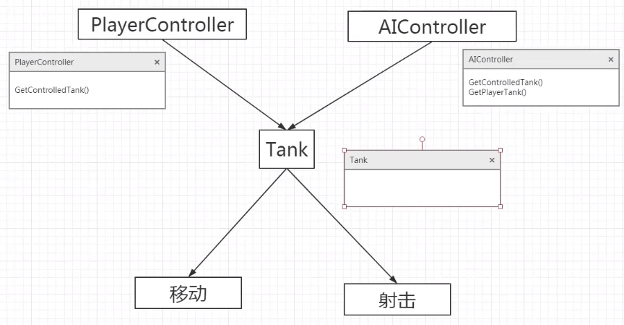
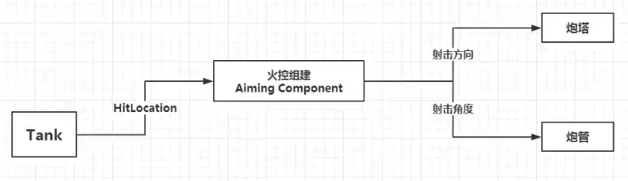

> # <i class="fa fa-book-open"></i> 后天星期六 - 坦克大战（C++）
# <i class="fa fa-star"></i> 任务一：简介

# <i class="fa fa-star"></i> 任务二：导入坦克模型
* 资源管理 `/Content/Assets`、`/Content/Maps`、`/Content/Blueprints`
* 导入 `tank.fbx_Body主体/Track履带/Barrel炮管/Turret炮塔.fbx`
  * 导入选项勾选 `Mesh - Conbine Meshes` 自动组装
  * 去除 import materials/textures

## 模型拼接
### 1. 蓝图中手动调整
### 2. 挂点
* Body 网格编辑器 - Details - Socket Manager - Create Socket 增加挂点插槽
* Preview Static Mesh 选择用于预览的网格模型
* Relative Location/Rotation/Scale 调整关联位置
* 创建Actor蓝图类BP_Tank做拼接
  * 插槽使用 `Add Component - Static Mesh - Details - Sockets - Parent Socket`

# <i class="fa fa-star"></i> 任务三：坦克视角控制
## 以Tank为视点
* 基于默认的GameModeBase创建BP_TankGameMode
  * 修改 Default Pawn Class
    * 需要绑定到Pawn或Pawn的子类
    * 开始时会在初始视点Player Start生成一个相应物体
* BP_Tank - Class Settings - Details - Class Options - Parent Class 
  * 修改父类为 Pawn
  * 绑定到BP_TankGameMode
* 应用GameMode
  * project settings - GameMode

## 视角调整
* 给TankBody添加组件Spring Arm及子组件Camera
  * Spring Arm - Details - Target Arm Length 修改摇臂长度
### **`根据鼠标的移动调整视角`**
* **`从外设获取输入`**
  * project settings - engine - input
    * `Action Mappings` 按键映射
    * **`Axis Mappings` 轴映射**
  * 添加轴绑定 LookH/V - Mouse X/Y 分别关联到鼠标水平/垂直方向的移动
  * 此时可在蓝图中获取到结点 `InputAxis LookH/V`
* **`移动逻辑`**
  * 项目管理：不在默认的 EventGraph 中处理输入，新建自定义的 InputGraph 用于处理输入
  * `基于摄像机摇臂当前的 rotation 做偏移`：`AddRelativeRotation`
    * 三维 rotation 展开，在 viewport 中观察并确定需要偏移的轴是哪一维
    * 把 InputAxis LookH 连到相应的水平维度
  * 垂直方向可同理新增一个 AddRelativeRotation 结点，但两个方向独立在旋转角度过大时会翻车（【？】其实我这瞎子没看出来翻了什么车……）
* **`Scene组件：只有位置信息`**
  * 给 TankBody 添加只有位置信息的 Scene 组件
  * 把 SpringArm 移入 Scene
  * 将两个处理维度偏移的结点其中一个 target 设为 Scene
* `对垂直方向的移动略做限制`
  * 使用 `SetRelativeRotation` ，把 SpringArm 原来的 rotatorX、rotatorZ `GetRelativeRotation` 取出来连进去不变
  * 用 `Clamp` 对偏移结果 rotatorY+MouseY 做 Min、Max 限制
    * 仍可在 viewport 中观察合适的视角范围
    * 此可用 [-40, 5]

# <i class="fa fa-star"></i> 任务四：创建 Controller
## **整体设计**
  

* 考虑基本功能：坦克的移动、射击
* 对战双方：PlayerController、AIController
  * 两者分别需要明确自己控制的 tank instance
  * 对 AI 而言还要确定 Player 控制的 tanke instance 做追踪和打击

## 基本框架
### 坦克类 Tank
* New C++ Class
  * Actor：`placed` or spawned in the world 可放置
  * Pawn：an actor that `can be 'prossessed'` and receive input from a controller 可放置、可控制
  * Character：a type of pawn that includes the ability to `walk` around 可放置、可控制、可移动
  * 默认功能逐步增加。
  * 此处用 Pawn 创建坦克类 Tank 并自定义移动逻辑的控制。
* 项目管理：新建时点 public 把头文件和源文件分别自动放入 Public 和 Private
### 控制类 Controller
#### **PlayerController - TankPlayerController**
* 获取所控制的 tank instance - `TankPlayerController::GetControlledTank()`
	```cpp
	ATank *ATankPlayerController::GetControlledTank()
	{
		// 转为 ATank 类型返回
		return Cast<ATank>(GetPawn());
	}
	```
  * 为了使类型转换能成功，进入 `BP_Tank - Class Settings - Parent Class` 设为 `Tank` 类
  * （否则类型转换不成功，下述 debug log 将输出 NULL）
* 在 BeginPlay() 中做输出测试 - `定位 BeginPlay() 来源`
  * ATankPlayerController -> `APlayerController` -> `AController` -> `AActor` -> `UObject`
  * `BeginPlay - Called when the level is started`
  * **`AActor 中定义了 virtual void BeginPlay();`** Overridable native event for when play begins for this actor
	```cpp
	// .h中声明对虚函数的重写
	class ...
	{
	public:
		virtual void BeginPlay() override;
	}

	// .cpp中
	void ATankPlayerController::BeginPlay()
	{
		// 记得调一下父类相关行为
		Super::BeginPlay();

		ATank *ControlledTank = GetControlledTank();
		if (ControlledTank == nullptr)
		{
			UE_LOG(LogTemp, Warning, TEXT("ERROR: Controlled Tank is NULL!!!"));
		}
		else
		{
			// 获取控制到的坦克默认名
			UE_LOG(LogTemp, Warning, TEXT("Controlled tank is %s"), *ControlledTank->GetName());
		}
	}
	```
  * `Attention！` 声明完必须写好定义再编译
  * `Super` 不是 C++ 标准语法，在 UE4 中定义为 `Typedef ParentClass SonClass::Super`
* **`使用 TankPlayerController`**
  * BP_TankGameMode - Player Controller Class 设为 TankPlayerController
#### **AIController - TankAIController**
* New C++ Class - show all classes - AIController
* 同理获取所控制的 tank instance
* 获取玩家控制的 tank instance
  * 取得当前世界 -> 取得世界中的玩家控制器 -> 取得玩家所控制的 tank instance
  * `GetWorld()->GetFirstPlayerController()->GetPawn()` 并类型转换为 ATank （也可将控制器转换为 TankPlayerController 并调用其中的 GetControllerTank）
  * 所需头文件 `#include "Engine/World.h"`
  * `Attention！` 记得指针判空
  * 【插播VS小技巧】Alt+上下键，把当前行上下移动
* 同理重写 BeginPlay 分别输出所控制的坦克和获取的玩家坦克名进行验证
* **`使用 TankAIController`**
  * BP_Tank - details - AI Controller Class 改为 TankAIController
  * 然后在场景里随便放两个看测试结果

# <i class="fa fa-star"></i> 任务五：LineTrace 寻找瞄准点
## BP_Tank 的基本物理模拟
* 增加物体重量：BP_Tank - tankbody - details - Physics - `Simulate Physics` 及 `MassInKg`
* 解决 SringArm 观察位置指向车底导致视角在车底（……）问题：把 SpringArm 往上抬一点看向炮塔（给 Tank 模型去掉 Simple Collision ，用 Collision - Auto Convex Collision 重新生成一个更贴合的，使坦克的碰撞体底部离地，对履带也重新生成碰撞体，max hull verts 设32，嗯，然而并没有解决）
## 射击功能 - 1. 创建准星 UI
* 项目管理：新建 Content/Blueprints/UI 文件夹
* `创建 User Interface - Widget Blueprint` - MainUI
  * 拖拽一个 `image` 到 Canvas Panel（画布）上，主界面出现个框
  * 点框出现一个 `anchor` ，调整 anchor 到想要设定的准星显示位置
  * 清空框的 position 使其左上角与 anchor 对齐
  * 框的 alignment (0, 0) 左上角与 anchor 对齐，(1, 1) 右下角与 anchor 对齐，因此 (0.5, 0.5) 把 anchor 放中间
  * 最后调整框的 size 大小
* **`应用 MainUI`**
  * `在 Controller 中应用`
  * 由于 Controller 是 C++ 的，所以基于 TankPlayerController 创建蓝图 BP_TankPlayerController
  * 从 Event Graph - BeginPlay 拉出结点 **`Create Widget`**
    * class - `MainUI`
  * 顺序拉出结点 **`add to viewport`**
    * target = Create Widget return value
  * 最后把 BP_TankGameMode 中的 Player Controller Class 改为 BP_TankPlayerController
## 射击功能 - 2. 瞄准（炮管转向准星）
### 逻辑
* 每帧行为：`Tick`
* 每帧都努力转向目标：`AimToTarget` ，其中应调用 Tank 给出的相应接口来做具体的转向行为
* 判断当前是否瞄准某实体并返回瞄准位置：`GetSightRayHitLocation`
### 实现 **GetSightRayHitLocation**
* 使用射线试探是否撞击到实体
  * 确定起点：即 Camera ，通过 **`PlayerCameraManager->GetCameraLocation()`** 获取
  * 确定方向：指向准星方向，**`DeprojectScreenPositionToWorld(float ScreenX, float ScreenY, FVector &WorldLocation, FVector &WorldDirection)`** 传入屏幕坐标，返回世界位置及方向
* **`获取准星所处屏幕坐标`**
  * 由于准星位置在 MainUI 中按照屏幕大小以比例做调整，因此先`获取屏幕(视口)大小` - **`GetViewportSize(int32 &sizeX, int32 &sizeY)`**
  * 分别乘上 UI 中设定的所处比例位置即为屏幕坐标
* **`发出射线试探并返回撞击点`**：`GetLookVectorHitLocation()`
  * 使用 **`GetWorld()->LineTraceSingleByChannel(FHitResult &outHit, FVector &startLocation, FVector &endLocation, ECollisionChannel, ...)`**
  * `ECollisionChannel` 使用 `ECollisionChannel::ECC_Visibility` 指 BP_Tank - TankBody - Details - `Collision - Collision Presets - Trace Responses - Visibility` 属性值，值为 block 时可被射线撞击到
  * 射线被 block 后返回 true
### 小总结
* 通过射线瞄准：GetWorld()->LineTraceSingleByChannel()，关键是要给出 startLocation 、endLocation
  * startLocation 即 camera 位置
  * endLocation = startLocation + direction * length
* 瞄准方向：从 camera 指向屏幕上的准星位置，通过 DeprojectScreenPositionToWorld() 取得，需要给出屏幕坐标 ScreenX 、ScreenY
  * 即转化为获取准星所处屏幕坐标：scale * GetViewportSize()

# <i class="fa fa-star"></i> 任务六：创建火控系统 AimingComponent
## 射击功能 - 3. 射击预处理
### 逻辑

* 不同于激光类武器是直线射击，`炮弹发射`实质是`抛物线`，因此瞄准后需要根据炮弹出膛的初速度计算发射角度。
* 需求
  * ① 炮塔转向射击方向
  * ② 炮管抬起相应射击角度

### 自定义静态网格组件
* 新建 C++ 类 - show all - `StaticMeshComponent` - TankTurret
* 为炮塔定义每秒可旋转角度，显示在主界面编辑器中，并`创建分类目录`
	```cpp
	UPROPERTY(EditAnywhere, Category = "Setup")
		float ...
	```
* **`显示到可绑定组件列表中并创建分组`**（BP_Tank 的 AddComponent 列表）
	```cpp
  // 可被蓝图生成，并设置分组
	UCLASS(ClassGroup = (Custom), meta = (BlueprintSpawnableComponent))
	class ... : public UStaticMeshComponent
	```
* BP_Tank 中原来的 TankTurret 组件用新的替换
  * 为之绑定 StaticMesh
  * 插入到 parent socket 中定位
* 同理创建 StaticMeshComponent - TankBarrel
  * 相同的 UCLASS
  * 定义相同的旋转速度，另外设定俯角、仰角（即上下俯仰角度最大最小值）
  * 编译后添加到 TankTurret 下，设定 staticmesh 与 socket

### 火控系统组件
* 新建 C++ 类 - show all - `ActorComponent` - TankAimingComponent
* 作为运算处理部件，分别对接从 PlayerController 传入的输入信息 HitLocation 以及将计算结果传达给炮塔和炮管
  * 接收 Controller 的输入 - `AimAt(FVector HitLocation);`
  * 获取要输出结果的对象
    * `UTankBarrel *Barrel = nullptr; UTankTurret *Turret = nullptr;`
    * 创建可在蓝图中调用的函数 `UPROPERTY(BlueprintCallable, Category = "Setup")` 并传入两指针
    * 在蓝图 BeginPlay 中把组件拖到相应 target 输入端
  * 设定炮弹出膛初速度（标量） - `float launchSpeed = ...;`
  * 计算抛出角度 - **`UGameplayStatics::SuggestProjectileVelocity`**
    * 给出 startLocation 、 endLocation 、 speed
    * 返回出膛初速度（矢量）
    ```cpp
    UGameplayStatics::SuggestProjectileVelocity
    (
        this,
        fireVector,
        startLocation,
        HitLocation,      // endLocation
        launchSpeed,
        false,            // default, followings same, can be ignored
        0,
        0,
        ESuggestProjVelocityTraceOption::DoNotTrace
    )
    ```
  * 给坦克设定炮弹发射点 `startLocation`
    * 在炮管 Barrel 的静态网格编辑器中添加插槽 socket - FireLocation
    * 把插槽位置设定在炮管前方
    * 在火控系统组件 AimingComponent 中使用获取到的输出对象 Barrel 得到其 socket 位置 - **`Barrel->GetSocketLocation(FName("FireLocation"));`**
* `在 Controller 中使用火控系统组件`
  * 回到需要坦克做处理的位置
  * 获取所控制的坦克 - **`GetControlledTank()->FindComponentByClass<UTankAimingComponent>()->AimAt(HitLocation);`**

### 小结及注意事项
* 记得把 Aiming Component 也加入 BP_Tank 的组件列表然后在 BeginPlay 里给指针设初值，否则又要狂炸惹！！！

# <i class="fa fa-star"></i> 任务七：炮塔和炮管转向

# <i class="fa fa-star"></i> 任务八：发射炮弹

# <i class="fa fa-star"></i> 任务九：完善射击状态


# <i class="fa fa-star"></i> 任务十：开始坦克移动并修复一个炮台 Bug

# <i class="fa fa-star"></i> 任务十一：OnHit 事件绑定及WASD控制移动

# <i class="fa fa-star"></i> 任务十二：优化坦克移动

# <i class="fa fa-star"></i> 任务十三：AIController

# <i class="fa fa-star"></i> 任务十四：重写 Projectile

# <i class="fa fa-star"></i> 任务十五：炮弹粒子效果

# <i class="fa fa-star"></i> 任务十六：炮弹伤害与冲击波

# <i class="fa fa-star"></i> 任务十七：创建血条和死亡代理

# <i class="fa fa-star"></i> 任务十八：玩家重生

# <i class="fa fa-star"></i> 任务十九：可拾取物品


<!-- 使用FontAwesome -->
<head> 
    <script defer src="https://use.fontawesome.com/releases/v5.0.13/js/all.js"></script> 
    <script defer src="https://use.fontawesome.com/releases/v5.0.13/js/v4-shims.js"></script> 
</head> 
<link rel="stylesheet" href="https://use.fontawesome.com/releases/v5.0.13/css/all.css">

<!-- Sample use: <i class="fa fa-star"></i> -->