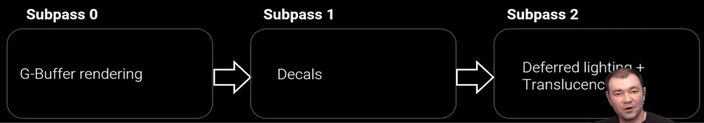
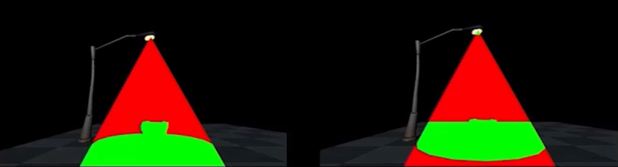
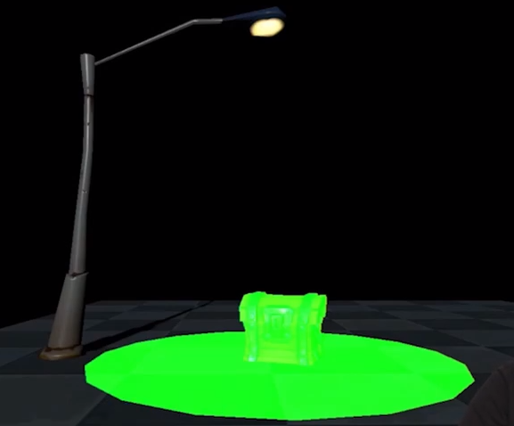

> # Unreal Engine 4 2020 Mobile Update
> * https://www.bilibili.com/video/BV11a4y1H7jC
> * Author 
>   * Epic Games - Unreal Engine Mobile Team Lead - Jack Porter
>   * Epic Games - Unreal Engine Mobile Rendering Programmer - Dmitriy Dyomin

## 移动端更新情况
### Mobile Platform Trends 移动平台发展趋势
* OpenGL ES -> Vulkan
* 用户期望更高的刷新频率
* 32-bit 减少
  * Google Play 现要求所有应用都有 64-bit 系统版本。
* 支持 ASTC 纹理压缩格式

> 下述许多移动端新特性为 UE 4.26 新增功能或实验性功能

### UE4 Mobile Update
#### 1. Android 系统
* 新增功能
  * New Google Play service support such as `App Bundles` and `Assets Delivery`
    * 如下载游戏的核心内容，启动后动态下载更多资源
  * High refresh rate (GLES & Vulkan)
  * NDK 21
* 开发中
  * 把 UE4 打包成 AAR（Android Archive） 并嵌入其它项目。达到在标准安卓项目中，渲染时调出 UE。
  * 更多移动端领域，收集相关数据并连接到 Unreal Insights 性能分析工具，以及安卓端的更多工具支持
#### 2. iOS 系统
* 支持更多输入设备，支持 iOS 14, XCode 12 and the latest iDevices
  * 对于苹果要求应用程序要准确显示输入控制器的按钮 UI 并提供了相应接口，已可在蓝图中获取
* 120Hz for iPad Pro
* `Windows Metal shader compiler` released at WWDC
  * 在 Windows 开发设备上编译 Metal 着色器
#### 3. Patching Plugin 补丁插件
* ChunkDownloader
  * Unreal Engine 4.26
  * 适用于包含大量小型内容的游戏
#### 4. Android Graphics - Mobile `Rendering` 移动端渲染
* 改进了移动端的图像功能和质量
* Compute Shaders
  * UE 4.25 对 GLES 最低版本要求从 2 提升到 3.1
  * 将 Compute Shader 用于
    * Niagara GPU 粒子模拟
    * Runtime 虚拟纹理压缩
    * GPU scene
    * 部分 post-processing（Eye Adaptation Histogram、`GTAO`）
  * 计划
    * `Global Distance Field` support 距离场
    * GPU-driven rendering for more advanced culling, instancing and geometry 用 GPU 驱动的渲染来处理更高级的几何体
* 安卓端的驱动问题
  * Vulkan 在 around 2017 的设备上有问题，改为使用 ES31
  * 而使用 GLES 时，许多基于 Mali GPU 的设备在`纹理缓冲大小`方面遇到了限制。部分功能无法使用：尤其是 GPU Scene，而其它缓冲在 GLES 的顶点着色器中无法访问。
#### 5. Android Graphics - Tools 调试工具
* 从使用设备或平台的特定调试工具转为使用通用调试工具
  * 平台相关调试工具如：Arm Mobile Studio（Mali Graphics Debugger）、骁龙 Adreno Profiler
  * `RenderDoc`：for OpenGL ES and Vulkan on Android
  * `Android GPU Inspector`：by Google, 需要最新驱动，但在支持的设备上可以提供 GPU Tracing，包括在 Adreno、Mali 设备上提供性能计数器。Beta Version：[https://gpuinspector.dev/](https://gpuinspector.dev/) 最新版本支持 Android 11 的 Pixel 4
#### 6. Mobile vs. Desktop 
* 渲染方式
    桌面端 | 移动端
    :---: | :---:
    延迟/前向渲染 | 仅支持前向渲染
* 光照
    
桌面端 | 
移动端
    :------ | :------
    ① 多种带阴影光照 ② 每个物体接收基于图像的光照（from reflection captures, blended per pixel） ③ 屏幕空间反射 Screen-space reflections（SSR） ④ 多种着色模型（default, clear-coat, skin, hair, ...） | ① 单个方向光照 ② 定向光源的动态阴影 ③ 没有阴影的点光源/聚光源 spotlights ④ 每个物体 only one reflection capture ⑤ 没有 SSR 只有平面反射 planar reflections ⑥ 着色模型仅 default
#### 7. 移动端的画质改进措施
* 4.26 brings the UE4 `Desktop` renderers, `Forward and Deferred` to mobile 移动端可选择使用桌面端渲染器
  * 适用于当前移动设备中的超高端机型
  * iOS 已完成 Beta 测试，Android（currently Vulkan only）测试中
  * 启动时可选 Desktop Renderer or Mobile Renderer
* 移动端的更多特性
  * Mobile deferred renderer 移动端的延迟渲染
    * 相对 Desktop Renderer 与移动端 GPU 更匹配
    * 是 4.26 的实验性功能
    * 下文由 Dmitriy 继续展开
  * dynamic shadows from movable spotlights on both static and moveable geometry 可移动聚光源的动态阴影（适用于静态/可移动几何体）
  * additional shading model
    * 目前仅支持无光照/默认光照（`unlit`/`default`）
  * ambient occlusion
    * 增加了 `Ground-Truth Ambient Occlusion （GTAO）`
    * 增强了间接光和阴影的表现
    * 低端设备上需要注意性能
  * screen-space reflections：`Pixel Projected Reflcetions`
    * 一种屏幕空间反射技术，比传统 SSR 更适用于移动端硬件
    * 是 4.26 的实验性功能
    * 仅适用于平面，选项 `Mobile - Planar Reflection Mode`
  * reflection capture compression 压缩反射捕捉贴图以减少反射捕捉占用内存
    * runtime virtual texturing
    * 通常用于将性能消耗极大的地形材质转换为虚拟纹理，改善运行时性能
### 8. Future Work
* 更多着色模型
* `CSM caching` for reusing cascaded shadow map data between frames 用 CSM 缓存在各帧之间重用层叠阴影贴图数据
* 把移动引擎的更多部分转到 Render Dependency Graph
* Global Distance Field 距离场功能（距离场阴影和环境光遮蔽）
* 更多由 GPU 驱动的渲染功能（advance culling, instancing and more advanced geometry）

## `Deferred Shading on Mobile`
### UE4 移动端渲染
* 移动端前向渲染（default）、延迟渲染，电脑端 Renderer（可以和 Mobile Deferred Shading 同时使用）的前向渲染、延迟渲染（default）
* 由于 Desktop Renderer 对移动端压力太大，因此推荐针对移动端 GPU 有相应优化的 Mobile Renderer Deferred Shading
* Deferred Shading 启用方法
  * `DefaultEngine.ini`
  * `r.Mobile.ShadingPath = 0/1`

### 前向渲染 vs. 延迟渲染
* Forward Shading 前向渲染
  * 前向渲染：单 pass 计算最终像素颜色，渲染完场景整个场景。
  * 优点
    * 移动端友好，不需要大量内存带宽。
  * 缺点
    * 由于要在单 pass 计算最终像素颜色，`材质着色器` material shader code 必须`包含光照`部分 lighting code（且要针对不同的静态、可移动、点光源等情况），增大了 shader 体量。
    * 每个像素都必须计算材质和光照，但如果该像素被遮挡，就会导致大量 overdraw `过度绘制`
    * 多光源情况下要把来自所有光源的光照整合到像素（即使该光源无贡献），性能开销很大
    * 没有很好的支持光照贴花 lit project decals 的方法（Need D-buffer, full depth prepass）

* Deferred Shading 延迟渲染
  * 延迟渲染：多 pass，最简过程两个 pass。第一个 pass 将所有对象和像素材质数据渲染为多种纹理，称之为 `G-Buffer`（Geometry Buffer，包含颜色、法线、世界空间坐标），第二个 pass 渲染光照体积 light volumes 并通过 G-Buffer 的数据计算最终像素颜色。
  * 优点
    * 材质和光照计算完全独立，光照部分只有在最后才对某光照可见的像素执行
    * Much less `shader permutations`
    * 减少 Overdraw
  * 缺点
    * 需要为 G-Buffer 准备 4-6 个额外的 render targets，大幅增加内存需求
    * 接上条，需要四倍空间的 MSAA 开销很大不能使用
    * Alpha blending 也不能和延迟着色一起使用（可`用延迟着色渲染所有不透明物体，再用前向着色渲染半透明对象`）
    * 有些旧设备不支持延迟着色所需要的 `multiple render targets（MRT）`

### 基于图块的 GPU 和延迟渲染 Tile-based GPUs and Deferred shading
* 移动端 GPU 通常是基于图块的（tile based）：将帧缓冲区分布到更小的 tiles 上，然后依次渲染 tiles，只将最终结果存储到系统内存 system memory。图块的渲染消耗很小，且不需要将中间结果存入系统内存，有助于减少内存带宽开销。
* 但在 Deferred Shading ，必须为每个 tile 做至少两个 pass，要把 G-Buffer 存入系统内存，后续 pass 读取 G-Buffer 的纹理数据做采样并计算最终像素值。
* 通过这种方法在 GPU 和系统内存之间移动 G-Buffer 效率较低。
* `Target`：在单个 pass 中实现多 pass 渲染，不将中间数据存入系统内存。
* => `使负责计算光照的着色器能直接获取 G-Buffer 数据并采样成纹理`（不同的图形 API 中实现各有不同）

#### Vulkan Subpasses
* Vulkan 的接口考虑到了 tile-based GPU 的运行，Vulkan 的 Pass 分为一些 subpasses ，便于在 G-Buffer 和光照通道之间表达像素依赖性
* 每个 subpass 可以声明自己所依赖的 input attachment 和 output attachment，使用 `SubpassLoad` 获取来自输入的 attachment 中的数据内容
* 因此移动端的延迟着色 Mobile Deferred Shading 最终分为三个 subpass

  * Subpass 0：G-Buffer、depth attachment
    * 写入 G-Buffer、depth
  * Subpass 1：Decals
    * 写入 G-Buffer、depth 只读
    * 该 subpass 通常为空，避免出现不同的渲染配置。因为 `render pass configuration` 会被烘焙进 `the pipeline state object`（PSO），如果需要在运行时更改配置，就需要为该配置创建新的管线状态对象。约 6000 个管线状态对象在移动端大概要编译几分钟，所以尽量要减少这些内容。
  * Subpass 2：Deffered lighting + Translucency
    * 写入 scene color、读取 G-Buffer、depth
    * 光照处理完后，用前向渲染渲染半透明物体。
  * 最后只把 scene color 放入系统内存
* 6 attachments = 5 color + DepthStencil = SceneColor + G-BufferA/B/C + SceneDepthAux(iOS) + DepthStencil
  * 注：在如 Samsung Galaxy S8 等使用 Mali G-71 GPU 的旧设备上 maxColorAttachments = 4 因此无法运行，不过有办法减少到只用 4 个
#### Metal(iOS)
* Metal programmable blending
  * 无需在 pass 中分清具体的 subpass
  * 可直接读取 color attachments
  * 不能读取芯片上的 DepthStencil attachment
    * 以 SceneDepthAux 替换，存储相同的 depth 信息，并在 lighting pass 被读取
    * R32F（32位浮点像素格式）存储场景深度 scene depth，用于在 lighting pass 重构像素的 world position，16位的精度不够
* G-Buffer 
  * 是临时的，只在 rendering pass 期间存在，不存入内存。但系统仍然会为其分配内存空间：类似一般纹理，所以根据其分辨率会占用不同大小的空间。
  * 在 Vulkan 可用 `imageUsage = VK_IMAGE_USAGE_TRANSIENT_ATTACHMENT_BIT`、`memoryProperty = VK_MEMORY_PROPERTY_LAZILY_ALLOCATED_BIT` 定义无内存标记，创建不占用系统内存的纹理
  * 在 Metal 可用 `MTLStorageMode.memoryless` ，the lazily allocated memory type

#### 移动端纹理格式
Attachment | 纹理格式 | 备注
:-:|:-:|:-:
SceneColor | R11G11B10 | mat.emissive/mat.unlit -> SceneColor
3x G-Buffer | RGBA8 | 即 RGB32，存 material data，目前暂时还未用于移动端延迟渲染
SceneDepthAux | R32F

* 总大小：160 bit 20 Bytes per-pixel

#### OpenGL
* 两种低耗访问像素数据的方式
  * Pixel Local Storage（PLS） 像素本地存储
    * supported: ARM Mali GPUs、ImgTech PowerVR GPU
    * not supported: Adreno GPU
  * shader frame buffer fetch 着色器帧缓冲区读取（只能读取单个 attachment）
    * supported on Adreno
    * not fully supported on the Mali GPUs
* 在不同设备上会有不同的延迟着色的实现方式，预计 4.27 中更新

#### 延迟着色为移动端带来的更多特性
* 支持所有 Deferred Decals 延迟贴花混合类型
* 更高质量的反射 reflections
  * 反射捕捉：混合影响到每个像素的所有反射捕捉，并与非静态填空光照反射进行混合 the non-static skylight reflections
  * 屏幕空间反射：SSR，4.26 中暂未支持，预计 4.27

#### **`光照优化`**
* 无光照像素模板测试
  * 37:24 when we apply `the directional light`, we render a `FullscreenQuad`. And the FullScreenQuad computes the lighting for each pixel on the screen. 但对于 unlit shading model 不需要计算光照，所以可以在计算 G-Buffer 的时候写入 `the stencil that this is unlit pixel` 无光照像素的模板，然后在计算光照的时候配置模板测试 `setup the stencil test`，过滤掉所有无光照像素 `mask out all unlit pixels`
  * 对于很多室外场景，天空会使用 unlit shading model，而且占据屏幕的一半，可以达到很好的优化效果
* `Light volume culling` for local lights rendering 局部光照渲染
  * 如对于聚光源 spotlights，只求与光照体积相交的几何体像素进行着色（即，如向下照射一个圆锥范围的路灯，只对该范围内的像素做着色）
  * 渲染光照体积的两个pass
        
    * First pass：不写入 color buffer，only render front faces of the volume 只渲染体积的正面，`update stencil` in cases when the `depth test fails` 深度测试失败时更新模板
    * Second pass：with the actual lighting shading 使用光照着色器，render only back faces 只渲染背面，do the inverted depth test 做反向的深度测试，shade only pixels that pass both `the depth test and the stencil test` 只渲染同时通过深度测试和模板测试的像素
        
  * 启用参数：`r.Mobile.UseLightStencilCulling = 1`（默认启用）
  * 缺点：adds additional draw calls and state switching between the draw calls 增加 DC 和状态切换
* Clustered deferred shading
  * 当存在多个局部光源，每个光源调 draw call 开销太大，且光照部分有重叠时会对一个像素做多次着色导致 overdraw
  * split the view into tiles or clusters, run a compute job at the start of the frame, `generate the list of the lights` that affects each cluster. 当应用平行光 apply the lighting for the directional light, `look up the light list` and `integrate all local lights that affects current pixel`. 通过预处理记录的 light list 合并影响当前像素的所有局部光源，实现在一次 draw call 中应用所有局部光源。
  * 启用参数：`r.Mobile.UseClusteredDeferredShading = 0/1`（默认禁用，与模板测试不能共用）
> 宗旨：单 pass 完成，省带宽省内存，不需要额外 resolve render target

### To do
* G-Buffer now 160bit -> 128bit or less
* shading models now default lit/unlit -> at least subsurface shading and clearcoat (requires more space in G-Buffer)
* `light functions` and `IES light profiles`
* 前向渲染可以做到的 the dynamic shadow from the spotlights 适用于聚光源的动态阴影
* SSR
* 由于 MSAA 在延迟着色下不适用，考虑添加 TAA
