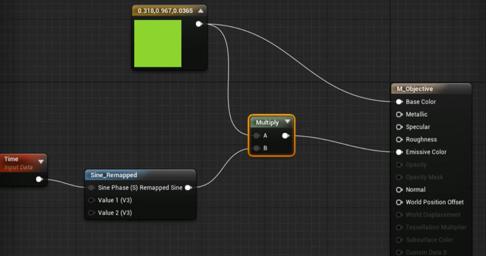
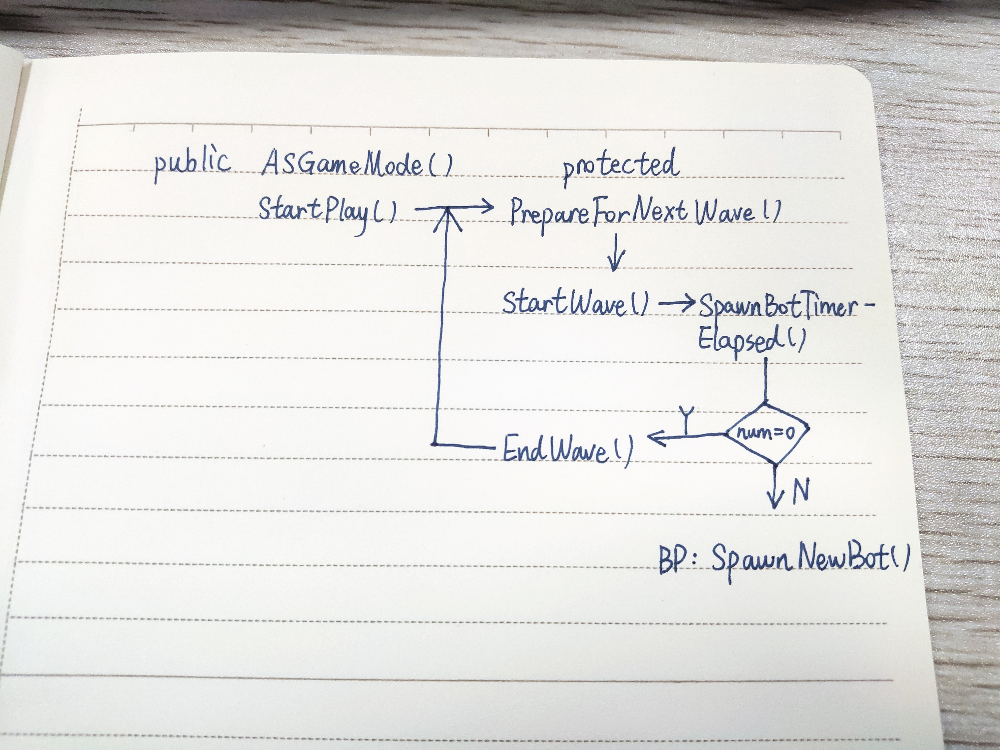

> # Create Multiplayer Games with C++
> * https://www.udemy.com/course/unrealengine-cpp/

## Preparation
### Visual Studio settings
* Visual Assist X shortcut
  快捷键 | 功能
  :----:|:----:
  Alt + O | 在 .h 和 .cpp 之间切换
  Shift + Alt + O | 在解决方案中查找文件
  Shift + Alt + S | 查找任意符号
  Alt + G | 在定义和实现之间切换
* 基本设置 https://docs.unrealengine.com/zh-CN/Programming/Development/VisualStudioSetup/index.html
* VS 2017 建议不关闭 options - text editor - c/c++ - advanced - intellisense - disable squiggles
### UE4 Editor setting
* blueprint - compile - save on compile - On Success Only

## 常见问题
* **`已绑定事件但无法触发`**
  * 可能原因：未绑定成功
  * 建议：将 `AddDynamic` 放到 `BeginPlay()` 时调用
* **`热重载问题`**
  * 如：在构造函数中改变量值后无法正确加载属性（更改不生效）、编辑器运行时在 VS 中加了新函数等
  * 建议：关掉 UE4 编辑器，直接在 VS 中编译


## 预热：爆炸特效
* `使用粒子系统`：**`UGameplayStatics::SpawnEmitterAtLocation()`**

## 一、拾取物体
### 1. 创建类
* New C++ Class - Actor - FBSObjectiveActor
* 基于 FBSObjectiveActor 创建 BP_Objective
### 2. 绑定组件（in C++）
* 选取一个拾取物体的地点，并放置 BP_Objective 
* **`为 Actor 绑定组件`**
    ```cpp
    // FBSObjectiveActor.h
    class USphereComponent;
    UCLASS()
    class xxx_API AFPSObjectiveActor : public AActor    
    {
        // 静态网格体组件，蓝图可见
        UPROPERTY(VisibleAnywhere, Category = "Components")
        UStaticMeshComponent *MeshComp;
        // 球体组件，蓝图可见
        UPROPERTY(VisibleAnywhere, Category = "Components")
        USphereComponent *SphereComp;
    }
    ```

    ```cpp
    // FBSObjectiveActor.cpp
    #include "Components\\SphereComponent.h"
    AFPSObjectiveActor::AFPSObjectiveActor()
    {
        // 根据指定类创建默认子对象
        MeshComp = CreateDefaultSubobject<UStaticMeshComponent>（TEXT("MeshComp")）;
        RootComponent = MeshComp;   // 将静态网格体组件设为根组件

        SphereComp = CreateDefaultSubobject<USphereComponent>(TEXT("SphereComp"));
        // 将球体组件附加到网格体组件上
        SphereComp->SetupAttachment(MeshComp);
    }
    ```
  * 小技巧：发现没高亮的时候，Shift + Alt + O 查类名位置，关注 Private/Classes 之后的部分 include
  * 头文件直接加在 .cpp 中， .h 中使用向前声明告知那是一个类。（据说不要在头文件里加太多东西，会影响编译时间？）
  * 球体组件附加到网格体组件：网格体的移动会带动球体
* 编译后为 SphereComp 添加网格体 EditorSphere
  * 调整大小 Scale
* 静态网格体组件设为无碰撞（蓝图中）
  * collision - `collision presets`
  * `BlockAllDynamic` 改为 `NoCollision`
### 3. 设置碰撞和重叠事件
#### 设置碰撞属性
```cpp
#include "Components/StaticMeshComponent.h"
// 禁用静态网格体组件的碰撞属性
MeshComp->SetCollisionEnabled(ECollisionEnabled::NoCollision);

// 不需要球体组件的物理效果，只使用查询 Line Traces 、 Overlap Events 等
SphereComp->SetCollisionEnabled(ECollisionEnabled::QueryOnly);
// 设置通道：相应所有通道
SphereComp->SetCollisionResponseToAllChannels(ECR_Ignore);
// 为 Pawn 人形体通道启用碰撞
SphereComp->SetCollisionResponseToChannel(ECC_Pawn, ECR_Overlap);
```
* `ECR_Overlap` 使发射物击中目标物体时不受阻，直接穿过对象
#### 重叠事件：重叠时生成粒子效果（捡起物体特效）
* **`生成粒子效果`**
    ```cpp
    // .h
    protected:
        void PlayEffects();

    // .cpp
    #include "Kismet/GameplayStatics.h"
    void AFPSObjectiveActor::PlayEffects()
    {
        UGameplayStatics::SpawnEmitterAtLocation(this, PickupFX, GetActorLocation());
    }
    ```
    * **`SpawnEmitterAttached`** 附加到物体
    * **`SpawnEmitterAtLocation`** 附加到特定位置，对静止物体而言就使用其位置即可
        * `UObject *WorldContextObject`：this，用于获取世界场景上下文，明确在哪个世界场景中注册相应粒子效果
        * `UParticleSystem *EmitterTemplate`：PickupFX
        * `FVector Location`：`GetActorLocation()`
* **`创建粒子系统`**
    ```cpp
    // .h
    protected:
        UPROPERTY(EditDefaultsOnly, Category = "Effects")
        UParticleSystem *PickupFX;
    ```
    * 暴露到蓝图中进行赋值
    * `EditDefaultsOnly`：property can be changed only for Blueprints, in Blueprint->Defaults
* **`物体重叠时调用`**
  * 注册到球体组件的重叠事件：`SphereComp->OnComponentBeginOverlap()`
  * 使用 Actor `NotifyActorBeginOverlap` （想找接口时可以到相关类型的父类文件里查查看）
        ```cpp
        // .h
        public:
            virtual void NotifyActorBeginOverlap(AActor *OtherActor) override;

        // .cpp
        void AFPSObjectiveActor::NotifyActorBeginOverlap(AActor *OtherActor)
        {
            Super::NotifyActorBeginOverlap(OtherActor);

            PlayEffects();
        }
        ```
### 4. 拾取物体
* 逻辑
  * FPSObjectiveActor 的 NotifyActorBeginOverlap 发生
  * 检查是否与 FPSCharacter 中角色类型发生重叠（已在碰撞设置中将过滤条件设为仅对 Pawn 有效，此处再用 cast 来 check 是否是对应需要的类型）
    ```cpp
    // FPSCharacter.h
    public:
        UPROPERTY(BlueprintReadOnly, Category = "Gameplay")
        bool bIsCarryObjective;
    
    // FPSObjectiveActor.cpp
    #include "FPSCharatcer.h" 
    void AFPSObjectiveActor::NotifyActorBeginOverlap(AActor *OtherActor)
    {
        AFPSCharacter * MyCharacter = Cast<AFPSCharacter>(OtherActor);
        if (MyCharacter)
        {
            MyCharacter->bIsCarryObjective = true;

            Destroy();
        }
    }
    ```
### 5. 向用户显示信息
#### 创建 UMG
* 创建文本 UI - UMG
  * 在 Content/UI 下创建 User Interface - Widget Blueprint - WBP_ObjectiveInfo
  * 添加 Text 控件
  * text - details - size to content 使大小适应文本内容
  * font - size 调整文本内容大小
* 应用 UMG
  * 在 Content/Blueprints 下创建 HUD - FPSHUD - BP_HUD
  * 在 Event Graph 中 `Create Widget`，target = WBP_ObjectiveInfo
  * 将 Create Widget Return Value `Add to Viewport`
* 应用 HUD
  * 在 Content/Blueprints 下创建 FPSGameMode - BP_GameMode
  * Classes - HUD Class 设为 BP_HUD
* 应用 GameMode
  * 主界面 World Settings - GameMode - GameMove Override 设为 BP_GameMode
* **`发生事件时修改文本信息`**
  * bind get text 0 - GetObjectiveText
  * 创建变量 Text - GetObjective、ExtractArea 并设置对应文本
  * get text 蓝图界面中 select，index = Boolean
  * 通过结点 **`Get Owning Player Pawn`** 找到玩家控制的 Pawn ，Return Value 用 `isValid` 或 `Cast To FPSCharatcer` 检查是否有效，此用 Cast （转换成功即有效）
  * 根据相应情况显示文本
### 6. Challenge：黑洞
* 一个会吸入周围 Actor 的黑洞
  * Sphere Component，Create and Destroy
  * Physics：`AddForce()`、`AddRadialForce()`
  * Find Nearby Actors：`SphereComp->GetOverlappingComponents` in `Tick()`
  * check all actors `Generate Overlap Events`
* p15 02:42

## 二、游戏规则
* 总览
  * 玩家将目标物体带至通关区域范围即完成任务。
  * 向玩家显示相应通知。
  * 暂停接收玩家输入。
  * 镜头离开玩家，切至下一关。
### 1. 通关口 Extraction Zone
* 创建 C++ 类 - Actor - FPSExtractionZone
* 添加盒体组件、重叠组件（检测重叠事件）
    ```cpp
    // FPSExtractionZone.h
    class UBoxComponent;
    UPROPERTY(VisibleAnywhere, Category = "Components")
    UBoxComponent *OverlapComp;

    // FPSExtractionZone.cpp
    #include "Components/BoxComponent.h"
    AFPSExtractionZone::AFPSExtractionZone()
    {
        OverlapComp = CreateDefaultSubobject<UBoxComponent>(TEXT("OverlapComp"));
        OverlapComp->SetCollisionEnabled(ECollisionEnabled::QueryOnly);
        OverlapComp->SetCollisionResponseToAllChannels(ECR_Ignore);
        OverlapComp->SetCollisionResponseToChannel(ECC_Pawn, ECR_Overlap);
        // 设置盒体区域的响应范围
        OverlapComp->SetBoxExtent(FVector(200.0f));
        // 设为根组件
        RootComponent = OverlapComp;
        // 显示重叠组件
        OverlapComp->SetHiddenInGame(false);
        // 创建与玩家发生重叠时的事件
        OverlapComp->OnComponentBeginOverlap.AddDynamic(this, &AFPSExtractionZone::HandleOverlap);
    }
    ```
* 定义绑定到重叠事件的代理函数
    * OnComponentBeginOverlap Alt + G 转到定义
    * 对其类型 Alt + G 转到定义
    * 找到 `DECLARE_DYNAMIC_MULTICAST_DELEGATE_*()` ：声明了代理，把首项去掉，后面的参数列表作为要定义的代理函数的参数，去掉类型和名称间的分隔逗号
    * 要标记为 UFUNCTION() ，通知虚幻后端该函数的含义及如何与事件绑定
    ```cpp
    // FPSExtractionZone.h
    UFUNCTION()
    void HandleOverlap(UPrimitiveComponent *OverlappedComponent, AActor *OtherActor, UPrimitiveComponent *OtherComp, int32 OtherBodyIndex, bool bFromSweep, const FHitResult &SweepResult);

    // .cpp
    void AFPSExtractionZone::HandleOverlap(UPrimitiveComponent *OverlappedComponent, AActor *OtherActor, UPrimitiveComponent *OtherComp, int32 OtherBodyIndex, bool bFromSweep, const FHitResult &SweepResult)
    {
        // 判断玩家是否携带目标物体
        UE_LOG(LogTemp, Log, TEXT("Overlapped with extraction zone!"));
    }
    ```
* 使用重叠组件
  * 主界面左侧 Modes 中 search classes - FPSExtractionZone 拖入场景
  * `显示重叠组件`：`SetHiddenInGame`
### 2. 完善通关口
* 向项目的 Content 添加内容
  * 右键 Content - Show in Explorer
  * Ctrl + 把 Materials 拖入
* **`贴花组件`**
    ```cpp
    // FPSExtractionZone.h
    protected:
        UPROPERTY(VisibleAnywhre, Category = "Components")
        UDecalComponent *DecalComp;
    
    // .cpp
    #include "Components/DecalComponent.h"
    AFPSExtractionZone::AFPSExtractionZone()
    {
        // 创建对象
        DecalComp = CreateDefaultSubobject<UDecalComponent>(TEXT("DecalComp"));
        // 尺寸与通关口范围一致。API 可 Alt + G 到相关头文件里查。
        DecalComp->DecalSize = FVector(200.0f, 200.0f, 200.0f);
        // 
        DecalComp->SetupAttachment(RootComponent);
    }
    ```
    * 主界面中找到 DecalComp 为其设定材质 SpawnBox_M_Inst
    * 原材质颜色太亮，在强光照下不明显，把花纹调暗。将 SpawnBox_M 材质的 Opacity（不透明度）Clamp 的 Min Default 设高到 0.15 。
    * 基于 ExtractionZone 创建 BP_ExtractionZone ，便于更改 C++ 中设置的默认值 
    * DecalComp 相对 ExtractionZone 有偏移，重置 Location
    * 角度旋转 90 度
### 3. 游戏模式：通关规则
```cpp
// FPSExtractionZone.cpp
#include "FPSCharacter.h"
#include "FPSGameMode.h"
void AFPSExtractionZone::HandleOverlap(...)
{
    // 类型转换，并判断玩家是否携带目标物
    AFPSCharacter *MyPawn = Cast<AFPSCharacter>(OtherActor);
    if (MyPawn && MyPawn->bIsCarryObjective)
    {
        // 通知【游戏模式】目前的游戏状态
        AFPSGameMode *GM = Cast<FPSGameMode>(GetWorld()->GetAuthGameMode());
        if (GM)
        {
            GM->CompleteMission(MyPawn);
        }
    }
}
```
* `GetWorld()` 返回当前游戏世界
* `GetAuthGameMode()` 返回当前世界游戏模式的引用，仅在服务器上有效
```cpp
// FPSGameMode.h
public:
    void CompleteMission(APawn *InstigatorPawn);

    UFUNCTION(BlueprintImplementableEvent, Category = "GameMode")
    void OnMissionCompleted(APawn *InstigatorPawn);
```
* `UFUNCTION(BlueprintImplementableEvent)` 通过蓝图实现
```cpp
// FPSGameMode.cpp
void AFPSGameMode::CompleteMission(APawn *InstigatorPawn)
{
    if (InstigatorPawn)     // check
    {
        InstigatorPawn->DisableInput(nullptr);  // 禁用输入
    }
    OnMissionCompleted(InstigatorPawn);
}
```
* Pawn 与 PlayerController 
  * Pawn 生成后由 PlayerController 控制，输入经由 PlayerController 转换后发送给 Pawn
  * `DisableInput(nullptr)` 禁用对角色 Pawn 输入，但不阻止对 PlayerController 的输入（如调出游戏菜单等）
### 4. 添加通关反馈
* **`文字提示`**：创建提示任务完成的 UI Widget
  * 创建新的 Widget - WBP_GameOver
  * 放入 Text ，Anchor 调整至屏幕中心，重置 Text Position ，并放在屏幕中心上部。
* 在 BP_GameMode 蓝图中完成上述暴露给蓝图实现的函数 `OnMissionCompleted` ，向玩家显示任务完成提示
  * Create Widget(WBP_GameMode, default) -> Add to Viewport
  * Owning Player 保留默认值
* **`音效提示`**：未携带目标物进入通关口时的未完成提示
    ```cpp
    // FPSExtractionZone.h
    protected:
        UPROPERTY(EditDefaultsOnly, Category = "Sounds")
        USoundBase *ObjectiveMissingSound;
    ```
    * `EditDefaultsOnly` 游戏启动后无法编辑，只能在为其创建蓝图版本时进行编辑
    * 在 `BP_ExtractionZone` 中设置音效：details - sounds - objective missing sound
* 在 `HandleOverlap` 中调用
    ```cpp
    // FPSExtractionZone.cpp
    #include "Kismet/GameplayStatics.h"
    void AFPSExtractionZone::HandleOverlap(...)
    {
        AFPSCharacter *MyPawn = Cast<AFPSCharacter>(OtherActor);
        if (MyPawn == nullptr)
        {
            return;
        }

        if (MyPawn->bIsCarryObjective)
        {
            AFPSGameMode *GM = Cast<AFPSGameMode>(GetWorld()->GetAuthGameMode());
            if (GM)
            {
                GM->CompleteMission(MyPawn);
            }
        }
        else
        {
            UGameplayStatics::PlaySound2D(this, ObjectiveMissingSound);
        }
    }
    ```
    * `UGameplayStatics` 中均为静态函数
    * `PlaySound2D` 播放声效，将信号传输至音频引擎
### 5. 视角切换
* 蓝图实现：`BP_GameMode` 中
  * 用 **`Sequence`** 接出另一条执行线
  * `获取控制器`：从 `Event On Mission Completed` 结点的 `Instigator Pawn` 拉出结点 **`Get Controller`** 并 **`Cast to PlayerController`** 
  * `更改视角`：`Cast As Player Controller` -> `Set View Target with Blend` 
  * `创建新视角`
    * 新建蓝图 Actor - BP_SpectatingViewpoint
    * 添加组件 StaticMesh ，设定 Static Mesh - MatineeCam_SM 
    * **`在游戏中隐藏`**：StaticMesh - details - Rendering - Hidden in Game
    * 将 BP_SpectatingViewpoint 拖入场景，右键 `Pilot` 调整视角
  * `应用新视角`
    * 回到 `Set View Target` 
    * `获取新视角`：**`Get All Actors of Class`** ，`Actor Class` 设为 BP_SpectatingViewpoint ，返回值 Out Actors -> `Get (a copy)` 
  * `视角切换优化`：仍然是 `Set View Target with Blend`
    * `Blend Time`：0.5
    * `Blend Func`：Cubic
* **`C++ 实现`**
    ```cpp
    // FPSGameMode.h
    protected:
        UPROPERTY(EditDefaultsOnly, Category = "Spectating")
        TSubclassOf<AActor> SpectatingViewpointClass;

    // FPSGameMode.cpp
    #include "Kismet/GameplayStatics.h"
    void AFPSGameMode::CompleteMission(APawn *InstigatorPawn)
    {
        if (InstigatorPawn)
        {
            ...
            if (SpectatingViewpointClass)   // check 新视角存在
            {
                // 获取新视角
                TArray<AActor *> ReturnedActors;
                UGameplayStatics::GetAllActorsOfClass(this, SpectatingViewpointClass, ReturnedActors);

                if (ReturnedActors.Num() > 0)
                {
                    AActor *NewViewTarget = ReturnedActors[0];

                    // 获取控制器
                    APlayerController *PC = Cast<PlayerController>(InstigatorPawn->GetController());
                    if (PC)
                    {
                        // 应用新视角，并设切换过渡时间
                        PC->SetViewTargetWithBlend(NewViewTarget, 0.5f, EViewTargetBlendFunction::VTBlend_Cubic);
                    }
                }
            }
            else
            {
                UE_LOG(LogTemp, Warning, TEXT("SpectatingViewpointClass is nullptr. Please update GameMode class with valid subclass. Cannot change spectating view target."));
            }
        }
        
    }
    ```
    * 编译后到蓝图中给 SpectatingViewpointClass 赋值为 BP_SpectatingViewpoint
    * 接口名与蓝图中类似，主要根据接口所需传入的参数逆推需要的变量
### 6. Challenge：发射平台
* 把人弹飞
  * 在 `LaunchCharacter()` 单个函数中完成，内置在 Character Class 中
  * 添加粒子效果
  * 可以把物体（如蓝色方块）也弹飞：Generate Overlap Events on blue cubes
* 关键点
  * 碰撞组件：球体/盒体碰撞组件，判定人物或物体是否与其重叠
  * 
* p22 02:23

## 三、AI 基础
* AI 行为
  * 守卫目标物
  * 能看到玩家，听到周围动静
  * 对守卫有干扰机制（可声东击西）
### 1. AI 守卫
* New C++ Class - Character - FPSAIGuard
  * Character 比 Pawn 多的内容：Static Mesh 组件、角色的移动
  * 不涉及玩家，可将 SetupPlayerInputComponent 部分删掉
  * 增加 Content 资源
* 基于 FPSAIGuard 创建 BP_Guard
  * `使用模型`：Mesh - details - Mesh - skeletal Mesh 使用导入的 DwarfGrunt_R_new
  * 调整位置 -80，调整胶囊碰撞体高度 Shape - Capsule Half H... = 60
  * 面向 X 轴方向（红轴方向）：Rotation_Z = -90
  * `设置动画效果`：details - animation - animation mode - use animation assets，anim to play 中选择动画效果 Idle
* **`人形体感应组件 PawnSensingComponent`**
    ```cpp
    // FPSAIGuard.h
    class UPawnSensingComponents;

    protected:
        UPROPERTY(VisibleAnywhere, Category = "Components")
        UPawnSensingComponent *PawnSensingComp;
    
    // FPSAIGuard.cpp
    #include "Perception/PawnSensingComponent.h"
    AFPSAIGuard::AFPSAIGuard()
    {
        PawnSensingComp = CreateDefaultSubobject<UPawnSensingComponent>(TEXT("PawnSensingComp"));
    }
    ```
    * **`添加 AI 模块`**：由于 AI 模块不在 Engine 或 Core 模块中，所以要在 `FPSGame.Build.cs` 的 `PublicDenpendencyModule` 添加模块依赖 `AIModule`
* 拽个 BP_Guard 进场景看效果 w（有丶可爱哈
### 2. 视觉感应
#### **`PawnSensingComponent`**
* 贼多放射线！（Debug Lines）
* 类似 `CharacterMovement` ，是 `Actor` 组件而非场景组件，没有确定的位置，无法附加到其它组件
* details - AI
  * Peripheral Vision ...：视野范围 FOV
  * Sight Radius：视野半径
  * Hearing Threshold：有遮挡最大听距
  * LOSHearing Threshold：无遮挡直线听距（$> Hearing Threshold$）
* details - Events
  * `On See Pawn`
  * `On Hear Noise`
* **`绑定视觉事件`**
    ```cpp
    // FPSAIGuard.cpp
    AFPSAIGuard::AFPSAIGuard()
    {
        PawnSensingComp->OnSeePawn.AddDynamic(this, &APFSAIGuard::OnPawnSeen);
    }
    ```
    * 查源码找到所需定义的函数接口形式
      * 注意标记为 `UFUNCTION()` ，否则会 `unable to bind delegate (function might not be marked as a UFUNCTION)`
    * 事件在 AIGuard 发现 Pawn 类型物体时触发
      * 需判定所发现的是其它 AI 还是玩家
      * 如果是玩家则 Game Over
    ```cpp
    // FPSAIGuard.h
    protected:
        UFUNCTION()
        void OnPawnSeen(APawn *SeenPawn);

    // FPSAIGuard.cpp
    #include "DrawDebugHelpers.h"   // 先随便画点东西当做反应
    void AFPSAIGuard::OnPawnSeen(APawn *SeenPawn)
    {
        if (SeenPawn == nullptr)
        {
            return;
        }
        DrawDebugSphere(GetWorld(), SeenPawn->GetActorLocation(), 32.0f, 12, FColor::Red, false, 10.0f);
    }
    ```
* UE4 小技巧：运行中 `F1` 切……透视图？透视世界？
### 3. 听觉感应
* 基本设置类似视觉感应
* 触发听觉感应事件所需绑定的函数代理
    ```cpp
    // FPSAIGuard.h
    protected:
        UFUNCTION()
        void OnNoiseHeard(APawn *NoiseInstigator, const FVector &Location, float Volume);
    
    // FPSAIGuard.cpp
    void AFPSAIGuard::OnNoiseHeard(APawn *NoiseInstigator, const FVector &Location, float Volume)
    {
        Instigator
        DrawDebugSphere(GetWorld(), Location, 32.0f, 12, FColor::Green, false, 10.0f);
    }
    ```
    * 由于 Actor 中本身定义有 Instigator ，会重名，因此找到的接口示例中 Instigator 需重命名一下。（编译时报错：`Function parameter: 'Instigator' cannot be defined in 'OnNoiseHeard' as it is already used`）（看起来 UE4 的类里面仿佛制止了变量名覆盖这种特性【？】）
* **`为玩家人物添加声音发射器组件 NoiseEmitterComponent`**
    ```cpp
    // FPSCharacter.h
    class UPawnNoiseEmitterComponent;

    protected:
        UPROPERTY(VisibleAnywhere, BlueprintReadOnly, Category = "AI")
        UPawnNoiseEmitterComponent *NoiseEmitterComponent;

    // FPSCharacter.cpp
    #include "Components/PawnNoiseEmitterComponent.h"
    AFPSCharacter::AFPSCharacter()
    {
        NoiseEmitterComponent = CreateDefaultSubobject<UPawnNoiseEmitterComponent>(TEXT("NoiseEmitter"));
    }
    ```
    * 命名方式与原 Character 类中的变量保持一致。
    * 在 `PawnNoiseEmitterComponent.h` 中可以发现 `MakeNoise()` 接口
* **`制造声音`**
  * BP_Player event graph - 先用 Tick event 测试 - 结点 **`Pawn Make Noise`** ，参数输入注意 information：if zero vector, use the actor's location 因此 Noise Location 可为空。
  * 【？】问题：触发视觉感应时，听觉感应组件失效。（貌似是 Pawn 的特性？）
### 4. 给发射物附加触发 AI Guard 听觉感应的声效
```cpp
// FPSProjectile.cpp
void AFPSProjectile::OnHit(UPrimitiveComponent *HitComp, AActor *OtherActor, UPrimitiveComponent *OtherComp, FVector NormalImpulse, const FHitResult &Hit)
{
    // 发射物击中物体时发出音效
    MakeNoise(1.0f, Instigator);
    Destroy();  // 挪下来的
}
```
* MakeNoise 会 check 传入的 Instigator 是否具有 PawnNoiseEmitterComponent 而可发出声音
```cpp
// FPSCharacter.cpp
void AFPSCharacter::Fire()
{
    if (ProjectileClass)
    {
        FActorSpawnParameters ActorSpawnParams;
        ActorSpawnParams.SpawnCollisionHandlingOverride = ESPawnActorCollisionHandlingMethod::AdjustIfPossibleButDontSpawnIfColliding;
        ActorSpawnParams.Instigator = this; // 将 Actor 自带的 Instigator 设为本 Character 自身
    }
}
```
* `ActorSpawnParams.Instigator = this;` 使 Projectile 调用时传入的 Instigator 为当前 Character
* 调整感官感应组件的感应间隔
  * BP_Guard - PawnSensingComponent - details - AI - `Sensing Interval`
### 5. 干扰 AI
* 逻辑：当有声音时让 AI 转向发声处
* 实现：
  * 蓝图库 KismetMathLibrary 中有 `LookAtRotation`
  * 【？】不直接调用蓝图函数，用它返回的 `MakeRotFromX()` （可能是因为效率问题？），再找一层，发现 `FRotationMatrix::MakeFromX(FVector X).Rotator();`
    ```cpp
    // FPSAIGuard.cpp
    void AFPSAIGuard::OnNoiseHeard(...)
    {
        // 把位置转换为方向
        FVector Direction = Location - GetActorLocation();
        Direction.Normalize();
        // 获取转向 rotator
        FRotator NewLookAt = FRotationMatrix::MakeFromX(Direction).Rotator();
        // 设置新的 rotation
        SetActorRotation(NewLookAt);
    }
    ```
    * 优化：令 Guard 只做左右转动（只更改 `Yaw` 值，`Pitch` 上下，`Roll` 倾斜），设 NewLookAt.Pitch/Roll = 0.0f
* 调试：
  * UE4 小技巧：运行时 `~` 调出控制台，`show collision` 显示碰撞体
* `受干扰一定时间后回到初始状态`
  * 记录初始状态
    ```cpp
    // FPSAIGuard.h
    protected:
        FRotator OriginalRotation;

    // FPSAIGuard.cpp
    void AFPSAIGuard::BeginPlay()
    {
        OriginalRotation = GetActorRotation();
    }
    ```
  * **`设置计时器`**
    ```cpp
    // FPSAIGuard.cpp
    void AFPSAIGuard::OnNoiseHeard(...)
    {
        SetActorRotation(NewLookAt);

        FTimerHandle TimerHandle_ResetOrientation;
        GetWorldTimerManager().SetTimer(TimerHandle_ResetOrientation, this, &AFPSAIGuard::ResetOrientation, 3.0f);
    }

    // .h 定义重置函数，用于绑定到计时器，用于执行
    UFUNCTION()
    void ResetOrientation();

    // .cpp 实现重置函数
    void AFPSAIGuard::ResetOrientation()
    {
        SetActorRotation(OriginalRotation);
    }
    ```
    * 计时器参数看接口
    * 此时多次干扰，之前干扰产生的时间句柄先执行重置，会让之后的干扰时效缩短。所以要`复用计时器`
    ```cpp
    // 句柄声明放到 .h protected
    // 清除原先的计时器
    GetWorldTimerManager().ClearTimer(TimerHandle_ResetOrientation);
    GetWorldTimerManager().SetTimer(...);
    ```
### 6. 游戏模式：死亡规则
* 规则：被守卫发现就 Game Over
  * 显示 Game Over
  * 切换摄像机视角
  * 取消 Pawn 控制权
* 修改 Game Mode
  * 为 `FPSGameMode::CompleteMission()` 增加参数 `bool bMissionSuccess`
  * 通知 Game Mode 任务完成处的调用传入 `true`
  * 守卫发现即 `AFPSAIGuard::OnPawnSeen()` 处类似调用，并传入 `false`
* 修改 UI 显示的文字
  * WBP_GameOver 添加变量 bMissionSuccess ，并勾选 details - `Instance Editable` 和 `Expose on Spawn`（在 BP_GameMode 中的 Create Widget 刷新后会显示该变量）
  * 然后把 BP_GameMode - Event Graph - Event On Mission Completed - Mission Success 接到 Widget 的 Mission Success
  * 在 WBP_GameOver 给 Text 绑定函数：进入函数蓝图， `Get Mission Success` - `Select` 根据不同值指定文本，返回值连到 `Return Node`
### 7. 在守卫头顶添加 3D UI 反应
* Feedback：守卫被干扰，看向发声源发现没人的时候显示“？”；守卫发现玩家时显示“！”。
* 创建 Content/UI - WBP_GuardState
  * 添加 Text 控件
  * anchor 放到中心，重置 position，Alignment (0.5, 0.5)，Size to Content，Font Size 65，黄色，Shadow Color A 0.2。
  * Text 设为 “？”
* 在 BP_Guard 中
  * 添加组件 `Widget` 新建窗口控件组件
  * Widget - details - User Interface - `Widget Class` 设为 `WBP_GuardState`
  * 到 Viewport 中把问号往上提，调整位置
  * Widget - details - User Interface - `Space` 从 World 设为 Screen：令其从每个方向都能看到
* 根据状态调整 UI
  * 定义枚举类
    ```cpp
    // FPSAIGuard.h
    UENUM(BlueprintType)
    enum class EAIState : uint8
    {
        Idle,           // 默认状态
        Suspicious,     // 被干扰时，显示“？”
        Alerted         // 警惕状态，显示“！”
    }

    class ...
    {
    protected:
        EAIState GuardState;
        
        void SetGuardState(EAIState NewState);

        UFUNCTION(BlueprintImplementableEvent, Category = "AI")
        void OnStateChanged(EAIState NewState);
    }

    // FPSAIGuard.cpp
    AFPSAIGuard::AFPSAIGuard()
    {
        GuardState = EAIState::Idle;        // 设定默认值
    }

    void AFPSAIGuard::SetGuardState(EAIState NewState)
    {
        if (GuardState == NewState)
        {
            return;
        }
        GuardState = NewState;              // 更新状态

        OnStateChanged(GuardState);         // 调用 UMG 修改 3D UI 状态
    }
    ```
    * 枚举类型标记为 `UENUM(BlueprintType)` 使其在蓝图可用，`uint8` 为公开给蓝图的定义格式
    * 在 cpp 中更改状态后在蓝图中更改 UMG 文本，因此定义一个在蓝图中实现的函数接口，在此调用，并在蓝图中实现
    * 另外记得去 AI Guard 中 `OnNoiseHeard`、`OnPawnSeen` 两个事件中调用 `SetGuardState()`，注意 Alerted 优先级高于 Suspicious ，可以在 OnNoiseHeard 进入时即判定。最后在 `ResetOrientation()` 中同样判定及重置状态。
* 实现 UI 文本更改
  * 在 BP_Guard - Event Graph 中实现事件 `On State Changed`
  * 拖入 `Widget` 组件 -> `Get User Widget Object` 获得控件 -> Cast To WBP_GuardState
  * 把事件执行线连到 Cast。
  * 转到 WBP_GuardState 进入蓝图界面 Graph ，新建 Functions - UpdateText ，增加 Inputs - `Text NewText;`。回到 Designer 界面选中 Text - details - 勾选 `Is Variable`。再到 Graph 中，Text 显示到 Variables 栏下，拖入蓝图 `SetText`。
  * 再回到 BP_Guard，As WBP_GuardState -> `Update Text`，New State 输入从 On State Changed - New State -> Select 给出。
  * 在 WBP_GuardState - event graph - event construct -> `Get Text` -> `SetText` 使初始显示为空。
### 8. Challenge：AI 巡逻
* 逻辑
  * 两点间游走（可以范围内随机？）：**`寻路网格体 Nav Mesh Bounds Volume`**
    * 寻路系统相关
    * UE4 小技巧：右键物体，Select -> Select all matching classes 选中所有匹配类
    * details - `search navigation`（导航） - collision - `can ever affect` 取消寻路系统对相应物体的影响。（默认情况下物体会让寻路网格有洞，而模拟物理的物体被击中时会移动，运行时寻路网格静止，洞保留）
  * Suspicious 时停止巡逻
* p31 02:53

## 四、实现联网
* 总览
  * 让类在多人游戏设置下的客户端和服务器上运作
  * **Replication**
### 1. 场景调整
* 调整场景，增加难度。
* 为目标物创建简单材质
  * 新建 Content/Materials/M_Objective 闪光材质
  
  
  * `Sine_Remapped` 两 Value 值可改变脉冲频率
* 尝试多人游（爆）戏（炸）
  * Play - Multiplayer Options - Number of Players 设为 2，同时打开两个客户端（实际上打开的是一个服务器和一个客户端）
  * UE4 小技巧：多端运行时 Shift + F1 挪开窗口
  * ↓ 在客户端做操作测试：
  * 问题 1：守卫头顶 UMG UI 只在触发客户端显示
  * 问题 2：客户端可出现拾起粒子特效，但目标物未显示销毁，只在服务器上显示销毁。但客户端的左上提示 UI 正常变化，服务器提示 UI 未改变。
  * 问题 3：任务完成时客户端视角切换，无 UI 提示。服务器未切换视角，有 UI 提示，仍可移动。
  * 问题 4：（p34 开头处）在客户端、服务端分别开枪，另一窗口都没有相应变化， Projectile 不通信。
### 2. 发射物 Projectile 联网
* `打开 Replication`：在要复制到客户端的 Actor 类的构造函数中将相关 Actor 的复制选项打开
	```cpp
	// FPSProjectile.cpp
	AFPSProjectile::AFPSProjectile()
	{
		SetReplicates(true);
		SetReplicateMovement(true);
	}
	```
	* `SetReplicates`：生成发射物 projectile 时在客户端复制同样的效果。
    	* 流程：
    	* ① 服务器窗口调用 `AFPSCharacter::Fire()` 
    	* ② `AFPSCharacter::Fire()` 中 `SpawnActor<AFPSProjectile>` 生成发射物
    	* 此时只对服务器有效，客户端中不显示
    	* ③ 启用 `SetReplicates` 后，服务器向所有客户端发送数据包，请求在客户端上生成该发射物
	* `SetReplicateMovement`：类似地，移动、位置、转动等信息改变时，服务器也向客户端发送数据包，将状态更新到客户端
* `确保代码在服务端上运行`：**`函数在服务端和客户端的同步问题`**
  * ue4 client-server mode ，只能从服务端给客户端发数据包。如果要反向的话需要调用服务端给出的事件触发接口传参实现：https://answers.unrealengine.com/questions/709110/index.html
  * 所以完成 SetReplicate 后，在客户端窗口生成发射物的数据不能被服务端知晓：`FPSCharacter::Fire()` 与玩家控制的 Character 绑定，客户端无法往服务端直接传数据包。
  * **`服务器函数`**
    ```cpp
    // FPSCharacter.h
    protected:
        UFUNCTION(Server, Reliable, WithValidation)
        void ServerFire();

    // FPSCharacter.cpp
    void AFPSCharacter::ServerFire_Validate()
    {
        return true;
    }

    void AFPSCharacter::ServerFire_Implementation()
    {
        // 需要运行在服务器上的部分代码
        if (ProjectileClass) { ... }
    }

    void AFPSCharacter::Fire()
    {
        ServerFire();
    }
    ```
    * `Reliable`：确保连接至服务器（可能遇到丢包等问题，但最终确保连接）
    * `WithValidation`：实现时要另外写一个 `_Validate` 结尾的 bool 函数，在服务器端进行完整性检查时用到。当客户端发起 return false 请求时服务器会强制取消连接，因为可能出现严重问题或在用外挂（
    * 注意实现时要加后缀 `_Implementation` ，调用时与头文件的 ServerFire() 保持一致。
    * 原因：`当创建带有 Server 关键词的 UFUNCTION 时，后台会自动为 _Implementation 和 _Validate 创建头文件`
    * 流程：在客户端 `Fire()` 中调用 `ServerFire()` 时，不在客户端执行，而是发送请求到服务器，让服务器执行 ServerFire_Implementation() 函数。在服务端 `Fire()` 中调用 `ServerFire()` 时（因为本游戏服务端自身也可以是游戏玩家），当然直接执行。
* 其它 Projectile 相关内容
  ```cpp
  // FPSProjectile.cpp
  void AFPSProjectile::OnHit(...)
  {
      // 施加推力等
      if (Role = ROLE_Authority)
      {
          MakeNoise(...);
          Destroy();
      }
  }
  ```
  * MakeNoise 用于影响 AI 逻辑，所以只需在服务器上运行。
  * Destroy 不应在客户端执行，因为客户端不拥有 Actor ，只是模拟生成了服务器的指令（replicate）。最终还是服务端决定何时销毁 Actor 。
### 3. **`角色组件联网`**
* 问题：客户端只能水平
  * 在模板工程代码中使用了 `MuzzleLocation`、`MuzzleRotation`
  * 运行测试可以发现客户端抬枪的时候服务端并没有动。
* 解决办法一：在服务器函数中给出发射物位置和旋转度信息，当然这样不能解决服务端观察客户端角色时没有抬枪的问题。
* 解决办法二：**`uint8 APawn::RemoteViewPitch`** 
    ```cpp
    // FPSCharacter.h
    public:
        virtual void Tick(float DeltaTime) override;
    // FPSCharacter.cpp 
    void AFPSCharacter::Tick(float DeltaTime)
    {
        Super::Tick(DeltaTime);

        // check 是否被控制中
        if ( !IsLocallyControlled() )
        {
            // 设置玩家手臂的相对旋转度
            FRotator NewRot = Mesh1PComponent->RelativeRotation;
            NewRot.Pitch = RemoteViewPitch;
            Mesh1PComponent->SetRelativeRotation(NewRot);
        }
    }
    ```
  * 用到 FPSCharacter 的每台机器上的实例都按帧更新其位置。更新函数在服务器和客户端上都会运行，即运行两次。
  * `RemoteViewPitch` 是 replicated 的。
  * 注意：`不要和控制角色时给出的输入冲突`，因此只在不操作角色时执行。
* 组件拼接 Bug：手臂虚影
  * BP_Player 中 Mesh1PComponent 轴心在底部，但又附加到摄像机组件
  * 把上面更改的组件从 Mesh1PComponent 改为 CameraComponent
  * Bug：手臂狂晃
  * **`RemoteViewPitch的存储方式`**： Alt + G 转到定义，其类型为 `uint8` ，不能为负值，在整个文件中搜索 RemoteViewPitch ，发现设置该变量的地方，有注释“Compress pitch to 1 byte”，被压缩到了一个字节。因此该量不能直接设置为 Pitch ，而需要进行解压（做压缩处操作的逆操作）。偷懒笔记：$RemoteViewPitch \times 360.0f / 255.0f$，转为 [0, 360] 内的任一角度。
### 4. 目标物体联网
#### 玩家起点微调
* 移除 BP_Player
  * 主界面选中 BP_Player 查看 details - BP_Player(self) - Pawn - `Auto Possess Player`
  * 默认设置 Player 0 ，即第一个进入游戏的玩家会获得该 Pawn 的支配权。也即第一个进入游戏的玩家的 `Player Controller 会分配到这个 Pawn`。
  * 对于多人游戏，使用 `Player Start` 。
* **`Player Start`**
  * 游戏开始时，Game Mode 尝试在关卡中寻找这类 Actor ，（盲猜）取一个交给玩家控制器。
  * 流程：在 World Settings 中设定了 BP_GameMode ，并在 Default Pawn 应用了 BP_Player ，因此 GameMode 会在 Player Start 处生成 BP_Player （盲猜）并将控制权交给 Player Controller。
* 把 Number of Players 改回 1 看效果
#### 更改目标物设置
* 打开 replicates：构造函数中 `SetReplicates(true);`
* UE4 小技巧：运行窗口大小调整 play - advanced settings - editor preference - play in new window - `new window size`
### 5. AI 守卫联网
* AI 守卫头顶 UI 在客户端中不显示变化的原因
  * `AFPSAIGuard::SetGuardState()` 中的 `OnStateChanged()` 是 AI 相关函数，AI 只在服务器上进行逻辑运算，所以这类函数只能在服务器调用
  * 【？】可是这明明是自定义的，还是说是因为它在 AI 模块里？
#### **`实现变量的同步`**
* `Replicated一个变量`
    ```cpp
    // FPSAIGuard.h
    protected:
        UPROPERTY(ReplicatedUsing = OnRep_GuardState)
        EAIState GuardState;

        UFUNCTION()
        void OnRep_GuardState;

    // FPSAIGuard.cpp
    void AFPSAIGuard::OnRep_GuardState()
    {
        OnStateChanged(GuardState);
    }

    void AFPSAIGuard::SetGuardState(EAIState NewState)
    {
        // ...
        GuardState = NewState;      // 更新状态
        OnRep_GuardState();
        // OnStateChanged(GuardState); // 服务器运行
    }
    ```
    * 当 GuardState 更新后，客户端上会调用 `OnRep_GuardState()` ，因此在该函数内调用 `OnStateChanged()` 修改 UI 显示。
    * 流程：（盲猜）由于对 `GuardState` 设置了 `ReplicatedUsing` ，因此其变化会由服务器通知客户端。接着客户端调用 `OnRep_GuardState()` 并在其内调用 `OnStateChanged()` 修改蓝图中的 UI 显示。
* `设置 ReplicatedUsing 同步规则`
  * 同步规则：如所有客户端都同步，单客户端进行同步等。
  * **`GetLifetimeReplicatedProps`**：Ctrl + Shift + F 查询源码
    ```cpp
    // FPSAIGuard.cpp
    #include "Net/UnrealNetwork.h"
    void AFPSAIGuard::GetLifetimeReplicatedProps(TArray<FLifetimeProperty> &OutLifetimeProps) const
    {
        Super::GetLifetimeReplicatedProps(OutLifetimeProps);
        DOREPLIFETIME(AFPSAIGuard, GuardState);     // 复制
    }
    ```
    * 应用默认规则复制变量，即复制到所有联网客户端。
    * 该设置配合 ReplicatedUsing 实现将 AI 守卫状态同步到所有客户端。
* 【？】流程：更新状态后，服务器调用 `OnRep_GuardState()` ，因此之后的 OnStateChanged() 调用可以删掉了。
  * 【？】上面盲猜失败了咩？？？到底是谁调 `OnRep_GuardState()`？？？
### 6. 游戏状态联网 1
* 问题：通关逻辑中，失败提示音、任务完成提示 UI 等生成错乱。
* 解决任务完成也出现的失败提示音
  * 原因：是否携带目标物标记 `IsCarryingObjective` 未同步（变量同步问题，类似 GuardState ）
  * 之前只对服务器设置了 `IsCarryingObjective` 的状态更新，因此在客户端上该值永远不会为真。所以在 UPROPERTY 中打开该变量的 replicated，并通过 `` 函数实现同步。
    ```cpp
    // FPSCharacter.h
    public:
        UPROPERTY(Replicated, ...)
        bool bIsCarryingObjective;

    // FPSCharacter.cpp
    #include "Net/UnrealNetwork.h"
    void AFPSCharacter::GetLifetimeReplicatedProps(TArray< FLifetimeProperty > &OutLifetimeProps) const
    {
        Super::GetLifetimeReplicatedProps(OutLifetimeProps);
        DOREPLIFETIME(AFPSCharacter, bIsCarryingObjective);
        // 也可以使用 _CONDITION 添加同步规则
        // DOREPLIFETIME_CONDITION(AFPSCharacter, bIsCarryingObjective, COND_OwnerOnly);
    }
    ```
    * `COND_OwnerOnly`：将数据传输至任一控制角色的机器上，有效节省带宽。
  * UE4 小技巧：play - `Run Dedicated Server` 在专用服务器上运行，则本地运行的就是客户端
* 解决任务完成提示 UI 不显示问题
  * 原因：BP_GameMode 中的 `OnMissionCompleted` 事件用于创建相应控件 UI 并显示，所以关键在于，通关口触发并将信号发送至 Game Mode 后，这一块的实现目前未实现同步
  * 在 `AFPSGameMode::CompleteMission()` 中，只有 PC 、if (PC) 在后台运行，因此在客户端上也正常。其它代码都跑在服务器上。
### 7. 游戏状态联网 2
* 需求
  * 任务完成提示 UI 同步
  * 统一禁用所有玩家对 Pawn 的操作
* 分析
  * 实现于 `AFPSGameMode::CompleteMission()` 中，检查是否提供了 `InstagatorPawn` 并禁用该 Pawn 的输入
  * **`Game Mode 在客户端上没有 instance （实例），因此 Game Mode 类中的相关函数都不会在客户端上运行。`**所以当客户端运行到 HandleOverlap 内创建 GM 的时候就获取不到 GameMode 。
  * 但是当前的需求其实只要确保：在每个客户端上都 `DisableInput(nullptr)`，而不止是针对 `InstigatorPawn` 。并且在每台客户端上运行 `OnMissionCompleted()` 显示 UI 的变化。
* 解决办法：**`组播函数 Multicast Function`**
  * 一般来说想要同步代码，可以像上面的 ServerFire 一样做 Server、Client、MultiCast 这样的标记，让服务器调用再应用到客户端。但 Game Mode 类只存在于服务器上，不能再这样操作。【？】Game Mode 类不能使用 Replicated。【？】为啥不能在服务器这调用了然后结果告诉客户端？就在服务器上不是更好办……吗？
  * 【？】是不是我英语不太好只会看翻译。。。那上面的 MultiCast 标记和下面的 Multicast 函数有啥区别。。。
  * 【？】UFUNCTION(NetMulticast) 不行吗？https://docs.unrealengine.com/zh-CN/Programming/UnrealArchitecture/Reference/Functions/Specifiers/index.html
* **`游戏状态基 Game State Base`**
  * 创建 C++ 类 - Game State Base - FPSGameState
  * 进入不知道为啥 Alt + 2 了一下然后好像就加载出了基本头文件啥的内容=。=||| 前面没加载完？
  * Game State Base ：`用于装入 Game Mode 中所有需要复制的东西`。
* **`创建组播函数`**
    ```cpp
    // FPSGameState.h
    public:
        UFUNCTION(NetMulticast, Reliable)
        void MulticastOnMissionComplete(APawn *InstigatorPawn, bool bMissionSuccess);

    // FPSGameState.cpp
    void AFPSGameState::MulticastOnMissionComplete(APawn *InstigatorPawn, bool bMissionSuccess);
    {
        for (FConstPawnIterator It = GetWorld()->GetPawnIterator(); It; It++)
        {
            APawn *Pawn = It->Get();
        }
        if (Pawn && Pawn->IsLocallyControlled())
        {
            Pawn->DisableInput(nullptr);
        }
    }
    ```
    * 创建组播函数 `MulticastOmMissionComplete()` ，参数列表与原函数保持一致。实现时同样加 `_Implementation` 后缀。
    * 【？】我透竟然用了！NetMulticast！那为啥 Game Mode 里不行。。。客户端没有实例不能 replicated 所以就不行吗=。=？
    * `NetMulticast`：函数经服务器调用时，消息发送到所有客户端，服务器和客户端都会运行。
* 禁用所有受玩家控制的 Pawn
  * `获取所有受控 Pawn`：`world.h PawnIterator`，包括敌方 Pawn
  * `check 是否受本地控制`：`Pawn->IsLocallyControlled()`
  * 在 Game Mode 中调用
    ```cpp
    // FPSGameMode.cpp
    #include "FPSGameState.h"
    AFPSGameMode::AFPSGameMode()
    {
        GameStateClass = AFPSGameState::StaticClass();
    }

    void AFPSGameMode::CompleteMission(APawn *InstigatorPawn, bool bMissionSuccess)
    {
        // 删除原有的 InstigatorPawn->DisableInput(nullptr); ，其只对当前行为的 Pawn 生效
        AFPSGameState *GS = GetGameState<AFPSGameState>();
        if (GS)
        {
            GS->MulticastOnMissionComplete(InstigatorPawn, bMissionSuccess);
        }
    }
    ```
    * `GetGameState<T>()` 模板函数。【？】看来可以有多种状态基？
    * 【？】`GameStateClass = AFPSGameState::StaticClass();` 好像是用于明确游戏状态，但是还是不太清楚在干嘛……就像在 BP_GameMode 里应用 Player Controller 之类的一样做个设置？好像是的。。。那 StaticClass 又是啥玩意。。。UClass::StaticClass()，好像就是返回这个类？
    * 流程：游戏模式通过获取设定的游戏状态调用组播函数，通知客户端跟它一起跑组播函数内的代码。
### 8. 游戏状态联网 3
* 需求：任务完成提示 UI 的同步问题
* 分析：使用Player Controller
  * 玩家控制器将受到的输入发送给所控制的 Pawn ，`在服务器和拥有该控制器的客户端上都存在`。
  * Pawn ：服务器上两个，客户端机器上也有两个，使它们都同步。
  * Player Controller 只需控制本地设备。但对于当前需求，只需要在本地设备上显示 HUD 信息，所以已经足够。
* 实现
  * 创建 C++ 类 - Player Controller - FPSPlayerController
  * 创建组播函数
    ```cpp
    // FPSPlayerController.h
    public:
        UFUNCTION(BlueprintImplementableEvent, Category = "PlayerController")
        void OnMissionCompleted(APawn *InstigatorPawn, bool bMissionSuccess);
    ```
  * 在游戏状态中调用：类似 PawnIterator ，通过 `PlayerControllerIterator` 获取所有玩家控制器，并调用玩家控制器的该组播函数。
    ```cpp
    // FPSGameState.cpp
    #include "FPSPlayerController.h"
    void AFPSGameState::MulticastOnMissionComplete_Implementation(...)
    {
        for (FConstPlayerControllerIterator It = GetWorld()->GetPlayerControllerIterator(); It; It++)
        {
            AFPSPlayerController *PC = Cast<AFPSPlayerController>(It->Get());
            if (PC && PC->IsLocalController())
            {
                PC->OnMissionCompleted(InstigatorPawn, bMissionSuccess);

                // disable input
                APawn *MyPawn = PC->GetPawn();
                if (MyPawn)
                {
                    MyPawn->DisableInput(PC);
                }
            }
        }
    }
    ```
    * 由于组播函数在服务器上也会运行，所以要判断获取的控制器是否本地控制器。
    * 【？】道理我都懂，那么如果在服务器上对其它客户端的控制器也调用了这个函数的话会咋样？为啥我感觉调就调了……能直接用那个控制器让客户端显示的话那不是更好？如果不能的话就是资源浪费一丢丢？会有啥不妙的问题吗？【测一下】
    * `简化`：可以把上面的 PawnIterator 去掉，在这里通过玩家控制器迭代器获取相应控制的 Pawn。
  * 实现组播函数
    * 把 BP_GameMode 中原来 OnMissionCompleted 的蓝图实现剪切到新的基于 FPSPlayerController 创建的 BP_PlayerController 中
    * 事件同样是 OnMissionCompleted ，不过此时是组播函数版本，会在客户端也调用
    * 最后在 BP_GameMode 中应用 BP_PlayerController
* 需求：服务器完成任务后摄像机不切换视角问题
* 分析：是的没错，就是最后一坨没有进入组播函数的那部分代码干了切换视角的事
* 实现
  * 把原来只对 InstigatorPawn 的控制器做的 SetViewTargetWithBlend ，通过 PlayerControllerIterator 对所有玩家控制器进行设置。
  ```cpp
  // FPSGameMode.cpp
  void AFPSGameMode::CompleteMission(...)
  {
      // ...
      AActor *NewViewTarget = ReturnedActors[0];
      for (FConstPlayerControllerIterator It = GetWorld()->GetPlayerControllerIterator(); It; It++)
      {
          APlayerController *PC = It->Get();
          if (PC)
          {
              PC->SetViewTargetWithBlend(NewViewTarget, 0.5f, EViewTargetBlendFunction::VTBlend_Cubic);
          }
      }
  }
  ```
  * 这一部分在服务器上运行，不检查是否本地控制器，否则只有一个控制器可用。
  * `SetViewTargetWithBlend` is `a framework function` that just `does the view target replication` 然后向客户端传输信号，令其更改视角。
  * 【？】因为视角是和控制器绑定的？服务器和客户端上控制器联动？
  * 【？】那么所以为什么显示 UI 的时候不直接在服务器上对所有控制器直接调要用组播+判本地控制器……因为 UI 是要跑在客户端上才有效？
### 9. Activity：和基友一起愉快滴玩耍w
* 项目设置 - edit - project settings
  * Maps & Modes
    * Default GameMode - 启用 FPSGameMode
    * Game Default Map - 默认地图 FirstPersonExampleMap 已启用
* 直接打包
* 运行
  * 进入一个 .exe
  * `~` 启用控制台
  * `> open FirstPersonExampleMap?listen` 建立连接
  * 再打开一个 .exe
  * 进入控制台，`> open 127.0.0.1` 联机
  * 与其他人联机：WinNoEditor 整个打包，获取他人 IP，再用 :7777 做端口（失败则可能是因为路由器的NAT规则比较严格，可在7777端口上做转发）

## 五、Coop Game 1 - 角色基本组件及动画
* 总览
  * 玩家的基本移动 Basic movements
  * 添加角色动画 Character animations
  * 设置第三人称摄像机视角 Third person camera view
### 1. 创建项目
* New project - C++ - Basic Code - No Starter Content
### 2. 创建角色
* New C++ Class - Character - SCharacter
  * S - Shooter
### 3. 角色移动控制 - 键盘移动
* ① 添加输入控制 - 轴映射
  * project settings - input - `Axis Mappings`
  * 添加映射 MoveForward
  * 添加按键 W scale = 1.0、S scale = -1.0
* ② 绑定代理函数到 project settings 中定义的轴映射
    ```cpp
    // SCharacter.cpp
    void ASCharacter::SetupPlayerInputComponent(UInputComponent *PlayerInputComponent)
    {
        PlayerInputComponent->BindAxis("MoveForward", this, &ASCharacter::MoveForward);
    }
    ```
* ③ 定义代理函数
    ```cpp
    // SCharacter.h
    protected:
        void MoveForward(float Value);

    // SCharacter.cpp
    void ASCharacter::MoveForward(float Value)
    {
        AddMovementInput(GetActorForwardVector() * Value);
    }
    ```
    * 【？】这参数啥玩意
* 左右移动有 `GetActorRightVector()`
* 项目管理：创建 Content/Blueprints 文件夹
  * 基于 SCharacter 创建 BP_PlayerPawn 拖入场景
  * details - Auto Possess Player 设为 Player 0。对单玩家模式，直接分配到该 Pawn 可以简化对 Player Start 的设置等操作。
* 【？】为什么人走起来一卡一卡的
### 4. 角色视野控制 - 鼠标转向
* ① 添加输入控制 - 轴映射
  * project settings - input - `Axis Mappings`
  * 添加映射 LookUp、Turn
  * 添加按键 Mouse Y scale = -1.0（坐标系问题，1 时颠倒）、Mouse X scale = 1.0
* ② 绑定代理函数
    ```cpp
    // SCharacter.cpp
    void ASCharacter::SetupPlayerInputComponent(UInputComponent *PlayerInputComponent)
    {
        PlayerInputComponent->BindAxis("LookUp", this, &ASCharacter::AddControllerPitchInput);  // 上下
        PlayerInputComponent->BindAxis("Turn", this, &ASCharacter::AddControllerYawInput);    // 左右
    }
    ```
    * `AddControllerPitch/YawInput(float Value);` 为 Pawn 自带的视角控制输入函数。
* 项目管理：创建 Content/Maps 文件夹
  * 保存地图为 P_TestMap （persistent）
### 5. 第三人称摄像机视角 1 - Camera Component
* 声明摄像机组件
    ```cpp
    // SCharacter.h
    class UCameraComponent;

    protected:
        UPROPERTY(VisibleAnywhere, BlueprintReadOnly, Category = "Components")
        UCameraComponent *CameraComp;
    ```
    * VisibleAnywhere 在所有属性窗口中可见，无法编辑。
    * BlueprintReadOnly 蓝图可读取，无法修改。
    * 因此这样标识的组件只能在构造函数内创建实例，添加为属性。构造完就不能惹！
* 创建摄像机组件
    ```cpp
    // SCharacter.cpp
    #include "Camera/CameraComponent.h"
    ASCharacter::ASCharacter()
    {
        CameraComp = CreateDefaultSubobject<UCameraComponent>(TEXT("CameraComp"));
        CameraComp->bUsePawnControlRotation = true;
    }
    ```
    * bUsePawnControlRotation 使摄像机正常地跟随观看者视角移动
* 编译
  * 摄像机组件位置与蓝图 viewport 中设置不一致是常见问题，需要重新编译。
  * 编译后对 BP_PlayerPawn 和 CameraComp 分别 reset position 。
* UE4 小技巧：Save on Compile - On Success Only （好像是记过了的小技巧2333 不过再记一次问题不大（
  * 节省编译后手动保存的时间
### 6. 第三人称摄像机视角 2 - Spring Arm Component
* UE4 小技巧：运行时 `~` 打开控制台 `show collision` 显示碰撞体
* 问题：上下看的时候有点奇怪
* 定义摄像机摇臂组件
    ```cpp
    // SCharacter.h
    class USpringArmComponent;

    protected:
        UPROPERTY(VisibleAnywhere, BlueprintReadOnly, Category = "Components")
        USpringArmComponent *SpringArmComp;

    // SCharacter.cpp
    #include "GameFramework/SpringArmComponent.h"
    ASCharacter::ASCharacter()
    {
        SpringArmComp = CreateDefaultSubobject<USpringArmComponent>(TEXT("SpringArmComp"));
        SpringArmComp->bUsePawnControlRotation = true;
        SpringArmComp->SetupAttachment(RootComponent);

        CameraComp->SetupAttachment(SpringArmComp);
    }
    ```
    * 把摇臂附加到根组件，即人物 Character 胶囊碰撞体。
    * 去掉对摄像机组件设置的 UsePawnControlRotation ，打开摇臂的 UsePawnControlRotation 。【？】为啥？
    * 最后把摄像机组件附加到摇臂。
* 连接摇臂和摄像机组件
  * 在 BP_PlayerPawn 中调整摇臂位置。
  * UE4 小技巧：在蓝图 viewport 中 Alt + 左键可以任意拖动视图
  * 编译后摄像机附加到摇臂，reset 一下摄像机的 position 自动连接到摇臂末端。
* 摇臂特性 Spring Arm Component - details
  * `调整视点到角色距离` Camera - `Target Arm Length`
  * `碰撞测试` Camera Collision - `Do Collision Test`
  * `相机延迟` Lag 随角色平缓移动
### 7. 添加角色网格
* 素材获取
  * 引擎启动器 - 商城 Marketplace - `animation starter pack`
  * 进入后 add to project
  * 选择项目和版本
* 应用网格
  * Content/AnimStarterPack/UE4_Mannequin/Mesh - 应用 SK_Mannequin mesh
  * UE4 小技巧：内容浏览器右下 view options - Thumbnails - Scale 调整缩略图预览大小
  * 在 BP_PlayerPawn 中为 Mesh 组件 - details Mesh - Skeletal Mesh - 应用该网格体，并调整位置。（Location Z = -88，Rotation Z = -90）
  * 在场景中添加 Sky Light 使色调更柔和
### 8. 添加角色动画 - 输入控制和蹲伏动作函数
* 定义开始和结束函数
    ```cpp
    // SCharacter.h
    protected:
        void BeginCrouch();
        void EndCrouch();

    // SCharacter.cpp
    void ASCharacter::BeginCrouch()
    {
        Crouch();
    }

    void ASCharacter::EndCrouch()
    {
        UnCrouch();
    }
    ```
    * `Crouch()、UnCrouch()` 内置函数
    * 允许使用蹲伏函数：NavAgentProperties 用于 AI ，但引擎底层也会检查是否为玩家角色打开该功能。
        ```cpp
        // SCharacter.cpp
        #include "GameFramework/PawnMovementComponent.h"
        ASCharacter::ASCharacter()
        {
            GetMovementComponent()->GetNavAgentPropertiesRef().bCanCrouch = true;
        }
        ```
        * 【？】Shift + Alt + O 查 MovementComponent 除了 PawnMovementComponent 还有单独的 MovementComponent ，怎么取？（瞎几把试？（x
* 添加输入控制并绑定按键
  * project settings 添加 action mappings - Crouch - C 键
  * 绑定按键
    ```cpp
    void ASCharacter::SetupPlayerInputComponent(UInputComponent *PlayerInputComponent)
    {
        PlayerInputComponent->BindAction("Crouch", IE_Pressed, this, &ASCharacter::BeginCrouch);
        PlayerInputComponent->BindAction("Crouch", IE_Released, this, &ASCharacter::EndCrouch);
    }
    ```
* 此时未添加角色动画，摄像机视角会“下蹲”，碰撞体缩小，但模型不动。
### 9. 添加角色动画 - 网格体模型动画
* AnimStarterPack 包内资源
  * 动画序列 - 内容浏览器中绿色底边，双击进入，是单一动画动作。
  * 混合空间 - 黄色标识文件，BS（Blend Spaces）前缀，双击弹出新窗口。Shift + 拖动十字光标，混合不同的动画动作。`混合空间坐标轴`：横轴方位，[-180, 180]（可用于扫射）。纵轴速度。
  * 动画蓝图 - `_AnimBlueprint` 后缀，将动画序列和混合空间文件整合，形成最终动作姿势
* 动画蓝图 - 编辑器（UE4ASP_HeroTPP_AnimBlueprint）
  * 左侧 Graphs - AnimGraph 中可看到最终动画姿势
  * **`状态机 State Machine`** 单击查看详情
* 动画蓝图 - **`状态机 State Machine`**
  * 根据不同状态调整当前的动画动作
  * 如 Speed、Direction 等（左侧 Variables 中的变量）
* 动画蓝图 - 在 Event Graph 中获取角色输入并更新变量值
  * Event Blueprint Update Animation 主事件结点，每帧更新，是数据更新的来源。
  * 文件中用蓝图实现了一个 Jump ，但内置函数中已有，不需要。
  * 只保留对速度和方向的设置部分。
* 动画蓝图 - 将动画蓝图应用到角色
  * BP_PlayerPawn - 选中 Mesh 组件 - details - Animation - Anim Class - UE4ASP_HeroTPP_AnimBlueprint
* 动画蓝图 - 添加蹲伏动作
  * UE4ASP_HeroTPP_AnimBlueprint 中
  * 将变量 `bool Crouching` 拖到 Event Graph 中 `Set`，连上执行线。
  * Try Get Pawn Owner -> Cast To Character, As Character -> Get Is Crouched -> Set Crouching
  * 可以在右侧 Edit Preview 中改变变量状态，预览动作。在 Edit Defaults 中改变编译后的默认动作状态。
* 【？】
  * 不造为啥我这前后左右移动模型会很别扭，左下和右上就能正常走路：不能正常走路的时候拿另一个键卡一下就好了……？？？啥玩意？？？好像也是外接键盘的锅……笔记本自带键盘就完全没问题。
  * [ok] 长按触发的 IE_Pressed 会抖：外接键盘信号不好，要用笔记本自带的键盘才能长按保持 Pressed orz
  * Jump 也很扭曲：
### 10. Challenge：角色跳跃
* 跳跃
  * 查找 Jump 逻辑
  * 设置按键
  * 设置动画
* p52 00:54

## 六、武器设定
* Hit-scan weapon：发出轨迹线瞄准目标 Actor
  * 创建轨迹线
  * 对 Actor 造成伤害
  * 基础特效
* Challenge：Grenade launcher 枪榴弹发射器
  * 类似第一个项目中的 projectile
### 1. 创建武器类
* 创建 C++ 类 - Actor - SWeapon
* 添加骨骼网格体组件
    ```cpp
    // SWeapon.h
    class USkeletalMeshComponent;
    protected:
        // 声明
        UPROPERTY(VisibleAnywhere, BlueprintReadOnly, Category = "Components")
        USkeletalMeshComponent *MeshComp;
    // SWeapon.cpp
    ASWeapon::ASWeapon()
    {
        // 创建组件实例
        MeshComp = CreateDefaultSubobject<USkeletalMeshComponent>(TEXT("MeshComp"));
        RootComponent = MeshComp;
    }
    ```
    * 【？】Character 中以碰撞体为根组件，武器中为啥就直接网格是根组件了，武器不搞碰撞体吗？
    * 【？】这里不需要头文件……已经在 Core 里了吗？
* 基于武器类创建步枪 BP_Rifle 
  * UE4 小技巧：蓝图编辑器 - details - 选择网格 - view options - `show engine content` 显示引擎自带的一些资源
  * 先随便选个物体
* 把武器分配给角色
  * BP_PlayerPawn - Event Graph
  * BeginPlay -> BP_Rifle SpawnActor(`class = BP_Rifle`, Transform = Make Transform(0), `Collision Handling Override = Always Spawn, Ignore Collisions`)（collision default 时可能因为发生碰撞导致 Spawn 失败）-> AttachToComponent(`parent = Mesh Component`, `Socket Name = WeaponSocket`, `Rule = Snap to Target`)
  * UE4 小技巧：蓝图编辑器中 details - mesh - 已选资源下的 search 按钮可跳转到内容浏览器资源所在处
* `为角色骨骼添加插槽`：确定角色拿武器的具体位置
  * 打开 SK_Mannequin 编辑器 - Skeleton 显示骨骼
  * search "hand" - 选择 hand_r
  * 右键 hand_r - **`Add Socket`** - WeaponSocket
### 2. 导入武器资源
* 导入武器网格体包（课程资源）
* uasset 文件
  * 已在其它项目中导入好的文件，无法直接拖拽入内容浏览器，要复制到 Content 目录下。
* 在 BP_Rifle - MeshComp - details - Mesh - Skeletal Mesh - 应用 SK_Rifle 骨骼网格体
* 调整穿模：UE4_Mannequin_Skeleton 骨骼编辑器 - 调整插槽位置
  * UE4 小技巧：右键 Socket - `Add Preview Asset` 添加网格体预览
  * 调整位置后运行并查看更新后的手持状态
  * 【？】调整的明明是默认姿势位置竟然还能更新瞄准姿势的吗
* 【？】
  * [ok] 在骨骼预览里面不知道怎么调的时候去运行里看平移坐标轴和旋转轴颜色对应调
  * 
### 3. Trace line 1
* Fire() 逻辑
  * 用`轨迹线`确定瞄准方向
  * 
* 位置追踪效果
    ```cpp
    // SWeapon.h
    protected:
        UFUNCTION(BlueprintCallable, Category = "Weapon")
        void Fire();
    // SWeapon.cpp
    #include "DrawDebugHelpers.h"
    void ASWeapon::Fire()
    {
        // 从武器获取所有者 - 即角色
        AActor *MyOwner = GetOwner();
        if (MyOwner)    // 保证非空指针
        {
            FVector EyeLocation;
            FRotator EyeRotation;
            // 从控制着武器的 Actor 获取当前双眼位置和方向
            MyOwner->GetActorEyesViewPoint(EyeLocation, EyeRotation);

            // 确定轨迹线终点
            FVector TraceEnd = EyeLocation + EyeRotation.Vector() * 10000;

            FCollisionQueryParams QueryParams;
            QueryParams.AddIgnoreActor(MyOwner);    // 追踪时忽略控制武器的 Actor（不 打 我 自 己）
            QueryParams.AddIgnoreActor(this);       // 追踪时忽略武器本身
            // 定位到目标网格体的具体哪块三角网格，得到更精确的射击结果，便于在具体击中位置添加射击特效
            // 不打开的话只击中简单碰撞包围盒
            QueryParams.bTraceComplex = true;       

            FHitResult Hit;
            if (GetWorld()->LineTraceSingleByChannel(Hit, EyeLocation, TraceEnd, ECC_Visibility, QueryParams))
            {
                // 轨迹线受阻，TODO
            }

            DrawDebugLine(GetWorld(), EyeLocation, TraceEnd, FColor::white, false, 1.0f, 0, 1.0f);
        }
    }
    ```
    * `LineTraceSingleByChannel(HitResult, Start, End, Channel);` 轨迹线受阻时返回 true 。
    * HitResult 记录击中的物体，距离，击中方向等信息。
    * `CollisionChannel` 目前暂时只使用可见性通道 `ECC_Visibility` ，能在世界中进行追踪。当有物体阻碍时，轨迹线受阻，利用返回结果判断物体是否能受到伤害。
    * 可选参数 `FCollisionQueryParams 碰撞查询参数` 见注释
    * `【！】通过补全提示给出所需参数`
    * `DrawDebugLine()` 绘制轨迹线进行调试
* 测试：在蓝图中调用
  * BP_PlayerPawn - Event Graph
  * 蓝图中将结点返回值添加为变量 SpawnActor BP_Rifle(`Owner = Self`) return value -> promote to variable - Current Weapon（记得连执行线）
  * Left Mouse Button 事件（好像是默认绑定的按键不用设置【？】） -> Fire（从 Current Weapon 获取）
  * UE4 小技巧：蓝图编辑器 - Ctrl + 将变量拖入蓝图（【？】好像直接是 get 了？）
  * Current Weapon -> （如果属于 Actor 类型）Cast to BP_Rifle -> Fire
### 4. Trace Line 2
* Shift + Alt + S 查 `GetActorEyesViewPoint` 有多种实现，关注 Pawn 重写的版本。
  * `APawn::GetActorEyesViewPoint()` 中有 `GetPawnViewLocation()`
  * 切到 `GetPawnViewLocation()` 的实现康康它在干啥：`GetActorLocation() + 眼底高度 BaseEyeHeight`
  * `GetActorLocation()` 位置： BP_PlayerPawn - ArrowComponent 即视口中箭头的位置
  * `BaseEyeHeight` 位置：details - search eye - Base Eye Height
* `【！】想自定义函数的话就去康康 virtual 了没，以及访问权限级别`
* 自定义 GetActorEyesViewPoint （改为摄像机位置）
    ```cpp
    // SCharacter.h
    public:
        virtual FVector GetPawnViewLocation() const override;
    // SCharacter.cpp
    FVector ASCharacter::GetPawnViewLocation() const
    {
        if (CameraComp)
        {
            return CameraComp->GetComponentLocation();
        }
        return Super::GetPawnViewLocation();
    }
    ```
### 5. Apply Damage to Actors
* FHitResult（Alt + G）
  * Actor：Actor hit by the trace
  * PhysMaterial：Physical material that was hit.
    * 可用于根据不同材质应用不同粒子特效，或判断击中的具体位置。
* 改进 `ASWeapon::Fire()`
    ```cpp
    // SWeapon.cpp
    #include "Kismet/GameplayStatics.h"
    void ASWeapon::Fire()
    {
        FVector ShotDirection = EyeRotation.Vector();
        if (LineTraceSingleByChannel())
        {
            AActor *HitActor = Hit.GetActor();
            UGameplayStatics::ApplyPointDamage(HitActor, 20.0f, ShotDirection, Hit, MyOwner->GetInstigatorController(), this,  DamageType)
        }
    }
    ```
  * `ApplyDamage`：ApplyDamage、ApplyPointDamage 点伤害、ApplyRadialDamage 放射伤害、ApplyRadialDamageWithFalloff 放射伤害后下落
  * ApplyPointDamage：可获取射击方位、击中角色的具体部位等，可用于应用物理推力。详见接口参数列表。
  * `TSubclassOf<class UDamageType> DamageTypeClass` 参数：传递的不是伤害类型实例而是伤害类型的一个子类（TSubclassOf）
* 定义伤害类型的子类
    ```cpp
    // SWeapon.h
    class UDamageType;

    protected:
        UPROPERTY(EditDefaultsOnly, BlueprintReadOnly, Category = "Weapon")
        TSubclassOf<UDamageType> DamageType;
    ```
    * 传入伤害`类型子类`是 UE 实现伤害系统的方式。不使用实例，因为不用改变伤害类型中的变量，只要通过类型明确施加什么类型的作用力、应用什么样的效果。
    * `EditDefaultsOnly` 只在编辑器中编辑（与运行时相对）
    * `BlueprintReadOnly` 仅蓝图可读，便于在 HUD 或其它地方读取
### 6. 创建伤害目标
* 创建蓝图类 Actor - BP_TargetDummy
  * 添加骨骼网格组件 SkeletalMesh - 应用 SK_Mannequin
  * 把 SkeletalMesh 设为根组件
* **`添加响应伤害的事件`**
  * Event Graph - search 结点 Damage（AnyDamage 任意伤害可用、PointDamage、RadialDamage）
  * Event PointDamage: Damage -> Print String 测试输出伤害数值
  * `记得把 SkeletalMesh - details - Collision - Collision Presets - BlockAll`（详细参数里有 Trace Response - Visibility ，就是当前的 LineTrace 追踪的可见性通道）
  * PointDamage: Hit Location 即击中位置，可 Draw Debug Sphere 测试
### 7. 枪口及伤害特效
* 导入 WeaponEffects
  * 枪口光效 WeaponEffects/Muzzle/P_Muzzle_large
  * 溅血特效 WeaponEffects/BloodImpact/P_blodd_splash_02
* 打开 Muzzle Large `粒子效果编辑器`
  * 工具栏 `Restart Sim` 反复播放效果
* 枪口光效应用到武器（应用粒子特效）：武器开火时，在武器网格体枪口位置产生相应特效
    ```cpp
    // SWeapon.cpp
    #include "Particles/ParticleSystem.h"
    void ASWeapon::Fire()
    {
        if (MuzzleEffect)   // 防空指针炸穿
        {
            UGameplaytStatics::SpawnEmitterAttached(MuzzleEffect, MeshComp, MuzzleSocketName);
        }
    }
    ```
    * 为了根据枪口动态调整位置，附加在枪口插槽上，而非使用 SpawnEmitterAtLocation()。
    * SpawnEmitterAttached(特效, 网格组件, 特效要附加到的插槽名);
    * 定义附加插槽名
        ```cpp
        // SWeapon.h
        protected:
            UPROPERTY(VisibleDefaultsOnly, BlueprintReadOnly, Category = "Weapon")
            FName MuzzleSocketName;
        // SWeapon.cpp
        ASWeapon::ASWeapon()
        {
            MuzzleSocketName = "MuzzleSocket";
        }
        ```
        * `VisibleDefaultsOnly` 仅可见，不能被编辑，因为该插槽名不需要在运行时被更改。（只在构造函数中指定。当然用 Edit~ 使其可更改也莫得问题）
    * 定义粒子特效
        ```cpp
        // SWeapon.h
        class UParticleSystem;

        protected:
            UPROPERTY(EditDefaultsOnly, BlueprintReadOnly, Category = "Weapon")
            UParticleSystem *MuzzleEffect;
        ```
* 在被击中位置附加特效，类似过程
  * 打 Dummy 所以用 AtLocation 即可，Location 和 Rotation 从 HitResult 中获取，Rotation 可用 ImpactNormal.Rotation()，也可用“反向射击方向”（【？】InverseShotDirection？这啥？可能在 HitResult 里能找到？）
  * 【！】反正填参注意补全提示
* 编译后在 BP_Rifle 中给特效插槽赋值，再到骨骼网格体文件中确定 MuzzleSocket
### 8. 烟迹光束粒子
* WeaponEffects/BasicTracer/P_SmokeTrail
* **`光束粒子发射器 Beam Particle Emitter`**：能确定源头及目标位置的一类发射器。在起点终点之间延展出贴图，播放粒子效果。
  * UE4 小技巧：Play - Simulate 模拟运行粒子特效？
  * 发射器编辑器 - Emitters - Color Over Life - details - Alpha Over Life 疯狂展开 - Point0 - Out Val 设大使效果明显
  * `关键`：Source、Target 在 C++ 中指定
* 简单材质 M_Beam
  * UE4 小技巧：材质编辑器中用不同的几何体预览，有时候正方体看得更清楚
  * `Panner` 做出移动效果
  * `Particle Color/Alpha` 控制粒子的不透明度 `Opacity` 和颜色
* **`指定光束粒子发射器的 Source 和 Target`**
    ```cpp
    // SWeapon.h
    UPROPERTY(EditDefaultsOnly, BlueprintReadOnly, Category = "Weapon")
    UParticleSystem *TracerEffect;      // 定义粒子特效
    // SWeapon.cpp
    #include "Component/SkeletalMeshComponent.h"
    #include "Particles/ParticleSystemComponent.h"
    Fire()
    {
        if (TracerEffect)
        {
            FVector MuzzleLocation = MeshComp->GetSocketLocation(MuzzleSocketName);
            UParticleSystemComponent *TracerComp = UGameplayStatics::SpawnEmitterAtLocation(GetWorld(), TracerEffect, MuzzleLocation);
            if (TracerComp)
            {
                TracerComp->SetVectorParameter(TracerTargetName, TracerEndPoint);
            }
        }
    }
    ```
    * 粒子系统组件 ParticleSystemComponent 在生成粒子系统时被引擎创建
    * `SetVectorParameter` 所需的 Target Name 在发射器编辑器 - Target - details - Target Name（错的=。=）应当是`Parameter Name`，TracerEndPoint 简单设定，击中时用命中位置，否则用默认的 TracerEnd 轨迹线终点。
    * 最后回到 BP_Rifle 设定 SmokeTrail
### 9. 准星
* 项目管理：创建 Content/UI 文件夹
* 创建 UMG - WBP_Crosshair
  * 添加 image 控件
  * anchor 设在中心，alignment (0.5, 0.5)，reset position，size (4, 4)
* 在 BP_PlayerPawn 中创建 Widget 并显示
* 调整摄像机
  * Target Arm Length 160
### 10. Challenge：Grenade Launcher
* 建议
  * Derive class from 'SWeapon'
  * spawn actor in Fire() （为能够重写，记得 virtual 一下）
  * 延迟爆炸
  * 范围伤害
  * 武器特效包中有爆炸特效素材
* p63 02:40

## 七、武器设定 2
* 总览
  * 开镜狙击 Aiming down sights
  * 后座力导致的摄像机抖动 Camera shakes
  * 多表面类型 Multiple physical surface types（用于生成不同的粒子效果，击中不同材质的表面产生不同效果）
### 1. 开镜狙击 Add aim down sights
* 变焦 Zoom / 开镜 Aim down sight 功能
* 关键：设置 Camera 的 FieldOfView
    ```cpp
    // SCharacter.h
    protected:
        bool bWantsToZoom;
        UPROPERTY(EditDefaultsOnly, Category = "Player")
        float ZoomedFOV;
        float DefaultFOV;
    // SCharacter.cpp
    BeginPlay()
    {
        DefaultFOV = CameraComp->FieldOfView;
        ZoomedFOV = 65.0f;
    }
    
    Tick()
    {
        float CurrentFOV = bWantsToZoom ? ZoomedFOV : DefaultFOV;
        CameraComp->SetFieldOfView(ZoomedFOV);
    }
    ```
* 右键设置 bWantsToZoom
* **`摄像机平滑过渡：插值`**
    ```cpp
    // SCharacter.h
    protected:
        UPROPERTY(EditDefaultsOnly, Category = "Player", meta = (ClampMin = 0.1, ClampMax = 100))
        float ZoomInterpSpeed;
    // SCharacter.cpp
    BeginPlay()
    {
        ZoomInterpSpeed = 20;
    }
    Tick()
    {
        float TargetFOV = bWantsToZoom ? ZoomedFOV : DefaultFOV;
        float NewFOV = FMath::FInterpTo(CameraComp->FieldOfView, TargetFOV, DeltaTime, ZoomInterpSpeed);
        CameraComp->SetFieldOfView(NewFOV);
    }
    ```
    * `UCLASS、USTRUCT、UPROPERTY 参数定义位置`：\Engine\Source\Runtime\CoreUObject\Public\UObject\ObjectMacros.h
    * `BlueprintMetadata 结构定义位置`：\Engine\Source\Editor\BlueprintGraph\Classes\EdGraphSchema_K2.h
### 2. 控制台变量
* 控制台变量：微调，如启用/禁用 Debug 函数
```cpp
// SWeapon.cpp
static int32 DebugWeaponDrawing = 0;
FAutoConsoleVariableRef CVARDebugWeaponDrawing
(
    TEXT("COOP.DebugWeapons"), 
    DebugWeaponDrawing, 
    TEXT("Draw Debug Lines for Weapons"), 
    ECVF_Cheat
);

Fire()
{
    if (DebugWeaponDrawing > 0)
    {
        DrawDebugLine(...);
    }
}
```
* `ECVF_Cheat`：只有在游戏中启用该标志后，函数才能被调用
### 3. 整理代码
* 调整 Weapon 类的代码，如：
  * Fire() 中特效 MuzzleFlash、TracerEffect 部分剥离为单独的 PlayFireEffects
* 把鼠标左键 Fire() 从蓝图改到 cpp
* `spawn 武器（C++实现）`
```cpp
// SCharacter.h
class ASWeapon;
protected:
    ASWeapon *CurrentWeapon;

    // 指定要 Spawn 的类型
    UPROERTY(EditDefaultsOnly, Category = "Player")
    TSubclassOf<ASWeapon> StarterWeaponClass;

    UPROPERTY(VisibleDefaultsOnly, Category = "Player")
    FName WeaponAttachSocketName;
// SCharacter.cpp
#include "SWeapon.h"
construction()
{
    WeaponAttachSocketName = "WeaponSocket";
}
void ASCharacter::BeginPlay()
{
    // Spawn a weapon
    // Spawn 参数
    FActorSpawnParameters  SpawnParams;
    SpawnParams.SpawnCollisionHandlingOverride = ESpawnActorCollisionHandlingMethod::AlwaysSpawn;
    
    CurrentWeapon = GetWorld()->SpawnActor<ASWeapon>(StarterWeaponClass, FVector::ZeroVector, FRotator::ZeroRotator, SpawnParams);
    if (CurrentWeapon)
    {
        CurrentWeapon->SetOwner(this);
        CurrentWeapon->AttachToComponent(GetMesh(), FAttachmentTransformRules::SnapToTargetNotIncludingScale, WeaponAttachSocketName);
    }
}
```
* 把 SWeapon::Fire() 调为 public
* 注意：`C++ 中某个函数 private 后其它 C++ 类无法访问，但蓝图函数可以，要禁用蓝图调用需在 UFUNTION 中指定 BlueprintProtected 关键词`
* 编译后在 BP_PlayerPawn 给 StarterWeaponClass 赋值为 BP_Rifle
### 4. 摄像机抖动
* PlayerController的实现
  * Shift+Alt+O ClientPlayCameraShake/Anim
```cpp
// SWeapon.h
protected:
    UPROPERTY(EditDefaultsOnly, Category = "Weapon")
    TSubclassOf<UCameraShake> FireCamShake;
// SWeapon.cpp
void ASWeapon::PlayFireEffects(FVector TraceEnd)
{
    APawn *MyOwner = Cast<APawn>(GetOwner());
    if (MyOwner)
    {
        APlayerController *PC = Cast<APlayerController>(MyOwner->GetController());
        if (PC)
        {
            PC->ClientPlayCameraShake>(FireCamShake);
        }
    }
}
```
* 到 BP_Rifle 为 FireCamShake 赋值
  * 在 Content/Blueprints 新建 Blueprint Class - parent:CameraShake - CamShake_RifleFire 并设 Duration = 0.2，Rot.Roll Amplitude = 0.5, Frequency = 30.0, FOVOscillation Initial Offset = Zero，随便调
  * 用于赋值
### 5. 自定义表面类型
* `设定表面类型` Edit - Project Settings - Physics
  * 设一个 SurfaceType1 = FleshDefault 默认肉体效果、SurfaceType2 = FleshVulnerable 易伤部位
* `应用表面类型` 在骨骼网格体对应的 `SK_xxx_PhysicsAsset` 中选中某部位 - details - Collision - `Phys Material Override`
  * UE4 小技巧：骨骼网格体选中一部分，Ctrl+A 全选
* 创建新材质 Content/Core - `Physics - Physics Material Class` - PhysMat_FleshDefault/Vulnerable
  * Physical Properties - Surface Type 应用相应表面类型
### 6. 自定义表面类型的应用
```cpp
// SWeapon.h
protected:
    UPROPERTY(EditDefaultsOnly, BlueprintReadOnly, Category = "Weapon")
    UParticleSystem *DefaultImpactEffect;   // 把原来的单一效果改掉

    UPROPERTY(EditDefaultsOnly, BlueprintReadOnly, Category = "Weapon")
    UParticleSystem *FleshImpackEffect;
// SWeapon.cpp
#include "PhysicalMaterials/PhysicalMaterial.h"
Fire()
{
    if (LineTrace())
    {
        EPhysicalSurface SurfaceType = UPhysicalMaterial::DetermineSurfaceType(Hit.PhysMaterial.Get());
        UParticleSyetem *SelectedEffect = nullptr;
        switch (SurfaceType)
        {
        case SurfaceType1:
            // SelectedEffect = FleshImpackEffect;
            // break;
        case SurfaceType2:
            SelectedEffect = FleshImpackEffect;
            break;
        default:
            SelectedEffect = DefaultImpackEffect;
            break;
        }
        if (SelectedEffect)
        {
            UGameplayStatics::SpawnEmitterAtLocation(GetWorld(), SelectedEffect, Hit.ImpactPoint, Hit.ImpactNormal.Rotation());
        }
    }
}
```
* Hit.PhysMaterial 是 `TWeakObjectPtr` 弱指针
* VS 小技巧：选中，（小番茄快捷键）Alt+Shift+R 在项目中 Rename 某量
* 更规范一点，增强可读性
    ```cpp
    // Source/CoopGame.h
    #define SURFACE_FLESHDEFAULT        SurfaceType1
    #define SURFACE_FLESHVULNERABLE     SurfaceType2
    // SWeapon.cpp
    #include "CoopGame.h"
    // 替换原来的 SUrfaceType1/2
    ```
* 编译后在 BP_Rifle 为 DefaultImpackEffect、FleshImpactEffect 赋值 
* ？：没有溅血效果
* **`Debug`**
  * VS 小技巧：VS - Debug - Attach to Process - UE4Editor.exe
  * 如果直接从 VS 运行应该自动 Attach，分别运行时需手动 Attach
  * 在新增部分前设断点，看到 Hit.PhysMaterial nullptr，展开信息，查看是否击中 SkeletalMesh 等。回到前面的 Collision 碰撞设置，QueryParams 未设置返回物理材质。所以 `QueryParams.bReturnPhysicalMaterial = true;`
  * VS 小技巧：解除所有断点 Debug - Detach All
### 7. 自定义碰撞通道
* 之前在 LineTraceByChannel 中使用的通道是 ECC_Visibility 可见性通道
* 创建自定义通道：拥有更多权限
  * ① 使用 `ECC_GameTraceChannel` 系列，类似 SurfaceType 系列，在 CoopGame.h 中增加宏定义 `#define COLLISION_WEAPON ECC_GameTraceChannel1`
  * ② `通知编译器使用自定义通道`：Project settings - Engine - Collision - `Trace Channels - New Trace Channel - Name:Weapon` 第一项即对应 ECC_GameTraceChannel1
  * ③ `应用自定义通道`：BP_targetDummy - SkeletalMesh - details - Collision - Collision Presets = Custom ，在下面列表可看到 Weapon 。`使用 Weapon 通道时，释放了 Visibility 通道，就可用于其它功能。`
### 8. Bonus 伤害特效
```cpp
// SWeapon.h
protected:
    UPROPERTY(...)
    float BaseDamage;
// SWeapon.cpp
// 初始化并替换原 Damage 传入伤害值
Fire()
{
    float ActualDamage = BaseDamage;
    if (SurfaceType = SURFACE_FLESHVULNERABLE)
    {
        ActualDamage *= 4.0f;
    }
}
```
* `Draw Debug String`：在 BP_TargetDummy 中应用，打印 Damage 值，在伤害处显示
### 9. 武器自动开火
* 把 Fire() 移回 protected，创建 public StartFire()、StopFire()
```cpp
// SWeapon.h
protected:
    FTimerHandle TimerHandle_TimeBetweenShots;
// SWeapon.cpp
#include "TimerManager.h"
void ASWeapon::StartFire()
{
    // 设置定时器循环执行 Fire()，每 1s 调用一次，first delay 触发后首次调用延迟，不设默认为前面的 rate
    GetWorldTimerManager().SetTimer(TimerHandle_TimeBetweenShots, this, &ASWeapon::Fire, 1.0f, true, 0.0f);
}

void ASWeapon::StopFire()
{
    GetWorldTimeManager().ClearTimer(TimerHandle_TimeBetweenShots);
}
// 最后在人物中更改按键绑定和调用函数
```
* 【！】：还还还还是要通过接口看需要的东西哟w
* ？：手动狂点比自动开火快——监控上次开火时间
```cpp
// SWeapon.h
protected:
    float LastFireTime;

    // RPM - Bullets per minute fired by weapon 每分钟发射子弹数
    UPROPERTY(...)
    float RateOfFire;   // 把频率抽成变量，并公开到编辑器中便于后续设计调整

    // Derived from RateOfFire 转换为每秒发射子弹数
    float TimeBetweenShots;
// SWeapon.cpp
// 初始化频率
ASWeapon()
{
    RateOfFire = 600;
}

BeginPlay()
{
    TimeBetweenShots = 60 / RateOfFire;
}

StartFire()
{
    // 就是动态取得firstdelay = 开火设定间隔 + 时间变化量（负值），即 开火设定间隔 - 时间变化量，即剩余还需等待多久间隔
    float FirstDelay = FMath::Max(LastFireTime + TimeBetweenShots - GetWorld()->TimeSeconds, 0);
    // 由于 firstdelay < 0 时改用 rate，因此 clamp 限制一下
    GetWorldTimerManager().SetTimer(..., rate = TimerBetweenShots, ..., FirstDelay);
}
```
### 10. Activity：设计实现自己的武器特性
* 示例：添加弹药动作，为武器实现装弹过程，完成子弹扫射，武器反冲效果；能量积蓄武器。
* Idea -> 分解为具体任务并实现
  * `google`/look into `engine code` or `prototype in Blueprint` first

## 八、伤害反馈
* 总览
  * 自定义组件（记录生命值、侦听传入的伤害事件，集成到一个组件中，可解耦并分别应用到玩家和 AI ）
  * 角色死亡效果
  * UMG 生命值反馈
### 1. 生命值组件
* 创建 Actor Component - Public/Components/SHealthComponent
  * Actor Component 记录变量、触发事件
  * Scene Component 提供 Transform 、表示游戏世界中呈现的特定视觉效果
```cpp
// SHealthComponent.h
UCLASS( ClassGroup=(COOP), meta=(BlueprintSpawnableComponent) )

protected:
    UPROPERTY(EditDefaultsOnly, BlueprintReadOnly, Category = "HealthComponent")
    float Health;
```
* UCLASS 参数
  * `ClassGroup` 添加组件时下拉列表分类
  * `meta BlueprintSpawnableComponent` 可在蓝图中添加该组件
* 组件列表中，Scene Component 在树形层级结构中，Actor Component 在下方
### 2. 伤害事件
* 将 HealthComponent 组件与事件 OnTakeDamage 关联，以自动反馈 TakeHit 事件
```cpp
// SHealthComponent.h
public:
    void HandleTakeAnyDamage(...);
// SHealthComponent.cpp
BeginPlay()
{
    AActor *MyOwner = GetOwner();
    if (MyOwner)
    {
        MyOwner->OnTakeAnyDamage.AddDynamic(this, &USHealthComponent::HandleTakeAnyDamage);
    }
}
```
* 动态注册事件
  * ① 绑定代理函数 `On<Event>.AddDynamic(this, &<HandleFunction>);`
  * ② 定义代理函数 疯狂 Alt+G 找到宏定义给出的代理函数接口
  * `③ 代理函数需标记为 UFUNTION`
* 就此实现了：在角色中添加该组件，并将该组件的相应函数绑定到角色以触发相应事件
* 定义、初始化、在 HandleTakeAnyDamage 控制生命值变化、并 `FMath::Clamp()` 到指定范围。
* 日志输出
  * `UE_LOG(LogTemp, Log/Warning/Error, TEXT(""));`
* ？：不是每次都能造成伤害
  * CapsuleComponent - Weapon 通道处于 Block 状态
    ```cpp
    // SCharacter.cpp
    #include "Components/CapsuleComponents.h"
    #include "CoopGame.h"
    ASCharacter()
    {
        // 使胶囊体组件忽略对武器追踪的碰撞，即使武器追踪可穿透胶囊体击中角色
        GetCapsuleComponent()->SetCollisionResponseToChannel(COLLISION_WEAPON, ECR_Ignore);
    }
    ```
### 3. 自定义事件
```cpp
// SHealthComponent.h
// OnHealthChanged event
DECLARE_DYNAMIC_MULTICAST_DELEGATE_SixParams(FOnHealthChangedSignature, UShealthComponent*, HealthComp, float, Health, float, HealthDelta, const class UDamageType *, DamageType, class AController*, InstigatedBy, AActor*, DamageCauser);

public:
    // 公开给蓝图赋值
    UPROPERTY(BlueprintAssignable, Category = "Events")
    FOnHealthChangedSignature OnHealthChanged;

// SHealthComponent.cpp
HandleTakeAnyDamage()
{
    // Broadcast(填入在宏中声明的参数列表)
    OnHealthChanged.Broadcast(this, Health, Damage, DamageType, InstigatedBy, DamageCauser);
}
```
* ① `DECLARE_DYNAMIC_MULTICAST_DELEGATE(事件类型名，触发组件，参数列表)` 声明动态组播代理
  * 参数列表与 HandleTakeAnyDamage 类似，Damage -> HealthDelta，其余参数可仿照搬运
* ② 添加至 SHealthComponent 类，通常需要便于在蓝图中访问
  * `BlueprintAssignable` 可在蓝图中赋值（公开到蓝图的事件列表中）
* ③ `调用并进行广播`：OnHealthChanged.`Broadcast(填入在宏中声明的参数列表)`
* 应用：`对某事件作出特定反馈`
### 4. 死亡动画
* 用 C++ 添加生命值组件（把 BP 中的删掉）
    ```cpp
    // SCharacter.h
    class USHealthComponent;
    protected:
        USHealthComponent *HealthComp;
    // SCharacter.cpp
    #include "SHealthComponent.h"
    ASCharacter()
    {
        HealthComp = CreateDefaultSubobject<USHealthComponent>(TEXT("HealthComp"));
    }
    ```
* 添加事件绑定
    ```cpp
    // SCharacter.cpp
    BeginPlay()
    {
        HealthComp->OnHealthChanged.AddDynamic(this, &ASCharacter::OnHealthChanged);
    }
    ```
* 定义代理函数：死亡
  * 死亡逻辑 1：禁用玩家对角色的控制、禁用移动组件
  * 死亡逻辑 2：触发死亡后关闭胶囊体组件的碰撞属性，不再需要查询或生成物理效果
  * 死亡逻辑 3：播放死亡动画
    ```cpp
    // SCharacter.h
    protected:
        UFUNCTION()
        void OnHealthChanged(...);

        UPROPERTY(BlueprintReadOnly, Category = "Player")
        bool bDied;     // 避免重复调用，以及用于播放动画蓝图
    // SCharacter.cpp
    OnHealthChanged(...)
    {
        if (Health <= 0.0f && !bDied)   
        {
            bDired = true;
            // 停止移动
            GetMovementComponent()->StopMovementImmediately();
            GetCapsuleComponent()->SetCollisionEnabled(ECollisionEnabled::NoCollision);

            // 等待销毁时从控制器解除控制
            DetachFromControllerPendingDestroy();       
            // 十秒后销毁该角色
            SetLifeSpan(10.0f);

        }
    }
    ```
* **`更新动画蓝图`**
  * 到 AnimStarterPack 中 Filters - Animation Blueprint 进入 UE4ASP_HeroTPP_AnimBlueprint
  * 打开 `AnimGraph`，创建结点 Play Dealth_1
  * 创建结点 `BlendPosesbybool(ActiveValue=bDied, TruePose=PlayDeath_1, FalsePose=Locomotion)` -> FinalAnimationPose
  * 取消 Play Dealth_1 的循环：details - 取消勾选 Loop
* **`通知动画蓝图角色死亡信息`**
  * ① 把死亡标记 bDied 公开到蓝图
  * ② 在 AnimBlueprint - Event Graph 中：Character -> Cast to SCharacter -> GetbDied() -> 赋值到动画蓝图的变量 bDied （在 AnimGraph 中使用的 ActiveValue）
* 自杀测试
  * 主界面 Modes 基本图形 - Pain Causing Volume
  * 设置 Damage Per Second、Pain Interval 等
* 注意这里死亡时武器未销毁（诶，爆装备了！（
### 5. 生命值提示 UI 材质
* 把生命值组件公开到蓝图
* 将贴图 T_HealthMask.png 导入到 Content/UI
  * Level Of Detail - Texture Group = UI
  * Texture - sRGB = false（一般地，为灰阶遮罩纹理禁用 sRGB 项）
* 创建 Content/UI/M_HealthIndicator 材质
  * 效果：屏幕中央 Logo 提示，血条越少 Logo 越清晰
  * ① 把贴图拽到材质编辑器变成 Texture Sample 结点
  * ② Material 主属性设置
    * Blend Mode = Masked 设为遮罩（划掉）
    * Shading Model = Unlit 不显示阴影（划掉）
    * Material Domain = User Interface 直接设为 UI
    * UE4 小技巧：材质编辑器 - Palette 中右对齐的标识键+鼠标左键快速创建该结点，如 Constant 1 则 1+Left Mouse 快速创建常量值
  * ③ Multiply(TextureSample.Base, TextureSample.Alpha) -> Opacity Mask
  * ④ 1 -> Final Color
  * ⑤ 小技巧 Debug：Time -> frac(取小数)（可在 [0, 1] 之间调节动画时长，可用于 preview Mesh and ...? 快速调试/预览动画网格体 p80 03:40）
  * ⑥ 把 ③ 中的 TextureSample.Base 改为 Multiply(TextureSample.Base, Frac)【哦豁！材质动起来了艹】（再给 Time 乘个值可以降速）
  * ⑦ `Static Switch Parameter` - details - General - Parameter Name = DebugAnimate，True 时 Frac，False 时输入  Param Alpha = 0（设其 Slider Max = 1，最大化显示效果）
### 6. UMG 生命值 UI
* 使用材质：创建使用 5 中材质的 Widget 
* WBP_HealthIndicator
  * 添加 image，居中，size (300, 300)，Appearance 设 Brush
* 在 BP_PlayerPawn 的 BeginPlay 中加 Sequence 创建该 Widget
* `OnHealthChanged 事件参数问题`：把 HealthComp 参数名改一下 OwingHealthComponent，否则会和组件名冲突
* `利用 OnHealthChanged 事件添加反馈给 WBP_HealthIndicator`
  * WBP_HealthIndicator - Event Graph
  * Event Construct(): GetOwingPlayerPawn -> GetComponentbyClass(SHealthComponent) -> isValid -> BindEventtoOnHealthChanged(Target = HealthComponent, Event = OnHealthChanged)
  * OnHealthChanged 执行线-> `Image.GetDynamicMaterial` 创建动态材质或返回之前所创建的材质 -> `SetScalarParameterValue`( Parameter Name = `Alpha`（材质中创建的 Param Alpha）, `Value = Clamp(OnHealthChanged.Health/DefaultHealth, 0, 1)`)（值做限制，避免超出范围）
* ？：反效果
  * Health/DefaultHealth => 1-Health/DefaultHealth
* 把主材质 Final Color 改成红色
### 7. Challenge：爆炸桶
* 红色炸药桶：被击中几次，爆炸（从地上弹起，余波炸开附近物体），变色
* 提示
  * 需要响应 Weapon 带来的伤害，可以利用生命值组件，Health = 0 时炸
  * 播放粒子效果
  * 改变圆柱网格体的表面材质
  * 向上弹起
  * 炸开附近物体（RadialForceComponent）
* 资源中有网格体与材质
* p82 01:25

## 九、联网
* 总览
  * 为之前几章内容做联机设置
### 1. Bug Play
* 喜闻乐见的 Bug Play 时间
  * Number of Players = 2
  * Run Dedicated Server 在专用服务器上运行
  * Editor Preferences - Level Editor - Play 运行相关设置
* 现象
  * Client 窗口处于观战状态：之前对一个 BP_PlayerPawn 设置的 Auto Possess = Player 0 在多人模式下不起作用，改为多个 Player Start、创建新 BP_TestGameMode 并令 Default Pawn Class = BP_PlayerPawn ，最后在 World Settings 中应用该 GameMode。则开始后 GameMode 从 Player Start 中随机选取一个点，生成相应的 Pawn Class 并给出控制权。
  * 人物移动等已自动同步
  * Client 的人物射击在 Server 中不显示，反之亦然
  * 人物武器是同步的：在 BeginPlay() 时生成了武器，该阶段在 CS 同时执行（针对同一角色对象，BeginPlay() 会在客户端和服务器上都运行一次）。由于没有设置 replication ，所以此时客户端和服务器上的两个角色是独立的。然鹅希望在服务器生成武器，通知客户端复制（引擎系统内部进行），最后客户端生成武器。
### 2. 武器联网 1 - SpawnActor 与 Variable 的同步
* ① 只在服务器端生成武器：`Role == ROLE_Authority` 检查是否在服务器端
    ```cpp
    // SCharacter.cpp
    BeginPlay()
    {
        DefaultFOV = ...;
        HealthComp->...;

        if (Role == ROLE_Authority)
        {
            // other code
        }
    }
    ```
* ② Replicate SpawnActor(Weapon)：打开 replicate ，经系统处理，使客户端的武器相关数据与服务端同步。（UE4 小技巧：设置完如果不生效记得检查编辑器是否因热重载问题没有及时更新。不过直接从 VS 编译打开编辑器貌似就不会有介个问题。）
    ```cpp
    // SWeapon.cpp
    ASWeapon::ASWeapon()
    {
        SetReplicates(true);
    }
    ```
* ③ Replicate Variable(CurrentWeapon)：（VS 小技巧：查找，F3 下一项）开火时从 CurrentWeapon 变量调用 StartFire() ，因此客户端没有 CurrentWeapon 变量则无法成功调用。
    ```cpp
    // SCharacter.h
    protected:
        UPROPERTY(Replicated)
        ASWeapon *CurrentWeapon;
    // SCharacter.cpp
    #include "Net/UnrealNetwork.h"
    void ASCharacter::GetLifetimeReplicatedProps(TArray<FLifetimeProperty> &OutLifetimeProps) const
    {
        Super::GetLifetimeReplicatedProps(OutLifetimeProps);

        DOREPLIFETIME(ASCharacter, CurrentWeapon);
    }
    ```
    * Step 1：对变量标识 `Replicated` 属性
    * Step 2：通过 `GetLifetimeReplicatedProps` 函数解释如何复制该变量。默认通知所有相连客户端进行复制。
### 3. 武器联网 2 - Fire() 函数同步（客户端向服务端发送函数执行请求）
* 问题：客户端能开火了，但是只有开火端能看到粒子特效
* 分析：希望 Fire() 函数中的相关处理在各端同步
* 步骤
  * ① **`创建能发送至服务器的函数`**
    ```cpp
    // SWeapon.h
    protected:
        UFUNCTION(Server, Reliable, WithValidation)
        void ServerFire();
    ```
    * 服务器函数的函数名必须有 Server 前缀，客户端函数则要 Client 前缀。
    * `Server` 关键词，确保调用 ServerFire() 时，请求发送至主机服务器，而不是在客户端上运行
    * `Reliable` 可靠连接，保证最终能连接上服务器，`Unreliable` 不保证最终能执行。（通常 Gameplay 中的重要组件都应用 Reliable，但不太重要的部分可以用 Unreliable 减轻负载，因为它 more lightly）
    * `WithValidation` 只要明确是在服务器上运行，就需要指定该标识
  * ② **`实现服务器函数`**
    ```cpp
    // SWeapon.cpp
    void ASWeapon::ServerFire_Implementation()
    {
        Fire();
    }

    bool ASWeapon::ServerFire_Validate()
    {
        return true;
    }
    ```
    * 实现时，需要 `_Implementation` 后缀。
    * 由于指定了关键词 `WithValidation`，所以需要返回 `bool` 的、以 `_Validate` 为后缀的函数。一般用于检验代码正确性，有问题则调用该函数的客户端会从服务器断开连接。此处暂时不进行该项处理，直接返回真。
  * ③ **`调用服务器函数`**
    ```cpp
    // SWeapon.cpp
    void ASWeapon::Fire()
    {
        if (Role < ROLE_Authority)
        {
            ServerFire();
            return;
        }
    }
    ```
    * 在跑 Fire() 逻辑前 check 一下本机，如果不是服务端则用服务器函数发送请求。
  * 问题：此时客户端开火只在服务端看到效果 hhh，因为各种粒子效果也只在服务端运行。
  * 方案：去掉客户端调用处的 return，则服务端、开火客户端都跑了一遍完整的，都有效果。但是把服务端放到专用服务器，开两个客户端，那么非调用客户端处还没收到相关通知。
  * Error：服务端放到专用服务器时，客户端和服务端都执行了 BP_PlayerPawn 中添加 HUD 的行为，即使没有本地控制的 PlayerPawn 也会执行 HUD 的创建。=> 添加本地控制检查 `BeginPlay() -> if(IsLocallyControlled()) -> Sequence `【？】p86 08:40 有听没有懂？是指因为运行了三个端但是只有两个 PlayerStart 所以有一个没有生成出 BP_PlayerPawn 所以那个端的 HUD 没有 owner 所以炸了？自己试的时候记得看下报错报的啥。
### 4. 武器联网 3 - 多客户端同步（服务端执行后通知其它客户端）
* 分析：区分哪些部分只需要在服务端执行，哪些要在各客户端同步
  * 服务端执行：Damage 实际伤害
  * 客户端同步：武器攻击附带的效果，冲击波和声效等
* 同步逻辑
  * 开火客户端 Fire() 时调用服务器函数 ServerFire() 通知服务端执行函数 Fire()。
  * 服务端执行，记录武器特效生成时所需信息（武器追踪的起点终点），该信息由指定了 replicate 的结构体变量同步到其它客户端。
  * 最后其它客户端根据相应信息执行特效生成部分，显示效果。
* `定义结构体`：记录武器攻击效果生成时所需的信息，用于通知其它客户端
    ```cpp
    // SWeapon.h
    USTRUCT()
    struct FHitScanTrace
    {
        GENERATED_BODY()
    public:
        UPROPERTY()
        FVector_NetQuantize TraceFrom;

        UPROPERTY()
        FVector_NetQuantize TraceTo;
    }
    ```
    * 由于与联网相关，所以创建 `FVector_NetQuantize/10/100/Normal`（精确到个位/一位小数/两位小数/[-1, 1]） 包装矢量，降低精度，减少数据传输量
* `服务端执行武器追踪时，记录特效所需信息，并将信息同步到其它客户端`
    ```cpp
    // SWeapon.h
    protected:
        UPROPERTY(ReplicateUsing=OnRep_HitScanTrace)
        FHitScanTrace HitScanTrace;

        UFUNCTION()
        void OnRep_HitScanTrace();

    // SWeapon.cpp
    #include "Net/UnrealNetwork.h"
    Fire()
    {
        // PlayFireEffects(TracerEndPoint);
        if (Role == ROLE_Authority)
        {
            HitScanTrace.TraceTo = TracerEndPoint;
        }
    }

    void ASWeapon::OnRep_HisScanTrace()
    {
        // play cosmetic FX
        PlayFireEffects(HitScanTrace.TraceTo);
    }

    // 记得指定如何同步变量
    void ASCharacter::GetLifetimeReplicatedProps(TArray<FLifetimeProperty> &OutLifetimeProps) const
    {
        Super::GetLifetimeReplicatedProps(OutLifetimeProps);

        DOREPLIFETIME_(ASCharacter, HitScanTrace);
    }
    ```
    * `ReplicatedUsing=FunctionName` 每次 replicate 该属性时都触发指定函数 FunctionName
    * `GetLifetimeReplicatedProps()` 不需要在头文件中声明，因为 Unreal Head Tool 中已经做好了处理
    * `_CONDITION(..., ..., COND_SkipOwner);` 略过向服务端发送请求的客户端
### 5. 武器联网 4 - 多客户端同步（续）
* 问题
  * 一、不在 PlayFireEffects() 中的特效未同步到其它客户端：主要是针对不同表面的击中效果，所以要在同步的 HitScanTrace 结构体中增加击中的表面类型信息
  * 二、对着同一个地方多次开火时，由于结构体内信息未发生变化，所以服务器认为不再需要复制
* 处理问题一：① 在 HitScanTrace 中增加表面类型信息
    ```cpp
    // SWeapon.h
    struct FHitScanTrace
    {
    public:
        UPROPERTY()
        TEnumAsByte<EPhysicalSurface> SurfaceType;
    }
    ```
    * `TEnumAsByte`：不能直接传入并复制枚举类，所以将枚举转换为字节。（只是建议，doc：Template to store enumeration values as bytes in a type-safe way.）
* 处理问题一：② 将击中效果封装到单独的函数
    ```cpp
    // SWeapon.h
    protected:
        void PlayImpactEffects(EPhysicalSurface SurfaceType, FVector ImpactPoint);

    // SWeapon.cpp
    PlayImpactEffects(...)
    {
        UParticleSystem *SelectedEffect = nullptr;
        ...
        if (SelectedEffect) 
        {
            FVector MuzzleLocation = MeshComp->GetSocketLocation(MuzzleSocketName);
            FVector ShotDirection = ImpactPoint - MuzzleLocation;
            ShotDirection.Normalize();

            SpawnEmitterAtLocation(..., ImpactPoint, ShotDirection.Rotation());
        }
    }
    ```
    * ImpactNormal.Rotation 使粒子效果根据射击方位调整粒子效果的 rotation，手动算一个。
    * 注意：第三人称游戏，视觉感受的轨迹线和实际摄像机播放的轨迹线有不同。
* 处理问题一：③ 调用击中效果函数
    ```cpp
    // 本地客户端与服务器执行
    Fire()
    {
        ApplyPointDamage();
        PlayImpactEffects(SurfaceType, Hit.ImpactPoint);
        ...
    }

    // 通知其它客户端执行
    OnRep_HitScanTrace()
    {
        PlayImpactEffects(HitScantrace.SurfaceType, HitScanTrace.TraceTo);
    }
    ```
* 处理问题一（及二）：④ 记录击中的表面类型信息
    ```cpp
    // SWeapon.cpp
    Fire()
    {
        EPhysicalSurface SurfaceType = SUrfaceType_Default;
        FHitResult Hit;
        if (LineTrace()) 
        {
            SurfaceType = UPhysicalMaterial::DetermineSurfaceType(Hit.PhysMaterial.Get());
            // ...
        }
        if (Role == ROLE_Authority)
        {
            HitScanTrace.SurfaceType = SurfaceType;
        }
    }
    ```
    * 【？】对问题二的处理，好像就是把 if (LineTrace()) 内的 SurfaceType 声明拿到前面了？为啥这样就可以“即便射击未受阻碍，也不缓存上次击中的情形”？哦这和问题二无关来着？只是重置一下表面类型吧……并且这里每次更新成新的 SurfaceType 就可以顺便解决问题二？可是 SurfaceType 的值也很可能一直重复的吧？？？试一下记得试一下=。= p88 06:06
* 问题：此时多客户端效果同步，但有明显延迟。因为 Epic 的动态更新速率以每 Actor 为单位进行，单个 Actor 没有发生太大变化的话，更新特定网络连接的速率会动态降低。
    ```cpp
    // SWeapon.cpp
    ASWeapon()
    {
        NetUpdateFrequency = 66.0f;
        MinNetUpdateFrequency = 33.0f;
    }
    ```
    * `设置网络更新频率`
    * 对这两个量 Alt+G 到 Actor.h 中查找 `InitializeDefaults()` 设置的默认值为 100.0f 和 2.0f。（100 高了点，一般游戏帧率也就 60）
### 6. 伤害反馈联网
* Bug Play
  * Server 打 Client：生命值组件生效，死透了！也禁用了对角色的控制。但是没有死亡动画，死了以后视角也不太对，生命值 UI 标记也莫得。
  * Client 打 Server：服务端一切正常，但客户端看不到其死的过程，但销毁生效。
* ① `复制生命值变量，确保针对伤害事件的反馈只在服务端发生`
  * Replicated 组件
    ```cpp
    // SHealthComponent.cpp
    #include "Net/UnrealNetwork.h"
    USHealthComponent::USHealthComponent()
    {
        SetIsReplicated(true);
    }
    ```
  * BeginPlay() 中，仅在服务端绑定伤害事件的代理函数
    ```cpp
    BeginPlay()
    {
        // only hook if we are server
        if (GetOwnerRole() == ROLE_Authority)
        {
            AActor *MyOwner = GetOwner();
            if (MyOwner)
            {
                MyOwner->OnTakeAnyDamage.AddDynamic(...);
            }
        }
    }
    ```
    * `GetOwnerRole()` 组件没有 Role 的概念，需要通过拥有该组件的 Actor 来获取。
  * 为生命值组件中的变量 Health 添加 `Replicated` 标识，并用 `GetLifetimeReplicatedProps()` 说明如何复制该变量。
  * 看效果：BP_PlayerPawn - Tick() -> if(IsLocallyControlled) -> PrintString(HealthComp.Health, Duration = 0)
* ② 动画同步：同步 bDied 变量即可
### 7. Challenge：爆炸桶联网
* 将 Intro 八 Challenge 的爆炸桶联网：联网前，不管在哪打都只有服务端有效果。
  * 把受波及的物体 `Static Mesh Replicate Movement` 属性打开才能同步受冲击效果。
  * 物理效果的延迟问题，可以不用太苛刻，先实现效果同步。
* 提示
  * 确保服务器将所有效果信息复制给客户端
  * 两者都能产生效果
  * bool bExploded
* p90 02:46

## 十、基础 AI
* 总览
  * 滚动追踪球体（接近玩家，爆炸）：AI 基础原理，Navigation 及 C++ 中如何为其编写基本行为
  * 适应多人游戏
### 1. 创建可拾取物体类
* 创建 C++ 类 - parent = Pawn - Public/AI/STrackerBot
  * 添加静态网格体组件 VisibleDefaultsOnly & Category = "Components"，并设为根节点
  * 【？】疑惑重现，什么时候要设为根组件？设不设根组件有啥区别？
  * 移除玩家输入组件
* 创建基于 STrackerBot 的蓝图类 BP_TrackerBot
  * Static Mesh = ArcadeEditorSphere (Show Engine Content)
  * 整个小球：创建 Content/Meshes ，把资源复制进去，重命名该球为 SM_TrackerBot，打开静态网格体编辑器 - details - Build Scale = (0.2, 0.2, 0.2)
  * 整个材质：M_TrackerBot，Base Color = (1, 1, 1)，并应用。
  * UE4 小技巧：选中物体+INS 放到地面。（纳尼？不是 END 放地上吗！难道都可以吗！）
* 扩大 Floor 面积
* 放入 Nav Mesh Bounds Volume ，沉入 Floor，放到和 Floor 差不多大。
  * 消除 BP_TrackerBot 对 Nav Mesh 的影响：即取消 BP_TrackerBot - MeshComp - details - Can Ever Affect Navigation，C++ 中在构造时 `MeshComp->bCanEverAffectNavigation = false;`（error：无法访问受保护对象，因此 `SetCanEver...(false);`）
* 放入一些 Cube 拉长，在场景中瞎几把布局一下，给 AI 制造障碍。
### 2. Move-to
* 移动方法 1：`Move to Location`
  * BeginPlay() -> SimpleMovetoLocation(Controller = GetAIController(Self), Goal = MakeVector(0, 0, 0))
  * Error：移动失败，不允许 AI Controller 移动
  * 设置 AI Controller 的移动：【！】在组件中搜索 `move`，查看相关项。添加 Floating Pawn Movement。
  * 动起来了！！！
* 移动方法 2：`Move to Actor`
  * 类似，目标 Actor 暂用 GetPlayerPawn（不适用于 multiplayer ）
* 移动方法 3：`Find Path to Actor Synchronously`
  * Custom Event: FindNextPathPoint() -> FindPathtoActorSynchronously(PathStart = GetActorLocation(), GoalActor = GetPlayerPawn()) -> GetPathPoints()
    * `GetPathPoints()` 包含了移动路径上所有点。
    * UE4 小技巧：看“点”的时候可以 draw debug sphere 看看是些啥。测试时记得 BeginPlay() 调用。
    * UE4 小技巧：编辑器按 P 禁用 Nav Mesh 的渲染。
* 滚动效果逻辑
  * 对球施加物理作用力。
  * 为了调整滚动方向，对移动路径分段，总是移动到下一路径点。
* 在 C++ 中获取移动路径点
    ```cpp
    // STrackerBot.h
    protected:
        FVector GetNextPathPoint();
    // STrackerBot.cpp
    #include "Kismet/GamePlayStatics.h"
    #include "GameFramework/Character.h"    // 用于 PlayerPawn
    #include "AI/Navigation/NavigationPath.h"
    #include "AI/Navigation/NavigationSystem.h"
    FVector ASTrackerBot::GetNextPathPoint()
    {
        ACharacter *PlayerPawn = UGameplayStatics::GetPlayerCharacter(this, 0);  // 不适用于 multiplayer
        UNavigationPath *NavPath = UNavigationSystem::FindPathToActorSynchronously(this, GetActorLocation(), PlayerPawn);

        if (NavPath->PathPoints.Num() > 1)
        {
            return NavPath->PathPoints[1];
        }
        return GetActorLocation();
    }
    ```
    * `UObject *WorldContextObject = this` 参数告知引擎处于哪个世界场景（当前关卡），提供上下文信息。
    * 【？】`UGameplayStatics` 里有些啥，为啥他一下子就想到去这里面找角色信息，嘤。
    * `PathPoints` 数组中第一个路径点为当前位置，因此取出第二个路径点即下一个位置。 
### 3. 添加物理滚动效果
* 步骤
  * 打开物理模拟
  * 检查到目标距离，还挺远就施加推力
```cpp
// STrackerBot.cpp
Construction()
{
    // 打开物理模拟属性
    MeshComp->SetSimulatePhyscis(true);
}

BeginPlay()
{
    // find initial move-to
    FVector NextPathPoint = GetNextPathPoint();
}

// STrackerBot.h
protected:
    // next point in navigation path
    FVector NextPathPoint;

    UPROPERTY(EditDefaultsOnly, Category = "TrackerBot")
    float MovementForce;

    UPROPERTY(EditDefaultsOnly, Category = "TrackerBot")
    bool bUseVelocityChange;

    UPROPERTY(EditDefaultsOnly, Category = "TrackerBot")
    float RequiedDistanceToTarget;

// STrackerBot.cpp
// 初始化 bUseVelocityChange = true; MovementForce = 1000; Required = 100;
Tick()
{
    // 直接 Equal 可能因精度问题错过目标
    // if (!GetActorLocation().Equals(NextPathPoint))
    float DistanceToTarget = (GetActorLocation() - NextPathPoint).Size();
    if ( DistanceToTarget <= RequiredDistanceToTarget )
    {
        NextPathPoint = GetNextPathPoint();

        DrawDebugString(GetWorld(), GetActorLocation(), "Target Reached!");
    }
    else
    {
        // keep moving towards next target
        // 施加推力：求方向，归一化，乘上力的大小
        FVector ForceDirection = NextPathPoint - GetActorLocation();
        ForceDirection.Normalize();
        ForceDirection *= MovementForce;

        MechComp->AddForce(ForceDirection, NAME_None, bUseVelocityChange);

        DrawDebugDirectionalArrow(GetWorld(), GetActorLocation(), GetActorLocation() + ForceDirection, 32, FColor::Yellow, false, 0.0f, 0, 1.0f);
    }

    DrawDebugSphere(GetWorld(), NextPathPoint, 20, 12, FColor::Yellow, 4.0f, 1.0f);
}
```
* 【？】为什么 Tick 了还要 BeginPlay 里调一下？
* 不动的原因
  * 检查寻路正确
  * 打开速率变化
  * 也可能力不够大
### 4. 添加生命值组件
* 需求：对 TrackerBot 施加伤害，被击中时闪烁，反馈血条，HP = 0 时爆炸（也是攻击手段，离玩家很近时也炸）
* 实现
  * ① 添加生命值组件，公开到编辑器，创建实例
  * ② 动态注册反馈函数到 OnHealthChanged 事件
  * ③ 定义代理函数 HandleTakeDamage
    ```cpp
    void HandleTakeDamage(...)
    {
        // Explode on hitpoints == 0
        // @TODO: Pulse the material on hit
        UE_LOG(LogTemp, Log, TEXT("Health %s of %s"), *FString::SanitizeFloat(Health), *GetName());
    }
    ```
    * `double 转 FString`：`FString::SanitizeFloat(double);`
    * `debug print 对象名`：`GetName();`
    * bug：代理函数不生效，检查是否标记 UFUNCTION()，否则会注册失败。
    * bug：参数名不要和组件名瞎几把撞
### 5. 脉冲闪烁材质
* Play -> `Lighting Quality` -> High
  * 消除主界面 `LIGHTING NEEDS TO BE REBUILD`
  * 提升场景显示效果
* 需求
  * 被击中时闪烁
* 实现：被击中时闪烁
  * ① 0+鼠标左键创建结点，重命名为 LastTimeDamageTaken
  * ② 添加时间结点 `Time`(Period = 1.0) （即周期设为 [0, 1]）
  * ③ Subtract(Time, LastTimeDamageTaken) -> Emissive Color
  * 此时可断开 Base Color 观察闪烁更明显
  * ④ Clamp(Subtract, 0, 1) 【？】“不希望当禁用这项（Time）时值超出范围”。说起来 LastTimeDamageTaken 是啥量啊……（是 GetWorld()->TimeSeconds）不禁用 Time 的时候不会超吗=。=
  * ⑤ 1-Clamp（使光线由明到暗）
  * ⑥ Power(1-Clamp, 2, Exponent = 6.0)（使效果更？迅速？变化更快？，而不是缓慢线性变化）
  * ⑦ Multiply(Subtract, 4)（更快一点）
* 实现：看出滚动效果（添加纹理）
  * ① 1+鼠标左键创建 Texture Sample ，Texture = T_Default_Material_Grid_M。到该纹理编辑器中 View - (Blue, Alpha)，Blue -> BaseColor
  * ② 添加 `TexCoord`(UTiling = 4.0, VTiling = 4.0) 使其平铺，也可以用 Multiply
  * ③ Multiply((蓝色), Texture Sample) -> BaseColor
* 实现：`击中时应用闪烁材质`
    ```cpp
    // STrackerBot.h
    protected:
        // Dynamic material to pulse on damage
        UMaterialInstanceDynamic *MatInst;
    // STrackerBot.cpp
    HandleTakeDamage()
    {
        // 0: 指出材质，此时该材质为网格体上第一个，也是唯一一个材质
        if (MatInst == nullptr)
        {
            MatInst = MeshComp->CreateAndSetDynamicMaterialInstanceDynamicFromMaterial(0, MeshComp->GetMaterial(0)); 
        }
        if (MatInst)    // 防空指针
        {
            MatInst->SetScalarParameterValue("LastTimeDamageTaken", GetWorld()->TimeSeconds);
        }
    }
    ```
    * 【？】`UMaterialInterface` *Parent = MeshComp->GetMaterial(0); 嗷……应该是指根据这个材质创建一个材质实例？可是那不是和第一个参数意思重复了吗=。=
    * `创建动态材质实例`：如果直接静态应用材质实例，会影响关卡中其它 TrackerBot，所以在运行时动态创建材质实例并应用。
    * 注意：当没给网格体组件材质赋值时，创建实例会失败，导致空指针，所以要防一哈。
    * `设置材质参数`：`Inst.SetScalarParameterValue("参数名", 值);` 
    * 取消 M_TrackerBot 中的 Time Period
### 6. 自毁效果
* 需求
  * HP = 0 时爆炸（绑定特效、应用伤害 ApplyRadialDamage）
  * 自毁（销毁 TrackerBot）
* 实现：p97 SelfDestruct()
  * 注意：添加标记，保证不重复炸。因为炸过还可能留在同一帧画面。【？】记得康康它是怎么反复炸的（逃
  * 可以 DrawDebugSphere 看下爆炸位置
* 应用：在 HandleTakeDamage 中调用
### 7. 在玩家附近爆炸
* 需求
  * 在玩家附近，设定时器，定时器每次更新，对玩家触发一次伤害。
  * 最终爆炸。
* 实现
  * 添加球体组件，设置半径，`SetCollisionEnabled(ECollisionEnabled::QueryOnly);` 不需要应用物理效果，`SetCollisionResponseToAllChannels(ECR_Ignore);`，`SetCollisionToChannel(ECC_Pawn, ECR_Overlap);` 限制物理引擎需处理的事件（编译后在蓝图编辑器 Collision 中检查），`SetupAttachment(RootComponent)`【？】迷惑再现：为啥要这样设昂不挂载到根组件下会怎么样……记得试一下哈
  * 注册 Overlap 事件，绑定代理函数 `NotifyActorBeginOverlap(AActor *OtherActor)` ，当有 OtherActor 重叠时通知自身，并调用该代理函数（p98 02:27 附近）
  * 使用计时器 `GetWorldTimerManager` ，并设已启动自毁标志。
  * 【？】为啥这里写的 ApplyDamage 参数是我打我自己（p98 03:49），后面又说每次计时器更新对玩家触发一次伤害？。【check】05:06 damage to itself，翻译错了。
  * VS 小技巧：自动格式化 Edit - Advanced - `Format Document`
### 8. 添加音效 1 - Cue & Attenuation
* 资源：TrackerSounds 音效包
* 项目管理：新建 Content/TrackerBot 并把相关的 Meshes 和 Blueprint 都放入，再把音效资源也放进去。
* 需求
  * 在启动自毁处添加预警音效 
  * 在最终爆炸处添加爆炸音效
* 实现
  * UGameplayStatics::PlaySoundAttached(USoundCue *SelfDestructSound, RootComponent);（改成 Spawn ，Play 已弃用）
  * 炸了就不会再移动了，直接 PlaySoundAtLocation （注意 check 空指针，不过 PlaySound 里已经做了保护）
* 应用：蓝图中给 SoundCue 赋值
* `创建音效文件 Cue`
  * 根据所需 Sound Wave 创建 Sound Cue，并应用到 BP_TrackerBot 的 Sound Cue
  * `音量衰减`：创建文件 Sounds - `Sound Attenuation` - TrackerBotSoundAttenuation，details - `Distance Algorithm = Natural Sound`。
  * `应用音量衰减`：在 Cue - Output - `AttenuationSettings` = TrackerBotSoundAttenuation
### 9. 添加音效 2 - 
* 需求
  * 发出滚动声（当且仅当滚动时发声）
  * 使滚动声体现出滚动速率
* 实现：发出滚动声音
  * `音量衰减`（方法二）：根据 ball_roll_03_loop 创建 Cue，Output - details - 勾选 OverrideAttenuation
    * Distance Algorithm = Natural Sound
    * Radius = 300
    * Falloff Distance = 2000
  * 应用：BP_TrackerBot 中添加`组件 Audio` - AudioComp - details - Sound = ball_roll_03_loop_Cue
* 修 Bug：球体弹跳不正常
  * 查看碰撞体：SM_TrackerBot 查看 collision - simple collision，非球体碰撞体
  * 删除碰撞体：Collision - Remove Collision
  * 重新生成碰撞体：Collision - Add Sphere Simplified Collision
* 实现：声音与滚动速率匹配
  * BP_TrackerBot - Event Graph - Tick() -> AudioComp.SetVolumeMultiplier(OutRange = MapRangeClamped(Value = GetVelocity().VectorLength, InRange = [10, 1000], OutRange = [0, 2]))
  * Bug：OutRange 最小值 0 自动禁用，设为 0.1
  * 滚动声循环：Cue - Looping
### 10. 联网设置 1
* Bug Play：Number of Players = 2
* 问题：直接炸
  * 导航系统 NavigationSystem 尝试在客户端和服务端上同时运行（因为在 BeginPlay() 里调用了一波获取下一路径点）。
  * 但是`默认情况下客户端上不加载导航网格体`，因为一般 AI 只受服务器管理，客户端不需要进行寻路计算。
  * 项目设置中有更改的选项，不过此处只需让服务端调用（ROLE == ROLE_Authority）。Tick() 中同理。
### 11. 联网设置 2
* 问题：客户端看不到闪烁及爆炸效果
* 分析：生命值组件在服务端更新 HP，值被复制，但作出相应反馈的代理函数只在服务端绑定到 OnTakeAnyDamage 事件（SHealthComponent::BeginPlay()），并在 HandleTakeAnyDamage 中做广播。
* `使生命值组件在客户端上也触发 OnTakeAnyDamage 事件`
  * 方法一：创建包含所有相关信息的结构体
  * 方法二：ReplicatedUsing 变量 Health，使其更改时触发 OnRep_Health 函数
    ```cpp
    // SHealthComponent.cpp
    OnRep_Health(float OldHealth)
    {
        float Damage = OldHealth - Health;
        OnHealthChanged.Broadcast(this, Health, Damage, nullptr, nullptr, nullptr);
    }
    ```
    * UE4 coding 小技巧：`ReplicatedUsing 函数` 可用所标识的变量的上一次更新的值作为一个参数。
* 把 SelfDestruct() 中除了爆炸特效、声效以外的伤害应用和销毁放在 ROLE == ROLE_Authority 中
* 同理，NotifyActorBeginOverlap() 中的计时器也只在服务端跑
* 注：如果在专用服务器上跑的话还要做修改，目前暂时不考虑。
* 问题：客户端看不到自毁前的爆炸
* 分析：Destroy() 太快客户端来不及炸 
* 处理方法
  * Destroy(); => SetLifeSpan(2.0f);
  * 并且为这续的两秒做处理：制造这球已经炸没了的假象，即设为不可见，取消物理碰撞模拟，取消自动寻路
    ```cpp
    // STrackerBot.cpp
    SelfDestruct()
    {
        PlaySound();
        
        MeshComp->SetVisibility(false, true);
        MeshComp->SetCollision(ECollisionEnabled::NoCollision);
    }

    Tick() { if (Role == ROLE_Authority && !bExploded) {...} }
    NotifyActorBeginOverlap() { 同上 }
    ```
### 12. Challenge：爆炸联动
* 需求
  * TrackerBot 根据周围同伴个数增大爆炸威力。
  * 闪光效果提示联动中，同伴数越多闪烁强度越大，伤害越大。
* 提示
  * 每秒检查附近 AI 数
  * 将该值存储为 PowerLevel
  * 应用伤害前根据 PowerLevel bonus 伤害值
  * update Material-variable "PowerLevelAlpha" based on PowerLevel：float Alpha = PowerLevel / (float)MaxPowerLevel; 根据能量值更新材质变量，Alpha $\in$ [0, 1]，为了避免整数除以整除转一个到浮点。（ PowerLevel = 附近 AI 数所以必然是整数除以整数）
* 有资源
* p103 03:41

## 十一、功能道具
* 总览
  * 创建增益型道具：Super speed、Health regeneration（基本设计与《虚幻竞技场》类似）
    * 生成 Actor
    * 玩家经过时可拾起
    * 经过一定时间后重新生成道具
  * 适应多人游戏
### 1. 创建可拾取物品类
* SPickupActor : Actor
* 需求
  * 道具在所处位置附近一定范围内给出可见提示
* 资源管理：Content/Powerups 与增强道具相关的所有资源
* 实现
  * 球体组件（根）、贴花组件（附加到根）
  * NotifyActorBeginOverlap（默认调用了 BP Handler，所以重写的话要 Super 一下，之前 TrackerBot 中的就遗漏了一些蓝图功能）
  * 基于 SPickupActor 创建 BP_TestPickup 
    * 视口 show floor `查看 decal 效果`，调整 Rotation `DecalComp->SetRelativeRotation(FRotator(90, 0, 0));`
    * 调整球体大小 `SphereComp->SetSphereRadius(75.0f);`
    * 使贴花与球体组件大小适配 `DecalComp->DecalSize = FVector(64, 75, 75);` (thickness, match sphere, match sphere) （【！】在蓝图编辑器里看组件基本属性名）
### 2. Power-up 类道具
* SPowerupActor : SPickupActor
* 需求
  * 道具被拾起后
    * 隐藏在所处位置呈现的视觉效果
    * 对作用的玩家产生特效或在地图中触发事件
    * 失效后自毁
* 实现
  * 在蓝图中实现道具激发/buff中/道具失效事件 void OnActivate/OnPowerupTicked/OnExpired(); (Category = "Powerup")
  * 指定增益间隔 float PowerupInterval、总增益次数 int32 TotalNumberOfTicks 初始化都为 0
  * ActivatePowerup() 通过计时器定时触发事件：当 PowerupInterval > 0 时，WorldTimerManager.SetTimer()、Handle、绑定自定义事件 OnTickPowerup 注意标记 UFUNCTION 才能成功识别并绑定
  * 实现事件 OnTickPowerup：增加已增益次数 int32 TicksPocessed、检查道具是否还有效决定继续更新还是调用 OnExpired() 并移除计时器 TimerManager.ClearTimer()、
### 3. Activity：增益道具 Ideas
* 本章实现
  * 加速 10s
  * 回血
* Others：地图炮（当前地图敌军全灭），本章 Challenge：自行乱搞一个道具
### 4. 加速道具 1
* 道具资源包
  * 注意导入 uasset 的方式，路径一致
  * 导入 Icon.fbx：Combine Meshes
#### 准备材质
* M_PowerupDecal：给出道具拾取范围指示（圈贴花）
  * 选中主节点
    * Material Domain = Deferred Decal
    * Blend Mode = Translucent 半透明
    * Decal Blend Mode = DBuffer Translucent Color_Roughness
  * TextureSample(T_CircleMask3).任意通道 -> Opacity
  * 3+Click Vector(白) -> Base Color
  * Roughness = 0
* BP_TestPickup 中应用到 DecalComp
#### 加速道具
* (BP_)Powerup_SuperSpeed : SPowerupActor
  * 为啥命名不要 BP ，我就要（x
* 初始化增益次数、buff 时间
* 实现 OnActivate/OnPowerupTicked/OnExpired()
  * OnActivated()：① 由于增益效果是加速，所以获取角色移动组件，暂时性修改其最大移动速度（GetPlayerPown()->GetComponentbyClass(CharacterMovementComponent).SetMaxWalkSpeed(GetMaxSpeed*2);），② 隐藏道具
  * OnExpired()：同理除以2，并销毁
### 5. 加速道具 2
* 生成道具、跟踪记录生成的增益效果 【？】
    ```cpp
    // SPickupActor.h
    class ASPowerupActor;
    protected:
        // 指定要生成的道具类型
        UPROPERTY(EditDefaultsOnly, Category = "PickupActor")
        TSubclassOf<ASPowerupActor> PowerUpClass;

        // 生成道具
        void Respawn();
        // 生成的道具实例
        ASPowerupActor *PowerUpInstance;
        // 拾取后生成间隔时间
        UPROPERTY(EditDefaultsOnly, Category = "PickupActor")
        float ColldownDuration;
        // 生成间隔计时器
        FTimerHandle TimerHandle_RespawnTimer;

    // SPickupActor.cpp
    BeginPlay()
    {
        Respawn();
    }

    Respawn()
    {
        if (PowerUpClass == nullptr)    // 保护！
        {
            UE_LOG(LogTemp, Warning, TEXT("PowerUpClass is nullptr in %s. Please update your Blueprint."), *GetName());
            return;
        }
        FActorSpawnParameters SpawnParams;
        SpawnParams.SpawnCollisionHandlingOverride = ESpawnActorCollisionHandlingMethod::AlwaysSpawn;

        PowerUpInstance = GetWorld()->SpawnActor<ASPowerupActor>(PowerUpClass, GetTransform(), SpawnParams);
    }

    NotifyActorBeginOverlap(AActor *OtherActor)
    {
        Super;
        if (PowerUpInstance)
        {
            PowerUpInstance->ActivatePowerup();
            PowerUpInstance = nullptr;

            // Set timer to respawn
            GetWorldTimerManager().SetTimer(TimerHandle_RespawnTimer, this, &ASPickupActor::Respawn, ColldownDuration);
        }
    }
    ```
    * 在 PickupActor 中完成：生成道具，被拾起后计时，到一定时间再次生成相同道具
* BP_Powerup_SuperSpeed
  * Static Mesh = SpeedIcon
* BP_TestPickup
  * PowerUpClass = BP_Powerup_SuperSpeed
  * CooldownDuration = 5
### 6. 加速道具 3
* Bug：拾取后降速，去掉 OnExpired() 的实现捡不起来了（
  * OnActivated() 没调（
* 【？】把 OnTickPowerup 拾取时的立即触发效果去掉，即 10s 以后 【check】因为 OnTickPowerup 的实现进去就直接 +1 并 check 了，所以直接触发的话一上来就跪掉
* 创建材质 M_Powerup
  * Base Color = 3+Click Vector(蓝)
  * Emissive Color = Multiply(Vector(蓝), 4)
* 创建材质实例 MI_PowerupSpeed
* 应用实例 SpeedIcon - Material = MI_PowerupSpeed
* 添加光源 BP_Powerup_SuperSpeed （使光源呈现闪光效果，也可以 Tick() 从 CPU 传值到 GPU）
  * Add Component `PointLight`
  * 创建材质 M_PowerupLightFunction （光源函数，GPU 中运行）：Material Domain = `Light Function`，Emissive = `Sine_Remapped(Multiply(Time, 0.7), 0.2, default = 1)`
  * PointLight - details - Light Function - ~ Material = M_PowerupLightFunction
  * Attenuation Radius = 200
  * `Cast Shadows = false` 节省开销
* 把 M_PowerupLightFunction 的 Emissive 用到 M_Powerup
  * Multiply(Multiply()) -> Emissive 发光
    * Time 节点是同步的
    * 效果：本身发光，又加灯效果更好一点【？】
  * M_Powrup - `Shading Model = Unlit 取消表面被灯源照出不同亮度的效果`
  * `菲涅尔节点` Emissive = Multiply(Multiply(Multiply()), Fresnel(Exponent = 2.0))
    * UE4 小技巧：选中 Static Mesh，在材质编辑器视口点茶壶，`预览材质应用到网格体上的效果`
    * 【？】因为效果不好又调成 Add(Multiply(Multiply(蓝, 2)), Fresnel(Exponent = 4.0))？？？why？？？
* 复制蓝色 RGB 到 PoingLight Component - Light Color
* 拾取后同时隐藏 PointLight：直接 Attach 到道具网格体下，SetVisibility 时 `Propagate to Children = true`
### 7. 回血道具 1
* BP_Powerup_HealthRegen : SPowerupActor
  * 类似设置，网格体 HealthIcon，实现事件
  * OnPowerupTicked()：通过生命值组件修改生命值，在生命值组件提供接口 void Heal(float HealAmount);（BlueprintCallable, Category HealthComponent），注意判定是否已经去世（，以及回血的时候可以用 Clamp 做限制。Debug 小技巧：`*FString::SanitizeFloat(float)` 去尾 0 输出。最后广播。蓝图中调用处给出 HealingAmount。
    ```cpp
    // SHealthComponent.cpp
    void Heal(float HealAmount)
    {
        if (HealthAmount <= 0.0f || Health <= 0.0f)
        {
            return;
        }
        Health = FMath::Clamp(Health + HealAmount, 0.0f, DefaultHealth);
        UE_LOG(LogTemp, Log, TEXT("Health changed: %s (+%s)"), *FString::SanitizeFloat(Health), *FString::SanitizeFloat(HealAmount));
        OnHealthChanged.Broadcast(this, Health, -HealAmount, nullptr, nullptr, nullptr);
    }
    ```
  * 初始化 PowerupInterval = 0.5，次数 4
* 添加毒区掉点血做测试：Modes - `pain causing volume`
* 在 BP_TestPickup 把 PowerUpClass 添加到 Instance（在主界面 details 可见并编辑）：EditDefaultsOnly => `EditInstanceOnly` 在蓝图中无法编辑，需要放入关卡后在主界面改类型，便于设计关卡
### 8. 回血道具 2
* MI_PowerupHealth : M_Powerup
* `在材质实例中更改材质参数`
  * 在 M_Powerup 给颜色结点设 `Paramater Name` = Color
  * MI_PowerupHealth - Vector Parameter Value - Color 绿
* 另与加速道具相同，设光照函数等
* 道具旋转效果：BP_Powerup_HealthRegen - Event Graph - 添加组件 RotatingMovement ，默认设置 RotationRate.Z = 180
* 把 CooldownDuration 也设为 EditInstanceOnly，初始化为 10s
### 9. 联网 1 - OnRep 通知函数
* Bug Play！
  * Number = 2
  * BP_TestPickup - Replicates = true
  * BP_Powerup_HealthRegen - Replicates = true
* 现象
  * Server 拾取后 Client 中的未消失
  * 但 Client 中也会重新生成
* 修改
  * check SPowerupActor：构造时打开复制 SetReplicates(true);
  * check SPickupActor：打开 replicates，令 BeginPlay()、NotifyActorBeginOverlap() 只在服务端运行
  * check Powerup_HealthRegen：SetVisibility 由于 OnActivate() 在 NotifyActorBeginOverlap() 调用所以也只跑在服务端 => 对呈现感官效果的部分单独封装到某个函数，`用变量`的 ReplicatedUsing=OnRep_xxx `触发事件`。由于在蓝图中设置呈现效果等比较方便，再封一层用蓝图实现。最后记得 GetLifetimexxx 指定复制规则。
    ```cpp
    // SPowerupActor.h
    protected:
        UPROPERTY(ReplicatedUsing=OnRep_PowerupActive)
        bool bIsPowerupActive;

        UFUNCTION()
        void OnRep_PowerupActive();

        UFUNCTION(BlueprintImplementableEvent, Category = "Powerups")
        void OnPowerupStateChanged(bool bNewIsActive);
    // SPowerupActor.cpp
    OnRep_PowerupActive()
    {
        OnPowerupStateChanged(bIsPowerupActive);
    }
    ```
  * Powerup_HealthRegen 中实现 OnPowerupStateChanged()：设置可见性
  * 初始化 bIsPowerupActive = false，在道具激活时更改，并调用 OnRep_PowerupActive() （`OnRep 通知函数：ActivatePowerup() 只在服务端调用，更改相关变量 bIsPowerupActive 时，服务端通知各客户端复制该变量，客户端触发该通知函数并运行，但是不会在服务器调用，所以为了在服务端生效需要手调一下`），在道具失效时重置，并调用 OnRep_PowerupActive()
* 现象
  * 只能捡一次
* 修改
  * 分析：失效时重置了 bIsPowerupActive = false，设可见性时如果用 not bIsPowerupActive 就重新可见了。【？】可是为什么第一次正常，是失效后的 bug 当成是重新生成的新道具了？
  * fix：SetVisibility() -> Destroy()、OnExpired()：Destroy()
### 10. Base Class 共享基类
* 把两种道具中相同的部分封装到一个基类
  * Duplicate Powerup_HealthRegen - BP_PowerupBase，把具体道具特性删掉（颜色、某些事件的实现、相关变量、一些属性的初始化）
  * 更改两个道具的父类：Class Settings - `Parent Class` = BP_PowerupBase。
  * 删掉重复部分，加速道具中的事件函数 OnExpired() 右键 `Add call to parent function` 替换 Destroy()
### 11. 联网 2 - GetPlayerPawn() 的问题
* 在回血道具的蓝图实现中用到了 `GetPlayerPawn() ：只在服务端运行，获取由 Host 检索到的第一个 Player Pawn`
  * Fix：OnPowerupTicked()：`for(GetAllActorsOfClass(Actor Class = SCharacter))` 群体 buff 了
* 加速道具中同理，但只针对当前触发该重叠事件的对象（p115 04:03）
  * Fix：通知蓝图触发重叠事件的对象，check valid
    ```cpp
    // SPowerupActor.cpp
    ActivatePowerup(AActor *ActiveFor)  
    {
        OnActivated(ActiveFor);
    }
    ```
* 测试
  * 客户端服务端均有效。【？】这回怎么不测专用服务器了（
### 12. Activity：另一种增益道具
* 攻击力翻倍？
* 地图炮？（这是不是不算增益道具了（

## 十二、游戏规则
* 总览
  * 创建关卡：BSP Geometry Tools，画出粗略可用于测试游戏功能的关卡
  * 关键元素：玩家 Player Spawns、敌军 Enemy Spawns、增益道具 Power-up Locations
  * `创建游戏模式`：批量生成敌军、杀敌得分、处理 Win & Lose 等游戏状态、玩家复活 Respawn Players
### 1. Game Mode
* 规则：生成敌军，击杀得分
* 创建 SGameMode : Game Mode Base
  * 删掉默认生成的 CoopGameGameModeBase.h/.cpp
  * generate visual studio project files
  * Alt+Shift+O 查看 Game Mode 相关文件（GameMode、GameModeBase、SGameMode）
* `GameMode : Game Mode Base`
  * Game Mode 额外包括了 namespace MatchState （未立即开始游戏的一些匹配状态）
  * 当前只需 Game Mode Base 中的 class PlayerState、GameState 等
* 本教程
  * GameMode：只存在于服务端，客户端上没有副本
  * GameState：由于 GameMode 不能用于客户端，所以用 GameState 存放复制信息
  * PlayerState：包含玩家的所有基本信息（持久化的那种），因为客户端没有玩家控制器（只存在于 Host 或服务端）
### 2. Environment Query System 场景查询系统
#### `用场景查询系统 EQS 查找动态位置`（蓝图）
* `创建 EQS`
  * ① 保证编辑器`启用 EQS`：Editor Settings - search environment - General - Experimental - AI - `Environment Querying System = true` 并重启编辑器
  * ② `创建场景查询`：创建 `Artificial Intelligence - Environment Query` - EQS_FindSpawnLocation
  * ③ `指定查询范围`：Update Graph - Root -> `Points: Grid` 在查询器周围生成简单网格
  * ④ **`创建场景查询上下文`**：查询器可定义为 Game Mode，但其不具备位置信息，那么在查询器周围生成网格就无意义。
    * 创建 Blueprint - `EnvQueryContext_BlueprintBase` - EnvQueryContext_BotSpawns
    * Functions - Override - Provide Actors Set
    * （运行该蓝图时会运行其中所有实现的 Functions ，返回并供 EQS 使用）
    * Provide Actors Set -> GetAllActorsOfClass(ActorClass = TargetPoint) -> Return Node
  * ⑤ `使用场景查询上下文`：EQS_FindSpawnLocation - Generate Around = EnvQueryContext_BotSpawns
* `EQS 测试`
  * ① 使用场景查询：Blueprint - EQSTestingPawn - BP_EQSTestingPawn，拖入场景，details - Query Template = EQS_FindSpawnLocation
  * ② 放置查询点：Modes - Target Point
  * ③ 移动 TestingPawn ：画面更新后在 Target Point 附近生成点状网格
* `在 GameMode 使用 EQS`：BP_TestGameMode
  * 修改父类：Class Settings - Parent Class = SGameMode
  * 使用场景查询：BeginPlay()：`RunEQSQuery`(QueryTemplate = EQS_FindSpawnLocation, Querier = Self, RunMode = RandomItemfromBest25%)
#### 测试
* 添加测试：EQS_FindSpawnLocation
  * SimpleGrid: generate around Querier 右键 `Add Test` Distance：离查询器的距离（查询器指 GameMode【？】因为 GameMode 用了这玩意所以查询器就是 GameMode 吗=。=？？？）此时这一项没用，因为 GameMode 没有位置信息。
* 创建查找玩家的场景查询上下文
  * Blueprint - EnvQueryContext_BlueprintBase - EnvironmentQueryContext_AllPlayers
  * 同样实现 Provide Actors Set，ActorClass = SCharacter（有需求时可以遍历一下数组 check 玩家是否存活）
* 在测试中指定对象
  * EQS_FindSpawnLocation 选中 Test: Distance - `Distance To` = EnvQueryContext_AllPlayers
  * 设置过滤条件：Filter Type = Minimum，Float Value Min = 200 （即：排除离玩家 200 单位长度以内的范围，不生成 AI。可在 Preview 预览过滤范围）
  * 主界面中更新的点状网格显示分值，被过滤掉的为蓝色，0
### 3. 生成 AI
* BP_TestGameMode - Event Graph
  * RunEQSQuery() -> Assign `OnQueryFinished()` 事件节点（异步运行，所以要先 check 状态）
  * OnQueryFinishedEvent()
    * QueryStatus -> Switch on EEnvQueryStatus
    * QueryInstance -> Get Results as Locations
    * EEnvQueryStatus.Success -> for(Results) element -> Draw Debug Sphere -> SpawnActor(Class = BP_TrackerBot, Transform = element.MakeTransform, Collision Handling Override = Try to adjust location, don't spawn if still colliding 避免在地板等内部生成)
* 问题：生成位置嵌在地板里
* EQS_FindSpawnLocation
  * Distance - Post Projection Vertical Offset = 50 调整垂直偏移（在主界面看偏移效果）
* 炸了（
  * STrackerBot.cpp::GetNextPathPoint() check NavPath NULL
### 4. 批量生成 AI
```cpp
// SGameMode.h
protected:
    FTimerHandle TimerHandle_BotSpawner;

    // 这波生成多少个 Bots to spawn in current wave
    int32 NrOfBotsToSpawn;

    // 第几波
    int32 WaveCount;

    // 生成下一波敌军 AI 时间间隔
    UPROPERTY(EditDefaultsOnly, Category = "GameMode")
    float TimeBetweenWaves;

protected:
    // hook for BP to spawn a single bot
    UFUNCTION(BlueprintImplementableEvent, Category = "GameMode")
    void SpawnNewBot();

    void SpawnBotTimerElapsed();

    // start spawning bots
    void StartWave();

    // stop spawning bots
    void EndWave();

    // set timer for next startwave
    void PrepareForNextWave();

public:
    ASGameMode();
    virtual void StartPlay() override;

// SGameMode.cpp
ASGameMode()
{
    TimeBetweenWaves = 2.0f;
}

StartWave()
{
    // 计算这波要生成多少只
    WaveCount++;
    NrOfBotsToSpawn = 2 * WaveCount;
    // 用计时器调用
    GetWorldTimerManager().SetTimer(TimerHandle_BotSpawner, this, &ASGameMode::SpawnBotTimerElapsed, 1.0f, true, 0.0f);
}

EndWave()
{
    GetWorldTimerManager().ClearTimer(TimerHandle_BotSpawner);

    PrepareForNextWave();
}

PrepareForNextWave()
{
    FTimerHandle TimerHandle_NextWaveStart;
    GetWorldTimerManager().SetTimer(TimerHandle_NextWaveStart, this, &ASGameMode::StartWave, TimeBetweenWaves, false);
}

StartPlay()
{
    Super::StartPlay();
    PrepareForNextWave();
}

SpawnBotTimerElapsed()
{
    SpawnNewBot();
    NrOfBotsToSpawn--;
    if (NrOfBotsToSpawn <= 0)
    {
        EndWave();
    }
}
```



* 【！】注意看计时器的不同版本适用不同的需求，这里以 rate = 1.0f 频率生成新 AI
* TimerHandle 设为属性成员，便于之后在其它函数关闭对该项的计时，取消生成新 AI
* `给计时器加限制条件的方式`
  * if (xxx) SetTimer(); 然后直接 Clear() 显然是乱搞（
  * 所以在进触发函数里面做 check
  * 并且这种逻辑在 C++ 里好实现，所以不要丢蓝图，哪里方便哪里搞
* 【！】想在“游戏开始”阶段乱搞？：GameModeBase.h 里找 StartPlay() ，check virtual & public
* 【？】在 StartPlay() 和 EndWave() 都调了 Prepare() ，但先调的计时器没清空，那它不就没结束？一直在跑？还重复调用的话不会越来越多吗=。=？（可是 p121 10:58 Tomlooman：EndWave() 中 Prepare() 否则无法循环）【check】因为 Prepare() 的计时器 loop = false 所以调一次只会触发一次。嗷……所以所谓的生成间隔是在前一波生成完了 EndWave() 以后到下一波生成之间的时间间隔，用于下一波计时器的 FirstDelay。
* 最后到 BP_TestGameMode 中实现 SpawnNewBot()，即把原来 BeginPlay() 接的 RunEQSQuery() 实现生成 AI 全部接给 SpawnNewBot()
### 5. 修改生成逻辑
* 需求：前一波死光再生成新一波
* 逻辑
  * 在 Prepare() 前检查敌军状态：通过场景的 Pawn 迭代器获取对象，忽略空 Pawn 和玩家，对敌军 AI 通过生命值组件检查血条状态
  * 在生命值组件给出获取 Health 值的接口
```cpp
// SGameMode.h
protected:
    void CheckWaveState();

    FTimerHandle TimerHandle_NextWaveStart;

// SGameMode.cpp
CheckWaveState()
{
    // 已经准备生成下一波 AI：检查计时器是否触发
    bool bIsPreparingForWave = GetWorldTimerManager().IsTimerActive(TimerHandle_NextWaveStart);
    // 上一波 AI 还没生成完
    if (NrOfBotsToSpawn > 0 || bIsPreparingForWave)
    {
        return;
    }
    // 上一波 AI 还没死光
    bool bIsAnyBotAlive = false;
    for (FConstPawnIterator It = GetWorld()->GetPawnIterator(); It; ++It)
    {
        APawn *TestPawn = It->Get();
        if (TestPawn == nullptr || TestPawn->IsPlayerControlled())
        {
            continue;
        }

        USHealthComponent *HealthComp = Cast<USHealthComponent>(TestPawn->GetComponentByClass(USHealthComponent::StaticClass()));
        if (HealthComp && HealthComp->GetHealth() > 0.0f)
        {
            bIsAnyBotAlive = true;
            break;
        }
    }

    if (!bIsAnyBotAlive)
    {
        PrepareForNextWave();
    }
}
```
* 【！】忘了啥玩意如何使用：Ctrl+Shift+F 在 Solution 中查有没在哪用的示例
* 注意 `corner case`：已经在 Prepare() 了，但是第一只还没生完，此时会再次调用。因此在前面 check 一下当前是否已经计算出了要生成的 AI 数，说明已经在 Prepare()。
* 低频更新对敌军状态的 check
  * 方法一：设计时器
  * 方法二：降低 Tick 频率并用 Tick()
    ```cpp
    // SGameMode.cpp
    ASGameMode()
    {
        PrimaryActorTick.bCanEverTick = true;   // 默认情况下，GameMode 中禁用 Tick
        PrimaryActorTick.TickInterval = 1.0f;   // 每秒更新一次
    }
    // 重写 Tick() 并调用 CheckWaveState()
    ```
* Bug：不生成下一波 AI 惹
  * 加断点
  * UE4 VS Debug 小技巧：编译模式从 Development Editor 改成 `DebugGame Editor`，给出更多调试信息
  * 原因：检查敌军状态的时候 IsPlayerControlled() ，但场景里之前测试的时候放了个不受控的 BP_Character 用来被打（……，所以被当成 AI 了
* UE4 小技巧：World Settings - World - Kill Z = -4000 掉下这个高度的自动销毁
### 6. Game-Over State
* 需求：玩家全部去世时结束游戏。
* 实现：类似 check 敌军 AI 状态。
```cpp
// SGameMode.h
protected:
    void CheckAnyPlayerAlive();
// SGameMode.cpp
CheckAnyPlayerAlive()
{
    for (FConstPlayerControllerIterator It = GetWorld()->GetPlayerControllerIterator(); It; ++It)
    {
        APlayerController *PC = It->Get();
        if (PC && PC->GetPawn())
        {
            APawn *MyPawn = PC->GetPawn();
            USHealthComponent *HealthComp = Cast<USHealthComponent>(MyPawn->GetComponentByClass(USHealthComponent::StaticClass()));
            if (ensure(HealthComp) && HealthComp->GetHealth() > 0.0f)
            {
                return;
            }
        }
    }
    GameOver();
}

Tick(float DeltaSeconds)
{
    CheckAnyPlayerAlive();
}
```
* `ensure()`：`assert` 结果为假时会中断程序，保证出问题的情况不在生命值组件。【？】和直接判检查组件指针是否为空比，就是快速定位一哈？
* TODO
  * Game Over 时对玩家的提示信息。
  * 游戏结束了 TrackerBot 还在往玩家那跑（
### 7. 
### 8. 
### 9. 
### 10. 
### 11. 
### 12. 
### 13. 

## 十三、高级 AI
* 总览
  * 人形敌军、使用武器
  * 行为树 Behavior Trees
  * 用 Environment Query System 实现隐蔽、找到攻击玩家的最佳位置
  * 感官系统 Perception System for sight and hearing
### 1. 
* UE4 小技巧：选中 NavMesh 按 P 放大，再 P 隐藏
* 项目管理：创建 Content/AdvancedAI 文件夹
* 基于 SCharacter 创建 BP_AdvancedAI
* p132 01:49
### 2. 
### 3. 
### 4. 
### 5. 
### 6. 
### 7. 
### 8. 
### 9. 
### 10. 
### 11. 
### 12. 
### 13. Challenge：

# 注意点整理
* 如果在蓝图中明确重写了值，那么在 C++ 里的更改不会自动生效。
* 

# 小技巧整理
* UE4
  * **`【！】查头文件`**：Shift + Alt + O 查类名，关注 Private/Classes 之后的部分 include
  * 运行中 `F1` 切……透视图？透视世界？
  * 运行时 `~` 调出控制台，`show collision` 显示碰撞体
  * 右键物体，Select -> Select all matching classes 选中所有匹配类
  * 多端运行时 Shift + F1 挪开窗口
  * 运行窗口大小调整：play - advanced settings - editor preference - play in new window - `new window size`
  * play - `Run Dedicated Server` 在专用服务器上运行，则本地运行的就是客户端
  * Save on Compile - On Success Only 节省编译后手动保存的时间
  * 在蓝图 viewport 中 Alt + 左键可以任意拖动视图
  * 内容浏览器右下 view options - Thumbnails - Scale 调整缩略图预览大小
  * 蓝图编辑器 - details - 选择网格 - view options - `show engine content` 显示引擎自带的一些资源
  * 蓝图编辑器 - details - mesh - 已选资源下的 search 按钮可跳转到内容浏览器资源所在处
  * 骨骼编辑器 - Skeleton - 右键 Socket - `Add Preview Asset` 添加网格体预览
  * **`【！】查标识符`**：Shift + Alt + S 
  * Play - Simulate 模拟运行粒子特效？
  * 选中 NavMesh 按 P 放大，再 P 隐藏
  * 骨骼网格体选中一部分，Ctrl+A 全选（？不就是通用快捷键吗！！！人傻了！！！）
  * 材质编辑器 - Palette 中右对齐的标识键+鼠标左键快速创建该结点，如 Constant 1 则 1+Left Mouse 快速创建常量值
  * 小技巧 Debug：Time -> frac(取小数)（可在 [0, 1] 之间调节动画时长，可用于 preview Mesh and ...? 快速调试/预览动画网格体 p80 03:40）
  * 设置完如果不生效记得检查编辑器是否因热重载问题没有及时更新。不过直接从 VS 编译打开编辑器貌似就不会有介个问题。
  * 选中物体+INS 放到地面。（纳尼？不是 END 放地上吗！难道都可以吗！）
  * 看“点”的时候可以 draw debug sphere 看看是些啥。
  * 编辑器按 P 禁用 Nav Mesh 的渲染。
  * coding 小技巧：`ReplicatedUsing 函数` 可用所标识的变量的上一次更新的值作为一个参数。
  * 选中 Static Mesh，在材质编辑器视口点茶壶，`预览材质应用到网格体上的效果`
  * Debug 小技巧：`*FString::SanitizeFloat(float)` 去尾 0 输出
  * UE4 VS Debug 小技巧：编译模式从 Development Editor 改成 `DebugGame Editor`，给出更多信息
  * World Settings - World - Kill Z = -4000 掉下这个高度的自动销毁
* VS
  * 小番茄小技巧：ESC + 向下箭头切重载的接口信息
  * `重命名`：选中，（小番茄快捷键）Alt+Shift+R 在项目中 Rename 某量
  * `运行时调试 UE4`：VS - Debug - Attach to Process - UE4Editor.exe
  * 解除所有断点 Debug - Detach All
  * 查找，F3 下一项
  * 自动格式化 Edit - Advanced - `Format Document`

# 诡异点
* 编译报错 ntdll.pdb not included 多编译两次好像就好了。？？？
* 人物移动的【？】

# 备注
* 【？】：挠头的地方
* 【！】：要学会的方法
* （盲猜）abcd：abcd 是我猜的（
* 