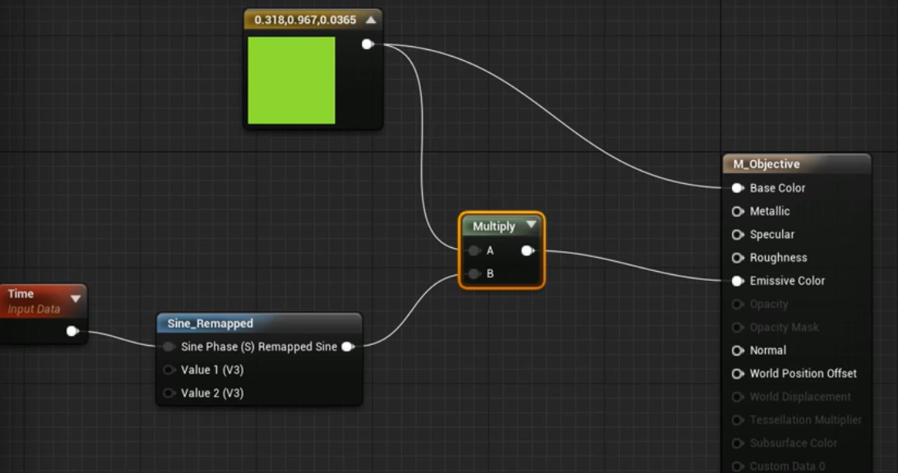

> # Create Multiplayer Games with C++
> * https://www.udemy.com/course/unrealengine-cpp/

## Preparation
### Visual Studio settings
* Visual Assist X shortcut
  快捷键 | 功能
  :----:|:----:
  Alt + O | 在 .h 和 .cpp 之间切换
  Shift + Alt + O | 在解决方案中查找文件
  Shift + Alt + S | 查找任意符号
  Alt + G | 在定义和实现之间切换
* 基本设置 https://docs.unrealengine.com/zh-CN/Programming/Development/VisualStudioSetup/index.html
* VS 2017 建议不关闭 options - text editor - c/c++ - advanced - intellisense - disable squiggles
### UE4 Editor setting
* blueprint - compile - save on compile - On Success Only

## 常见问题
* **`已绑定事件但无法触发`**
  * 可能原因：未绑定成功
  * 建议：将 `AddDynamic` 放到 `BeginPlay()` 时调用
* **`热重载问题`**
  * 如：在构造函数中改变量值后无法正确加载属性（更改不生效）、编辑器运行时在 VS 中加了新函数等
  * 建议：关掉 UE4 编辑器，直接在 VS 中编译


## 预热：爆炸特效
* `使用粒子系统`：**`UGameplayStatics::SpawnEmitterAtLocation()`**

## 一、拾取物体
### 1. 创建类
* New C++ Class - Actor - FBSObjectiveActor
* 基于 FBSObjectiveActor 创建 BP_Objective
### 2. 绑定组件（in C++）
* 选取一个拾取物体的地点，并放置 BP_Objective 
* **`为 Actor 绑定组件`**
    ```cpp
    // FBSObjectiveActor.h
    class USphereComponent;
    UCLASS()
    class xxx_API AFPSObjectiveActor : public AActor    
    {
        // 静态网格体组件，蓝图可见
        UPROPERTY(VisibleAnywhere, Category = "Components")
        UStaticMeshComponent *MeshComp;
        // 球体组件，蓝图可见
        UPROPERTY(VisibleAnywhere, Category = "Components")
        USphereComponent *SphereComp;
    }
    ```

    ```cpp
    // FBSObjectiveActor.cpp
    #include "Components\\SphereComponent.h"
    AFPSObjectiveActor::AFPSObjectiveActor()
    {
        // 根据指定类创建默认子对象
        MeshComp = CreateDefaultSubobject<UStaticMeshComponent>（TEXT("MeshComp")）;
        RootComponent = MeshComp;   // 将静态网格体组件设为根组件

        SphereComp = CreateDefaultSubobject<USphereComponent>(TEXT("SphereComp"));
        // 将球体组件附加到网格体组件上
        SphereComp->SetupAttachment(MeshComp);
    }
    ```
  * 小技巧：发现没高亮的时候，Shift + Alt + O 查类名位置，关注 Private/Classes 之后的部分 include
  * 头文件直接加在 .cpp 中， .h 中使用向前声明告知那是一个类。（据说不要在头文件里加太多东西，会影响编译时间？）
  * 球体组件附加到网格体组件：网格体的移动会带动球体
* 编译后为 SphereComp 添加网格体 EditorSphere
  * 调整大小 Scale
* 静态网格体组件设为无碰撞（蓝图中）
  * collision - `collision presets`
  * `BlockAllDynamic` 改为 `NoCollision`
### 3. 设置碰撞和重叠事件
#### 设置碰撞属性
```cpp
#include "Components/StaticMeshComponent.h"
// 禁用静态网格体组件的碰撞属性
MeshComp->SetCollisionEnabled(ECollisionEnabled::NoCollision);

// 不需要球体组件的物理效果，只使用查询 Line Traces 、 Overlap Events 等
SphereComp->SetCollisionEnabled(ECollisionEnabled::QueryOnly);
// 设置通道：相应所有通道
SphereComp->SetCollisionResponseToAllChannels(ECR_Ignore);
// 为 Pawn 人形体通道启用碰撞
SphereComp->SetCollisionResponseToChannel(ECC_Pawn, ECR_Overlap);
```
* `ECR_Overlap` 使发射物击中目标物体时不受阻，直接穿过对象
#### 重叠事件：重叠时生成粒子效果（捡起物体特效）
* **`生成粒子效果`**
    ```cpp
    // .h
    protected:
        void PlayEffects();

    // .cpp
    #include "Kismet/GameplayStatics.h"
    void AFPSObjectiveActor::PlayEffects()
    {
        UGameplayStatics::SpawnEmitterAtLocation(this, PickupFX, GetActorLocation());
    }
    ```
    * **`SpawnEmitterAttached`** 附加到物体
    * **`SpawnEmitterAtLocation`** 附加到特定位置，对静止物体而言就使用其位置即可
        * `UObject *WorldContextObject`：this，用于获取世界场景上下文，明确在哪个世界场景中注册相应粒子效果
        * `UParticleSystem *EmitterTemplate`：PickupFX
        * `FVector Location`：`GetActorLocation()`
* **`创建粒子系统`**
    ```cpp
    // .h
    protected:
        UPROPERTY(EditDefaultsOnly, Category = "Effects")
        UParticleSystem *PickupFX;
    ```
    * 暴露到蓝图中进行赋值
    * `EditDefaultsOnly`：property can be changed only for Blueprints, in Blueprint->Defaults
* **`物体重叠时调用`**
  * 注册到球体组件的重叠事件：`SphereComp->OnComponentBeginOverlap()`
  * 使用 Actor `NotifyActorBeginOverlap` （想找接口时可以到相关类型的父类文件里查查看）
        ```cpp
        // .h
        public:
            virtual void NotifyActorBeginOverlap(AActor *OtherActor) override;

        // .cpp
        void AFPSObjectiveActor::NotifyActorBeginOverlap(AActor *OtherActor)
        {
            Super::NotifyActorBeginOverlap(OtherActor);

            PlayEffects();
        }
        ```
### 4. 拾取物体
* 逻辑
  * FPSObjectiveActor 的 NotifyActorBeginOverlap 发生
  * 检查是否与 FPSCharacter 中角色类型发生重叠（已在碰撞设置中将过滤条件设为仅对 Pawn 有效，此处再用 cast 来 check 是否是对应需要的类型）
    ```cpp
    // FPSCharacter.h
    public:
        UPROPERTY(BlueprintReadOnly, Category = "Gameplay")
        bool bIsCarryObjective;
    
    // FPSObjectiveActor.cpp
    #include "FPSCharatcer.h" 
    void AFPSObjectiveActor::NotifyActorBeginOverlap(AActor *OtherActor)
    {
        AFPSCharacter * MyCharacter = Cast<AFPSCharacter>(OtherActor);
        if (MyCharacter)
        {
            MyCharacter->bIsCarryObjective = true;

            Destroy();
        }
    }
    ```
### 5. 向用户显示信息
#### 创建 UMG
* 创建文本 UI - UMG
  * 在 Content/UI 下创建 User Interface - Widget Blueprint - WBP_ObjectiveInfo
  * 添加 Text 控件
  * text - details - size to content 使大小适应文本内容
  * font - size 调整文本内容大小
* 应用 UMG
  * 在 Content/Blueprints 下创建 HUD - FPSHUD - BP_HUD
  * 在 Event Graph 中 `Create Widget`，target = WBP_ObjectiveInfo
  * 将 Create Widget Return Value `Add to Viewport`
* 应用 HUD
  * 在 Content/Blueprints 下创建 FPSGameMode - BP_GameMode
  * Classes - HUD Class 设为 BP_HUD
* 应用 GameMode
  * 主界面 World Settings - GameMode - GameMove Override 设为 BP_GameMode
* **`发生事件时修改文本信息`**
  * bind get text 0 - GetObjectiveText
  * 创建变量 Text - GetObjective、ExtractArea 并设置对应文本
  * get text 蓝图界面中 select，index = Boolean
  * 通过结点 **`Get Owning Player Pawn`** 找到玩家控制的 Pawn ，Return Value 用 `isValid` 或 `Cast To FPSCharatcer` 检查是否有效，此用 Cast （转换成功即有效）
  * 根据相应情况显示文本
### 6. Challenge：黑洞
* 一个会吸入周围 Actor 的黑洞
  * Sphere Component，Create and Destroy
  * Physics：`AddForce()`、`AddRadialForce()`
  * Find Nearby Actors：`SphereComp->GetOverlappingComponents` in `Tick()`
  * check all actors `Generate Overlap Events`
* p15 02:42

## 二、游戏规则
* 总览
  * 玩家将目标物体带至通关区域范围即完成任务。
  * 向玩家显示相应通知。
  * 暂停接收玩家输入。
  * 镜头离开玩家，切至下一关。
### 1. 通关口 Extraction Zone
* 创建 C++ 类 - Actor - FPSExtractionZone
* 添加盒体组件、重叠组件（检测重叠事件）
    ```cpp
    // FPSExtractionZone.h
    class UBoxComponent;
    UPROPERTY(VisibleAnywhere, Category = "Components")
    UBoxComponent *OverlapComp;

    // FPSExtractionZone.cpp
    #include "Components/BoxComponent.h"
    AFPSExtractionZone::AFPSExtractionZone()
    {
        OverlapComp = CreateDefaultSubobject<UBoxComponent>(TEXT("OverlapComp"));
        OverlapComp->SetCollisionEnabled(ECollisionEnabled::QueryOnly);
        OverlapComp->SetCollisionResponseToAllChannels(ECR_Ignore);
        OverlapComp->SetCollisionResponseToChannel(ECC_Pawn, ECR_Overlap);
        // 设置盒体区域的响应范围
        OverlapComp->SetBoxExtent(FVector(200.0f));
        // 设为根组件
        RootComponent = OverlapComp;
        // 显示重叠组件
        OverlapComp->SetHiddenInGame(false);
        // 创建与玩家发生重叠时的事件
        OverlapComp->OnComponentBeginOverlap.AddDynamic(this, &AFPSExtractionZone::HandleOverlap);
    }
    ```
* 定义绑定到重叠事件的代理函数
    * OnComponentBeginOverlap Alt + G 转到定义
    * 对其类型 Alt + G 转到定义
    * 找到 `DECLARE_DYNAMIC_MULTICAST_DELEGATE_*()` ：声明了代理，把首项去掉，后面的参数列表作为要定义的代理函数的参数，去掉类型和名称间的分隔逗号
    * 要标记为 UFUNCTION() ，通知虚幻后端该函数的含义及如何与事件绑定
    ```cpp
    // FPSExtractionZone.h
    UFUNCTION()
    void HandleOverlap(UPrimitiveComponent *OverlappedComponent, AActor *OtherActor, UPrimitiveComponent *OtherComp, int32 OtherBodyIndex, bool bFromSweep, const FHitResult &SweepResult);

    // .cpp
    void AFPSExtractionZone::HandleOverlap(UPrimitiveComponent *OverlappedComponent, AActor *OtherActor, UPrimitiveComponent *OtherComp, int32 OtherBodyIndex, bool bFromSweep, const FHitResult &SweepResult)
    {
        // 判断玩家是否携带目标物体
        UE_LOG(LogTemp, Log, TEXT("Overlapped with extraction zone!"));
    }
    ```
* 使用重叠组件
  * 主界面左侧 Modes 中 search classes - FPSExtractionZone 拖入场景
  * `显示重叠组件`：`SetHiddenInGame`
### 2. 完善通关口
* 向项目的 Content 添加内容
  * 右键 Content - Show in Explorer
  * Ctrl + 把 Materials 拖入
* **`贴花组件`**
    ```cpp
    // FPSExtractionZone.h
    protected:
        UPROPERTY(VisibleAnywhre, Category = "Components")
        UDecalComponent *DecalComp;
    
    // .cpp
    #include "Components/DecalComponent.h"
    AFPSExtractionZone::AFPSExtractionZone()
    {
        // 创建对象
        DecalComp = CreateDefaultSubobject<UDecalComponent>(TEXT("DecalComp"));
        // 尺寸与通关口范围一致。API 可 Alt + G 到相关头文件里查。
        DecalComp->DecalSize = FVector(200.0f, 200.0f, 200.0f);
        // 
        DecalComp->SetupAttachment(RootComponent);
    }
    ```
    * 主界面中找到 DecalComp 为其设定材质 SpawnBox_M_Inst
    * 原材质颜色太亮，在强光照下不明显，把花纹调暗。将 SpawnBox_M 材质的 Opacity（不透明度）Clamp 的 Min Default 设高到 0.15 。
    * 基于 ExtractionZone 创建 BP_ExtractionZone ，便于更改 C++ 中设置的默认值 
    * DecalComp 相对 ExtractionZone 有偏移，重置 Location
    * 角度旋转 90 度
### 3. 游戏模式：通关规则
```cpp
// FPSExtractionZone.cpp
#include "FPSCharacter.h"
#include "FPSGameMode.h"
void AFPSExtractionZone::HandleOverlap(...)
{
    // 类型转换，并判断玩家是否携带目标物
    AFPSCharacter *MyPawn = Cast<AFPSCharacter>(OtherActor);
    if (MyPawn && MyPawn->bIsCarryObjective)
    {
        // 通知【游戏模式】目前的游戏状态
        AFPSGameMode *GM = Cast<FPSGameMode>(GetWorld()->GetAuthGameMode());
        if (GM)
        {
            GM->CompleteMission(MyPawn);
        }
    }
}
```
* `GetWorld()` 返回当前游戏世界
* `GetAuthGameMode()` 返回当前世界游戏模式的引用，仅在服务器上有效
```cpp
// FPSGameMode.h
public:
    void CompleteMission(APawn *InstigatorPawn);

    UFUNCTION(BlueprintImplementableEvent, Category = "GameMode")
    void OnMissionCompleted(APawn *InstigatorPawn);
```
* `UFUNCTION(BlueprintImplementableEvent)` 通过蓝图实现
```cpp
// FPSGameMode.cpp
void AFPSGameMode::CompleteMission(APawn *InstigatorPawn)
{
    if (InstigatorPawn)     // check
    {
        InstigatorPawn->DisableInput(nullptr);  // 禁用输入
    }
    OnMissionCompleted(InstigatorPawn);
}
```
* Pawn 与 PlayerController 
  * Pawn 生成后由 PlayerController 控制，输入经由 PlayerController 转换后发送给 Pawn
  * `DisableInput(nullptr)` 禁用对角色 Pawn 输入，但不阻止对 PlayerController 的输入（如调出游戏菜单等）
### 4. 添加通关反馈
* **`文字提示`**：创建提示任务完成的 UI Widget
  * 创建新的 Widget - WBP_GameOver
  * 放入 Text ，Anchor 调整至屏幕中心，重置 Text Position ，并放在屏幕中心上部。
* 在 BP_GameMode 蓝图中完成上述暴露给蓝图实现的函数 `OnMissionCompleted` ，向玩家显示任务完成提示
  * Create Widget(WBP_GameMode, default) -> Add to Viewport
  * Owning Player 保留默认值
* **`音效提示`**：未携带目标物进入通关口时的未完成提示
    ```cpp
    // FPSExtractionZone.h
    protected:
        UPROPERTY(EditDefaultsOnly, Category = "Sounds")
        USoundBase *ObjectiveMissingSound;
    ```
    * `EditDefaultsOnly` 游戏启动后无法编辑，只能在为其创建蓝图版本时进行编辑
    * 在 `BP_ExtractionZone` 中设置音效：details - sounds - objective missing sound
* 在 `HandleOverlap` 中调用
    ```cpp
    // FPSExtractionZone.cpp
    #include "Kismet/GameplayStatics.h"
    void AFPSExtractionZone::HandleOverlap(...)
    {
        AFPSCharacter *MyPawn = Cast<AFPSCharacter>(OtherActor);
        if (MyPawn == nullptr)
        {
            return;
        }

        if (MyPawn->bIsCarryObjective)
        {
            AFPSGameMode *GM = Cast<AFPSGameMode>(GetWorld()->GetAuthGameMode());
            if (GM)
            {
                GM->CompleteMission(MyPawn);
            }
        }
        else
        {
            UGameplayStatics::PlaySound2D(this, ObjectiveMissingSound);
        }
    }
    ```
    * `UGameplayStatics` 中均为静态函数
    * `PlaySound2D` 播放声效，将信号传输至音频引擎
### 5. 视角切换
* 蓝图实现：`BP_GameMode` 中
  * 用 **`Sequence`** 接出另一条执行线
  * `获取控制器`：从 `Event On Mission Completed` 结点的 `Instigator Pawn` 拉出结点 **`Get Controller`** 并 **`Cast to PlayerController`** 
  * `更改视角`：`Cast As Player Controller` -> `Set View Target with Blend` 
  * `创建新视角`
    * 新建蓝图 Actor - BP_SpectatingViewpoint
    * 添加组件 StaticMesh ，设定 Static Mesh - MatineeCam_SM 
    * **`在游戏中隐藏`**：StaticMesh - details - Rendering - Hidden in Game
    * 将 BP_SpectatingViewpoint 拖入场景，右键 `Pilot` 调整视角
  * `应用新视角`
    * 回到 `Set View Target` 
    * `获取新视角`：**`Get All Actors of Class`** ，`Actor Class` 设为 BP_SpectatingViewpoint ，返回值 Out Actors -> `Get (a copy)` 
  * `视角切换优化`：仍然是 `Set View Target with Blend`
    * `Blend Time`：0.5
    * `Blend Func`：Cubic
* **`C++ 实现`**
    ```cpp
    // FPSGameMode.h
    protected:
        UPROPERTY(EditDefaultsOnly, Category = "Spectating")
        TSubclassOf<AActor> SpectatingViewpointClass;

    // FPSGameMode.cpp
    #include "Kismet/GameplayStatics.h"
    void AFPSGameMode::CompleteMission(APawn *InstigatorPawn)
    {
        if (InstigatorPawn)
        {
            ...
            if (SpectatingViewpointClass)   // check 新视角存在
            {
                // 获取新视角
                TArray<AActor *> ReturnedActors;
                UGameplayStatics::GetAllActorsOfClass(this, SpectatingViewpointClass, ReturnedActors);

                if (ReturnedActors.Num() > 0)
                {
                    AActor *NewViewTarget = ReturnedActors[0];

                    // 获取控制器
                    APlayerController *PC = Cast<PlayerController>(InstigatorPawn->GetController());
                    if (PC)
                    {
                        // 应用新视角，并设切换过渡时间
                        PC->SetViewTargetWithBlend(NewViewTarget, 0.5f, EViewTargetBlendFunction::VTBlend_Cubic);
                    }
                }
            }
            else
            {
                UE_LOG(LogTemp, Warning, TEXT("SpectatingViewpointClass is nullptr. Please update GameMode class with valid subclass. Cannot change spectating view target."));
            }
        }
        
    }
    ```
    * 编译后到蓝图中给 SpectatingViewpointClass 赋值为 BP_SpectatingViewpoint
    * 接口名与蓝图中类似，主要根据接口所需传入的参数逆推需要的变量
### 6. Challenge：发射平台
* 把人弹飞
  * 在 `LaunchCharacter()` 单个函数中完成，内置在 Character Class 中
  * 添加粒子效果
  * 可以把物体（如蓝色方块）也弹飞：Generate Overlap Events on blue cubes
* 关键点
  * 碰撞组件：球体/盒体碰撞组件，判定人物或物体是否与其重叠
  * 
* p22 02:23

## 三、AI 基础
* AI 行为
  * 守卫目标物
  * 能看到玩家，听到周围动静
  * 对守卫有干扰机制（可声东击西）
### 1. AI 守卫
* New C++ Class - Character - FPSAIGuard
  * Character 比 Pawn 多的内容：Static Mesh 组件、角色的移动
  * 不涉及玩家，可将 SetupPlayerInputComponent 部分删掉
  * 增加 Content 资源
* 基于 FPSAIGuard 创建 BP_Guard
  * `使用模型`：Mesh - details - Mesh - skeletal Mesh 使用导入的 DwarfGrunt_R_new
  * 调整位置 -80，调整胶囊碰撞体高度 Shape - Capsule Half H... = 60
  * 面向 X 轴方向（红轴方向）：Rotation_Z = -90
  * `设置动画效果`：details - animation - animation mode - use animation assets，anim to play 中选择动画效果 Idle
* **`人形体感应组件 PawnSensingComponent`**
    ```cpp
    // FPSAIGuard.h
    class UPawnSensingComponents;

    protected:
        UPROPERTY(VisibleAnywhere, Category = "Components")
        UPawnSensingComponent *PawnSensingComp;
    
    // FPSAIGuard.cpp
    #include "Perception/PawnSensingComponent.h"
    AFPSAIGuard::AFPSAIGuard()
    {
        PawnSensingComp = CreateDefaultSubobject<UPawnSensingComponent>(TEXT("PawnSensingComp"));
    }
    ```
    * **`添加 AI 模块`**：由于 AI 模块不在 Engine 或 Core 模块中，所以要在 `FPSGame.Build.cs` 的 `PublicDenpendencyModule` 添加模块依赖 `AIModule`
* 拽个 BP_Guard 进场景看效果 w（有丶可爱哈
### 2. 视觉感应
#### **`PawnSensingComponent`**
* 贼多放射线！（Debug Lines）
* 类似 `CharacterMovement` ，是 `Actor` 组件而非场景组件，没有确定的位置，无法附加到其它组件
* details - AI
  * Peripheral Vision ...：视野范围 FOV
  * Sight Radius：视野半径
  * Hearing Threshold：有遮挡最大听距
  * LOSHearing Threshold：无遮挡直线听距（$> Hearing Threshold$）
* details - Events
  * `On See Pawn`
  * `On Hear Noise`
* **`绑定视觉事件`**
    ```cpp
    // FPSAIGuard.cpp
    AFPSAIGuard::AFPSAIGuard()
    {
        PawnSensingComp->OnSeePawn.AddDynamic(this, &APFSAIGuard::OnPawnSeen);
    }
    ```
    * 查源码找到所需定义的函数接口形式
      * 注意标记为 `UFUNCTION()` ，否则会 `unable to bind delegate (function might not be marked as a UFUNCTION)`
    * 事件在 AIGuard 发现 Pawn 类型物体时触发
      * 需判定所发现的是其它 AI 还是玩家
      * 如果是玩家则 Game Over
    ```cpp
    // FPSAIGuard.h
    protected:
        UFUNCTION()
        void OnPawnSeen(APawn *SeenPawn);

    // FPSAIGuard.cpp
    #include "DrawDebugHelpers.h"   // 先随便画点东西当做反应
    void AFPSAIGuard::OnPawnSeen(APawn *SeenPawn)
    {
        if (SeenPawn == nullptr)
        {
            return;
        }
        DrawDebugSphere(GetWorld(), SeenPawn->GetActorLocation(), 32.0f, 12, FColor::Red, false, 10.0f);
    }
    ```
* UE4 小技巧：运行中 `F1` 切……透视图？透视世界？
### 3. 听觉感应
* 基本设置类似视觉感应
* 触发听觉感应事件所需绑定的函数代理
    ```cpp
    // FPSAIGuard.h
    protected:
        UFUNCTION()
        void OnNoiseHeard(APawn *NoiseInstigator, const FVector &Location, float Volume);
    
    // FPSAIGuard.cpp
    void AFPSAIGuard::OnNoiseHeard(APawn *NoiseInstigator, const FVector &Location, float Volume)
    {
        Instigator
        DrawDebugSphere(GetWorld(), Location, 32.0f, 12, FColor::Green, false, 10.0f);
    }
    ```
    * 由于 Actor 中本身定义有 Instigator ，会重名，因此找到的接口示例中 Instigator 需重命名一下。（编译时报错：`Function parameter: 'Instigator' cannot be defined in 'OnNoiseHeard' as it is already used`）（看起来 UE4 的类里面仿佛制止了变量名覆盖这种特性【？】）
* **`为玩家人物添加声音发射器组件 NoiseEmitterComponent`**
    ```cpp
    // FPSCharacter.h
    class UPawnNoiseEmitterComponent;

    protected:
        UPROPERTY(VisibleAnywhere, BlueprintReadOnly, Category = "AI")
        UPawnNoiseEmitterComponent *NoiseEmitterComponent;

    // FPSCharacter.cpp
    #include "Components/PawnNoiseEmitterComponent.h"
    AFPSCharacter::AFPSCharacter()
    {
        NoiseEmitterComponent = CreateDefaultSubobject<UPawnNoiseEmitterComponent>(TEXT("NoiseEmitter"));
    }
    ```
    * 命名方式与原 Character 类中的变量保持一致。
    * 在 `PawnNoiseEmitterComponent.h` 中可以发现 `MakeNoise()` 接口
* **`制造声音`**
  * BP_Player event graph - 先用 Tick event 测试 - 结点 **`Pawn Make Noise`** ，参数输入注意 information：if zero vector, use the actor's location 因此 Noise Location 可为空。
  * 【？】问题：触发视觉感应时，听觉感应组件失效。（貌似是 Pawn 的特性？）
### 4. 给发射物附加触发 AI Guard 听觉感应的声效
```cpp
// FPSProjectile.cpp
void AFPSProjectile::OnHit(UPrimitiveComponent *HitComp, AActor *OtherActor, UPrimitiveComponent *OtherComp, FVector NormalImpulse, const FHitResult &Hit)
{
    // 发射物击中物体时发出音效
    MakeNoise(1.0f, Instigator);
    Destroy();  // 挪下来的
}
```
* MakeNoise 会 check 传入的 Instigator 是否具有 PawnNoiseEmitterComponent 而可发出声音
```cpp
// FPSCharacter.cpp
void AFPSCharacter::Fire()
{
    if (ProjectileClass)
    {
        FActorSpawnParameters ActorSpawnParams;
        ActorSpawnParams.SpawnCollisionHandlingOverride = ESPawnActorCollisionHandlingMethod::AdjustIfPossibleButDontSpawnIfColliding;
        ActorSpawnParams.Instigator = this; // 将 Actor 自带的 Instigator 设为本 Character 自身
    }
}
```
* `ActorSpawnParams.Instigator = this;` 使 Projectile 调用时传入的 Instigator 为当前 Character
* 调整感官感应组件的感应间隔
  * BP_Guard - PawnSensingComponent - details - AI - `Sensing Interval`
### 5. 干扰 AI
* 逻辑：当有声音时让 AI 转向发声处
* 实现：
  * 蓝图库 KismetMathLibrary 中有 `LookAtRotation`
  * 【？】不直接调用蓝图函数，用它返回的 `MakeRotFromX()` （可能是因为效率问题？），再找一层，发现 `FRotationMatrix::MakeFromX(FVector X).Rotator();`
    ```cpp
    // FPSAIGuard.cpp
    void AFPSAIGuard::OnNoiseHeard(...)
    {
        // 把位置转换为方向
        FVector Direction = Location - GetActorLocation();
        Direction.Normalize();
        // 获取转向 rotator
        FRotator NewLookAt = FRotationMatrix::MakeFromX(Direction).Rotator();
        // 设置新的 rotation
        SetActorRotation(NewLookAt);
    }
    ```
    * 优化：令 Guard 只做左右转动（只更改 `Yaw` 值，`Pitch` 上下，`Roll` 倾斜），设 NewLookAt.Pitch/Roll = 0.0f
* 调试：
  * UE4 小技巧：运行时 `~` 调出控制台，`show collision` 显示碰撞体
* `受干扰一定时间后回到初始状态`
  * 记录初始状态
    ```cpp
    // FPSAIGuard.h
    protected:
        FRotator OriginalRotation;

    // FPSAIGuard.cpp
    void AFPSAIGuard::BeginPlay()
    {
        OriginalRotation = GetActorRotation();
    }
    ```
  * **`设置计时器`**
    ```cpp
    // FPSAIGuard.cpp
    void AFPSAIGuard::OnNoiseHeard(...)
    {
        SetActorRotation(NewLookAt);

        FTimerHandle TimerHandle_ResetOrientation;
        GetWorldTimerManager().SetTimer(TimerHandle_ResetOrientation, this, &AFPSAIGuard::ResetOrientation, 3.0f);
    }

    // .h 定义重置函数，用于绑定到计时器，用于执行
    UFUNCTION()
    void ResetOrientation();

    // .cpp 实现重置函数
    void AFPSAIGuard::ResetOrientation()
    {
        SetActorRotation(OriginalRotation);
    }
    ```
    * 计时器参数看接口
    * 此时多次干扰，之前干扰产生的时间句柄先执行重置，会让之后的干扰时效缩短。所以要`复用计时器`
    ```cpp
    // 句柄声明放到 .h protected
    // 清除原先的计时器
    GetWorldTimerManager().ClearTimer(TimerHandle_ResetOrientation);
    GetWorldTimerManager().SetTimer(...);
    ```
### 6. 游戏模式：死亡规则
* 规则：被守卫发现就 Game Over
  * 显示 Game Over
  * 切换摄像机视角
  * 取消 Pawn 控制权
* 修改 Game Mode
  * 为 `FPSGameMode::CompleteMission()` 增加参数 `bool bMissionSuccess`
  * 通知 Game Mode 任务完成处的调用传入 `true`
  * 守卫发现即 `AFPSAIGuard::OnPawnSeen()` 处类似调用，并传入 `false`
* 修改 UI 显示的文字
  * WBP_GameOver 添加变量 bMissionSuccess ，并勾选 details - `Instance Editable` 和 `Expose on Spawn`（在 BP_GameMode 中的 Create Widget 刷新后会显示该变量）
  * 然后把 BP_GameMode - Event Graph - Event On Mission Completed - Mission Success 接到 Widget 的 Mission Success
  * 在 WBP_GameOver 给 Text 绑定函数：进入函数蓝图， `Get Mission Success` - `Select` 根据不同值指定文本，返回值连到 `Return Node`
### 7. 在守卫头顶添加 3D UI 反应
* Feedback：守卫被干扰，看向发声源发现没人的时候显示“？”；守卫发现玩家时显示“！”。
* 创建 Content/UI - WBP_GuardState
  * 添加 Text 控件
  * anchor 放到中心，重置 position，Alignment (0.5, 0.5)，Size to Content，Font Size 65，黄色，Shadow Color A 0.2。
  * Text 设为 “？”
* 在 BP_Guard 中
  * 添加组件 `Widget` 新建窗口控件组件
  * Widget - details - User Interface - `Widget Class` 设为 `WBP_GuardState`
  * 到 Viewport 中把问号往上提，调整位置
  * Widget - details - User Interface - `Space` 从 World 设为 Screen：令其从每个方向都能看到
* 根据状态调整 UI
  * 定义枚举类
    ```cpp
    // FPSAIGuard.h
    UENUM(BlueprintType)
    enum class EAIState : uint8
    {
        Idle,           // 默认状态
        Suspicious,     // 被干扰时，显示“？”
        Alerted         // 警惕状态，显示“！”
    }

    class ...
    {
    protected:
        EAIState GuardState;
        
        void SetGuardState(EAIState NewState);

        UFUNCTION(BlueprintImplementableEvent, Category = "AI")
        void OnStateChanged(EAIState NewState);
    }

    // FPSAIGuard.cpp
    AFPSAIGuard::AFPSAIGuard()
    {
        GuardState = EAIState::Idle;        // 设定默认值
    }

    void AFPSAIGuard::SetGuardState(EAIState NewState)
    {
        if (GuardState == NewState)
        {
            return;
        }
        GuardState = NewState;              // 更新状态

        OnStateChanged(GuardState);         // 调用 UMG 修改 3D UI 状态
    }
    ```
    * 枚举类型标记为 `UENUM(BlueprintType)` 使其在蓝图可用，`uint8` 为公开给蓝图的定义格式
    * 在 cpp 中更改状态后在蓝图中更改 UMG 文本，因此定义一个在蓝图中实现的函数接口，在此调用，并在蓝图中实现
    * 另外记得去 AI Guard 中 `OnNoiseHeard`、`OnPawnSeen` 两个事件中调用 `SetGuardState()`，注意 Alerted 优先级高于 Suspicious ，可以在 OnNoiseHeard 进入时即判定。最后在 `ResetOrientation()` 中同样判定及重置状态。
* 实现 UI 文本更改
  * 在 BP_Guard - Event Graph 中实现事件 `On State Changed`
  * 拖入 `Widget` 组件 -> `Get User Widget Object` 获得控件 -> Cast To WBP_GuardState
  * 把事件执行线连到 Cast。
  * 转到 WBP_GuardState 进入蓝图界面 Graph ，新建 Functions - UpdateText ，增加 Inputs - `Text NewText;`。回到 Designer 界面选中 Text - details - 勾选 `Is Variable`。再到 Graph 中，Text 显示到 Variables 栏下，拖入蓝图 `SetText`。
  * 再回到 BP_Guard，As WBP_GuardState -> `Update Text`，New State 输入从 On State Changed - New State -> Select 给出。
  * 在 WBP_GuardState - event graph - event construct -> `Get Text` -> `SetText` 使初始显示为空。
### 8. Challenge：AI 巡逻
* 逻辑
  * 两点间游走（可以范围内随机？）：**`寻路网格体 Nav Mesh Bounds Volume`**
    * 寻路系统相关
    * UE4 小技巧：右键物体，Select -> Select all matching classes 选中所有匹配类
    * details - `search navigation`（导航） - collision - `can ever affect` 取消寻路系统对相应物体的影响。（默认情况下物体会让寻路网格有洞，而模拟物理的物体被击中时会移动，运行时寻路网格静止，洞保留）
  * Suspicious 时停止巡逻
* p31 02:53

## 四、实现联网
* 总览
  * 让类在多人游戏设置下的客户端和服务器上运作
  * **Replication**
### 1. 场景调整
* 调整场景，增加难度。
* 为目标物创建简单材质
  * 新建 Content/Materials/M_Objective 闪光材质
  
  
  * `Sine_Remapped` 两 Value 值可改变脉冲频率
* 尝试多人游（爆）戏（炸）
  * Play - Multiplayer Options - Number of Players 设为 2，同时打开两个客户端（实际上打开的是一个服务器和一个客户端）
  * UE4 小技巧：多端运行时 Shift + F1 挪开窗口
  * ↓ 在客户端做操作测试：
  * 问题 1：守卫头顶 UMG UI 只在触发客户端显示
  * 问题 2：客户端可出现拾起粒子特效，但目标物未显示销毁，只在服务器上显示销毁。但客户端的左上提示 UI 正常变化，服务器提示 UI 未改变。
  * 问题 3：任务完成时客户端视角切换，无 UI 提示。服务器未切换视角，有 UI 提示，仍可移动。
  * 问题 4：（p34 开头处）在客户端、服务端分别开枪，另一窗口都没有相应变化， Projectile 不通信。
### 2. 发射物 Projectile 联网
* `打开 Replication`：在要复制到客户端的 Actor 类的构造函数中将相关 Actor 的复制选项打开
	```cpp
	// FPSProjectile.cpp
	AFPSProjectile::AFPSProjectile()
	{
		SetReplicates(true);
		SetReplicateMovement(true);
	}
	```
	* `SetReplicates`：生成发射物 projectile 时在客户端复制同样的效果。
    	* 流程：
    	* ① 服务器窗口调用 `AFPSCharacter::Fire()` 
    	* ② `AFPSCharacter::Fire()` 中 `SpawnActor<AFPSProjectile>` 生成发射物
    	* 此时只对服务器有效，客户端中不显示
    	* ③ 启用 `SetReplicates` 后，服务器向所有客户端发送数据包，请求在客户端上生成该发射物
	* `SetReplicateMovement`：类似地，移动、位置、转动等信息改变时，服务器也向客户端发送数据包，将状态更新到客户端
* `确保代码在服务端上运行`：**`函数在服务端和客户端的同步问题`**
  * ue4 client-server mode ，只能从服务端给客户端发数据包。如果要反向的话需要调用服务端给出的事件触发接口传参实现：https://answers.unrealengine.com/questions/709110/index.html
  * 所以完成 SetReplicate 后，在客户端窗口生成发射物的数据不能被服务端知晓：`FPSCharacter::Fire()` 与玩家控制的 Character 绑定，客户端无法往服务端直接传数据包。
  * **`服务器函数`**
    ```cpp
    // FPSCharacter.h
    protected:
        UFUNCTION(Server, Reliable, WithValidation)
        void ServerFire();

    // FPSCharacter.cpp
    void AFPSCharacter::ServerFire_Validate()
    {
        return true;
    }

    void AFPSCharacter::ServerFire_Implementation()
    {
        // 需要运行在服务器上的部分代码
        if (ProjectileClass) { ... }
    }

    void AFPSCharacter::Fire()
    {
        ServerFire();
    }
    ```
    * `Reliable`：确保连接至服务器（可能遇到丢包等问题，但最终确保连接）
    * `WithValidation`：实现时要另外写一个 `_Validate` 结尾的 bool 函数，在服务器端进行完整性检查时用到。当客户端发起 return false 请求时服务器会强制取消连接，因为可能出现严重问题或在用外挂（
    * 注意实现时要加后缀 `_Implementation` ，调用时与头文件的 ServerFire() 保持一致。
    * 原因：`当创建带有 Server 关键词的 UFUNCTION 时，后台会自动为 _Implementation 和 _Validate 创建头文件`
    * 流程：在客户端 `Fire()` 中调用 `ServerFire()` 时，不在客户端执行，而是发送请求到服务器，让服务器执行 ServerFire_Implementation() 函数。在服务端 `Fire()` 中调用 `ServerFire()` 时（因为本游戏服务端自身也可以是游戏玩家），当然直接执行。
* 其它 Projectile 相关内容
  ```cpp
  // FPSProjectile.cpp
  void AFPSProjectile::OnHit(...)
  {
      // 施加推力等
      if (Role = ROLE_Authority)
      {
          MakeNoise(...);
          Destroy();
      }
  }
  ```
  * MakeNoise 用于影响 AI 逻辑，所以只需在服务器上运行。
  * Destroy 不应在客户端执行，因为客户端不拥有 Actor ，只是模拟生成了服务器的指令（replicate）。最终还是服务端决定何时销毁 Actor 。
### 3. **`角色组件联网`**
* 问题：客户端只能水平
  * 在模板工程代码中使用了 `MuzzleLocation`、`MuzzleRotation`
  * 运行测试可以发现客户端抬枪的时候服务端并没有动。
* 解决办法一：在服务器函数中给出发射物位置和旋转度信息，当然这样不能解决服务端观察客户端角色时没有抬枪的问题。
* 解决办法二：**`uint8 APawn::RemoteViewPitch`** 
    ```cpp
    // FPSCharacter.h
    public:
        virtual void Tick(float DeltaTime) override;
    // FPSCharacter.cpp 
    void AFPSCharacter::Tick(float DeltaTime)
    {
        Super::Tick(DeltaTime);

        // check 是否被控制中
        if ( !IsLocallyControlled() )
        {
            // 设置玩家手臂的相对旋转度
            FRotator NewRot = Mesh1PComponent->RelativeRotation;
            NewRot.Pitch = RemoteViewPitch;
            Mesh1PComponent->SetRelativeRotation(NewRot);
        }
    }
    ```
  * 用到 FPSCharacter 的每台机器上的实例都按帧更新其位置。更新函数在服务器和客户端上都会运行，即运行两次。
  * `RemoteViewPitch` 是 replicated 的。
  * 注意：`不要和控制角色时给出的输入冲突`，因此只在不操作角色时执行。
* 组件拼接 Bug：手臂虚影
  * BP_Player 中 Mesh1PComponent 轴心在底部，但又附加到摄像机组件
  * 把上面更改的组件从 Mesh1PComponent 改为 CameraComponent
  * Bug：手臂狂晃
  * **`RemoteViewPitch的存储方式`**： Alt + G 转到定义，其类型为 `uint8` ，不能为负值，在整个文件中搜索 RemoteViewPitch ，发现设置该变量的地方，有注释“Compress pitch to 1 byte”，被压缩到了一个字节。因此该量不能直接设置为 Pitch ，而需要进行解压（做压缩处操作的逆操作）。偷懒笔记：$RemoteViewPitch \times 360.0f / 255.0f$，转为 [0, 360] 内的任一角度。
### 4. 目标物体联网
#### 玩家起点微调
* 移除 BP_Player
  * 主界面选中 BP_Player 查看 details - BP_Player(self) - Pawn - `Auto Possess Player`
  * 默认设置 Player 0 ，即第一个进入游戏的玩家会获得该 Pawn 的支配权。也即第一个进入游戏的玩家的 `Player Controller 会分配到这个 Pawn`。
  * 对于多人游戏，使用 `Player Start` 。
* **`Player Start`**
  * 游戏开始时，Game Mode 尝试在关卡中寻找这类 Actor ，（盲猜）取一个交给玩家控制器。
  * 流程：在 World Settings 中设定了 BP_GameMode ，并在 Default Pawn 应用了 BP_Player ，因此 GameMode 会在 Player Start 处生成 BP_Player （盲猜）并将控制权交给 Player Controller。
* 把 Number of Players 改回 1 看效果
#### 更改目标物设置
* 打开 replicates：构造函数中 `SetReplicates(true);`
* UE4 小技巧：运行窗口大小调整 play - advanced settings - editor preference - play in new window - `new window size`
### 5. AI 守卫联网
* AI 守卫头顶 UI 在客户端中不显示变化的原因
  * `AFPSAIGuard::SetGuardState()` 中的 `OnStateChanged()` 是 AI 相关函数，AI 只在服务器上进行逻辑运算，所以这类函数只能在服务器调用
  * 【？】可是这明明是自定义的，还是说是因为它在 AI 模块里？
#### **`实现变量的同步`**
* `Replicated一个变量`
    ```cpp
    // FPSAIGuard.h
    protected:
        UPROPERTY(ReplicatedUsing = OnRep_GuardState)
        EAIState GuardState;

        UFUNCTION()
        void OnRep_GuardState;

    // FPSAIGuard.cpp
    void AFPSAIGuard::OnRep_GuardState()
    {
        OnStateChanged(GuardState);
    }

    void AFPSAIGuard::SetGuardState(EAIState NewState)
    {
        // ...
        GuardState = NewState;      // 更新状态
        OnRep_GuardState();
        // OnStateChanged(GuardState); // 服务器运行
    }
    ```
    * 当 GuardState 更新后，客户端上会调用 `OnRep_GuardState()` ，因此在该函数内调用 `OnStateChanged()` 修改 UI 显示。
    * 流程：（盲猜）由于对 `GuardState` 设置了 `ReplicatedUsing` ，因此其变化会由服务器通知客户端。接着客户端调用 `OnRep_GuardState()` 并在其内调用 `OnStateChanged()` 修改蓝图中的 UI 显示。
* `设置 ReplicatedUsing 同步规则`
  * 同步规则：如所有客户端都同步，单客户端进行同步等。
  * **`GetLifetimeReplicatedProps`**：Ctrl + Shift + F 查询源码
    ```cpp
    // FPSAIGuard.cpp
    #include "Net/UnrealNetwork.h"
    void AFPSAIGuard::GetLifetimeReplicatedProps(TArray<FLifetimeProperty> &OutLifetimeProps) const
    {
        Super::GetLifetimeReplicatedProps(OutLifetimeProps);
        DOREPLIFETIME(AFPSAIGuard, GuardState);     // 复制
    }
    ```
    * 应用默认规则复制变量，即复制到所有联网客户端。
    * 该设置配合 ReplicatedUsing 实现将 AI 守卫状态同步到所有客户端。
* 【？】流程：更新状态后，服务器调用 `OnRep_GuardState()` ，因此之后的 OnStateChanged() 调用可以删掉了。
  * 【？】上面盲猜失败了咩？？？到底是谁调 `OnRep_GuardState()`？？？
### 6. 游戏状态联网 1
* 问题：通关逻辑中，失败提示音、任务完成提示 UI 等生成错乱。
* 解决任务完成也出现的失败提示音
  * 原因：是否携带目标物标记 `IsCarryingObjective` 未同步（变量同步问题，类似 GuardState ）
  * 之前只对服务器设置了 `IsCarryingObjective` 的状态更新，因此在客户端上该值永远不会为真。所以在 UPROPERTY 中打开该变量的 replicated，并通过 `` 函数实现同步。
    ```cpp
    // FPSCharacter.h
    public:
        UPROPERTY(Replicated, ...)
        bool bIsCarryingObjective;

    // FPSCharacter.cpp
    #include "Net/UnrealNetwork.h"
    void AFPSCharacter::GetLifetimeReplicatedProps(TArray< FLifetimeProperty > &OutLifetimeProps) const
    {
        Super::GetLifetimeReplicatedProps(OutLifetimeProps);
        DOREPLIFETIME(AFPSCharacter, bIsCarryingObjective);
        // 也可以使用 _CONDITION 添加同步规则
        // DOREPLIFETIME_CONDITION(AFPSCharacter, bIsCarryingObjective, COND_OwnerOnly);
    }
    ```
    * `COND_OwnerOnly`：将数据传输至任一控制角色的机器上，有效节省带宽。
  * UE4 小技巧：play - `Run Dedicated Server` 在专用服务器上运行，则本地运行的就是客户端
* 解决任务完成提示 UI 不显示问题
  * 原因：BP_GameMode 中的 `OnMissionCompleted` 事件用于创建相应控件 UI 并显示，所以关键在于，通关口触发并将信号发送至 Game Mode 后，这一块的实现目前未实现同步
  * 在 `AFPSGameMode::CompleteMission()` 中，只有 PC 、if (PC) 在后台运行，因此在客户端上也正常。其它代码都跑在服务器上。
### 7. 游戏状态联网 2
* 需求
  * 任务完成提示 UI 同步
  * 统一禁用所有玩家对 Pawn 的操作
* 分析
  * 实现于 `AFPSGameMode::CompleteMission()` 中，检查是否提供了 `InstagatorPawn` 并禁用该 Pawn 的输入
  * **`Game Mode 在客户端上没有 instance （实例），因此 Game Mode 类中的相关函数都不会在客户端上运行。`**所以当客户端运行到 HandleOverlap 内创建 GM 的时候就获取不到 GameMode 。
  * 但是当前的需求其实只要确保：在每个客户端上都 `DisableInput(nullptr)`，而不止是针对 `InstigatorPawn` 。并且在每台客户端上运行 `OnMissionCompleted()` 显示 UI 的变化。
* 解决办法：**`组播函数 Multicast Function`**
  * 一般来说想要同步代码，可以像上面的 ServerFire 一样做 Server、Client、MultiCast 这样的标记，让服务器调用再应用到客户端。但 Game Mode 类只存在于服务器上，不能再这样操作。【？】Game Mode 类不能使用 Replicated。【？】为啥不能在服务器这调用了然后结果告诉客户端？就在服务器上不是更好办……吗？
  * 【？】是不是我英语不太好只会看翻译。。。那上面的 MultiCast 标记和下面的 Multicast 函数有啥区别。。。
  * 【？】UFUNCTION(NetMulticast) 不行吗？https://docs.unrealengine.com/zh-CN/Programming/UnrealArchitecture/Reference/Functions/Specifiers/index.html
* **`游戏状态基 Game State Base`**
  * 创建 C++ 类 - Game State Base - FPSGameState
  * 进入不知道为啥 Alt + 2 了一下然后好像就加载出了基本头文件啥的内容=。=||| 前面没加载完？
  * Game State Base ：`用于装入 Game Mode 中所有需要复制的东西`。
* **`创建组播函数`**
    ```cpp
    // FPSGameState.h
    public:
        UFUNCTION(NetMulticast, Reliable)
        void MulticastOnMissionComplete(APawn *InstigatorPawn, bool bMissionSuccess);

    // FPSGameState.cpp
    void AFPSGameState::MulticastOnMissionComplete(APawn *InstigatorPawn, bool bMissionSuccess);
    {
        for (FConstPawnIterator It = GetWorld()->GetPawnIterator(); It; It++)
        {
            APawn *Pawn = It->Get();
        }
        if (Pawn && Pawn->IsLocallyControlled())
        {
            Pawn->DisableInput(nullptr);
        }
    }
    ```
    * 创建组播函数 `MulticastOmMissionComplete()` ，参数列表与原函数保持一致。实现时同样加 `_Implementation` 后缀。
    * 【？】我透竟然用了！NetMulticast！那为啥 Game Mode 里不行。。。客户端没有实例不能 replicated 所以就不行吗=。=？
    * `NetMulticast`：函数经服务器调用时，消息发送到所有客户端，服务器和客户端都会运行。
* 禁用所有受玩家控制的 Pawn
  * `获取所有受控 Pawn`：`world.h PawnIterator`，包括敌方 Pawn
  * `check 是否受本地控制`：`Pawn->IsLocallyControlled()`
  * 在 Game Mode 中调用
    ```cpp
    // FPSGameMode.cpp
    #include "FPSGameState.h"
    AFPSGameMode::AFPSGameMode()
    {
        GameStateClass = AFPSGameState::StaticClass();
    }

    void AFPSGameMode::CompleteMission(APawn *InstigatorPawn, bool bMissionSuccess)
    {
        // 删除原有的 InstigatorPawn->DisableInput(nullptr); ，其只对当前行为的 Pawn 生效
        AFPSGameState *GS = GetGameState<AFPSGameState>();
        if (GS)
        {
            GS->MulticastOnMissionComplete(InstigatorPawn, bMissionSuccess);
        }
    }
    ```
    * `GetGameState<T>()` 模板函数。【？】看来可以有多种状态基？
    * 【？】`GameStateClass = AFPSGameState::StaticClass();` 好像是用于明确游戏状态，但是还是不太清楚在干嘛……就像在 BP_GameMode 里应用 Player Controller 之类的一样做个设置？好像是的。。。那 StaticClass 又是啥玩意。。。UClass::StaticClass()，好像就是返回这个类？
    * 流程：游戏模式通过获取设定的游戏状态调用组播函数，通知客户端跟它一起跑组播函数内的代码。
### 8. 游戏状态联网 3
* 需求：任务完成提示 UI 的同步问题
* 分析：使用Player Controller
  * 玩家控制器将受到的输入发送给所控制的 Pawn ，`在服务器和拥有该控制器的客户端上都存在`。
  * Pawn ：服务器上两个，客户端机器上也有两个，使它们都同步。
  * Player Controller 只需控制本地设备。但对于当前需求，只需要在本地设备上显示 HUD 信息，所以已经足够。
* 实现
  * 创建 C++ 类 - Player Controller - FPSPlayerController
  * 创建组播函数
    ```cpp
    // FPSPlayerController.h
    public:
        UFUNCTION(BlueprintImplementableEvent, Category = "PlayerController")
        void OnMissionCompleted(APawn *InstigatorPawn, bool bMissionSuccess);
    ```
  * 在游戏状态中调用：类似 PawnIterator ，通过 `PlayerControllerIterator` 获取所有玩家控制器，并调用玩家控制器的该组播函数。
    ```cpp
    // FPSGameState.cpp
    #include "FPSPlayerController.h"
    void AFPSGameState::MulticastOnMissionComplete_Implementation(...)
    {
        for (FConstPlayerControllerIterator It = GetWorld()->GetPlayerControllerIterator(); It; It++)
        {
            AFPSPlayerController *PC = Cast<AFPSPlayerController>(It->Get());
            if (PC && PC->IsLocalController())
            {
                PC->OnMissionCompleted(InstigatorPawn, bMissionSuccess);

                // disable input
                APawn *MyPawn = PC->GetPawn();
                if (MyPawn)
                {
                    MyPawn->DisableInput(PC);
                }
            }
        }
    }
    ```
    * 由于组播函数在服务器上也会运行，所以要判断获取的控制器是否本地控制器。
    * 【？】道理我都懂，那么如果在服务器上对其它客户端的控制器也调用了这个函数的话会咋样？为啥我感觉调就调了……能直接用那个控制器让客户端显示的话那不是更好？如果不能的话就是资源浪费一丢丢？会有啥不妙的问题吗？【测一下】
    * `简化`：可以把上面的 PawnIterator 去掉，在这里通过玩家控制器迭代器获取相应控制的 Pawn。
  * 实现组播函数
    * 把 BP_GameMode 中原来 OnMissionCompleted 的蓝图实现剪切到新的基于 FPSPlayerController 创建的 BP_PlayerController 中
    * 事件同样是 OnMissionCompleted ，不过此时是组播函数版本，会在客户端也调用
    * 最后在 BP_GameMode 中应用 BP_PlayerController
* 需求：服务器完成任务后摄像机不切换视角问题
* 分析：是的没错，就是最后一坨没有进入组播函数的那部分代码干了切换视角的事
* 实现
  * 把原来只对 InstigatorPawn 的控制器做的 SetViewTargetWithBlend ，通过 PlayerControllerIterator 对所有玩家控制器进行设置。
  ```cpp
  // FPSGameMode.cpp
  void AFPSGameMode::CompleteMission(...)
  {
      // ...
      AActor *NewViewTarget = ReturnedActors[0];
      for (FConstPlayerControllerIterator It = GetWorld()->GetPlayerControllerIterator(); It; It++)
      {
          APlayerController *PC = It->Get();
          if (PC)
          {
              PC->SetViewTargetWithBlend(NewViewTarget, 0.5f, EViewTargetBlendFunction::VTBlend_Cubic);
          }
      }
  }
  ```
  * 这一部分在服务器上运行，不检查是否本地控制器，否则只有一个控制器可用。
  * `SetViewTargetWithBlend` is `a framework function` that just `does the view target replication` 然后向客户端传输信号，令其更改视角。
  * 【？】因为视角是和控制器绑定的？服务器和客户端上控制器联动？
  * 【？】那么所以为什么显示 UI 的时候不直接在服务器上对所有控制器直接调要用组播+判本地控制器……因为 UI 是要跑在客户端上才有效？
### 9. Activity：和基友一起愉快滴玩耍w
* 项目设置 - edit - project settings
  * Maps & Modes
    * Default GameMode - 启用 FPSGameMode
    * Game Default Map - 默认地图 FirstPersonExampleMap 已启用
* 直接打包
* 运行
  * 进入一个 .exe
  * `~` 启用控制台
  * `> open FirstPersonExampleMap?listen` 建立连接
  * 再打开一个 .exe
  * 进入控制台，`> open 127.0.0.1` 联机
  * 与其他人联机：WinNoEditor 整个打包，获取他人 IP，再用 :7777 做端口（失败则可能是因为路由器的NAT规则比较严格，可在7777端口上做转发）

## 五、Coop Game 1
* 总览
  * 玩家的基本移动 Basic movements
  * 添加角色动画 Character animations
  * 设置第三人称摄像机视角 Third person camera view
### 1. 创建项目
* New project - C++ - Basic Code - No Starter Content
### 2. 创建角色
* New C++ Class - Character - SCharacter
  * S - Shooter
### 3. 角色移动控制 - 键盘移动
* ① 添加输入控制 - 轴映射
  * project settings - input - `Axis Mappings`
  * 添加映射 MoveForward
  * 添加按键 W scale = 1.0、S scale = -1.0
* ② 绑定代理函数到 project settings 中定义的轴映射
    ```cpp
    // SCharacter.cpp
    void ASCharacter::SetupPlayerInputComponent(UInputComponent *PlayerInputComponent)
    {
        PlayerInputComponent->BindAxis("MoveForward", this, &ASCharacter::MoveForward);
    }
    ```
* ③ 定义代理函数
    ```cpp
    // SCharacter.h
    protected:
        void MoveForward(float Value);

    // SCharacter.cpp
    void ASCharacter::MoveForward(float Value)
    {
        AddMovementInput(GetActorForwardVector() * Value);
    }
    ```
    * 【？】这参数啥玩意
* 左右移动有 `GetActorRightVector()`
* 项目管理：创建 Content/Blueprints 文件夹
  * 基于 SCharacter 创建 BP_PlayerPawn 拖入场景
  * details - Auto Possess Player 设为 Player 0。对单玩家模式，直接分配到该 Pawn 可以简化对 Player Start 的设置等操作。
* 【？】为什么人走起来一卡一卡的
### 4. 角色视野控制 - 鼠标转向
* ① 添加输入控制 - 轴映射
  * project settings - input - `Axis Mappings`
  * 添加映射 LookUp、Turn
  * 添加按键 Mouse Y scale = -1.0（坐标系问题，1 时颠倒）、Mouse X scale = 1.0
* ② 绑定代理函数
    ```cpp
    // SCharacter.cpp
    void ASCharacter::SetupPlayerInputComponent(UInputComponent *PlayerInputComponent)
    {
        PlayerInputComponent->BindAxis("LookUp", this, &ASCharacter::AddControllerPitchInput);  // 上下
        PlayerInputComponent->BindAxis("Turn", this, &ASCharacter::AddControllerYawInput);    // 左右
    }
    ```
    * `AddControllerPitch/YawInput(float Value);` 为 Pawn 自带的视角控制输入函数。
* 项目管理：创建 Content/Maps 文件夹
  * 保存地图为 P_TestMap （persistent）
### 5. 第三人称摄像机视角 1 - Camera Component
* 声明摄像机组件
    ```cpp
    // SCharacter.h
    class UCameraComponent;

    protected:
        UPROPERTY(VisibleAnywhere, BlueprintReadOnly, Category = "Components")
        UCameraComponent *CameraComp;
    ```
    * VisibleAnywhere 在所有属性窗口中可见，无法编辑。
    * BlueprintReadOnly 蓝图可读取，无法修改。
    * 因此这样标识的组件只能在构造函数内创建实例，添加为属性。构造完就不能惹！
* 创建摄像机组件
    ```cpp
    // SCharacter.cpp
    #include "Camera/CameraComponent.h"
    ASCharacter::ASCharacter()
    {
        CameraComp = CreateDefaultSubobject<UCameraComponent>(TEXT("CameraComp"));
        CameraComp->bUsePawnControlRotation = true;
    }
    ```
    * bUsePawnControlRotation 使摄像机正常地跟随观看者视角移动
* 编译
  * 摄像机组件位置与蓝图 viewport 中设置不一致是常见问题，需要重新编译。
  * 编译后对 BP_PlayerPawn 和 CameraComp 分别 reset position 。
* UE4 小技巧：Save on Compile - On Success Only （好像是记过了的小技巧2333 不过再记一次问题不大（
  * 节省编译后手动保存的时间
### 6. 第三人称摄像机视角 2 - Spring Arm Component
* UE4 小技巧：运行时 `~` 打开控制台 `show collision` 显示碰撞体
* 问题：上下看的时候有点奇怪
* 定义摄像机摇臂组件
    ```cpp
    // SCharacter.h
    class USpringArmComponent;

    protected:
        UPROPERTY(VisibleAnywhere, BlueprintReadOnly, Category = "Components")
        USpringArmComponent *SpringArmComp;

    // SCharacter.cpp
    #include "GameFramework/SpringArmComponent.h"
    ASCharacter::ASCharacter()
    {
        SpringArmComp = CreateDefaultSubobject<USpringArmComponent>(TEXT("SpringArmComp"));
        SpringArmComp->bUsePawnControlRotation = true;
        SpringArmComp->SetupAttachment(RootComponent);

        CameraComp->SetupAttachment(SpringArmComp);
    }
    ```
    * 把摇臂附加到根组件，即人物 Character 胶囊碰撞体。
    * 去掉对摄像机组件设置的 UsePawnControlRotation ，打开摇臂的 UsePawnControlRotation 。【？】为啥？
    * 最后把摄像机组件附加到摇臂。
* 连接摇臂和摄像机组件
  * 在 BP_PlayerPawn 中调整摇臂位置。
  * UE4 小技巧：在蓝图 viewport 中 Alt + 左键可以任意拖动视图
  * 编译后摄像机附加到摇臂，reset 一下摄像机的 position 自动连接到摇臂末端。
* 摇臂特性 Spring Arm Component - details
  * `调整视点到角色距离` Camera - `Target Arm Length`
  * `碰撞测试` Camera Collision - `Do Collision Test`
  * `相机延迟` Lag 随角色平缓移动
### 7. 添加角色网格
* 素材获取
  * 引擎启动器 - 商城 Marketplace - `animation starter pack`
  * 进入后 add to project
  * 选择项目和版本
* 应用网格
  * Content/AnimStarterPack/UE4_Mannequin/Mesh - 应用 SK_Mannequin mesh
  * UE4 小技巧：内容浏览器右下 view options - Thumbnails - Scale 调整缩略图预览大小
  * 在 BP_PlayerPawn 中为 Mesh 组件 - details Mesh - Skeletal Mesh - 应用该网格体，并调整位置。（Location Z = -88，Rotation Z = -90）
  * 在场景中添加 Sky Light 使色调更柔和
### 8. 添加角色动画 - 输入控制和蹲伏动作函数
* 定义开始和结束函数
    ```cpp
    // SCharacter.h
    protected:
        void BeginCrouch();
        void EndCrouch();

    // SCharacter.cpp
    void ASCharacter::BeginCrouch()
    {
        Crouch();
    }

    void ASCharacter::EndCrouch()
    {
        UnCrouch();
    }
    ```
    * `Crouch()、UnCrouch()` 内置函数
    * 允许使用蹲伏函数：NavAgentProperties 用于 AI ，但引擎底层也会检查是否为玩家角色打开该功能。
        ```cpp
        // SCharacter.cpp
        #include "GameFramework/PawnMovementComponent.h"
        ASCharacter::ASCharacter()
        {
            GetMovementComponent()->GetNavAgentPropertiesRef().bCanCrouch = true;
        }
        ```
        * 【？】Shift + Alt + O 查 MovementComponent 除了 PawnMovementComponent 还有单独的 MovementComponent ，怎么取？（瞎几把试？（x
* 添加输入控制并绑定按键
  * project settings 添加 action mappings - Crouch - C 键
  * 绑定按键
    ```cpp
    void ASCharacter::SetupPlayerInputComponent(UInputComponent *PlayerInputComponent)
    {
        PlayerInputComponent->BindAction("Crouch", IE_Pressed, this, &ASCharacter::BeginCrouch);
        PlayerInputComponent->BindAction("Crouch", IE_Released, this, &ASCharacter::EndCrouch);
    }
    ```
* 此时未添加角色动画，摄像机视角会“下蹲”，碰撞体缩小，但模型不动。
### 9. 添加角色动画 - 网格体模型动画
* AnimStarterPack 包内资源
  * 动画序列 - 内容浏览器中绿色底边，双击进入，是单一动画动作。
  * 混合空间 - 黄色标识文件，BS（Blend Spaces）前缀，双击弹出新窗口。Shift + 拖动十字光标，混合不同的动画动作。`混合空间坐标轴`：横轴方位，[-180, 180]（可用于扫射）。纵轴速度。
  * 动画蓝图 - `_AnimBlueprint` 后缀，将动画序列和混合空间文件整合，形成最终动作姿势
* 动画蓝图 - 编辑器（UE4ASP_HeroTPP_AnimBlueprint）
  * 左侧 Graphs - AnimGraph 中可看到最终动画姿势
  * **`状态机 State Machine`** 单击查看详情
* 动画蓝图 - **`状态机 State Machine`**
  * 根据不同状态调整当前的动画动作
  * 如 Speed、Direction 等（左侧 Variables 中的变量）
* 动画蓝图 - 在 Event Graph 中获取角色输入并更新变量值
  * Event Blueprint Update Animation 主事件结点，每帧更新，是数据更新的来源。
  * 文件中用蓝图实现了一个 Jump ，但内置函数中已有，不需要。
  * 只保留对速度和方向的设置部分。
* 动画蓝图 - 将动画蓝图应用到角色
  * BP_PlayerPawn - 选中 Mesh 组件 - details - Animation - Anim Class - UE4ASP_HeroTPP_AnimBlueprint
* 动画蓝图 - 添加蹲伏动作
  * UE4ASP_HeroTPP_AnimBlueprint 中
  * 将变量 `bool Crouching` 拖到 Event Graph 中 `Set`，连上执行线。
  * Try Get Pawn Owner -> Cast To Character, As Character -> Get Is Crouched -> Set Crouching
  * 可以在右侧 Edit Preview 中改变变量状态，预览动作。在 Edit Defaults 中改变编译后的默认动作状态。
### 10. Challenge：角色跳跃
* 跳跃
  * 查找 Jump 逻辑
  * 设置按键
  * 设置动画
* p52 00:54

## 六、武器设定：hit-scan 武器（发出轨迹线、瞄准游戏世界中的目标actor）
* Hit-scan weapon：发出轨迹线瞄准目标 Actor
  * 创建轨迹线
  * 对 Actor 造成伤害
  * 基础特效
* Challenge：Grenade launcher 枪榴弹发射器
  * 类似第一个项目中的 projectile
### 1. 创建武器类
* 创建 C++ 类 - Actor - SWeapon
* 添加骨骼网格体组件
    ```cpp
    // SWeapon.h
    class USkeletalMeshComponent;
    protected:
        // 声明
        UPROPERTY(VisibleAnywhere, BlueprintReadOnly, Category = "Components")
        USkeletalMeshComponent *MeshComp;
    // SWeapon.cpp
    ASWeapon::ASWeapon()
    {
        // 创建组件实例
        MeshComp = CreateDefaultSubobject<USkeletalMeshComponent>(TEXT("MeshComp"));
        RootComponent = MeshComp;
    }
    ```
    * 【？】Character 中以碰撞体为根组件，武器中为啥就直接网格是根组件了，武器不搞碰撞体吗？
    * 【？】这里不需要头文件……已经在 Core 里了吗？
* 基于武器类创建步枪 BP_Rifle 
  * UE4 小技巧：蓝图编辑器 - details - 选择网格 - view options - `show engine content` 显示引擎自带的一些资源
  * 先随便选个物体
* 把武器分配给角色
  * BP_PlayerPawn - Event Graph
  * BeginPlay -> BP_Rifle SpawnActor(`class = BP_Rifle`, Transform = Make Transform(0), `Collision Handling Override = Always Spawn, Ignore Collisions`)（collision default 时可能因为发生碰撞导致 Spawn 失败）-> AttachToComponent(`parent = Mesh Component`, `Socket Name = WeaponSocket`, `Rule = Snap to Target`)
  * UE4 小技巧：蓝图编辑器中 details - mesh - 已选资源下的 search 按钮可跳转到内容浏览器资源所在处
* `为角色骨骼添加插槽`：确定角色拿武器的具体位置
  * 打开 SK_Mannequin 编辑器 - Skeleton 显示骨骼
  * search "hand" - 选择 hand_r
  * 右键 hand_r - **`Add Socket`** - WeaponSocket
### 2. 导入武器资源
* 导入武器网格体包（课程资源）
* uasset 文件
  * 已在其它项目中导入好的文件，无法直接拖拽入内容浏览器，要复制到 Content 目录下。
* 在 BP_Rifle - MeshComp - details - Mesh - Skeletal Mesh - 应用 SK_Rifle 骨骼网格体
* 调整穿模：UE4_Mannequin_Skeleton 骨骼编辑器 - 调整插槽位置
  * UE4 小技巧：右键 Socket - `Add Preview Asset` 添加网格体预览
  * 调整位置后运行并查看更新后的手持状态
  * 【？】调整的明明是默认姿势位置竟然还能更新瞄准姿势的吗
### 3. Trace line 1
* Fire() 逻辑
  * 用`轨迹线`确定瞄准方向
  * 
* 位置追踪效果
    ```cpp
    // SWeapon.h
    protected:
        UFUNCTION(BlueprintCallable, Category = "Weapon")
        void Fire();
    // SWeapon.cpp
    #include "DrawDebugHelpers.h"
    void ASWeapon::Fire()
    {
        // 从武器获取所有者 - 即角色
        AActor *MyOwner = GetOwner();
        if (MyOwner)    // 保证非空指针
        {
            FVector EyeLocation;
            FRotator EyeRotation;
            // 从控制着武器的 Actor 获取当前双眼位置和方向
            MyOwner->GetActorEyesViewPoint(EyeLocation, EyeRotation);

            // 确定轨迹线终点
            FVector TraceEnd = EyeLocation + EyeRotation.Vector() * 10000;

            FCollisionQueryParams QueryParams;
            QueryParams.AddIgnoreActor(MyOwner);    // 追踪时忽略控制武器的 Actor（不 打 我 自 己）
            QueryParams.AddIgnoreActor(this);       // 追踪时忽略武器本身
            // 定位到目标网格体的具体哪块三角网格，得到更精确的射击结果，便于在具体击中位置添加射击特效
            // 不打开的话只击中简单碰撞包围盒
            QueryParams.bTraceComplex = true;       

            FHitResult Hit;
            if (GetWorld()->LineTraceSingleByChannel(Hit, EyeLocation, TraceEnd, ECC_Visibility, QueryParams))
            {
                // 轨迹线受阻，TODO
            }

            DrawDebugLine(GetWorld(), EyeLocation, TraceEnd, FColor::white, false, 1.0f, 0, 1.0f);
        }
    }
    ```
    * `LineTraceSingleByChannel(HitResult, Start, End, Channel);` 轨迹线受阻时返回 true 。
    * HitResult 记录击中的物体，距离，击中方向等信息。
    * `CollisionChannel` 目前暂时只使用可见性通道 `ECC_Visibility` ，能在世界中进行追踪。当有物体阻碍时，轨迹线受阻，利用返回结果判断物体是否能受到伤害。
    * 可选参数 `FCollisionQueryParams 碰撞查询参数` 见注释
    * `【！】通过补全提示给出所需参数`
    * `DrawDebugLine()` 绘制轨迹线进行调试
* 测试：在蓝图中调用
  * BP_PlayerPawn - Event Graph
  * 蓝图中将结点返回值添加为变量 SpawnActor BP_Rifle(`Owner = Self`) return value -> promote to variable - Current Weapon（记得连执行线）
  * Left Mouse Button 事件（好像是默认绑定的按键不用设置【？】） -> Fire（从 Current Weapon 获取）
  * UE4 小技巧：蓝图编辑器 - Ctrl + 将变量拖入蓝图（【？】好像直接是 get 了？）
  * Current Weapon -> （如果属于 Actor 类型）Cast to BP_Rifle -> Fire
### 4. Trace Line 2
* Shift + Alt + S 查 `GetActorEyesViewPoint` 有多种实现，关注 Pawn 重写的版本。
  * `APawn::GetActorEyesViewPoint()` 中有 `GetPawnViewLocation()`
  * 切到 `GetPawnViewLocation()` 的实现康康它在干啥：`GetActorLocation() + 眼底高度 BaseEyeHeight`
  * `GetActorLocation()` 位置： BP_PlayerPawn - ArrowComponent 即视口中箭头的位置
  * `BaseEyeHeight` 位置：details - search eye - Base Eye Height
* `【！】想自定义函数的话就去康康 virtual 了没，以及访问权限级别`
* 自定义 GetActorEyesViewPoint （改为摄像机位置）
    ```cpp
    // SCharacter.h
    public:
        virtual FVector GetPawnViewLocation() const override;
    // SCharacter.cpp
    FVector ASCharacter::GetPawnViewLocation() const
    {
        if (CameraComp)
        {
            return CameraComp->GetComponentLocation();
        }
        return Super::GetPawnViewLocation();
    }
    ```
### 5. Apply Damage to Actors
* FHitResult（Alt + G）
  * Actor：Actor hit by the trace
  * PhysMaterial：Physical material that was hit.
    * 可用于根据不同材质应用不同粒子特效，或判断击中的具体位置。
* 改进 `ASWeapon::Fire()`
    ```cpp
    // SWeapon.cpp
    #include "Kismet/GameplayStatics.h"
    void ASWeapon::Fire()
    {
        FVector ShotDirection = EyeRotation.Vector();
        if (LineTraceSingleByChannel())
        {
            AActor *HitActor = Hit.GetActor();
            UGameplayStatics::ApplyPointDamage(HitActor, 20.0f, ShotDirection, Hit, MyOwner->GetInstigatorController(), this,  DamageType)
        }
    }
    ```
  * `ApplyDamage`：ApplyDamage、ApplyPointDamage 点伤害、ApplyRadialDamage 放射伤害、ApplyRadialDamageWithFalloff 放射伤害后下落
  * ApplyPointDamage：可获取射击方位、击中角色的具体部位等，可用于应用物理推力。详见接口参数列表。
  * `TSubclassOf<class UDamageType> DamageTypeClass` 参数：传递的不是伤害类型实例而是伤害类型的一个子类（TSubclassOf）
* 定义伤害类型的子类
    ```cpp
    // SWeapon.h
    class UDamageType;

    protected:
        UPROPERTY(EditDefaultsOnly, BlueprintReadOnly, Category = "Weapon")
        TSubclassOf<UDamageType> DamageType;
    ```
    * 传入伤害`类型子类`是 UE 实现伤害系统的方式。不使用实例，因为不用改变伤害类型中的变量，只要通过类型明确施加什么类型的作用力、应用什么样的效果。
    * `EditDefaultsOnly` 只在编辑器中编辑（与运行时相对）
    * `BlueprintReadOnly` 仅蓝图可读，便于在 HUD 或其它地方读取
### 6. 创建伤害目标
* 创建蓝图类 Actor - BP_TargetDummy
  * 添加骨骼网格组件 SkeletalMesh - 应用 SK_Mannequin
  * 把 SkeletalMesh 设为根组件
* **`添加响应伤害的事件`**
  * Event Graph - search 结点 Damage（AnyDamage 任意伤害可用、PointDamage、RadialDamage）
  * Event PointDamage: Damage -> Print String 测试输出伤害数值
  * `记得把 SkeletalMesh - details - Collision - Collision Presets - BlockAll`（详细参数里有 Trace Response - Visibility ，就是当前的 LineTrace 追踪的可见性通道）
  * PointDamage: Hit Location 即击中位置，可 Draw Debug Sphere 测试
### 7. 枪口及伤害特效
* 导入 WeaponEffects
  * 枪口光效 WeaponEffects/Muzzle/P_Muzzle_large
  * 溅血特效 WeaponEffects/BloodImpact/P_blodd_splash_02
* 打开 Muzzle Large `粒子效果编辑器`
  * 工具栏 `Restart Sim` 反复播放效果
* 枪口光效应用到武器（应用粒子特效）：武器开火时，在武器网格体枪口位置产生相应特效
    ```cpp
    // SWeapon.cpp
    #include "Particles/ParticleSystem.h"
    void ASWeapon::Fire()
    {
        if (MuzzleEffect)   // 防空指针炸穿
        {
            UGameplaytStatics::SpawnEmitterAttached(MuzzleEffect, MeshComp, MuzzleSocketName);
        }
    }
    ```
    * 为了根据枪口动态调整位置，附加在枪口插槽上，而非使用 SpawnEmitterAtLocation()。
    * SpawnEmitterAttached(特效, 网格组件, 特效要附加到的插槽名);
    * 定义附加插槽名
        ```cpp
        // SWeapon.h
        protected:
            UPROPERTY(VisibleDefaultsOnly, BlueprintReadOnly, Category = "Weapon")
            FName MuzzleSocketName;
        // SWeapon.cpp
        ASWeapon::ASWeapon()
        {
            MuzzleSocketName = "MuzzleSocket";
        }
        ```
        * `VisibleDefaultsOnly` 仅可见，不能被编辑，因为该插槽名不需要在运行时被更改。（只在构造函数中指定。当然用 Edit~ 使其可更改也莫得问题）
    * 定义粒子特效
        ```cpp
        // SWeapon.h
        class UParticleSystem;

        protected:
            UPROPERTY(EditDefaultsOnly, BlueprintReadOnly, Category = "Weapon")
            UParticleSystem *MuzzleEffect;
        ```
* 在被击中位置附加特效，类似过程
  * 打 Dummy 所以用 AtLocation 即可，Location 和 Rotation 从 HitResult 中获取，Rotation 可用 ImpactNormal.Rotation()，也可用“反向射击方向”（【？】InverseShotDirection？这啥？可能在 HitResult 里能找到？）
  * 【！】反正填参注意补全提示
* 编译后在 BP_Rifle 中给特效插槽赋值，再到骨骼网格体文件中确定 MuzzleSocket
### 8. 烟迹光束粒子
* WeaponEffects/BasicTracer/P_SmokeTrail
* **`光束粒子发射器 Beam Particle Emitter`**：能确定源头及目标位置的一类发射器。在起点终点之间延展出贴图，播放粒子效果。
  * UE4 小技巧：Play - Simulate 模拟运行粒子特效？
  * 发射器编辑器 - Emitters - Color Over Life - details - Alpha Over Life 疯狂展开 - Point0 - Out Val 设大使效果明显
  * `关键`：Source、Target 在 C++ 中指定
* 简单材质 M_Beam
  * UE4 小技巧：材质编辑器中用不同的几何体预览，有时候正方体看得更清楚
  * `Panner` 做出移动效果
  * `Particle Color/Alpha` 控制粒子的不透明度 `Opacity` 和颜色
* **`指定光束粒子发射器的 Source 和 Target`**
    ```cpp
    // SWeapon.h
    UPROPERTY(EditDefaultsOnly, BlueprintReadOnly, Category = "Weapon")
    UParticleSystem *TracerEffect;      // 定义粒子特效
    // SWeapon.cpp
    #include "Component/SkeletalMeshComponent.h"
    #include "Particles/ParticleSystemComponent.h"
    Fire()
    {
        if (TracerEffect)
        {
            FVector MuzzleLocation = MeshComp->GetSocketLocation(MuzzleSocketName);
            UParticleSystemComponent *TracerComp = UGameplayStatics::SpawnEmitterAtLocation(GetWorld(), TracerEffect, MuzzleLocation);
            if (TracerComp)
            {
                TracerComp->SetVectorParameter(TracerTargetName, TracerEndPoint);
            }
        }
    }
    ```
    * 粒子系统组件 ParticleSystemComponent 在生成粒子系统时被引擎创建
    * `SetVectorParameter` 所需的 Target Name 在发射器编辑器 - Target - details - Target Name（错的=。=）应当是`Parameter Name`，TracerEndPoint 简单设定，击中时用命中位置，否则用默认的 TracerEnd 轨迹线终点。
    * 最后回到 BP_Rifle 设定 SmokeTrail
### 9. 准星
* 项目管理：创建 Content/UI 文件夹
* 创建 UMG - WBP_Crosshair
  * 添加 image 控件
  * anchor 设在中心，alignment (0.5, 0.5)，reset position，size (4, 4)
* 在 BP_PlayerPawn 中创建 Widget 并显示
* 调整摄像机
  * Target Arm Length 160
### 10. Challenge：Grenade Launcher
* 建议
  * Derive class from 'SWeapon'
  * spawn actor in Fire() （为能够重写，记得 virtual 一下）
  * 延迟爆炸
  * 范围伤害
  * 武器特效包中有爆炸特效素材
* p63 02:40

## 七、
* 总览
  * 开镜狙击 Aiming down sights
  * 后座力导致的摄像机抖动 Camera shakes
  * 多表面类型 Multiple physical surface types（用于生成不同的粒子效果，击中不同材质的表面产生不同效果）
  * 
### 1. 
### 2. 
### 3. 
### 4. 
### 5. 
### 6. 
### 7. 
### 8. 
### 9. 

## 八、
* 总览
  * 自定义组件（记录生命值、侦听传入的伤害事件，集成到一个组件中，可解耦并分别应用到玩家和 AI ）
  * 角色死亡效果
  * UMG 生命值反馈
### 1. 
### 2. 
### 3. 
### 4. 
### 5. 
### 6. 
### 7. 
### 8. 
### 9. 

## 九、联网
* 总览
  * 为之前几章内容做联机设置
### 1. 
### 2. 
### 3. 
### 4. 
### 5. 
### 6. 
### 7. 
### 8. 
### 9. 

## 十、基础 AI
* 总览
  * 滚动追踪球体（接近玩家，爆炸）：AI 基础原理，Navigation 及 C++ 中如何为其编写基本行为
  * 适应多人游戏
### 1. 
### 2. 
### 3. 
### 4. 
### 5. 
### 6. 
### 7. 
### 8. 
### 9. 

## 十一、功能道具
* 总览
  * 创建增益型道具：Super speed、Health regeneration（基本设计与《虚幻竞技场》类似）
    * 生成 Actor
    * 玩家经过时可拾起
    * 经过一定时间后重新生成道具
  * 适应多人游戏
### 1. 创建可拾取物体类
* p105 01:54
* 
### 2. 
### 3. 
### 4. 
### 5. 
### 6. 
### 7. 
### 8. 
### 9. 

## 十二、游戏规则
* 总览
  * 创建关卡：BSP Geometry Tools，画出粗略可用于测试游戏功能的关卡
  * 关键元素：玩家 Player Spawns、敌军 Enemy Spawns、增益道具 Power-up Locations
  * `创建游戏模式`：批量生成敌军、杀敌得分、处理 Win & Lose 等游戏状态、玩家复活 Respawn Players
### 1. 
### 2. 
### 3. 
### 4. 
### 5. 
### 6. 
### 7. 
### 8. 
### 9. 

## 十三、高级 AI
* 总览
  * 人形敌军、使用武器
  * 行为树 Behavior Trees
  * 用 Environment Query System 实现隐蔽、找到攻击玩家的最佳位置
  * 感官系统 Perception System for sight and hearing
### 1. 
* UE4 小技巧：选中 NavMesh 按 P 放大，再 P 隐藏
* 项目管理：创建 Content/AdvancedAI 文件夹
* 基于 SCharacter 创建 BP_AdvancedAI
* p132 01:49
### 2. 
### 3. 
### 4. 
### 5. 
### 6. 
### 7. 
### 8. 
### 9. 

# 注意点整理
* 如果在蓝图中明确重写了值，那么在 C++ 里的更改不会自动生效。
* 

# 小技巧整理
* **`【！】查头文件`**：Shift + Alt + O 查类名，关注 Private/Classes 之后的部分 include
* 运行中 `F1` 切……透视图？透视世界？
* 运行时 `~` 调出控制台，`show collision` 显示碰撞体
* 右键物体，Select -> Select all matching classes 选中所有匹配类
* 多端运行时 Shift + F1 挪开窗口
* 运行窗口大小调整：play - advanced settings - editor preference - play in new window - `new window size`
* play - `Run Dedicated Server` 在专用服务器上运行，则本地运行的就是客户端
* Save on Compile - On Success Only 节省编译后手动保存的时间
* 在蓝图 viewport 中 Alt + 左键可以任意拖动视图
* 内容浏览器右下 view options - Thumbnails - Scale 调整缩略图预览大小
* 蓝图编辑器 - details - 选择网格 - view options - `show engine content` 显示引擎自带的一些资源
* 蓝图编辑器 - details - mesh - 已选资源下的 search 按钮可跳转到内容浏览器资源所在处
* 骨骼编辑器 - Skeleton - 右键 Socket - `Add Preview Asset` 添加网格体预览
* **`【！】查标识符`**：Shift + Alt + S 
* Play - Simulate 模拟运行粒子特效？
* VS小番茄小技巧：ESC + 向下箭头切重载的接口信息
* 选中 NavMesh 按 P 放大，再 P 隐藏

# 备注
* 【？】：挠头的地方
* 【！】：要学会的方法
* （盲猜）abcd：abcd 是我猜的（
* 