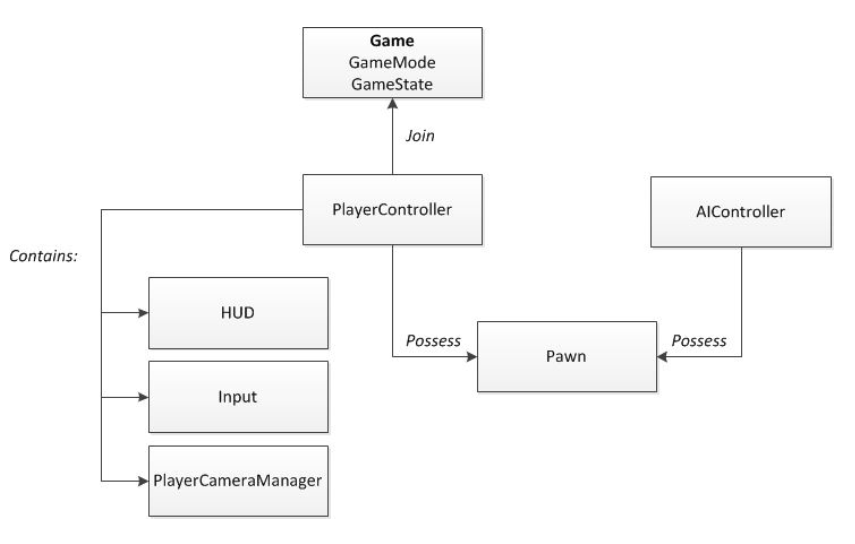

> # Unreal Engine 4
> * Unreal Engine 4 入门系列
> * http://www.52vr.com/article-569-1.html

# 一、Unreal Engine 4
* 1998年，UE1发行。UnrealScript编程语言。
* 2002年，UE2，对物体属性实时修改，支持次世代游戏机（PlayStation2、XBox等）。
* 2006年，UE3，Kismet可视化脚本工具（以各种节点连接成逻辑流程图）。
* 2014年，UE4，C++代替UnrealScript，引擎开源，支持热更新，跨平台多。15年初起免费使用。商城中可购买、上传游戏资源。

# 二、下载安装
* 英文文档：https://docs.unrealengine.com/latest/INT/
* 中文文档：https://docs.unrealengine.com/latest/CHN/index.html
* 论坛：https://forums.unrealengine.com/
* 问答社区：https://answers.unrealengine.com/

# 三、安装文件目录结构
## DirectXRedist
DirectX文件，以及安装DirectX的安装包。
## Launcher
引擎启动器文件夹。
* Engine：引擎代码、库等内容。
* VaultCache：从商城购买的资源的缓存。
* Portal：【不知道诶=。=】
## UE_4.19
* Engine：源代码、库、资源、map文件等组成引擎的部分。
* Samples：提供的两个示例Maps。
* Templates：不同类型游戏的模板（模板游戏的内容和源代码）。
* FeaturePacks：一堆.upack文件【暂时还不知道是啥=。=】

# 四、项目浏览器
## 项目选项卡
包含过去创建或购买的项目、示例，不兼容当前版本的项目显示灰色。
## 新建项目选项卡
分蓝图、C++两种，可以选择游戏模板。
## 基本设置
* 游戏平台：桌面/游戏机、移动设备/平板电脑
* 游戏质量：最高质量、可缩放的2D/3D（移动设备建议该选项）
* 初学者内容：具有初学者内容包含提供学习的基本材质和贴图的简单可放置网格物体。
* 项目创建位置和项目名称。

# 五、关卡编辑器
## 顶部
### 1. 标签栏：右方项目名称、内置教程。  
### 2. 菜单栏
* 文件：关卡/项目的打开创建，游戏打包等。
* 编辑：撤销、恢复、剪切、复制、粘贴或者重复任何选中的对象（或一组选中的对象）。设置偏好，如`自动保存开关和自动保存的时间`、改变`快捷键`、改变`测量单位`（厘米、米或千米）。项目设置则提供了描述项目的内容设置、项目ID或`项目如何打包`、该项目支持什么平台。
* 窗口：编辑器`窗口布局自定义`，在“窗口”中选择增加删除窗口。可点击窗口标签，拖动调整窗口位置。注意，有时候`窗口标签隐藏`，`左上角的黄色箭头显示`。可`窗口->重置布局`恢复。
* 帮助：官方教程、文档、论坛、回答中心等常用的超链接。
### 3. 工具栏（视口上方）
* 保存：`保存当前工作进度。`
* 版本管理：默认关闭。协作开发方式，记录每一次更改。
* 内容：包含所有资源、代码、关卡和其它游戏开发用到的内容。
* 商城。
* 设置：修改编辑器的设置。例如`允许选择半透膜物体`、`选择组合物体`等。`引擎的可视化设置`，例如`分辨率`、`贴图渲染质量`、`抗齿锯`等都可以在此处设置。
* 蓝图：`进入蓝图编辑器`。
* 过场动画：可用过场动画来创建电影艺术。
* 构建：构建关卡，引擎可以`预计算灯光和可视化数据`、`产生导航网络和更新几何体`。
* 播放：在视图中`测试关卡是否功能正常`。
* 启动：`制作、打包和生成可执行的应用程序文件`。

## 中央
### 4. 视口：创建和调试游戏。中间那块主窗口。
* 视角切换：按住鼠标左键/右键，WASD移动。
* 选择：鼠标左键。
### 5. 视图工具栏：视口内部上方。
#### 视图工具栏左侧
* 视口选项（下拉列表）：游戏模式（`去掉光源等`的运行效果），沉浸模式（`视口全屏`），etc。
* 视口投影类型（透视图）：透视投影（3D），正交投影（2D截面图的亚子？），viewport type视口类型（默认模式和电影模式）
* 视口渲染模式：默认带光照，还有一些其它模式。【后面再研究叭=。=】
* 显示：设置各类型actor的显示和隐藏。
#### 视图工具栏右侧
* 三个变换工具：平移、旋转、缩放。
* 坐标系统：全局（世界坐标系），局部坐标系。
* 进行三种变换时的对齐设置。
* 相机速度：在视口里切换视角的时候变换速度。
* 最大化：非最大化时显示三视图+透视图四种投影效果。

## 左侧
### 6. 模式
#### 放置模式（默认）
静态网格物体、灯光、触发器、体积（烟雾）等对象。
* 基本：基本几何体，触发器，摄像头，玩家起始位置等。
* 光照：各种光源。
* Cinematic：【？？？】
* 视觉效果：雾、延迟贴花等。
* Geometry：各种常用几何体。
* 体积：一些包含特殊属性的actor。
#### 描画模式
绘制调整颜色和贴图到静态网格中，可以设置画刷大小、半径、强度。  
绘制时注意选中，不要影响其它对象。
#### 地貌模式
创建地形，删除时切放置模式选中delete。
#### 植被模式
在地形或其它静态网格画树、草等。
#### 几何体编辑模式
Geometry不够用的话，可以自定义模型刷。

## 右侧
### 7. 世界大纲
层次展示场景中所有actor列表。
* 新建文件夹：`分类管理actor`，右键文件夹选中内部所有actor。
* 左边标记：隐藏/显示。
* `附加`：拖动一个actor到另一actor形成附加关系（移动父，子也动，反之不动。）关系`仅在世界大纲内生效`，视口内无效。
* 左下角：actor数量。
* 右下角：视图过滤方式和世界切换。
### 8. 细节
查看和修改当前选中的actor属性。由上而下：
* 名称：可修改。
* 名称右侧：Actor文档，锁定键（锁定细节面板，选中其它actor时该面板不发生变化）。
* 添加组件，蓝图/添加脚本。
* 属性区。

## 底部
### 9. 内容浏览器
显示所有游戏资源。可导入、组织、观察、创建资源。
* 添加新项、导入、保存。
* 右上角锁定：锁定时在视口中右键actor->关卡->在内容浏览器中查找，打开新窗口显示，否则直接在底部内容浏览器跳转。
* 左侧源面板：项目中收集的所有文件夹。
* 过滤器：过滤内容浏览器中显示的资源类型。
* 右下视图选项：资源显示的形式，显示内容等。

# 六、常用按键和快捷键

按键 | 动作
----|----
鼠标左键|	选择actor
鼠标左键+拖动|	前后移动和左右旋转摄像头
鼠标右键|	选择actor并打开右键菜单
鼠标右键+拖动|	旋转摄像头方向
鼠标左键+鼠标右键+拖动|	摄像头上下左右移动
鼠标中键+拖动|	摄像头上下左右移动
滑轮向上|	摄像机向前移动
滑轮向下|	摄像机向后移动
F|	聚焦选中的actor
箭头方向键|	摄像机前后左右移动
W|	选中平移工具
E|	选中旋转工具
R|	选中缩放工具
W+任何鼠标按键|	摄像机向前移动
S+任何鼠标按键|	摄像机向后移动
A+任何鼠标按键|	摄像机向左移动
D+任何鼠标按键|	摄像机向右移动
E+任何鼠标按键|	摄相机向上移动
Q+任何鼠标按键|	摄像机向下移动
Z+任何鼠标按键|	增加视野（鼠标释放后会恢复原状）
C+任何鼠标按键|	缩小视野（鼠标释放后会恢复原状）
Ctrl+S|	保存场景
Ctrl+N|	创建新场景
Ctrl+O|	打开一个已有的场景
Ctrl+Alt+S|	另存为新场景
Alt+鼠标左键+拖动|	复制当前选中的actor
Alt+鼠标右键+拖动|	摄像机前后移动
Alt+P|	进入Play预览模式
Esc|	退出预览模式
F11|	进入仿真模式


# 七、Actor类和Pawn类、编码规范（类名前缀）
## Actor类
可以放到游戏场景中的游戏对象的基本类型（祖宗）。放到场景中的东西都必须继承Actor类。（其定义了关于物体的位置、变换等操作）
## Pawn类
可以被玩家或NPC控制的角色。
## 类名
### 1. 类名前缀
UE4的类名必须遵从命名规范，需要在类名前面加上正确的前缀，与之对应的C++文件名则不加前缀。否则会编译报错。
* 派生自 Actor 的类前缀为 A，如 AController。
* 派生自 UObject 的类前缀为 U，如 UComponent。
* 枚举 的前缀为 E，如 EFortificationType。
* 接口 类的前缀通常为 I，如IAbilitySystemInterface。
* 模板 类的前缀为 T，如 TArray。
* 派生自 SWidget(Slate UI)的类前缀为 S，如 SButton。
* 其余类的前缀均为 字母 F ，如 FVector。
### 2. 其他类型命名
* bool类型变量需要加上b前缀，如 bCallable。

# 八、物体的添加
## 新建项目
* VS需提前设置，项目路径和名称不要带中文，VS编译会失败。
* VS打开后，工具栏->解决方案配置下拉框：Development Editor（开发编辑器）。
* Ctrl+F5编译运行。
## 工程结构
* **`Windows 10项目目录（~\Demo1）内容`**

    文件夹名        | 内容
    --------        | ------
    .vs             | VS生成的临时目录。（版本库可忽略）
    Binaries        | C++编译输出的动态链接库。（版本库可忽略）
    Config          | 工程配置文件。（手动修改/UE4GUI中改）
    Content         | 资源目录。（专用二进制存储，只能编辑器导入，不能手动拷入该目录）
    Intermediate    | 临时文件。（版本库可忽略）
    Saved           | 自动存储文件及日志信息。（版本库可忽略）
    Source          | C++代码存放路径。
    Demo1.sln       | VS工程文件。生成方法：UE4编辑器->文件->生成VS工程。（版本库可忽略）
    Demo1.uproject  | UE4项目工程文件。（json格式）

* Source目录
  * 项目同名文件夹Demo1：.cpp、.h、`.Build.cs`（描述当前工程依赖的库文件）
    * Demo1.h：预编译头文件，加快编译速度。`该目录下所有cpp文件需包含该头文件`【？】，其内也有通用而不会修改的代码。
  * 两个c#文件：`<Demo1>`.Target.cs（`类似于Makefile`的编译脚本）、`Demo1Editor`.Target.cs（构建编辑器相关代码，工程中存在依赖于UnrealEd的代码时，要放到Editor模块下，不能和Runtime放一起，否则无法打包）
* 子工程Module
  * 子工程在工程文件*.uproject中定义。
  * 添加子工程：Modules属性下添加引用，Source目录添加工程文件夹和编译文件*.Target.cs
## 添加物体到场景
* 内容浏览器中的初学者内容包内找到的物体可以直接拖进场景。如StarterContent->Props->MaterialSphere球体。
* 拖入后自动选中球体。
* R键，球体上坐标轴端点都变成立方体。此时为缩放模式，拖动立方体调整物体大小。
* F键，视口聚焦到该物体。
* StarterContent->Materials中可以拖出材质到球体上，改变其材质。（只影响外观，不影响其它物理属性。）

# 九、关卡和碰撞体
* 熟练基本操作：
  * 文件->新建空关卡，空关卡初始全黑。
  * StarterContent->`Shapes`->Shape_Plane添加平面。
  * StarterContent->Materials->M_Ground_Moss改变材质。
  * StarterContent->`Props`（道具）->SM_Rock添加石块。
  * StarterContent->`Particles`（粒子系统）->P_Fire添加火焰粒子系统。
  * 放置模式中加光源。
* 默认视角转换时可以穿透岩石，设置岩石，添加碰撞体属性（模拟物理的物体碰撞属性）：
  * 检测碰撞：网格-网格花费很高，使用近似的包围盒来估算碰撞体。
  * 视口选中->世界大纲右键岩石->最上面的编辑，打开**网格编辑器**。
  * 打开碰撞网格显示（Collision）。
  * 菜单栏->碰撞->打开胶囊体简化碰撞（Add capsule simplified collision：创建一个包围该静态网格的胶囊碰撞网格）。
  * 同样可以W（平移）、E（旋转）、R（缩放）调整该胶囊网格的位置、大小等属性。
  * 保存后再次播放，摄像机不能直接穿透这块石头。（被碰撞体网格包围）

# 十、角色
## **1. 默认关卡设置**
* 重新打开项目进入默认的Minimal_Default关卡。
  * 内容浏览器->过滤器->勾选关卡。
  * 关卡默认保存位置StarterContent->Maps。
  * 双击打开。
* 设置打开时的默认显示关卡：
  * 编辑->项目设置->地图&模式->Default Maps。
  * 可以分别设置游戏运行时默认关卡和编辑器启动时的默认关卡。
## **2. UE4 - Gameplay框架**
* https://docs.unrealengine.com/zh-CN/Gameplay/Framework/QuickReference/index.html
### **① 世界场景中的人物**
* Actor类：一个可以放置到UE4世界中的对象。
* Pawn类：继承自Actor，**可被控制器（Controller）拥有**，可接受输入如移动等，但不具有人形特性。
* Character类（角色）：继承自Pawn，类人式Pawn，默认携带用于碰撞的胶囊组件（`CapsuleComponent`）和运动相关组件（`CharacterMovementComponent`），可执行人类基本动作、动画等。
### **② 控制器**
* 控制器Controller：负责定向Pawn的Actor，含**AI控制器**和**玩家控制器**，一个控制器可以**拥有**一个Pawn并对其进行控制。
* 玩家控制器`PlayerController`：Pawn和控制Pawn的玩家之间的接口。
* AI控制器`AIController`：用模拟的逻辑控制Pawn，决定NPC如何与玩家互动。
### **③ 向玩家显示信息**
* HUD（Head Up Display）：即UI，显示玩家名字、血条等。（于玩家控制器中）
* 相机`PlayerCameraManager`：玩家视角。
### **④ 游戏规则和状态**
* `GameMode`：游戏定义（规则、获胜条件等）。只存在于服务器，不应有很多游戏过程中会变化的数据，绝对不应有临时数据。
* `GameState`：游戏状态，玩家列表、得分、游戏进度、任务列表等。存在于服务器和所有客户端，自动同步到各个客户端。
* `PlayerState`：各个玩家状态。自动同步到各个客户端。
### **⑤ 总结：框架类关系**


## **3. 创建一个Character**
* 新建类头文件初始状态
    ```cpp
    #pragma once

    // CoreMinimal.h包含UE4核心编程环境的普遍存在类型，如FString，FName，FArray等
    #include "CoreMinimal.h" 
    // GameFramework中定义了一些引擎框架的类
    #include "GameFramework/Character.h"
    // *.generated.h存储了UE4收集的一些类型信息
    #include "Avatar.generated.h"

    UCLASS()    // 
    class DEMO1_INDOOR_API AAvatar : public ACharacter
    {
        GENERATED_BODY()

    public:
        // Sets default values for this character's properties
        AAvatar();

    protected:
        // Called when the game starts or when spawned
        virtual void BeginPlay() override;

    public:	
        // Called every frame
        virtual void Tick(float DeltaTime) override;

        // Called to bind functionality to input
        virtual void SetupPlayerInputComponent(class UInputComponent* PlayerInputComponent) override;
    };
    ```
