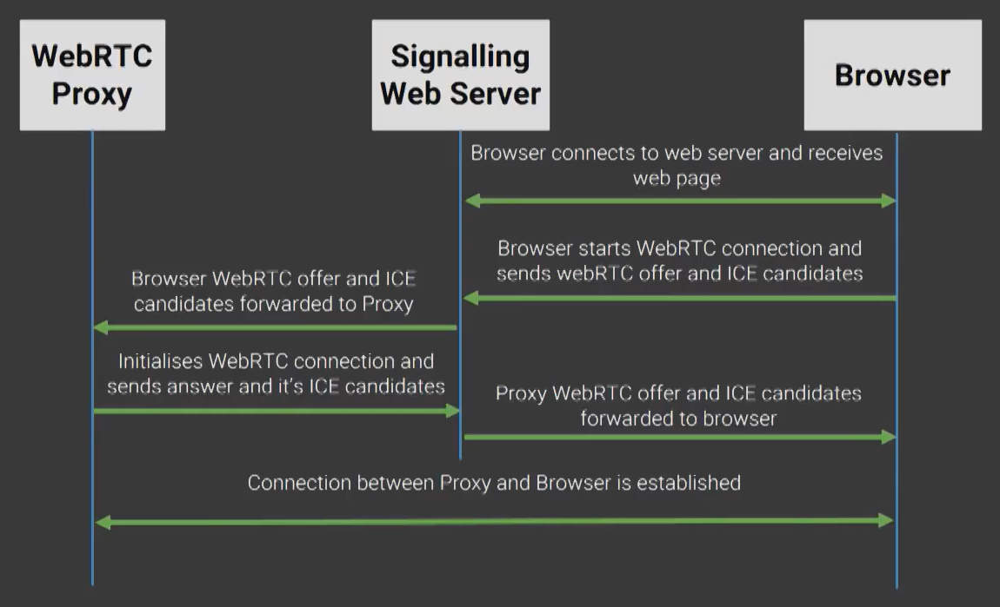
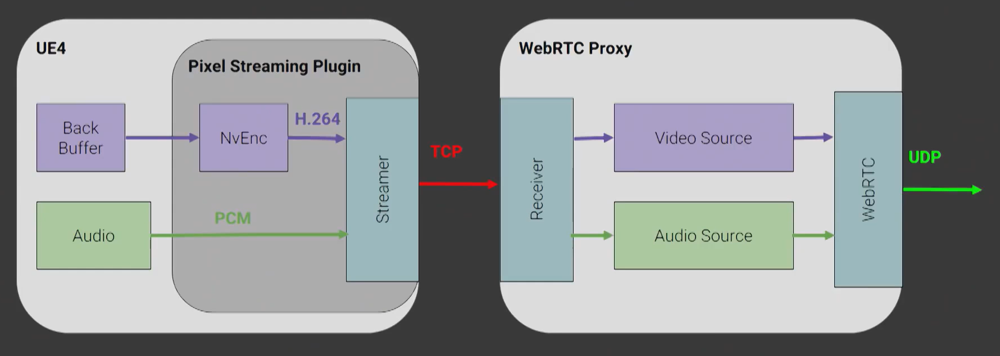

> # Unreal Engine 4 - Pixel Streaming
# 【一】FestEurope2019 UE4 Pixel Streaming
* Reference：https://www.bilibili.com/video/BV1gJ411J7Jv?from=search&seid=13972088166324341205

## 像素流送
* 主要用途：通过网络实时输送视频流、音频流到另一台联网机器，从而 use an application remotely
  * 输入同样通过网络返回。（可交互）
  * 输入到结果的反馈之间约100ms延迟。
* UE4中的Pixel Streaming Plugin
  * Released in UE 4.21
  * 可交互，多种输入方法，可自定义设置（所有组件提供完整源码）
* 通过像素流送访问UE4项目的好处
  * 像素流送是轻量级客户端，不用预装软件，只要浏览器能访问网页即可
  * 由于只是输送音视频流数据，所以可多用户同时访问
  * 用户只接收数据流，不能访问客户端和IP，没有逆向工程的机会。但可以用一些普通网页的安全措施：用户认证、为每个用户设置特定时间段等。
* 应用实例
  * 汽车厂商官网：用户在官网查看厂商定制的模型
  * 汽车销售展厅：导购实时更改颜色，客户在大屏幕上看效果
  * 建筑漫游展示
* 相关实现技术
  * NVIDIA硬件`编码`，将视频流转成H.264格式，显卡支持下可提供60帧/s的4K流送
  * 用WebRTC（Real-Time Communication）分发内容，在硬件上实现H.264`解码`
    * WebRTC是由Google创建的一种标准，现开放给社区共同维护
    * 目前主流浏览器都支持，无需插件，跨平台（移动/桌面）
    * WebRTC会根据实际的网络连接情况追踪流送，更新视频流
  * 网络栈 web stack（普通的技术栈 :) ）
    * standard `Node.js` server
    * a `Javascript` implementation

## 需求组件
* Pixel Streaming Plugin for UE4
  * 集成在UE4，同时集成了 NVIDIA NvEnc（对视频流编码，并发送给WebRTC proxy）
* WebRTC Proxy Server
  * 用WebRTC将音视频流从虚幻客户端分发到网页浏览器
* Signalling and Web Server（信令网络服务器，信令：控制电路的信号）
  * 协调用户、浏览器和WebRTC proxy之间的连接
  * 托管用户访问的网站
* STUN server and TURN server
  * STUN：网络地址转换 NAT punch-through，获取每台客户端的公共IP地址，用于连接WebRTC代理和用户
  * TURN：用于不支持WebRTC协议的网络（一般是移动网络，不支持UDP）
* Browser code
  * 一些简单的JS API

## 连接原理
### **WebRTC Proxy与Browser的连接过程**

* 使浏览器browser连接到信令服务器signalling web server并下载网站页面
* browser创建一个WebRTC offer（包含支持的视频格式、可使用的连接细节ICE candidates等）并发送到signalling web server
* signalling web server将信息转发到WebRTC proxy等待接收
* WebRTC proxy再通过signalling web server给出反馈和ICE candidates
* 最后在WebRTC proxy与browser之间建立了通路，音视频流可直接通过WebRTC proxy发到browser，来自browser的input也可直接传到WebRTC proxy并转发到UE4
### **UE4与WebRTC Proxy的通信细节**

* 从左至右，给出了音视频信息的传送方向，分别经过UE4、UE4的像素流送插件、WebRTC Proxy、客户端，反之为通过客户端给出的输入信息传送方向（来自鼠标键盘和触摸板等外设的操作）
* 音视频信息流的转移过程
  * 将UE4的`后台缓冲区Back Buffer`（UE4渲染内容的终点，即一般渲染到屏幕上的结果）中的内容通过NvEnc`编码`压缩为H.264格式，加上音频信息一起后发送到网络
    * Slate的UI系统中有一些可以访问back buffer的委托和回调函数（delegates and callbacks），并能识别特定事件（如back buffer分辨率的改变）
    * 初始化`NVDIA NvEnc系统`时要给出一些`编码参数`：分辨率resolution、编码后的每秒帧数frames per second、目标比特率target bitrate，通过这些量控制数据被压缩的程度，尽量最小化
    * 编码异步进行。有一个`编码器线程encoder thread`，该线程有一个事件，当编码和压缩发生时触发
    * NVIDIA NvEnc兼容D3D，注册缓冲区后可直接通过二进制数据传递纹理
    * 插件采用PCM编码（一种标准数字音频数据格式），插件中不压缩音频
  * 每当back buffer接收到数据时，都会尝试在插件和代理之间建立连接。通过另一个只负责监听来自代理的连接的线程完成。
  * 插件将数据发送给代理。
  * WebRTC Proxy的`接收器Receiver`含有处理不同类型事件的处理程序（如接收音视频信息），包含一个`捕获模块capture`和`解码器encoder`。  
    capture一般捕获来自网络摄像头webcam和麦克风microphone的帧数据，此处对于编码过的视频信息可直接通过capture，网络捕获模块network capture会从网络上获取数据。  
    WebRTC将音频信息压缩成Opus格式。
  * 

# 【二】像素流实践 - UE社区B站中文直播第14期
* Reference：https://www.bilibili.com/video/BV1UE411H7gU?from=search&seid=4103597289856465146

<i class="fa fa-star"></i>
<!-- 使用FontAwesome -->
<head> 
     
     
</head> 
<link rel="stylesheet" href="https://use.fontawesome.com/releases/v5.0.13/css/all.css">

<!-- Sample use: <i class="fa fa-star"></i> -->