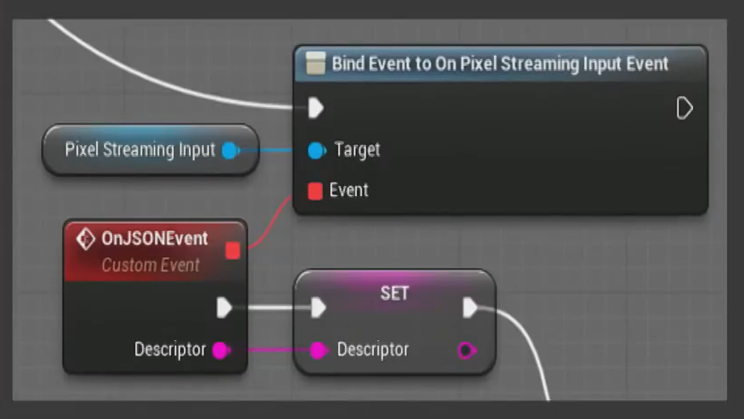
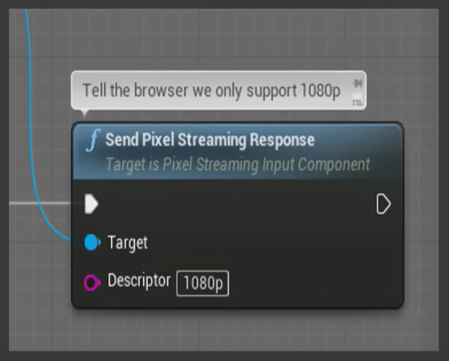

> # Unreal Engine 4 - Pixel Streaming
# 【一】FestEurope2019 UE4 Pixel Streaming
* Reference：https://www.bilibili.com/video/BV1gJ411J7Jv?from=search&seid=13972088166324341205

## 像素流送
* 主要用途：通过网络实时输送视频流、音频流到另一台联网机器，从而 use an application remotely
  * 输入同样通过网络返回。（可交互）
  * 输入到结果的反馈之间约100ms延迟。
* UE4中的Pixel Streaming Plugin
  * Released in UE 4.21
  * 可交互，多种输入方法，可自定义设置（所有组件提供完整源码）
* 通过像素流送访问UE4项目的好处
  * 像素流送是轻量级客户端，不用预装软件，只要浏览器能访问网页即可
  * 由于只是输送音视频流数据，所以可多用户同时访问
  * 用户只接收数据流，不能访问客户端和IP，没有逆向工程的机会。但可以用一些普通网页的安全措施：用户认证、为每个用户设置特定时间段等。
* 应用实例
  * 汽车厂商官网：用户在官网查看厂商定制的模型
  * 汽车销售展厅：导购实时更改颜色，客户在大屏幕上看效果
  * 建筑漫游展示
* 相关实现技术
  * NVIDIA硬件`编码`，将视频流转成H.264格式，显卡支持下可提供60帧/s的4K流送
  * 用WebRTC（Real-Time Communication）分发内容，在硬件上实现H.264`解码`
    * WebRTC是由Google创建的一种标准，现开放给社区共同维护
    * 目前主流浏览器都支持，无需插件，跨平台（移动/桌面）
    * WebRTC会根据实际的网络连接情况追踪流送，更新视频流
  * 网络栈 web stack（普通的技术栈 :) ）
    * standard `Node.js` server
    * a `Javascript` implementation

## 需求组件
* Pixel Streaming Plugin for UE4
  * 集成在UE4，同时集成了 NVIDIA NvEnc（对视频流编码，并发送给WebRTC proxy）
* WebRTC Proxy Server
  * 用WebRTC将音视频流从虚幻客户端分发到网页浏览器
* Signalling and Web Server（信令网络服务器，信令：控制电路的信号）
  * 协调用户、浏览器和WebRTC proxy之间的连接
  * 托管用户访问的网站
* STUN server and TURN server
  * STUN：网络地址转换 NAT punch-through，获取每台客户端的公共IP地址，用于连接WebRTC代理和用户
  * TURN：用于不支持WebRTC协议的网络（一般是移动网络，不支持UDP）
* Browser code
  * 一些简单的JS API

## 连接原理
### **WebRTC Proxy与Browser的连接过程**

* 使浏览器browser连接到信令服务器signalling web server并下载网站页面
* browser创建一个WebRTC offer（包含支持的视频格式、可使用的连接细节ICE candidates等）并发送到signalling web server
* signalling web server将信息转发到WebRTC proxy等待接收
* WebRTC proxy再通过signalling web server给出反馈和ICE candidates
* 最后在WebRTC proxy与browser之间建立了通路，音视频流可直接通过WebRTC proxy发到browser，来自browser的input也可直接传到WebRTC proxy并转发到UE4
### **UE4与WebRTC Proxy的通信细节**

* 从左至右，给出了音视频信息的传送方向，分别经过UE4、UE4的像素流送插件、WebRTC Proxy、客户端，反之为通过客户端给出的输入信息传送方向（来自鼠标键盘和触摸板等外设的操作）
* **`音视频信息流的转移过程`**
  * 将UE4的`后台缓冲区Back Buffer`（UE4渲染内容的终点，即一般渲染到屏幕上的结果）中的内容通过NvEnc`编码`压缩为H.264格式，加上音频信息一起发送到网络
    * Slate的UI系统中有一些可以访问back buffer的委托和回调函数（delegates and callbacks），并能识别特定事件（如back buffer分辨率的改变）
    * 初始化`NVDIA NvEnc系统`时要给出一些`编码参数`：分辨率resolution、编码后的每秒帧数frames per second、目标比特率target bitrate，通过这些量控制数据被压缩的程度，尽量最小化
    * 编码异步进行。有一个`编码器线程encoder thread`，该线程有一个事件，当编码和压缩发生时触发
    * NVIDIA NvEnc兼容D3D，注册缓冲区后可直接通过二进制数据传递纹理
    * 插件采用PCM编码（一种标准数字音频数据格式），插件中不压缩音频
  * 每当back buffer接收到数据时，都会尝试在插件和代理之间建立连接。通过另一个只负责监听来自代理的连接的线程完成。
  * 插件将数据发送给代理。
  * WebRTC Proxy的`接收器Receiver`含有处理不同类型事件的处理程序（如接收音视频信息），包含一个`捕获模块capture`和`编码器encoder`。  
    capture一般捕获来自网络摄像头webcam和麦克风microphone的帧数据，此处对于编码过的视频信息可直接通过capture，网络捕获模块network capture会从网络上获取数据。  
    WebRTC将音频信息压缩成Opus格式。
  * 视频编码过程会传递“分析数据”analytics，与WebRTC认为应使用的目标比特率有关。因为WebRTC具有带宽自适应性，其可以检测到低带宽环境，并尝试降低比特率（通过进一步压缩或降低帧率）。这种情况一旦发生，WebRTC proxy将被告知相应的目标比特率和帧率信息，并返回给插件中的NvEnc。
### Browser
* 输入指所有反向流动的数据：Key presses、Mouse events、Touch events、Custom events
* 内部机制
  * WebRTC提供了数据通道data channel功能来允许用户发送数据，与音视频信息通道并行
  * 一些信息将`被标准化normalized`：如实际浏览器的分辨率和UE4 back buffer中的分辨率会不一致，允许使用不同的分辨率
  * 位置信息和增量信息被`量化quantized`：如移动鼠标，不限制信息的发送量
* `自定义Customization`：可以自定义网页效果：除了制作UE4的UI界面并发送视频流给用户使用，也可以直接在网页中通过HTML实现用户界面。通过输入组件input component - **`UPixelStreamingInputComponent`**实现，其包含：
  * 蓝图类 Blueprintable Class
  * 可绑定的委托 `OnPixelStreamingInputEvent delegate`：接收来自浏览器的数据
  * 发送响应函数 `SendPixelStreamingResponse function`：可用两种方式发送数据。
* 可发送的数据类型
  * 字符串。数据主要由浏览器读取，用JSON格式通过字符串参数传递结构化数据。组件中提供了若干`辅助函数JSON helper functions`用于解析来自UE4的JSON数据。
  * 控制指令。允许运行来自浏览器的、安全允许范围内的指令，包括UE4控制台命令、内置指令（如改变分辨率）。
* Custom HTML sample 1 - 从browser发送数据
```html
<a href="#" onclick="onConfigButton(0,0)">
```

```js
function onConfigButton(category, item)
{
  // 创建js对象
  let descriptor = {
    Category: category,
    Item: item
  };
  emitUIInteraction(descriptor);  // 发送对象，会被自动序列化成字符串
}
```
  * 在蓝图中将事件绑定到输入事件

  * 然后获取描述符descriptor（即一个字符串）
* Custom HTML sample 2 - 在browser接收数据（关于判断UE4能否以4K分辨率运行，禁用浏览器的4K显示）
```js
// 响应处理
addResponseEventListener("handle_responses"), myHandleResponseFunction);
```
```js
function myHandleResponseFunction(data)
{
  // 禁用网页中的4K显示按钮
  if (data.substring("1080p")) {
    let button4K = document.getElementById("4k");
    button4K.disabled = true;
  }
}
```
  * 在蓝图中发送一个字符串

* Custom JavaScript sample
  * 提供了基本的 `app.js` 与 `webRtcPlayer.js` 。
  * webRtcPlayer 负责处理所有音视频的播放
  * app 基本可以处理剩下的内容，尤其与WebRTC相关的如连接到 signalling web server 、音视频解码与播放、浏览器窗口大小调整（尽量保证长宽比正确，否则显示黑条做填充）、输入处理和模式input handling and modes（如限制鼠标移动范围在浏览器窗口内或悬浮）、模拟emulation（当输入设备含触摸板，但UE4未配置时不支持触摸事件touch events，可以通过鼠标事件mouse events来模拟触摸事件）

## 系统缺陷 Limitations
* 客户端争用 client contention
  * Input：不同客户端可能给出有冲突的输入
  * Adaptation：所有用户的比特率相同，但实际必然会有不同
* 目前只支持 Windows 平台，NVIDIA 显卡
* 仍在测试阶段

## 改进措施 Potential Improvements
* WebRTC的自适应性会有影响，未来将试图把独立的WebRTC Proxy集成进UE4使两者更紧密结合
* 关于客户端争用问题
  * 引入客户ID、控制权
  * 转码transcoding，允许不同用户组使用不同的比特率，在UE4中输送不同的流，或通过编码系统为不同用户组将编码视频重新编码成比特率更低的视频，便于低带宽用户使用
* signalling web server 分解成独立服务器
* multiple-camera support 输送不同视角给不同用户
* hardware support 如增加对 Linux 的支持、 AMD 显卡设备
* controller support 像素流送主要用于企业enterprise领域，但支持一下手柄也挺好（
* D3D12 support 目前NVIDIA NvEnc system只支持D3D11

## 更多资料 Further Information
* Documentation
  * https://docs.unrealengine.com/en-us/Platforms/PixelStreaming
* Showcase
  * Samples/Showcases/PixelStreamingDemo
* UDN - ask questions
  * https://udn.unrealengine.com


# 【二】像素流实践 - UE社区B站中文直播第14期
* Reference：https://www.bilibili.com/video/BV1UE411H7gU?from=search&seid=4103597289856465146

> 音质好差所以先咕咕咕（

# 【三】官方文档 - 像素流送
* https://docs.unrealengine.com/en-US/Platforms/PixelStreaming/index.html

## Overview
* 作用、概况及原理简介
* 与 YouTube 等视频播放网站的区别
  * Pixel Streaming 的呈现是实时的
  * 用户可以通过 Browser 给 UE4 一些输入和控制
* 连接情况的补充
  * 客户端连接到 signalling web server 后由服务器提供相应 HTML 页面，包含播放器控件和 JS 控制代码
  * UE4 和 Browser 需要明确各自 IP 地址，二者间的直连才能工作。而 `NAT 服务可能对外部可见 IP 地址做修改`，需用 STUN 或 TURN 服务器解决，参考“创建主机和网络连接指南” https://docs.unrealengine.com/zh-CN/Platforms/PixelStreaming/Hosting/index.html 

## Getting Started
* 文档配置过程很详细很清楚辽，只是我女朋友显卡并不支持 NvEnc ，卒。

